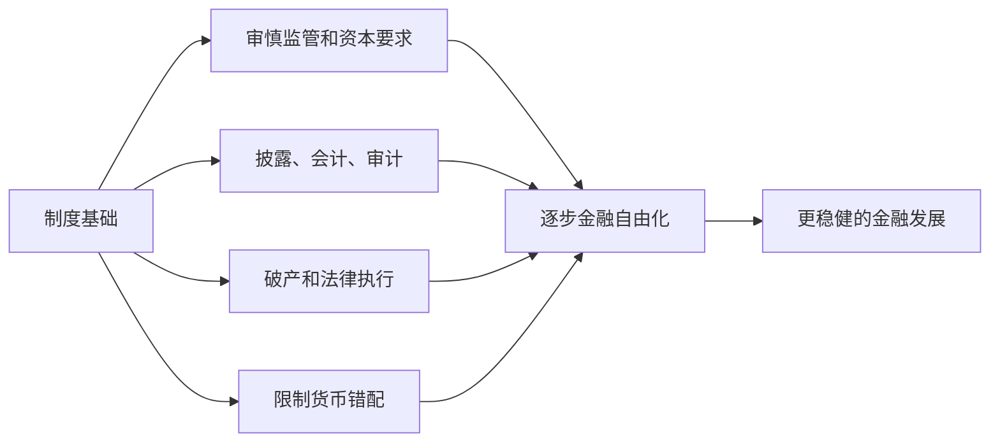

# 13.7 金融危机预防与政策应对

来源：

- 主线：Mishkin《货币金融学》Ch.12, Ch.13
- 补充：Mishkin/Eakins Ch.8, Additional Ch.25

金融危机的政策问题分两类。第一类是危机发生前怎样降低概率，第二类是危机发生后怎样阻止金融摩擦继续恶化。前者重在监管、资本、信息、货币错配和金融自由化顺序；后者重在流动性支持、金融机构救助、财政刺激和长期监管改革。

不能把政策应对理解成“政府救市”这么简单。金融危机中，政策目标是恢复信用中介功能：让金融机构有能力放贷，让市场能重新评估风险，让企业和家庭不因金融系统失灵而被迫收缩。

## 危机前：加强审慎监管

预防危机首先要加强银行和金融机构的审慎监管。金融机构必须持有足够资本，以吸收贷款损失和资产价格下跌。资本也让股东有更多自身资金承担风险，从而减少过度冒险激励。

审慎监管还要求金融机构具备真正的风险管理能力：能识别和计量风险，能监控风险暴露，能设置业务限额，能通过内部控制防止欺诈和未授权活动。危机往往不是因为没有任何规则，而是因为规则没有覆盖真实风险，或监管者没有资源和独立性执行规则。

在新兴市场中，监管独立尤其重要。政治和商业利益可能施压监管者，让高风险银行继续扩张。监管机构若薪酬低、技术弱、缺乏数据和法律支持，就难以限制风险积累。

## 限制货币错配和短期外债风险

新兴市场危机反复说明，外币债务和本币收入之间的错配极其危险。政策应限制银行和企业过度积累未对冲的外币债务，尤其是短期外币债务。外汇储备、稳健财政和可信货币政策，也能降低投机攻击成功概率。

这并不意味着所有外资流入都应被排斥。外资可以带来资金、技术和金融发展。但短期、可迅速撤离的资本流入，会在信心变化时放大危机。政策需要区分更稳定的长期资本和更易逆转的短期融资。

## 金融自由化要有顺序

金融自由化长期可能有益，但如果在监管、披露、法律和风险管理框架尚未建立前快速推进，就可能带来信贷繁荣和危机。更稳妥的做法是先建立制度基础，再逐步放开金融活动和资本流动。

制度基础包括强审慎监管、有效会计和审计、可靠信息披露、破产和债务重组机制、合格信用评级和信用登记、消费者保护以及监管者独立性。只有这些基础足够强，金融机构才能在自由化环境中承担可控风险。

## 危机中：流动性、救助和财政刺激

危机发生后，政策首先要防止金融体系冻结。中央银行可以作为最后贷款人提供流动性，帮助金融机构应对短期资金挤兑。2007-2009 年危机中，央行降低政策利率、扩大贷款工具、向市场注入流动性，并在传统工具接近极限后采用非常规政策。

政府还可能对关键金融机构实施救助、注资、担保或接管。这样做的目的不是保护股东，而是防止金融机构倒闭引发更大范围信用崩塌。问题在于，救助会带来道德风险。因此，救助通常应配合股东损失、管理层更换、资本重组和更严格监管。

财政刺激用于抵消私人消费和投资的急剧下降。政府支出增加、减税、失业救济、对家庭和企业的转移支付，可以缓和总需求下滑。2007-2009 年危机后，许多国家实施财政刺激，效果因国家债务空间、执行方式和金融体系状况而异。

## 危机后：修复金融体系和长期改革

危机结束不等于问题消失。银行需要清理坏资产、补充资本、恢复贷款能力；企业和家庭需要重组债务；监管框架需要补上危机暴露的漏洞。

危机后的长期改革通常包括提高资本和流动性要求、加强宏观审慎监管、扩大对影子银行和衍生品的监督、提高消费者保护、改善金融基础设施、增强信息披露和市场纪律。国际层面还需要监管协调，因为资金、金融机构和风险会跨境流动。

2007-2009 年危机后，许多改革都围绕这些方向展开：更高质量资本、更稳定融资、压力测试、系统重要性机构监管、有序处置机制、消费者保护和衍生品集中清算等。

## 政策应对的权衡

危机政策没有没有代价的选择。流动性支持可以阻止恐慌，但可能鼓励未来依赖中央银行；金融救助可以防止系统崩溃，但可能加重“大而不能倒”；财政刺激可以托住需求，但会增加公共债务；严格监管可以降低风险，但可能压低金融效率和信贷供给。

因此，好的政策不是在危机中临时选择一种工具，而是在平时建立制度，使危机中可以更有序地处理问题机构，更早发现风险，更少依赖全面救助。

| 政策阶段 | 主要工具 | 目标 | 风险 |
| --- | --- | --- | --- |
| 危机前 | 资本、监管、披露、限制错配 | 降低危机概率 | 过度约束可能降低效率 |
| 危机中 | 流动性支持、救助、财政刺激 | 阻止信用崩塌 | 道德风险和公共债务 |
| 危机后 | 坏账清理、资本修复、制度改革 | 恢复金融功能 | 改革不足会留下隐患 |

## 小结

金融危机预防依赖强审慎监管、充足资本、有效风险管理、信息披露、消费者保护和金融自由化顺序安排。新兴市场还必须限制货币错配和过度短期外债。危机发生后，中央银行和政府需要提供流动性、重组或救助关键机构、实施财政刺激，并推动长期监管改革。政策应对的核心目标是恢复信用中介功能，但每种工具都有代价，因此平时建立稳健制度比危机中临时救火更重要。

## 自测问题

- 为什么资本和审慎监管是危机预防的第一道防线？
- 新兴市场为什么特别需要限制货币错配？
- 金融自由化为什么需要按顺序推进？
- 危机中的流动性支持和救助为什么会带来道德风险？
