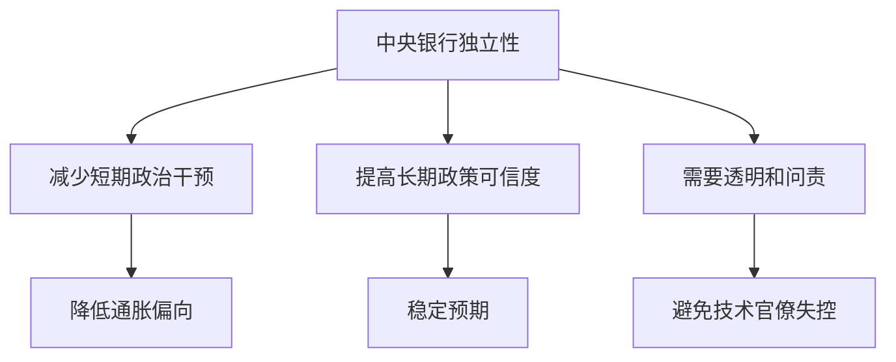

# 14.1 中央银行的起源、功能与独立性

来源：

- 主线：Mishkin《货币金融学》Ch.14, Ch.15
- 补充：Mankiw Ch.30；Mishkin/Eakins Ch.9
- 延伸：Bodie/Kane/Marcus《Investments》Ch.2, Ch.14

中央银行不是一开始就被设计成今天这样复杂的机构。它最初出现在政府融资、银行体系稳定和国际支付需要中，后来逐步承担发行货币、维护货币稳定、监管银行、充当最后贷款人、执行货币政策等职能。要理解中央银行为什么能影响利率、信贷、货币供给、产出和通胀，先要知道它为什么会出现，以及为什么现代社会通常希望它既有权力又受约束。

世界上最早的中央银行之一是 1668 年成立的瑞典银行。1694 年成立的英格兰银行则通常被视为现代中央银行的原型。早期中央银行的重要功能之一，是向政府提供融资，并帮助处理国际贸易扩张带来的支付需求。随着贸易规模扩大、跨境支付增加，稳定可靠的支付和清算机构变得重要。

## 从政府融资到货币稳定

早期中央银行常与政府债务联系在一起。政府需要资金，中央银行购买政府债务或向政府提供金融服务。但随着银行体系发展，中央银行功能逐渐扩展。它不只是政府的银行，还变成银行的银行：为商业银行提供账户、清算支付、在危机中提供流动性，并逐渐承担维护货币稳定的责任。

中央银行的职能可以概括为几类：

| 职能 | 要解决的问题 |
| --- | --- |
| 发行货币 | 统一社会普遍接受的支付工具 |
| 管理支付体系 | 让银行之间资金转移顺畅完成 |
| 监管或监督银行 | 降低银行体系风险和恐慌 |
| 最后贷款人 | 危机时向流动性困难机构提供支持 |
| 执行货币政策 | 影响利率、信贷、货币供给和通胀 |
| 管理外汇储备或汇率相关事务 | 在开放经济中维护外部稳定 |

这些职能不是所有国家完全相同。发达经济体中央银行更集中于货币政策、支付体系和金融稳定；新兴市场中央银行还常承担金融市场建设、信贷引导、外汇储备管理和发展金融包容等任务。

## 为什么美国迟迟没有接受单一中央银行

欧洲较早接受中央银行，美国则长期对中央集中的金融权力保持警惕。美国人担心，一个欧洲式单一中央银行会把银行控制权集中在少数人手中，带来政治危险。19 世纪美国多次尝试建立中央银行都伴随争议。

但美国频繁发生银行危机，特别是 1870 到 1907 年间反复出现的银行恐慌，逐渐削弱了反对中央银行的力量。1913 年，联邦储备体系建立。为了避免权力过度集中，美国没有建立一个完全单一的中央银行，而是设计了 12 家地区联邦储备银行，加上位于华盛顿的理事会和后来的公开市场委员会。

这个设计反映了一种制度折中：美国需要中央银行稳定金融体系和执行货币政策，但又不愿把所有权力集中在一个城市、一个机构或一组私人银行家手里。

## 中央银行为什么需要独立性

现代中央银行最重要的制度问题，是独立性。独立性不是说中央银行可以不受民主监督，而是说它在执行货币政策时不应被短期政治压力直接支配。

独立性有两层。目标独立性是中央银行能否自己决定货币政策目标，例如通胀目标或就业权衡。工具独立性是中央银行在目标既定后，能否自由选择政策工具，例如政策利率、公开市场操作、准备金工具等。

支持独立性的主要理由，是政治压力容易带来通胀偏向。政府和政治人物可能希望在选举前通过扩张性货币政策降低失业、刺激产出或降低政府融资成本。但短期刺激如果超过经济能力，最终会带来通胀和宏观不稳定。选举后再收紧，又可能造成经济波动。这种政治性扩张和收缩会形成政治商业周期。

独立中央银行能更专注于长期价格稳定和金融稳定，减少短期政治激励对货币政策的干扰。

## 反对独立性的理由

中央银行独立性也有争议。反对者认为，货币政策会影响就业、收入、政府债务成本和金融市场，不能完全交给非民选技术官僚。宏观经济稳定还需要财政政策和货币政策协调，如果中央银行过度独立，可能与政府政策方向冲突。

另一个问题是，中央银行本身也是官僚机构，也可能追求自身声望、权力和组织利益。独立性如果缺乏透明和问责，可能使中央银行偏离公共利益。

因此，现代趋势不是让中央银行“无人约束”，而是把独立性和问责结合起来。许多中央银行需要向议会报告，公布会议纪要，解释政策决定，并向公众说明通胀和经济预测。

## 和宏观经济学底座的连接

中央银行制度之所以重要，是因为它连接了货币、物价、就业和金融稳定。前面宏观章节中，通胀率衡量货币购买力变化，失业率衡量劳动资源闲置，GDP 衡量经济活动水平。中央银行通过影响利率、信用和货币供给，间接影响消费、投资、总需求和通胀。

独立性问题也可以放回宏观框架理解。若中央银行长期受短期政治压力支配，可能在经济接近潜在产出时仍然扩张货币和信用，短期看失业可能下降，但长期会形成更高通胀预期。工资和价格上调后，实际产出回到潜在水平附近，通胀却更高。独立性要解决的正是这种“短期刺激、长期通胀”的宏观偏差。

同时，中央银行不能只追求低通胀而忽视金融体系。第 13 章已经看到，金融危机会让消费和投资下降，进而压低 GDP、推高失业。现代中央银行的制度设计，实际上是在三个宏观任务之间求平衡：保持价格稳定，缓和产出和就业波动，防止金融体系失灵把冲击放大。

从金融市场角度看，中央银行独立性最终会进入利率和资产价格。若市场相信央行会维持价格稳定，长期债券投资者要求的通胀风险溢价较低，收益率曲线更容易反映真实期限溢价和增长预期；若央行可信度弱，投资者会要求更高名义利率来补偿未来通胀不确定性。央行制度因此不是政治背景，而是债券定价、汇率预期和风险资产估值的基础变量。

## 小结

中央银行从政府融资、国际支付和银行稳定需求中发展而来，后来逐步承担发行货币、管理支付体系、监管银行、最后贷款人和货币政策职能。美国联邦储备体系的分散结构反映了对权力集中的警惕。中央银行独立性有目标独立和工具独立两层，支持者强调它能减少政治性通胀偏向，反对者强调货币政策需要民主问责和财政协调。现代中央银行制度的关键，是在独立性、透明度和问责之间取得平衡。

## 自测问题

- 中央银行最早为什么会出现？
- 为什么美国联邦储备体系被设计成地区分散结构？
- 目标独立性和工具独立性有什么区别？
- 为什么中央银行独立性需要配合透明和问责？
- 中央银行可信度为什么会影响长期债券的通胀风险溢价？
