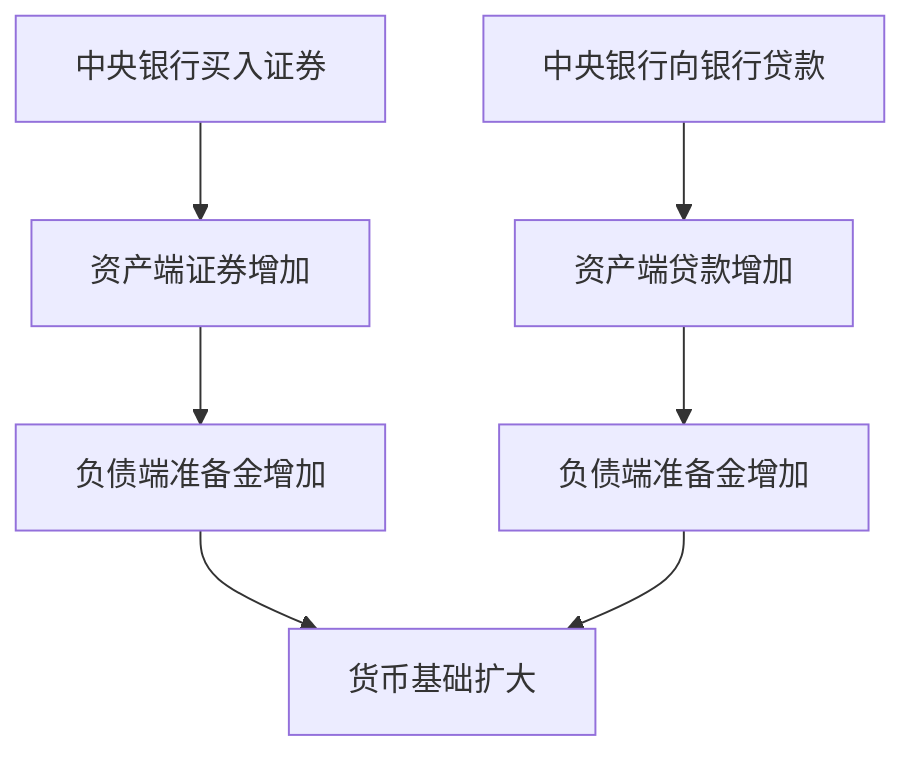

# 14.2 中央银行资产负债表

来源：

- 主线：Mishkin《货币金融学》Ch.14, Ch.15
- 补充：Mankiw Ch.30；Mishkin/Eakins Ch.9
- 延伸：Bodie/Kane/Marcus《Investments》Ch.2, Ch.14

中央银行影响货币供给和金融市场，最终都要落到它的资产负债表上。普通人看到中央银行降息、买债、向银行贷款，容易把这些理解成抽象政策。实际上，这些行动都会改变中央银行资产或负债，从而改变银行体系准备金、货币基础和金融条件。

一个简化的中央银行资产负债表只需要看四项：

| 中央银行资产 | 中央银行负债 |
| --- | --- |
| 持有证券 | 流通中现金 |
| 对金融机构贷款 | 银行准备金 |

这四项足以解释货币供给过程的基础。

## 中央银行的负债为什么是货币

中央银行负债中最重要的两项是流通中现金和准备金。它们被称为中央银行的货币性负债，因为它们直接构成货币基础。

流通中现金是公众手中的纸币。纸币上写着“Federal Reserve Note”之类字样，本质上是中央银行的债务凭证。但它和普通债务不同。如果你拿一张 100 美元纸币去中央银行要求偿付，你不会得到黄金或其他资产，而会得到等值的其他纸币组合。人们接受这种“以纸币偿付纸币”的安排，是因为中央银行纸币被社会普遍接受为支付手段。

准备金是商业银行在中央银行账户中的存款，加上银行金库中的现金。对商业银行来说，准备金是资产；对中央银行来说，准备金是负债，因为商业银行可以要求用中央银行货币进行支付。准备金增加，会增强银行体系创造存款的能力。

## 中央银行的资产怎样创造准备金

中央银行资产中，一项是证券，通常包括政府债券，在特殊时期也可能包括其他证券。中央银行购买证券时，会用新增准备金支付。卖方银行或交易商的银行账户获得准备金，中央银行资产端证券增加，负债端准备金增加。

另一项是对金融机构贷款。中央银行向银行贷款时，资产端增加一笔贷款，负债端增加银行准备金。银行取得准备金后，可以满足支付需求、准备金需求或缓解流动性压力。正常时期，中央银行贷款主要面向银行；危机时期，贷款工具可能扩展到其他金融机构。

中央银行资产通常能产生利息收入，而它的负债成本很低。流通中现金不支付利息，准备金在某些制度下可能支付利息，但总体上中央银行可以从资产收益和负债成本之间获得收入，并将大部分收入上缴财政。

## 资产负债表变化怎样影响货币基础

货币基础等于流通中现金加银行体系总准备金：

```text
MB = C + R
```

其中，`MB` 是货币基础，`C` 是流通中现金，`R` 是银行准备金。

中央银行买入证券，资产端证券增加，负债端准备金增加，货币基础扩大。中央银行卖出证券，资产端证券减少，负债端准备金减少，货币基础收缩。中央银行向银行发放贷款，贷款资产增加，准备金负债增加，货币基础扩大。银行偿还中央银行贷款时，准备金减少，货币基础收缩。



## 为什么印出来但未流通的纸币不算货币

货币供给中的现金只包括公众手中的现金，不包括已经印好但还没进入流通的纸币。原因很简单：未流通纸币没有成为任何人的资产，也没有影响任何人的支付和支出行为。

如果一个人印了很多自己的欠条，但没有交给别人，这些欠条不会改变他的债务，也不会改变别人的财富。中央银行纸币也是类似逻辑。只有纸币进入公众手中，成为公众资产和中央银行负债，才参与货币供给。

## 资产负债表为什么是宏观政策的入口

中央银行资产负债表看似是会计表，实际上是货币政策影响宏观经济的入口。资产端增加证券或贷款，负债端通常增加准备金或现金，货币基础扩大。货币基础扩大后，银行体系流动性更充足，短期利率和信用条件可能变化，进而影响消费和投资。

但“资产负债表扩大”不等于 GDP 一定上升，也不等于通胀一定立即上升。前面宏观章节强调，产出和物价取决于总需求与总供给。中央银行增加准备金，只是让金融体系具备更强的放贷和支付能力。银行是否愿意贷款，企业和家庭是否愿意借款，经济是否有闲置资源，公众通胀预期是否稳定，都会影响最终宏观结果。

2008 年以后，中央银行资产负债表大幅扩大，大量准备金停留在银行体系中。这个经验说明，货币基础是货币供给和总需求的重要起点，但不是自动传送带。理解资产负债表，是为了看清政策怎样进入金融体系；理解宏观传导，则要继续追踪准备金如何影响利率、信用、消费、投资和物价。

央行资产负债表还会改变金融市场中的安全资产结构。央行买入国债时，私人部门持有的国债减少、银行准备金增加；二者都安全，但期限、流动性用途和收益率不同。商业银行获得的是隔夜准备金资产，投资者失去的是较长期债券久期。因此，大规模买债不仅扩大货币基础，也会改变市场中久期风险的供给，影响期限溢价和投资组合再平衡。

## 小结

中央银行资产负债表是理解货币供给的起点。简化表中，资产包括证券和对金融机构贷款，负债包括流通中现金和银行准备金。流通中现金和准备金是中央银行货币性负债，它们构成货币基础。中央银行买入证券或发放贷款会增加准备金和货币基础，卖出证券或贷款偿还会减少准备金和货币基础。未进入公众手中的纸币不算货币，因为它没有影响任何人的资产、负债和支付行为。

## 自测问题

- 为什么流通中现金和准备金是中央银行的负债？
- 中央银行购买证券为什么会增加银行准备金？
- 货币基础由哪两部分构成？
- 为什么已经印好但未流通的纸币不计入货币供给？
- 央行买入长期国债为什么会影响市场中的久期风险供给？
