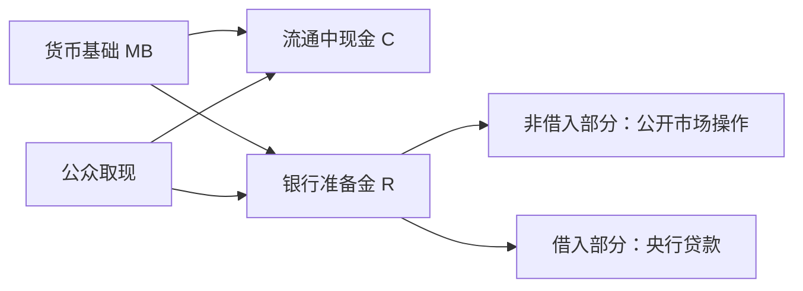

# 14.3 货币基础、现金与准备金

来源：

- 主线：Mishkin《货币金融学》Ch.14, Ch.15
- 补充：Mankiw Ch.30；Mishkin/Eakins Ch.9

货币供给不是中央银行直接输入一个数字就能得到的结果。中央银行最直接影响的是货币基础，也就是流通中现金和银行准备金之和。货币基础又被称为高能货币，因为它可以通过银行体系的存款创造过程支持更大规模的货币供给。

公式很简单：

```text
货币基础 MB = 流通中现金 C + 银行准备金 R
```

但这个公式背后有几个重要区别：现金和准备金都属于中央银行货币；现金由公众持有，准备金由银行持有；现金不能进一步创造存款，准备金却可以支持银行贷款和存款扩张。

## 公开市场操作怎样改变货币基础

中央银行控制货币基础的主要方式，是公开市场操作。公开市场购买是中央银行买入证券；公开市场出售是中央银行卖出证券。

假设中央银行从一级交易商处购买 1 亿美元债券。中央银行支付方式不是拿已有现金付款，而是在交易商所在银行的中央银行账户中增加 1 亿美元准备金。于是中央银行资产端证券增加 1 亿，负债端准备金增加 1 亿。货币基础增加 1 亿。

| 中央银行 | 资产变化 | 负债变化 |
| --- | ---: | ---: |
| 买入 1 亿美元证券 | 证券 +1 亿 | 准备金 +1 亿 |

如果中央银行卖出 1 亿美元证券，过程相反。买方银行账户中的准备金被扣减，中央银行资产端证券减少，负债端准备金减少，货币基础下降。

## 公众从存款转为现金时，货币基础为什么不变

公众持有现金的偏好会影响银行准备金，但不一定改变货币基础。假设圣诞节前公众想多持有现金，从银行取出 1 亿美元。公众资产中支票存款减少 1 亿，现金增加 1 亿。

银行体系失去 1 亿存款，也失去 1 亿准备金。中央银行负债端则发生内部转换：流通中现金增加 1 亿，准备金减少 1 亿。货币基础是现金加准备金，一增一减，总额不变。

| 变化 | 流通中现金 | 银行准备金 | 货币基础 |
| --- | ---: | ---: | ---: |
| 公众取现 1 亿 | +1 亿 | -1 亿 | 不变 |

这说明中央银行对货币基础的控制通常强于对准备金的控制。公众取现会让准备金波动，但只是把中央银行负债从“银行准备金”换成“公众现金”。

## 中央银行贷款怎样改变货币基础

中央银行还可以通过向金融机构贷款改变货币基础。假设中央银行向 First National Bank 贷款 1 亿美元。银行资产端准备金增加 1 亿，负债端对中央银行借款增加 1 亿。中央银行资产端贷款增加 1 亿，负债端准备金增加 1 亿。货币基础增加 1 亿。

银行偿还中央银行贷款时，准备金减少，中央银行贷款资产减少，货币基础也减少。

这种贷款创造的准备金叫借入准备金。它与公开市场操作创造的非借入准备金不同，因为中央银行可以设置贷款利率和条件，但银行是否借款还取决于银行自身需求。

## 非借入货币基础和借入准备金

为了区分中央银行完全控制和不完全控制的部分，可以把货币基础分成两块：

```text
非借入货币基础 MBn = 货币基础 MB - 借入准备金 BR
```

公开市场操作主要影响非借入货币基础，因为中央银行可以主动决定买入或卖出多少证券。借入准备金则来自银行向中央银行借款，中央银行能通过贴现率和贷款条件影响，但不能完全决定银行借多少。

还有一些因素会短期影响货币基础，例如支票清算过程中的浮款、财政部在中央银行账户中的存款变化、外汇干预等。这些因素不完全由中央银行控制，但通常可以预测并用公开市场操作抵消。



## 货币基础和宏观总需求的关系

货币基础本身不是 GDP 的组成部分。GDP 统计的是最终商品和服务的生产，货币基础统计的是中央银行货币。两者的连接在于金融条件：准备金增加可能降低银行体系资金紧张程度，影响短期利率、贷款供给和资产价格，再影响消费和投资。

如果经济处于正常状态，银行愿意贷款，企业和家庭愿意借款，货币基础增加更容易通过银行体系转化为存款和信用扩张。消费和投资上升，总需求增加，产出和物价受到影响。若经济存在闲置资源，产出可能先上升；若经济接近潜在产出，更多需求更可能表现为通胀压力。

如果经济处于危机状态，货币基础增加可能主要变成超额准备金。银行担心风险、资本不足，家庭和企业也不愿借款，存款和贷款扩张就会很弱。此时货币基础和总需求之间的联系变松。这为后面理解非常规货币政策打基础：央行资产负债表扩张是必要条件之一，但不是充分条件。

## 小结

货币基础等于流通中现金加银行准备金。公开市场购买增加准备金和货币基础，公开市场出售减少准备金和货币基础。公众从存款转为现金会减少银行准备金、增加流通中现金，但货币基础总额不变。中央银行贷款会增加借入准备金和货币基础，贷款偿还则减少货币基础。货币基础中，非借入部分主要由公开市场操作控制，借入准备金则取决于中央银行政策和银行借款意愿。

## 自测问题

- 货币基础为什么等于现金加准备金？
- 中央银行公开市场购买怎样改变资产负债表？
- 为什么公众取现会减少准备金但不改变货币基础？
- 非借入货币基础和借入准备金有什么区别？
