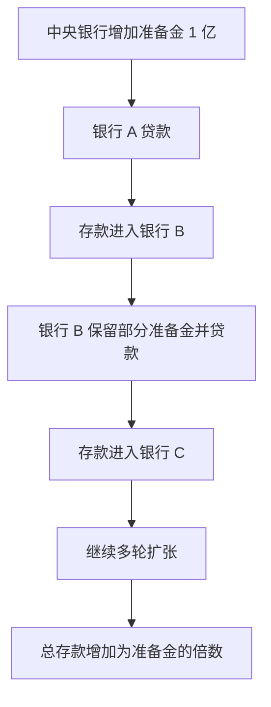

# 14.4 银行体系与存款创造

来源：

- 主线：Mishkin《货币金融学》Ch.14, Ch.15
- 补充：Mankiw Ch.30；Mishkin/Eakins Ch.9
- 延伸：Bodie/Kane/Marcus《Investments》Ch.1, Ch.18

中央银行增加 1 美元准备金，货币供给通常增加不止 1 美元。原因在于银行体系可以在准备金支持下创造存款。这个过程不是“凭空变富”，而是银行通过贷款同时创造资产和存款负债；只要每家银行只需保留一部分准备金，新增准备金就能支持多轮贷款和存款。

为了理解这个过程，先从单家银行开始，再看整个银行体系。

## 单家银行怎样创造存款

假设中央银行通过公开市场购买，从 First National Bank 买入 1 亿美元证券。银行资产端证券减少 1 亿，准备金增加 1 亿：

| First National Bank | 资产变化 | 负债变化 |
| --- | ---: | ---: |
| 卖出证券给中央银行 | 证券 -1 亿，准备金 +1 亿 | 无变化 |

这时银行支票存款没有增加，所以法定准备金要求没有变化。新增 1 亿准备金都是超额准备金。若银行不想持有低收益超额准备金，就会把它贷出。

银行发放 1 亿美元贷款时，会为借款人建立支票账户，把贷款资金记入账户。银行资产端增加贷款 1 亿，负债端增加支票存款 1 亿：

| First National Bank | 资产变化 | 负债变化 |
| --- | ---: | ---: |
| 发放贷款 | 贷款 +1 亿 | 支票存款 +1 亿 |

这一步很关键。银行发放贷款时创造了支票存款，而支票存款是货币供给的一部分。因此，银行贷款行为创造了货币。

## 为什么单家银行不能无限创造

借款人不会把贷款资金永远放在原银行账户中。他会用这笔钱付款，收款人可能把钱存入另一家银行。于是 First National Bank 会失去准备金。单家银行受到准备金流出的限制，不能无限扩大贷款。

但从整个银行体系看，一家银行失去的准备金往往进入另一家银行。第二家银行得到存款和准备金后，也只需保留一部分准备金，其余可以继续贷款。于是存款创造在银行体系内逐轮展开。

## 银行体系怎样多倍创造存款

假设法定准备金率是 10%，银行不持有超额准备金，公众也不把贷款收入转成现金。最初新增准备金为 1 亿美元。

第一家银行贷出 1 亿美元，这笔钱被支付并存入第二家银行。第二家银行新增存款 1 亿，需要保留 1000 万准备金，可以贷出 9000 万。9000 万又被存入第三家银行，第三家银行保留 900 万，贷出 8100 万。这个过程继续下去。

| 轮次 | 新增存款 | 需保留准备金 10% | 可新增贷款 |
| --- | ---: | ---: | ---: |
| 第 1 轮 | 1 亿 | 1000 万 | 9000 万 |
| 第 2 轮 | 9000 万 | 900 万 | 8100 万 |
| 第 3 轮 | 8100 万 | 810 万 | 7290 万 |

最终，整个银行体系新增存款达到 10 亿美元。因为 10 亿存款需要 1 亿准备金支持，而最初新增准备金正好是 1 亿。

简单存款乘数是：

```text
存款乘数 = 1 / 法定准备金率
```

若准备金率为 10%，存款乘数为 10。



## 存款创造不是机械魔法

简单模型有严格假设：银行不持有超额准备金，公众不持有更多现金，所有贷款收入都会重新存入银行体系。现实中这些假设不一定成立。

如果借款人把贷款收入作为现金持有，而不是存入银行，存款创造链条会中断。现金不会像存款那样在银行体系中支持下一轮贷款。如果银行担心存款流出或风险上升，选择持有超额准备金，也会减少贷款和存款扩张。

因此，中央银行增加准备金只是提供存款扩张的可能性，不保证银行体系一定按最大倍数扩张。

## 存款创造和宏观支出的连接

银行创造存款的过程之所以重要，是因为新贷款通常对应新的支出能力。企业获得贷款后，可以购买设备、支付工资、扩大库存；家庭获得贷款后，可以购买住房、汽车或其他耐用品。这些支出分别进入 GDP 中的投资和消费。

但贷款创造存款不等于社会真实财富自动增加。银行贷款同时创造资产和负债：借款人有了存款，也有了还款义务；银行有了贷款资产，也有了存款负债。经济是否真正变得更富，取决于贷款是否支持了有生产价值的消费和投资。如果贷款流向低质量项目或资产泡沫，短期会推高支出和价格，长期可能变成坏账和金融危机。

这正好连接第 13 章。信用扩张在宏观上会刺激总需求，但如果筛选和监督失败，就会积累逆向选择和道德风险。货币供给和银行信贷扩张因此有双重性质：正常时支持投资和增长，失控时放大泡沫和危机。

对投资者来说，银行存款创造解释了为什么“货币多了”不等于所有资产都等比例上涨。新增信用流向哪里，哪里先受到影响：如果贷款进入生产性企业投资，未来现金流可能上升；如果贷款主要进入房地产或金融资产杠杆交易，资产价格可能先涨，但未来违约和回撤风险也会积累。投资分析需要追踪信用流向，而不是只看货币总量。

## 小结

银行通过贷款创造存款。单家银行发放贷款时，资产端增加贷款，负债端增加支票存款；但单家银行会受到准备金流出的限制。整个银行体系中，一家银行流出的准备金会进入另一家银行，在法定准备金率约束下支持多轮贷款和存款扩张。简单模型中，存款乘数等于法定准备金率的倒数。但现实中，公众持有现金和银行持有超额准备金都会削弱多倍存款创造。

## 自测问题

- 银行发放贷款时为什么会创造存款？
- 为什么单家银行不能无限创造存款？
- 法定准备金率为 10% 时，简单存款乘数是多少？
- 公众持有现金和银行持有超额准备金为什么会削弱存款创造？
- 为什么分析资产价格时，要看新增信用流向生产投资还是资产交易？
