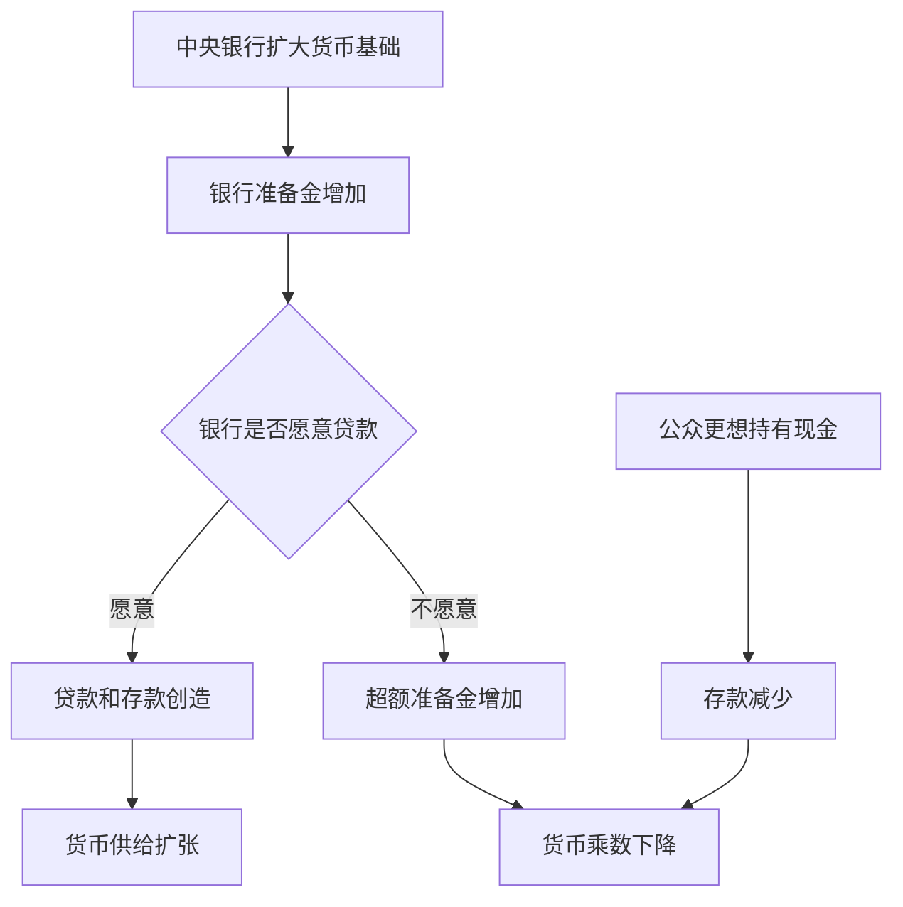

# 14.6 货币供给过程的现实限制

来源：

- 主线：Mishkin《货币金融学》Ch.14, Ch.15
- 补充：Mankiw Ch.30；Mishkin/Eakins Ch.9

简单模型容易让人误以为中央银行可以精确控制货币供给：只要增加准备金，再乘以存款乘数，就能得到新增货币。现实不是这样。中央银行能较好控制货币基础，尤其是非借入货币基础，但货币供给还取决于银行和公众行为。危机时期，这一点尤其明显。

本节的重点是把前面模型的边界讲清楚：中央银行很重要，但不是货币供给过程中的唯一决定者。

## 中央银行不能完全控制借入准备金

中央银行可以决定公开市场操作规模，因此能主动改变非借入货币基础。但借入准备金不同。中央银行可以设定贴现率、贷款条件和贷款工具，却不能单方面决定银行一定借多少。

如果银行资金紧张、抵押品合格、愿意承担借款成本，它们会借入准备金；如果银行不愿使用中央银行贷款，或者担心市场认为自己有问题，就可能少借。危机中，中央银行即使提供贷款工具，也要面对银行意愿、污名效应和风险偏好的影响。

因此，货币基础中由中央银行贷款产生的部分，比公开市场操作更难精确控制。

## 公众持有现金会削弱存款扩张

存款创造依赖资金留在银行体系中。若公众把贷款收入或存款转为现金，银行体系准备金减少，后续贷款和存款创造就会变弱。

例如，简单模型中 1 亿美元准备金在 10% 准备金率下可支持 10 亿美元存款。但如果贷款收入被公众作为现金持有，而不是存入银行，后续银行就得不到新增准备金，存款创造链条会提前停止。现金本身是货币，但它不会像银行准备金那样支持多轮贷款。

这意味着公众现金偏好越强，货币乘数越低，中央银行通过准备金影响广义货币的效果越弱。

## 银行持有超额准备金会中断乘数

银行不一定把所有超额准备金都贷出。它们可能因为担心存款流出、贷款风险上升、资本不足或经济前景不确定，而选择持有更多超额准备金。

这在危机时期特别重要。中央银行可以大量购买资产，使银行体系准备金暴增；但如果银行不愿贷款，或者借款人信用质量恶化，准备金会停留在银行体系中，货币乘数下降。基础货币大幅上升，不必然带来同等比例的存款和贷款扩张。

2008 年后非常规货币政策期间，准备金大幅增加，超额准备金也大幅增加，货币乘数显著下降。这说明货币供给过程不是机械乘法，而是受到银行风险管理和宏观环境影响。

## 准备金要求的重要性会变化

传统模型中，法定准备金率是核心参数。但在现代货币政策实践中，准备金要求的重要性可能下降。原因是银行可能持有大量超额准备金，超额准备金远超法定要求；此时法定准备金率变化不再是决定贷款能力的主要因素。

如果银行已经有大量超额准备金，即使准备金要求下降，也未必显著增加贷款；如果银行因风险担忧不愿贷款，更多准备金也不一定推动货币供给。货币政策的重点就会从“控制准备金数量”转向“影响短期利率、金融条件和预期”。

## 短期扰动与中央银行抵消操作

还有一些因素会短期扰动货币基础，例如浮款、财政部存款变化、外汇干预等。浮款来自支票清算时间差：中央银行先给收款银行记入准备金，再从付款银行扣除准备金，中间会临时增加准备金。财政部把存款从商业银行转到中央银行账户时，商业银行准备金会减少。

这些因素不完全由中央银行控制，但通常可以预测。中央银行可以通过公开市场操作抵消它们对货币基础的短期影响。因此，短期扰动会增加操作复杂度，却不意味着中央银行完全失去控制。

## 货币供给控制的真实含义

说中央银行控制货币供给，准确含义不是它可以逐日精确决定 M1 或 M2 的数量，而是它能通过资产负债表、政策利率、准备金条件和贷款工具影响货币基础和金融体系行为。

货币供给最终由政策和行为共同决定。中央银行提供基础货币，银行决定是否贷款和持有超额准备金，公众决定现金和存款比例。经济不确定性、监管、资本、贷款需求和风险偏好都会改变乘数。

## 为什么现实限制对宏观政策很重要

这些限制解释了为什么货币政策在不同宏观环境下效果不同。在经济扩张、银行资本充足、贷款需求旺盛时，中央银行收紧或放松准备金和利率，可能较快影响信贷和总需求。在金融危机或深度衰退中，银行和公众行为会使传导变弱。银行想修复资产负债表，公众想持有现金或安全资产，企业不愿投资，货币乘数下降。

这对宏观政策组合有直接含义。若货币供给传导受阻，单靠增加准备金可能不足以恢复 GDP 和就业。中央银行可能需要使用更直接影响长期利率、信用利差和预期的工具；财政政策也可能需要直接支撑总需求；监管政策需要修复银行资本和信用中介功能。

因此，第 14 章不是只在讲银行会计。它解释了宏观政策传导的第一段：中央银行怎样影响基础货币，以及为什么基础货币不一定机械变成广义货币、贷款、总需求和通胀。后面第 15 章的政策工具和第 16 章的政策战略，都建立在这个现实限制之上。

## 小结

货币供给过程受到现实限制。中央银行能较好控制非借入货币基础，但不能完全控制银行借入准备金。公众持有现金会削弱存款扩张，银行持有超额准备金会中断乘数过程。危机时期，准备金可以大幅增加，但如果银行不愿贷款、公众偏好现金或借款人风险上升，货币乘数会下降。中央银行仍然重要，但货币供给不是由中央银行单方面机械决定，而是中央银行、银行和公众共同作用的结果。

## 自测问题

- 为什么中央银行不能完全控制借入准备金？
- 公众持有现金为什么会削弱存款创造？
- 银行持有超额准备金为什么会使货币乘数下降？
- 为什么危机时期基础货币扩张不一定等比例转化为货币供给扩张？
