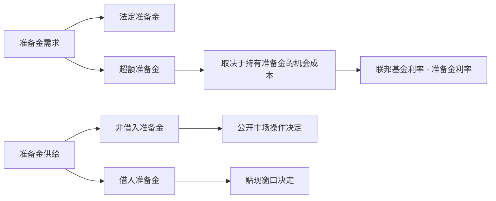

# 15.1 准备金市场与政策利率控制

来源：

- 主线：Mishkin《货币金融学》Ch.16
- 补充：Mishkin/Eakins Ch.10

中央银行讲“货币政策工具”，最终要回答一个很具体的问题：它怎样把银行体系中的一个短期利率推到自己想要的位置？在美国，这个关键利率长期是联邦基金利率，也就是银行之间隔夜借出和借入准备金的利率。

商业银行在中央银行有准备金账户。准备金可以用来满足法定要求，也可以作为支付和提现的缓冲。一天结束时，有些银行准备金多，有些银行准备金不足。准备金多的银行可以把多余准备金隔夜借给准备金不足的银行。这个隔夜市场形成的利率，就是联邦基金利率。

货币政策看上去很宏观，但执行时常从这个非常具体的市场开始。中央银行如果能影响银行体系准备金的供给和需求，就能影响联邦基金利率；联邦基金利率变化以后，会进一步影响其他短期利率、信贷条件、资产价格和总需求。

## 准备金需求从哪里来

银行为什么需要准备金？第一，银行必须满足法定准备金要求。第二，即使没有法定要求，银行也愿意持有一部分超额准备金，因为客户随时可能取现，银行之间每天也有大量支付清算。如果准备金太少，银行可能不得不临时借款，甚至被迫以不利条件筹资。

因此，准备金需求可以分成两部分：

| 组成 | 含义 | 银行为什么持有 |
| --- | --- | --- |
| 法定准备金 | 监管要求银行必须持有的准备金 | 满足法规要求 |
| 超额准备金 | 超过法定要求的准备金 | 应对存款流出、支付清算和不确定性 |

理解准备金需求时，关键不是只看“银行想不想持有准备金”，还要看持有准备金的机会成本。银行可以把准备金借给其他银行，赚取联邦基金利率；也可以把准备金放在中央银行账户上，获得准备金利率。如果联邦基金利率高于准备金利率，银行把准备金借出去更划算，愿意持有的超额准备金就少一些。如果联邦基金利率下降，持有准备金的机会成本下降，银行愿意持有更多超额准备金。

这就形成一条向下倾斜的准备金需求曲线：联邦基金利率越高，银行越不愿意持有超额准备金；联邦基金利率越低，银行越愿意持有超额准备金。

但这条曲线有一个重要的底部。假设中央银行对超额准备金支付利息，利率为 `ior`。银行通常不会愿意以低于 `ior` 的利率把准备金借给其他银行，因为它完全可以把钱放在中央银行那里拿到 `ior`。所以，当联邦基金利率下降到准备金利率附近时，准备金需求曲线会变得近似水平。准备金利率相当于给联邦基金利率放了一个地板。

## 准备金供给由什么决定

准备金供给来自中央银行。教材把准备金供给分成两类：非借入准备金和借入准备金。

非借入准备金主要由公开市场操作决定。中央银行买入证券时，向银行体系支付准备金，准备金增加；中央银行卖出证券时，从银行体系收回准备金，准备金减少。

借入准备金来自银行向中央银行借款。在美国，银行可以通过贴现窗口向联邦储备体系借入准备金。借款利率叫贴现率。通常情况下，贴现率高于联邦基金利率目标，所以健康银行更愿意先在同业市场借款，而不是直接向中央银行借款。只有当市场资金很紧、联邦基金利率被推高到贴现率附近时，银行才会更愿意通过贴现窗口获得资金。

这意味着准备金供给曲线也有一个特殊形状。当联邦基金利率低于贴现率时，银行没有强烈动机从中央银行借款，准备金供给主要等于非借入准备金，供给曲线接近垂直。可一旦联邦基金利率上升到贴现率附近，银行可以按贴现率从中央银行借入准备金，联邦基金利率就很难继续明显高于贴现率。贴现率相当于给联邦基金利率放了一个天花板。

## 政策利率如何被夹在走廊里

把准备金需求和准备金供给放在一起，就可以看到中央银行控制政策利率的基本机制。联邦基金利率由准备金市场的供求均衡决定。中央银行通过改变准备金供给、贴现率、准备金要求和准备金利率，改变这个均衡。

如果中央银行进行公开市场购买，银行体系准备金增加，非借入准备金上升，准备金供给曲线向右移动。在需求曲线向下倾斜的部分，供给增加会让联邦基金利率下降。反过来，公开市场出售会减少准备金，使联邦基金利率上升。

但如果联邦基金利率已经贴近准备金利率，公开市场购买可能不再明显压低利率。原因很简单：银行已经不愿意以低于准备金利率的价格借出准备金。额外准备金进入银行体系后，更多会变成银行持有的超额准备金，而不是继续把联邦基金利率推低。

如果中央银行提高贴现率，只有在银行大量依赖贴现窗口、联邦基金利率接近贴现率时，才会明显抬高联邦基金利率上限。在多数正常时期，贴现率高于目标利率，贴现贷款规模很小，所以贴现率小幅变化未必会直接改变市场利率。

如果中央银行提高法定准备金率，银行必须持有更多准备金，准备金需求曲线向右移动，联邦基金利率上升。降低法定准备金率则相反。但这种工具会突然改变银行资产负债安排，使用起来比较粗糙，所以现代中央银行很少频繁调整它。

如果中央银行提高准备金利率，联邦基金利率的地板也随之上移。尤其在银行体系持有大量超额准备金时，准备金利率可以成为控制短期利率的核心工具。

## 用一个简化例子理解

设想银行体系最初准备金刚好偏紧。很多银行需要借入准备金，少数有富余准备金的银行可以要求较高利率。联邦基金利率于是上升。中央银行如果希望利率下降，可以买入政府证券。证券卖方或其银行得到准备金，银行体系可用准备金增加，借入准备金的压力下降，联邦基金利率随之回落。

如果相反，银行体系准备金过多，许多银行都想把准备金借出去，但愿意借入的银行不多，联邦基金利率就会下行。中央银行可以卖出证券，收回准备金，让银行体系重新变得不那么宽松，利率上升。

这套机制说明，中央银行不是简单地“宣布”一个市场利率就能让它实现。宣布目标只是第一步。真正让目标利率落地的，是中央银行在准备金市场中改变供求条件，并用准备金利率和贴现率形成一个利率走廊。

## 四种工具在准备金市场中的位置

| 工具 | 直接影响 | 对联邦基金利率的典型作用 |
| --- | --- | --- |
| 公开市场操作 | 改变非借入准备金供给 | 买入压低利率，卖出抬高利率 |
| 贴现政策 | 改变借入准备金条件和利率上限 | 贴现率形成上限，危机时提供流动性 |
| 法定准备金率 | 改变准备金需求 | 提高准备金率会提高准备金需求和利率 |
| 准备金利率 | 改变持有准备金的收益 | 形成利率地板，充裕准备金环境下尤其重要 |

现代货币政策的一个重要变化，是中央银行越来越多在“充裕准备金”环境下操作。此时银行体系准备金很多，公开市场操作不一定像过去那样通过小幅改变准备金数量来精准移动联邦基金利率。准备金利率、隔夜逆回购等地板工具变得更重要。教材解释的基本逻辑仍然相同：政策利率来自准备金市场，只是市场所处的位置从准备金稀缺转向准备金充裕。

## 小结

货币政策工具首先要放到准备金市场中理解。银行持有准备金，是为了满足法定要求并应对支付和存款流出的不确定性；准备金供给来自中央银行的公开市场操作和贴现贷款。联邦基金利率由准备金供求决定。准备金利率给它提供地板，贴现率给它提供天花板，公开市场操作改变非借入准备金，法定准备金率改变准备金需求。中央银行控制短期政策利率，本质上是通过这些工具改变准备金市场的均衡。

## 自测问题

- 为什么联邦基金利率是理解美国货币政策操作的关键利率？
- 准备金需求为什么会随联邦基金利率上升而下降？
- 准备金利率为什么会成为联邦基金利率的地板？
- 贴现率为什么会成为联邦基金利率的天花板？
- 公开市场购买在什么情况下可能不再明显压低联邦基金利率？
