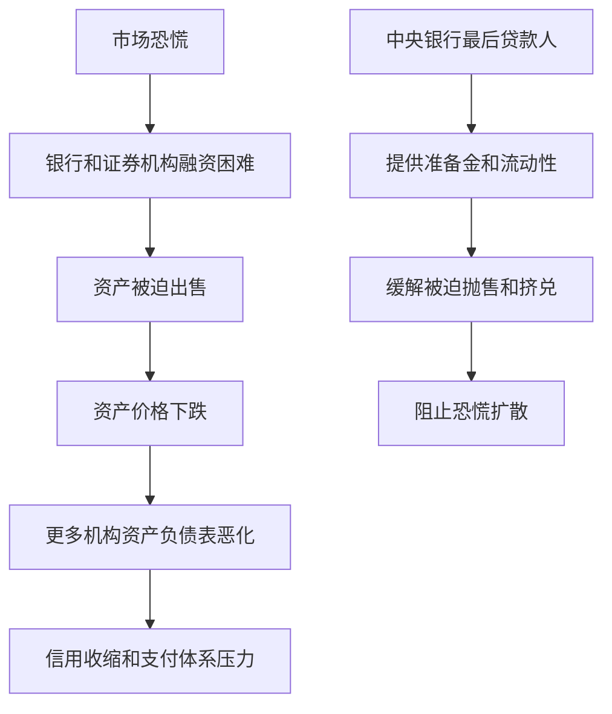

# 15.3 贴现窗口与最后贷款人

来源：

- 主线：Mishkin《货币金融学》Ch.16
- 补充：Mishkin/Eakins Ch.10

公开市场操作是中央银行主动向市场买卖证券，贴现政策则是中央银行向银行提供借款渠道。这个渠道叫贴现窗口。银行如果需要准备金，可以向中央银行借款；中央银行收取的利率叫贴现率。

贴现窗口有两层作用。平时，它是准备金市场的备用流动性来源，可以防止联邦基金利率过度上升。危机时，它是最后贷款人机制的一部分，可以在市场恐慌、资金突然断裂时向银行体系注入流动性，阻止个别机构的流动性困难演变成系统性恐慌。

## 银行为什么需要向中央银行借款

银行资产中有贷款和证券，负债中有存款和其他借款。存款人可能提款，银行之间每天要支付清算，贷款客户也会动用授信额度。正常情况下，银行可以从同业市场借入准备金，或者出售资产获得资金。但在市场紧张时，同业市场可能突然变得谨慎，其他银行不愿借钱，资产也可能难以及时出售。

贴现窗口提供一个后备来源。只要银行符合条件，可以用合格抵押品向中央银行借入准备金。这样，即使市场短期失灵，银行也不必立刻压缩贷款或抛售资产。

在准备金市场图形中，贴现窗口对应准备金供给曲线的水平部分。当联邦基金利率高到接近贴现率时，银行更愿意从中央银行借款，而不是在市场上支付更高利率。于是贴现率限制了联邦基金利率继续上升，形成利率上限。

## 三类贴现贷款

贴现贷款可以分成三类：一级信贷、二级信贷和季节性信贷。

一级信贷面向财务状况健康的银行，期限很短，通常是隔夜。健康银行可以从这个便利中获得短期准备金，因此它是一种常设贷款便利。一级信贷在货币政策中最重要，因为它直接为健康银行提供后备流动性。

二级信贷面向财务状况较弱、面临严重流动性问题的银行。由于借款银行风险更高，二级信贷利率通常高于一级信贷利率，带有惩罚性。

季节性信贷服务于存款和贷款有明显季节波动的小银行。例如农业地区或旅游地区的银行，在某些季节可能出现规律性的资金需求。季节性信贷帮助这些银行平滑准备金压力。

| 类型 | 主要对象 | 特点 |
| --- | --- | --- |
| 一级信贷 | 健康银行 | 短期、备用、常设贷款便利 |
| 二级信贷 | 财务较弱且流动性紧张的银行 | 利率更高，反映借款人风险 |
| 季节性信贷 | 有季节性资金需求的小银行 | 应对规律性存款和贷款波动 |

贴现率通常高于联邦基金利率目标。这样设计的原因，是中央银行希望银行首先在同业市场相互借贷，并让银行彼此监测信用风险。如果贴现率低于市场利率，银行可能大量依赖中央银行融资，同业市场的风险筛选功能会被削弱。

## 为什么贴现窗口平时用得不多

既然贴现窗口提供后备资金，为什么银行平时不大量使用？一个原因是价格。贴现率通常高于联邦基金利率目标，从中央银行借钱更贵。

另一个原因是声誉。银行向贴现窗口借款，可能被市场解读为“这家银行拿不到市场资金”。即使银行本身没有严重问题，也可能担心借款行为传递负面信号。这种现象叫贴现窗口污名。污名会让银行在需要流动性时仍然犹豫，从而降低贴现窗口在危机中的使用程度。

因此，贴现窗口的存在有时比实际使用量更重要。它告诉市场：如果准备金需求突然大幅上升，中央银行可以提供资金，联邦基金利率不会无限上升。平时它像消防设施，未必经常使用，但它的存在改变了市场对极端情形的预期。

## 最后贷款人的含义

最后贷款人是中央银行最古老、也最关键的金融稳定职能之一。当市场恐慌时，正常融资渠道可能关闭。单家银行即使资产长期价值足够，也可能因为短期现金不足而倒闭。如果许多银行同时遭遇挤兑，整个金融体系会被迫收缩信贷，支付体系和投资融资都会受损。

最后贷款人的作用，是在没有其他人愿意提供资金时，由中央银行向银行体系提供准备金，避免流动性问题扩散成金融恐慌。

贴现贷款在银行危机中尤其有效，因为它可以直接把准备金送到最需要的银行。公开市场操作增加的是银行体系总准备金，资金未必马上流向最紧张的机构；贴现窗口则能面向具体借款银行提供流动性。

## 危机中的例子

1987 年 10 月 19 日，美国股市发生“黑色星期一”，道琼斯工业平均指数单日大幅下跌。真正危险的是第二天。证券公司和交易商需要大量资金维持交易和清算，但银行因为担心证券行业风险而收紧信贷。市场有停止运转的危险。

中央银行在市场开盘前表明，愿意提供流动性支持经济和金融体系。它还让市场知道，如果银行向证券行业放款，可以通过贴现窗口获得支持。这个信号帮助银行继续提供资金，市场没有陷入全面停摆。

2001 年 9 月 11 日后，纽约金融中心遭到严重冲击，支付和清算体系面临巨大压力。中央银行再次宣布贴现窗口可以满足流动性需求，并通过贴现窗口和公开市场操作大量提供准备金。结果，金融系统在极端冲击下继续运转。

这些例子说明，最后贷款人不是只在传统银行挤兑中有用。现代金融体系中，证券交易商、货币市场基金、支付清算机构和大型金融市场都可能成为恐慌传播渠道。中央银行的流动性支持有时需要面向更广泛的金融系统。

## 最后贷款人的代价

最后贷款人可以防止恐慌，但也会带来道德风险。如果银行相信自己陷入麻烦时中央银行一定会救助，就可能在平时承担更多风险。大银行尤其可能认为自己“太大而不能倒”，因为它们倒闭会冲击整个金融体系。

这与存款保险的道德风险类似。保险和救助能防止挤兑，却也会削弱市场纪律。银行如果预期损失最终由保险基金、中央银行或纳税人承担，就可能降低风险管理标准。

因此，中央银行使用最后贷款人工具时必须权衡：不救助，恐慌可能扩散，经济损失巨大；救助过多，金融机构未来可能更敢冒险。成功的最后贷款人政策不是无条件救助所有机构，而是在系统性恐慌风险和道德风险之间做出判断。

## 小结

贴现窗口是银行向中央银行借入准备金的渠道。一级信贷服务健康银行，是主要的备用流动性工具；二级信贷服务财务较弱的银行；季节性信贷服务有规律性资金需求的小银行。贴现率通常高于联邦基金利率目标，因此贴现窗口平时使用不多，但它为联邦基金利率提供上限。危机中，贴现窗口体现中央银行最后贷款人职能，可以把流动性直接送到最需要的机构，防止金融恐慌扩散。不过，最后贷款人也会带来道德风险，必须谨慎使用。

## 自测问题

- 贴现窗口和公开市场操作的区别是什么？
- 为什么贴现率通常高于联邦基金利率目标？
- 贴现窗口为什么会给联邦基金利率提供上限？
- 最后贷款人为什么能阻止银行恐慌扩散？
- 最后贷款人职能为什么会带来道德风险？
