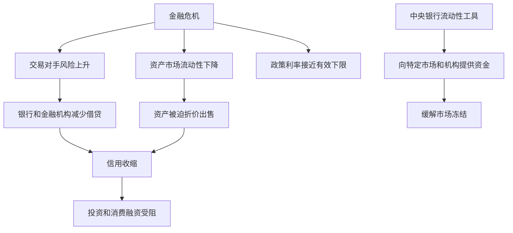

# 15.5 流动性工具与危机贷款机制

来源：

- 主线：Mishkin《货币金融学》Ch.16
- 补充：Mishkin/Eakins Ch.10
- 延伸：Bodie/Kane/Marcus《Investments》Ch.2, Ch.24

正常时期，中央银行通过公开市场操作、贴现政策、准备金要求和准备金利率，通常就能影响短期利率和货币供给。但金融危机不是正常时期。危机中，金融市场可能停止正常分配资金，银行和非银行金融机构不愿相互借贷，某些资产市场失去流动性，投资和消费融资渠道被堵住。此时，即使中央银行把短期政策利率降到很低，也未必能让信用重新流动。

这就是非常规货币政策工具出现的背景。非常规工具不是为了替代常规工具，而是在常规工具不足时，直接解决金融体系中某些断裂的融资渠道。流动性工具和危机贷款机制，就是其中第一类。

## 为什么危机中常规工具不够

危机中有两个问题特别重要。

第一，金融体系可能“卡住”。银行担心交易对手风险，不愿拆借；投资者担心资产价值，不愿买入证券；金融机构为了自保，减少贷款、出售资产、囤积现金。资金不再顺畅流向有生产性投资机会的人和企业。即使中央银行降低短期利率，信用市场仍可能冻结。

第二，政策利率可能接近有效下限。名义利率很难大幅低于零，因为人们可以持有现金，现金名义收益率是零。如果中央银行已经把联邦基金利率降到接近零，常规降息空间耗尽，就需要非利率工具继续刺激经济和修复金融市场。

## 扩大贴现窗口

危机初期，最自然的做法是扩大已有的贴现窗口。贴现窗口本来就是银行的后备流动性来源。2007 年金融危机开始时，联邦储备体系降低贴现率相对联邦基金利率目标的利差，让银行从贴现窗口借款更便宜。2008 年 3 月，这个利差进一步缩小。2020 年新冠危机中，贴现率也被大幅下调。

降低贴现率可以鼓励银行使用中央银行流动性。但贴现窗口有污名问题。银行担心市场认为自己陷入困境，因此即使中央银行降低贴现率，也未必愿意主动借款。危机越严重，污名越可能妨碍贴现窗口发挥作用。

这说明，中央银行不能只提供一个“可用”的窗口，还要考虑金融机构是否愿意使用它。如果使用工具本身会暴露借款人脆弱性，工具效果就会打折。

## 定期拍卖便利

为绕开贴现窗口污名，联邦储备体系在 2007 年 12 月设立了定期拍卖便利。它不是让银行单独来到贴现窗口，以固定惩罚性利率借款，而是由中央银行拍卖固定数量贷款，银行通过竞争性投标获得资金，利率由拍卖决定。

这种设计有几个效果。第一，许多银行一起参加拍卖，个别银行不容易被贴上“有问题”的标签。第二，利率不是单独的惩罚性贴现率，而是竞争形成。第三，中央银行可以明确控制投放规模。

随着危机加深，拍卖规模大幅扩大，未偿还贷款一度达到很高水平。危机结束后，这个工具被停止。它的意义在于说明：危机工具常常不是全新理论，而是围绕一个现实障碍重新设计操作机制。这里的障碍就是污名。

## 向非银行金融机构和特定市场提供流动性

2007-2009 年危机显示，现代金融体系的脆弱点不只在商业银行。投资银行、货币市场基金、商业票据市场、资产支持证券市场、抵押贷款支持证券市场都可能成为信用收缩的关键环节。

因此，中央银行的流动性供给扩展到传统银行之外。它设立贷款工具支持一级交易商，帮助商业票据融资，支持货币市场基金满足赎回，改善资产支持证券市场功能。还在个别系统性事件中提供贷款安排，帮助处理大型金融机构的失败风险。

2020 年新冠危机中，流动性支持进一步扩展。中央银行在财政部支持下设立工具，向小企业贷款、公司信用市场、州和地方政府债券市场等提供支持。工具名称很多，但背后逻辑相同：当某个关键融资市场冻结时，中央银行通过贷款、担保或购买安排恢复市场流动性。

可以把这些工具按目标分成几类：

| 目标 | 要解决的问题 | 工具思路 |
| --- | --- | --- |
| 银行流动性 | 银行不愿或无法从市场借到资金 | 扩大贴现窗口、定期拍卖 |
| 交易商流动性 | 证券交易商融资困难，市场做市能力下降 | 向一级交易商提供贷款 |
| 货币市场基金 | 投资者赎回导致基金抛售资产 | 向购买基金资产的机构提供融资 |
| 商业票据市场 | 企业短期融资断裂 | 支持或购买商业票据 |
| 资产支持证券市场 | 消费信贷和企业信贷证券化渠道冻结 | 以资产支持证券为抵押提供贷款 |
| 公司和地方政府信用市场 | 非金融部门融资压力急剧上升 | 支持公司债、市政债和相关贷款 |

## 危机贷款怎样进入中央银行资产负债表

当中央银行提供危机贷款时，它的资产负债表会扩大。资产端增加贷款或购买的证券，负债端通常增加银行准备金。2008 年以后，联邦储备体系资产负债表大幅扩张；2020 年新冠危机后，资产负债表又进一步上升。

资产负债表扩张本身不是最终目标。关键在于中央银行希望通过资产端的贷款和证券支持，改善特定市场功能；负债端准备金增加，是这些操作的会计结果。

这一区分很重要。危机贷款不是简单地“多印钱”。它首先是对金融市场流动性缺口的回应。某些市场冻结时，中央银行用自己的资产负债表替代暂时失灵的私人融资渠道，让支付、交易和融资继续进行。

## 流动性支持和信用风险

危机贷款工具会带来一个难题：中央银行是在提供流动性，还是在承担信用风险？

如果一家机构只是暂时缺现金，但资产质量良好，中央银行提供抵押贷款主要是流动性支持。如果一家机构资产已经严重亏损、偿付能力不足，贷款就可能变成信用救助。后者更容易带来损失和道德风险，也更接近财政政策。

因此，危机贷款通常强调抵押品、期限、利率和财政支持安排。抵押品降低中央银行损失风险；较高利率减少正常时期依赖；财政部支持可以把明显的信用风险放到财政当局承担范围内。

这也是为什么危机工具总伴随争议。支持者强调，如果不提供流动性，金融体系会冻结，实体经济损失更大。批评者担心，中央银行救助特定机构或市场，会鼓励未来冒险，并模糊货币政策与财政政策的边界。

## 危机贷款为什么是宏观政策

危机贷款看似针对金融机构或特定市场，最终目标却是稳定宏观经济。商业票据市场冻结，会影响企业发工资和补库存；货币市场基金赎回，会冲击短期融资；抵押贷款支持证券市场失灵，会推高住房贷款利率；公司债市场冻结，会阻断企业投资融资。每一个市场故障都可能压低消费、投资和就业。

因此，危机贷款不是为了让某个金融市场“价格好看”，而是为了让资金流继续支持实体经济支出。它补的是货币政策传导链条中的断点：从中央银行准备金到金融市场流动性，再到企业和家庭融资，再到总需求。

对投资者而言，危机流动性工具通常首先影响的是流动性折价和信用利差。当央行支持商业票据、货币市场基金或公司债市场时，它降低的是“卖不出去、融不到钱”的风险，而不一定消除发行人的长期偿付风险。判断政策效果时，需要分清市场价格反弹来自流动性恢复，还是来自基本面违约概率下降。

## 小结

金融危机中，常规降息和普通公开市场操作可能不足，因为金融体系可能冻结，政策利率也可能接近有效下限。中央银行于是使用流动性工具和危机贷款机制：扩大贴现窗口、设立定期拍卖便利、向一级交易商、货币市场基金、商业票据市场、资产支持证券市场、公司信用市场和地方政府融资市场提供支持。这些工具的核心目标是恢复关键金融市场的流动性，使资金重新流向实体经济。但危机贷款也会扩大中央银行资产负债表，并带来信用风险、道德风险和政策边界问题。

## 自测问题

- 金融危机中，为什么常规降息可能不足以恢复信用流动？
- 贴现窗口污名为什么会削弱危机贷款效果？
- 定期拍卖便利怎样缓解贴现窗口污名？
- 为什么现代中央银行危机工具会扩展到非银行金融机构和特定市场？
- 流动性支持和信用救助之间有什么区别？
- 危机工具压低信用利差时，为什么要区分流动性改善和违约风险下降？
