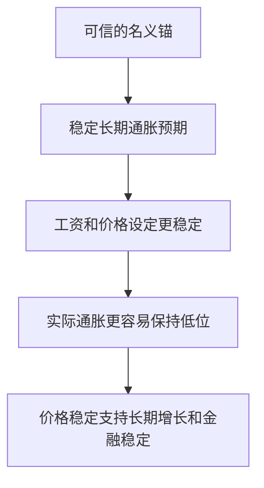

# 16.1 价格稳定与名义锚

来源：

- 主线：Mishkin《货币金融学》Ch.17
- 补充：Mishkin/Eakins Ch.10

货币政策工具回答的是“中央银行怎样操作”。货币政策战略回答的是另一个更根本的问题：中央银行为什么要这样操作，它最终想稳定什么？

如果只看每天的新闻，货币政策似乎总是在讨论利率：加息、降息、暂停加息、维持政策利率不变。但利率只是工具或操作目标。中央银行真正关心的是这些工具最终会怎样影响通胀、就业、产出、金融市场和公众预期。进入货币政策战略这一章，首先要理解一个核心判断：长期来看，价格稳定是货币政策最重要的目标之一，而名义锚是实现价格稳定的重要制度安排。

## 为什么价格稳定如此重要

价格稳定不是说所有商品价格都不变。市场经济中，某些商品变贵、某些商品变便宜是正常现象。石油供给减少，汽油价格可能上升；某种电子产品生产效率提高，价格可能下降。这些相对价格变化会引导资源重新配置。

价格稳定说的是总体物价水平比较稳定，通胀率低且可预测。也就是说，人们不必每天担心货币购买力会快速变化，企业和家庭可以比较安心地签合同、定工资、安排投资和储蓄。

通胀高且不稳定时，经济中的许多决策都会变得困难。一个家庭要为孩子未来上大学储蓄，如果未来物价水平难以预测，就很难判断今天应该存多少钱。企业要投资一台使用多年机器，如果未来成本、工资、销售价格和利率都被不稳定通胀扰乱，就更难评估项目是否值得做。工资合同、贷款合同、租赁合同和长期供货合同也都会变得更复杂。

通胀还会造成社会冲突。不同群体都希望自己的收入跟上物价上涨。工人希望工资上涨，企业希望提高售价，债权人希望利率补偿通胀，债务人希望用购买力下降的货币还债。通胀越高，围绕收入分配的冲突越明显。

极端情况下，恶性通胀会严重破坏经济运行。货币如果快速失去购买力，人们会减少持有货币，交易会变得混乱，价格信号失去意义，长期合同难以维持。教材提到，阿根廷、巴西、俄罗斯和津巴布韦等国家都曾经历严重通胀或恶性通胀，其经济后果非常沉重。

## 价格稳定不是唯一目标，但它是长期基础

中央银行当然不只关心通胀。高就业、产出稳定、经济增长、金融市场稳定、利率稳定和汇率稳定，也都是货币政策讨论中的重要目标。但价格稳定具有特殊地位，因为长期通胀失控会削弱其他目标。

如果通胀长期很高，长期利率通常也会升高，因为贷款人会要求补偿货币购买力损失。高利率会影响投资和住房购买。通胀不稳定还会增加金融市场不确定性，使企业更难进行长期计划。通胀失控甚至可能迫使中央银行后来采取剧烈紧缩，引发衰退和失业。

长期来看，高通胀不能永久降低失业率。中央银行如果试图通过持续扩张货币来让失业率低于经济能够长期维持的水平，公众最终会形成更高通胀预期，工资和价格会随之上调。结果往往是通胀更高，而就业和产出并没有永久改善。

所以，价格稳定的意义不是把其他目标排除掉，而是为其他目标提供长期环境。一个通胀低且稳定的经济，更容易实现可持续增长、稳定就业和金融体系正常运行。

## 名义锚是什么

为了实现价格稳定，中央银行需要某种“锚”。锚的作用是固定船的位置，防止船随水流漂走。货币政策中的名义锚，是一个能把总体物价水平或通胀预期固定住的名义变量。这个变量可以是通胀率，也可以是货币供给增长率，在某些制度下也可以是汇率。

名义变量是用货币单位表示、没有扣除物价变化影响的变量。通胀率、货币供给、名义汇率都属于名义变量。名义锚的作用，是让公众相信货币政策不会无限扩张，物价水平不会任意漂移。

如果中央银行宣布并可信地维持 2% 通胀目标，这个通胀目标就可以成为名义锚。家庭、企业和金融市场会以接近 2% 的长期通胀预期来签合同、定工资、定价和安排投资。如果中央银行承诺货币供给增长保持在某个范围内，并且公众相信它会执行，这个货币增长规则也可以成为名义锚。

名义锚发挥作用的第一条渠道，是稳定通胀预期。许多价格和工资并不是每天调整，而是在合同和计划中提前确定。如果公众相信未来通胀会保持低位，工资和价格设定就不会内置很高的通胀补偿。反过来，如果公众相信中央银行会放任高通胀，工资和价格会提前上调，高通胀就更容易自我实现。

## 没有锚会发生什么

没有名义锚时，货币政策容易变成逐日相机决策。每次面对短期压力，中央银行都可能被诱惑去多扩张一点：经济疲弱时多刺激，失业上升时多降息，政府融资压力上升时多提供货币支持，金融市场下跌时多放松。每一次看起来都有现实理由，但长期结果可能是公众逐渐相信中央银行不会坚持控制通胀。

一旦这种信念形成，通胀预期就会失去约束。企业调价时会提前考虑更高通胀，工人谈判工资时会要求更高补偿，贷款人会要求更高名义利率。中央银行如果继续扩张，只会验证公众预期；如果突然紧缩，又可能造成严重衰退。

名义锚的作用，就是给货币政策一个公开的、可观察的、能约束长期行为的基准。它让市场和公众知道，中央银行不能为了短期产出或就业目标无限牺牲价格稳定。

## 名义锚与时间不一致性

名义锚更深层的作用，是缓解时间不一致性问题。时间不一致性指的是：一个计划从长期看是最优的，但到了短期执行时，决策者有动机偏离它。

日常生活中很容易理解这个问题。一个人决定控制饮食，长期看少吃甜食更好。但当甜点摆在面前时，多吃一口有即时满足，于是长期计划被短期诱惑破坏。父母教育孩子也有类似问题。父母知道不能因为孩子哭闹就让步，否则孩子会学会用哭闹换取好处。但当孩子真的哭闹时，为了眼前安静，父母可能让步。结果孩子预期到哭闹有效，未来会更频繁地哭闹。

货币政策也面临类似诱惑。长期最优政策是保持低而稳定的通胀，不试图用意外扩张来永久提高产出。但在短期，中央银行可能被诱惑采取比公众预期更扩张的政策，因为意外扩张可能暂时提高产出、降低失业。问题在于，工人和企业会学习。一旦他们预期中央银行会这样做，就会提前提高工资和价格要求。最终，经济得到的是更高通胀，而不是更高平均产出。

名义锚像一条行为规则。它告诉中央银行和公众：政策不能每次都为了短期好处偏离长期价格稳定。只要这个锚可信，它就能减少政治压力和短期诱惑对货币政策的影响。

## 名义锚为什么必须可信

名义锚不是写在文件里就能发挥作用。它必须可信。公众相信中央银行会坚持这个锚，才会把它纳入预期。

可信度来自几个方面。第一，中央银行过去是否说到做到。第二，制度上是否给予中央银行足够独立性，使它能抵抗短期政治压力。第三，政策框架是否透明，公众能否判断中央银行是否偏离目标。第四，如果偏离目标，中央银行是否需要解释并承担问责。

如果中央银行宣布低通胀目标，却在经济稍有放缓时立刻放弃目标，公众就不会再相信它。相反，如果中央银行在短期冲击中允许通胀暂时波动，但清楚解释原因，并让公众相信长期目标不变，名义锚仍然可以保持有效。

这也说明，好的名义锚不是机械僵硬。经济会遇到石油价格冲击、金融危机、疫情、战争和供应链中断。中央银行不可能让每个月通胀都固定在同一个数值。关键是长期预期是否被锚定，公众是否相信中央银行会在中期把通胀带回稳定范围。

## 小结

货币政策战略首先要明确长期目标。价格稳定之所以重要，是因为高而不稳定的通胀会扰乱家庭和企业计划，扭曲合同和利率，引发收入分配冲突，并在极端情况下破坏货币和市场机制。价格稳定不是排斥就业、增长和金融稳定，而是这些目标的长期基础。名义锚是实现价格稳定的关键安排，它通过稳定通胀预期、约束相机抉择和缓解时间不一致性问题，使货币政策不至于被短期扩张诱惑带偏。名义锚必须可信，才能真正影响工资、价格、合同和金融市场预期。

## 自测问题

- 价格稳定为什么不是指每一种商品价格都不变？
- 高而不稳定的通胀会怎样影响家庭、企业和金融合同？
- 名义锚是什么？通胀目标为什么可以成为名义锚？
- 时间不一致性问题为什么会导致长期通胀偏高？
- 为什么名义锚必须具备可信度，而不能只是一个口头目标？
