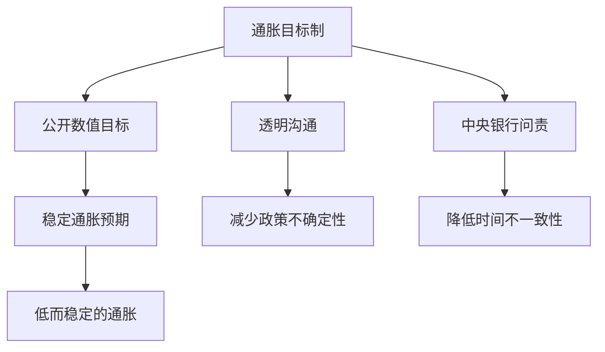

# 16.2 通胀目标制与平均通胀目标制

来源：

- 主线：Mishkin《货币金融学》Ch.17
- 补充：Mishkin/Eakins Ch.10
- 延伸：Bodie/Kane/Marcus《Investments》Ch.14, Ch.24

价格稳定需要名义锚。问题是，中央银行应该选择什么样的锚？在现代货币政策中，最有代表性的答案是通胀目标制：中央银行公开宣布一个中期通胀数值目标，并把货币政策框架、沟通和问责都围绕这个目标组织起来。

通胀目标制不是简单地说“我们希望通胀低一点”。它是一整套制度安排。它把价格稳定变成一个可公开观察、可解释、可评价的目标，使公众知道中央银行究竟想把通胀稳定在哪里，也让中央银行在偏离目标时必须说明原因。

## 通胀目标制包括哪些要素

通胀目标制通常包含五个要素。

第一，公开宣布中期通胀数值目标。目标可以是一个点，例如 2%；也可以是一个区间，例如 1%-3%。公开数值目标的作用，是让公众和市场知道中央银行要把通胀稳定在什么范围。

第二，制度上承诺价格稳定是长期主要目标。通胀目标不是一次新闻发布会上的口号，而要成为中央银行政策框架的一部分。中央银行需要承诺围绕这个目标制定政策，并在长期维持目标可信度。

第三，决策时使用广泛信息，而不是只盯一个变量。早期货币政策框架曾经重视货币总量目标，但货币总量和通胀之间的关系会随金融创新和支付方式变化而变化。通胀目标制下，中央银行会综合观察产出、就业、工资、汇率、资产价格、信用条件、通胀预期和金融市场信息。

第四，提高透明度。中央银行需要向公众解释自己的目标、预测、政策计划和偏离目标的原因。透明度使家庭、企业和金融市场更容易理解政策反应函数，从而减少不确定性。

第五，提高问责。既然目标公开，中央银行就要对目标实现情况负责。如果通胀持续偏离目标，中央银行必须解释为什么偏离、准备怎样把通胀带回目标、需要多长时间。

| 要素 | 作用 |
| --- | --- |
| 公开数值目标 | 给通胀预期一个明确锚点 |
| 长期制度承诺 | 让目标不是临时口号 |
| 信息包容型决策 | 避免机械盯住单一指标 |
| 透明沟通 | 降低政策不确定性 |
| 问责机制 | 让中央银行对目标负责 |

## 早期实践：新西兰、加拿大和英国

新西兰是第一个正式采用通胀目标制的国家。1989 年，新西兰通过新的中央银行法案，增强中央银行独立性，并把价格稳定确定为核心目标。财政部长和中央银行行长需要协商并公开政策目标协议，规定通胀目标区间和实现期限。新西兰制度的一个特点，是中央银行行长对实现目标承担很强责任。

加拿大在 1991 年采用通胀目标制。英国在 1992 年采用通胀目标，并开始发布通胀报告。英国的通胀报告定期解释通胀走势、经济预测和政策判断，让公众能够看到中央银行怎样理解经济形势。

这些国家采用通胀目标制后，通胀率明显下降，并且在之后较长时期保持低位。这个经验支持了一个重要判断：明确的通胀目标、透明沟通和问责机制，有助于把通胀预期稳定下来。

但降低通胀并非没有成本。新西兰在反通胀过程中失业率曾明显上升。这个例子提醒我们，通胀目标制不是没有代价的魔法工具。它可以改善长期表现，但从高通胀降到低通胀的过程中，经济可能经历短期产出和就业损失。

## 通胀目标制的优点

通胀目标制的第一个优点，是减少时间不一致性问题。公开的数值目标让中央银行更难为了短期产出刺激而长期放松货币政策。政治讨论也会从“中央银行能不能永久制造更多就业”转向“中央银行怎样保持长期通胀稳定”。这有助于减少要求中央银行过度扩张的压力。

第二个优点，是提高透明度。通胀目标容易被公众理解。中央银行可以围绕目标解释：为什么设定这个目标，当前通胀为什么偏离，政策怎样让通胀回到目标。透明沟通能帮助企业和家庭计划未来，也能让金融市场更稳定地形成利率和通胀预期。

第三个优点，是提高问责。目标越清楚，公众越容易评价中央银行表现。如果通胀长期高于或低于目标，中央银行不能含糊其辞，必须说明原因并提出政策路径。问责也有助于维护中央银行独立性，因为公众更容易看到独立中央银行在完成什么任务。

第四个优点，是更符合民主原则。货币政策影响就业、收入、利率和金融市场，不应完全隐藏在技术官僚内部。通胀目标制下，民选政府或法律框架通常参与目标设定，中央银行则负责操作。这种安排把目标授权和工具独立结合起来。

第五个优点，是实际表现较好。采用通胀目标制的国家通常成功降低通胀和通胀预期，而且低通胀在后续经济扩张中没有轻易反弹。

## 通胀目标制的批评

通胀目标制也有批评。

第一，信号可能滞后。货币政策影响通胀需要时间，通胀结果也不是中央银行可以立即精确控制的变量。如果今天政策犯错，可能要过一段时间才体现在通胀数据上。因此，通胀目标不像短期利率那样能即时显示政策立场。

第二，有人担心它过于僵硬。如果中央银行机械地追求通胀目标，可能在经济遭受冲击时过度收紧或过度放松。但实际运行中的通胀目标制通常不是机械规则，而是“受约束的相机抉择”。中央银行有操作空间，但这个空间受到中期通胀目标约束。

第三，有人担心它会增加产出波动。如果中央银行只盯通胀，通胀稍高就大幅紧缩，可能导致就业和产出大幅下降。但实际采用通胀目标制的国家通常使用灵活通胀目标制：允许通胀在短期偏离目标，以避免产出和就业过度波动。

第四，有人担心它会降低经济增长。降低通胀的过程中，产出可能低于正常水平。但在低通胀实现以后，许多通胀目标制国家的产出和就业并没有长期受损。低而稳定的通胀反而可能支持长期增长。

## 灵活通胀目标制

实际中更重要的概念是灵活通胀目标制。它不是要求每个月、每个季度通胀都精确等于目标，而是要求中央银行在中期把通胀带回目标，同时考虑产出和就业波动。

这种做法承认两个事实。第一，经济会受到冲击。能源价格上升、供应链中断、金融危机和疫情都可能让通胀短期偏离目标。第二，货币政策有滞后。如果中央银行为了立即压低通胀而过度紧缩，可能造成不必要的失业和产出损失。

因此，灵活通胀目标制通常会问：通胀偏离目标的原因是什么？偏离会不会影响长期预期？把通胀带回目标应该多快？如果过快回归会造成很大产出损失，中央银行可能选择更平滑的路径。

灵活并不等于放弃目标。它的关键是，短期允许偏离，长期维持锚定。

这正好对应宏观经济中的短期和长期区别。短期内，经济可能因为需求冲击、金融危机或供给冲击偏离潜在产出，货币政策需要考虑就业和产出稳定；长期内，通胀预期必须被锚定，否则名义工资、价格和利率会围绕更高通胀重新调整。灵活通胀目标制试图把这两件事放在同一框架中：短期稳定总需求，长期稳定价格水平。

## 美联储走向通胀目标制

美国联邦储备体系在很长时间内没有正式宣布通胀目标。20 世纪 80 年代中期以后，美联储实际上非常重视长期控制通胀，但它没有明确公开一个数值目标。这种做法有时被称为“只管去做”的策略：中央银行不详细说明完整框架，而是依靠政策判断和实际表现取得低通胀。

这种策略曾经取得较好宏观表现，但缺点是透明度不足。市场不断猜测中央银行真实意图，公众也不容易评价政策是否成功。缺少明确标准，还可能削弱问责。

2012 年，美联储发布长期目标和货币政策战略声明，明确把个人消费支出价格指数通胀的长期目标设为 2%。同时，美联储强调自己的目标是灵活的，既追求 2% 通胀，也追求最大可持续就业。这使美国框架更接近灵活通胀目标制。

## 平均通胀目标制

2020 年，美联储把原来的 2% 年度通胀目标调整为 2% 平均通胀目标。这个变化的核心，是过去的通胀偏离不再完全“既往不咎”。

在普通 2% 目标下，如果过去几年通胀一直低于 2%，中央银行仍然只要求未来回到 2%。过去低于目标的部分不需要补回来。平均通胀目标制则不同。如果通胀长期低于 2%，为了让一段时期的平均通胀回到 2%，中央银行会允许或寻求通胀在未来一段时间适度高于 2%。

这背后的担忧是有效下限。若通胀预期长期低于 2%，当经济遭受负面冲击、名义利率降到零附近时，实际利率会更高，货币政策刺激空间更小。平均通胀目标制试图防止通胀预期向下漂移。

平均通胀目标制还有一个稳定器作用。负面冲击使通胀下降时，公众如果相信中央银行未来会让通胀适度高于目标，通胀预期就不容易下滑。预期通胀较高时，在名义利率不能继续下降的情况下，实际利率也会降低，从而支持需求。

但它也有风险。如果中央银行允许通胀高于 2%，公众可能怀疑它已经不再认真控制通胀。因此，平均通胀目标制的成功取决于沟通和可信度：公众必须相信短期超调是为了维护长期 2% 平均目标，而不是放弃价格稳定。

金融市场会通过通胀保值债券、名义国债、通胀互换和收益率曲线来检验这种可信度。若平均通胀目标制可信，长期盈亏平衡通胀率应围绕目标保持稳定，即使短期实际通胀高于或低于目标也不应失控漂移。若市场开始认为“平均”只是放松约束的说法，长期通胀补偿和期限溢价会上升，央行反而需要更强紧缩来重建锚。

## 小结

通胀目标制把价格稳定目标具体化为公开的中期数值目标，并配合制度承诺、信息包容型决策、透明沟通和问责机制。它的优点是降低时间不一致性、稳定预期、提高透明度和问责，并在许多国家帮助降低通胀。它的批评包括信号滞后、可能僵硬、可能增加产出波动和影响增长，但实际运行中多采用灵活通胀目标制，允许短期偏离、坚持中期锚定。平均通胀目标制进一步要求过去偏离影响未来政策：如果通胀长期低于目标，未来可允许通胀适度高于目标，以防止通胀预期下滑并缓解有效下限问题。

## 自测问题

- 通胀目标制为什么不只是“希望低通胀”的口号？
- 通胀目标制的五个基本要素是什么？
- 为什么通胀目标制能缓解时间不一致性问题？
- 灵活通胀目标制和机械通胀目标有什么区别？
- 平均通胀目标制为什么要让过去的通胀偏离影响未来政策？
- 金融市场中的盈亏平衡通胀率怎样反映通胀目标可信度？
