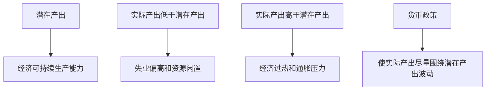

# 16.3 就业、产出、增长与金融稳定目标

来源：

- 主线：Mishkin《货币金融学》Ch.17
- 补充：Mishkin/Eakins Ch.10

价格稳定是货币政策的长期核心目标，但中央银行从来不只面对通胀。现实经济中，失业上升、产出下滑、金融市场冻结、利率大幅波动、汇率剧烈变化，都会让中央银行承受政策压力。因此，理解货币政策战略时，必须同时理解其他目标：高就业和产出稳定、经济增长、金融市场稳定、利率稳定和外汇市场稳定。

这些目标并不是彼此独立。就业和产出影响通胀压力，金融危机会打击实体经济，利率波动会影响金融机构资产价值，汇率变化会影响进口价格和出口竞争力。货币政策的难点，正是这些目标在长期可能相互支持，在短期却可能发生冲突。

## 高就业为什么是目标

高就业之所以重要，首先是因为失业会带来直接的人类痛苦。失业不是统计表上的一个数字，而意味着收入中断、家庭压力上升、技能闲置和生活计划被迫改变。长期失业还可能降低劳动者技能，使他们之后更难重新进入劳动力市场。

其次，高失业意味着资源浪费。工人没有工作，机器、厂房和设备也可能闲置。经济本来可以生产更多商品和服务，却因为需求不足或资源错配没有实现。这会造成实际 GDP 低于可能达到的水平。

不过，高就业不等于零失业。即使经济运行良好，也会有一部分人正在找工作。有些人离开原岗位寻找更合适的工作，有些人毕业后进入劳动力市场，有些人照顾家庭一段时间后重新求职。这类由于寻找匹配需要时间而产生的失业，叫摩擦性失业。它并不完全是坏事，因为更好的工作匹配可以提高生产率和个人满意度。

还有一种失业叫结构性失业。它来自岗位要求和劳动者技能、地区分布之间的不匹配。例如某些行业衰退，劳动者技能不再符合新行业需要；某地岗位增加，但失业者住在另一个地区。结构性失业更令人担忧，但货币政策能做的有限。降息可以刺激总需求，却不能直接把一个工人的技能变成另一个行业需要的技能，也不能直接解决地区迁移障碍。

因此，货币政策追求的高就业，不是让失业率等于零，而是让经济接近充分就业。充分就业对应的失业率通常称为自然失业率。它不是一个固定不变、可以精确观测的数字，而是一个估计值，会随着劳动力市场制度、人口结构、技能匹配和政策环境变化。

## 产出稳定与潜在产出

就业和产出紧密相连。失业率较高时，经济通常生产低于正常能力的产出；失业率过低、需求过热时，经济可能暂时超过可持续能力，但通胀压力会上升。

与自然失业率对应的产出水平，叫自然产出率或潜在产出。潜在产出不是经济能在极端加班、机器满负荷情况下短期冲到的最高产出，而是在劳动力、资本和技术正常利用下可以持续生产的水平。

货币政策稳定产出的意思，是尽量让实际产出围绕潜在产出波动，而不是长期低于潜在产出，也不是长期过热。实际产出低于潜在产出时，经济存在闲置资源，失业偏高；实际产出高于潜在产出太多时，工资和价格上涨压力可能加大。

这也解释了为什么中央银行不能只看当前失业率本身。它还要判断失业率相对于自然失业率的位置、产出相对于潜在产出的位置，以及这些偏离会怎样影响未来通胀。

## 经济增长目标

经济增长与高就业密切相关。失业率低、需求稳定时，企业更愿意投资新设备、扩大生产和提高生产率。反过来，如果工厂闲置、订单不足，企业没有动力增加资本支出。

但增长目标和就业稳定目标仍有区别。高就业更关注经济是否充分利用现有资源，经济增长更关注生产能力本身能否提高。长期增长来自资本积累、技术进步、人力资本提升和制度改善。货币政策可以通过稳定通胀和宏观环境间接支持增长，但它不能凭空创造长期生产率。

有些促进增长的政策更接近财政政策或结构性政策，例如鼓励储蓄和投资、改善教育培训、降低扭曲性税收、促进竞争和创新。货币政策如果试图用持续扩张来制造长期增长，最终更可能造成通胀，而不是提高生产率。

因此，中央银行可以支持经济增长，但主要方式是提供低而稳定的通胀环境、减少经济剧烈波动、维护金融体系正常融资功能，而不是把货币扩张当作长期增长来源。

## 金融市场稳定目标

金融市场的基本功能，是把资金从储蓄者转移到有生产性投资机会的借款者。如果金融市场正常运行，企业可以融资扩张，家庭可以获得住房和消费信贷，政府可以平稳融资，风险可以被分散和定价。

金融危机会破坏这个过程。银行和投资者不愿放贷，证券市场流动性消失，资产价格下跌削弱金融机构资产负债表，信用收缩又进一步打击消费和投资。前面金融危机章节已经说明，金融危机常常伴随深度衰退和缓慢复苏。

因此，金融市场稳定是中央银行的重要目标。美国联邦储备体系建立本身，就与 1907 年银行恐慌后的金融稳定需求有关。中央银行作为最后贷款人、支付体系核心和货币政策执行者，天然处在金融稳定的关键位置。

但金融稳定目标也会带来困难。中央银行如果过度保护金融市场，可能鼓励金融机构冒险，因为它们相信危机时会得到救助。中央银行如果完全忽视金融不稳定，又可能让金融危机扩大，最终造成更严重的产出和就业损失。

## 利率稳定目标

利率波动会增加经济不确定性。家庭买房时要考虑抵押贷款利率，企业投资时要考虑融资成本，银行和保险公司持有大量债券和贷款，长期利率变化会影响资产价值。

利率上升会使长期债券和固定利率贷款的市场价值下降。持有这些资产的金融机构可能出现资本损失。20 世纪 80 年代和 90 年代初，美国储蓄贷款协会和互助储蓄银行曾因利率大幅波动承受严重压力。

中央银行也会关心利率上升带来的政治压力。利率上升会使借款人不满，政府融资成本也可能增加，中央银行可能面临要求其降低利率或限制其权力的呼声。

不过，利率稳定不能理解为利率永远不变。如果通胀压力上升，中央银行可能必须提高利率。真正的问题是避免不必要的剧烈波动，并使利率变化与经济目标相一致。

## 外汇市场稳定目标

开放经济中，汇率变化会影响出口、进口和通胀。美元升值会让美国商品在国外更贵，使出口行业竞争力下降；美元贬值会提高进口商品价格，可能推高国内通胀。对更依赖国际贸易的国家来说，汇率稳定的重要性更高。

企业和家庭也需要汇率相对稳定来做计划。进口商、出口商、跨国企业和持有外币资产的人，都要面对汇率风险。剧烈汇率波动会增加合同和投资的不确定性。

但汇率稳定也不能成为无条件目标。一个国家如果同时想固定汇率、自由资本流动和独立货币政策，会遇到开放经济中的政策约束。这里先只需要理解：外汇市场稳定是货币政策会考虑的目标之一，但它必须与通胀、就业和金融稳定一起权衡。

## 长期一致与短期冲突

长期来看，价格稳定与其他目标并不矛盾。低而稳定的通胀有助于长期增长、金融稳定、利率稳定和就业稳定。高通胀不能永久降低自然失业率，也不能长期提高潜在产出。

短期中，目标之间却可能冲突。经济过热、失业率很低、通胀压力上升时，中央银行为了价格稳定可能需要提高利率。加息有助于抑制通胀，但短期会降低产出、提高失业，并造成利率波动。经济衰退时，中央银行为了稳定就业和产出可能降息，但如果通胀本来已经很高，降息可能削弱价格稳定。

| 目标 | 长期关系 | 短期可能冲突 |
| --- | --- | --- |
| 价格稳定 | 支持增长、就业和金融稳定 | 抗通胀加息可能压低产出 |
| 高就业和产出稳定 | 低通胀环境更可持续 | 刺激就业可能推高通胀 |
| 金融市场稳定 | 稳定金融体系有利于长期价格和产出稳定 | 救助可能带来道德风险 |
| 利率稳定 | 稳定预期和金融机构资产负债 | 必要加息或降息会带来波动 |
| 汇率稳定 | 降低贸易和进口价格不确定性 | 维持汇率可能限制国内政策 |

这就是为什么中央银行需要战略，而不只是工具。工具告诉中央银行能做什么，战略告诉中央银行在目标冲突时怎样排序、怎样解释、怎样保持长期可信度。

## 小结

货币政策除了价格稳定，还关注高就业和产出稳定、经济增长、金融市场稳定、利率稳定和外汇市场稳定。高就业不是零失业，而是接近自然失业率；产出稳定是让实际产出围绕潜在产出波动；经济增长主要来自生产率、资本和制度，货币政策只能间接支持；金融稳定关系到资金能否流向生产性用途；利率和汇率稳定能降低计划和金融风险。长期看，价格稳定与这些目标相互支持；短期中，抗通胀、稳就业、稳金融和稳汇率可能发生冲突，货币政策战略就是处理这些冲突的框架。

## 自测问题

- 为什么高就业不等于零失业？
- 摩擦性失业和结构性失业有什么区别？
- 潜在产出为什么不是短期最高产出？
- 金融市场稳定为什么会成为中央银行目标？
- 价格稳定和就业稳定为什么长期不冲突、短期可能冲突？
