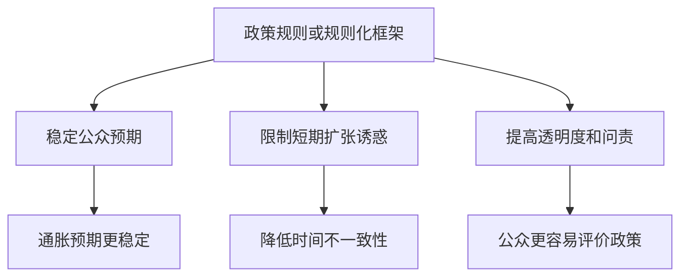
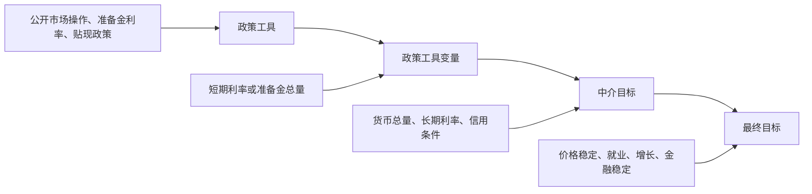

# 16.4 规则与相机抉择

来源：

- 主线：Mishkin《货币金融学》Ch.17
- 补充：Mishkin/Eakins Ch.10

货币政策有多个目标，经济又不断受到冲击。中央银行面对的一个基本选择是：政策应该尽量按事先设定的规则运行，还是应该根据每次经济形势灵活判断？

这个问题通常被称为“规则与相机抉择”的问题。规则不是说中央银行完全不思考，只按机器指令行动；相机抉择也不是说中央银行随心所欲。真正的分歧在于，货币政策是否需要一个稳定、可预期、能约束自身的框架，以及这个框架应该给政策制定者留下多少判断空间。

## 为什么不能只靠临场判断

如果经济总是按固定模式运行，中央银行也许只需要每次看数据，然后做最合适的短期决定。但现实中，货币政策有滞后。今天加息或降息，对产出可能要过一段时间才明显，对通胀的影响更慢。等通胀已经明显上升再收紧，往往已经太迟；等衰退已经完全显现再放松，也可能错过时机。

更重要的是，公众会根据中央银行行为形成预期。工资、价格、债券收益率、贷款利率和资产价格，都会受预期影响。如果中央银行每次只看短期利益，公众会怀疑它是否真有长期价格稳定承诺。

相机抉择的问题就在这里。单次看，扩张政策可能很有吸引力：失业高时降息，金融市场下跌时降息，政府融资压力大时保持宽松。可是如果公众预期中央银行总会为了短期好处放松，通胀预期会升高，工资和价格设定会提前反映这种预期。长期结果可能是更高通胀，而没有更高平均就业。

## 规则的作用

规则的价值，不只是让政策“机械”。它更重要的作用，是给中央银行一个可解释、可预期、可问责的行为框架。

名义锚就是一种规则性质的安排。通胀目标告诉公众：货币政策不会无限追逐短期产出刺激，而是要在中期保持价格稳定。泰勒规则也是一种规则性质的思路：当通胀高于目标、产出高于潜在产出时，政策利率应该上升；当通胀低于目标、产出低于潜在产出时，政策利率应该下降。

规则有几个好处。第一，它可以稳定预期。公众知道中央银行大致会怎样反应，就更容易形成稳定的通胀和利率预期。第二，它能减少时间不一致性。中央银行不容易每次都为了眼前收益偏离长期目标。第三，它能提高问责。政策如果偏离规则，中央银行需要解释为什么偏离。

## 为什么又不能完全机械

规则有价值，但经济不是只会发生一种冲击。石油价格上升、金融危机、疫情、战争、技术变化、财政政策变化、全球资本流动，都可能让同一个指标具有不同含义。

例如通胀上升可能来自需求过热，也可能来自能源价格暂时上升。两者需要的政策反应不完全相同。产出下降可能来自总需求不足，也可能来自供给能力受损。金融危机时，政策利率和信用利差之间的关系也会改变：即使短期利率很低，企业和家庭实际面对的融资条件仍可能很紧。

如果规则过于机械，中央银行可能在错误时候做出过度反应。只要通胀超过目标就立刻大幅收紧，可能在供给冲击中造成不必要的产出损失；只要产出低于潜在产出就立刻大幅放松，可能在通胀预期已经失控时进一步削弱可信度。

因此，现代货币政策更常见的做法不是“纯规则”或“纯相机抉择”，而是受约束的相机抉择。中央银行保留判断空间，但这个空间被长期目标、名义锚、透明沟通和问责机制约束。

## 受约束的相机抉择

受约束的相机抉择可以理解为：中央银行不是每一步都由公式自动决定，但也不能随意偏离长期目标。它必须用公开框架说明自己为什么这样做。

通胀目标制就是典型例子。中央银行有明确通胀目标，但不会机械地要求通胀每个月都等于目标。面对冲击时，它会根据经济状态、通胀预期、产出缺口和金融条件决定回到目标的速度。如果偏离目标，它要解释原因和回归路径。

这种安排试图同时保留两件事：一方面，长期目标和名义锚约束政策，防止短期扩张诱惑；另一方面，中央银行可以根据复杂经济环境作出判断，避免机械规则造成过度波动。

更具体地说，受约束的相机抉择不是“规则失败后的妥协”，而是现代货币政策面对现实经济复杂性后形成的常态。中央银行可以说：我们的长期通胀目标是 2%，但如果一次能源价格冲击暂时把通胀推高，我们不会为了让当月通胀立刻回到 2% 而制造严重衰退；我们会判断冲击是否会进入工资、价格和通胀预期，再决定收紧速度。这样的做法仍然是有规则的，因为它没有放弃长期目标；同时也是相机的，因为它没有机械套用公式。

如果缺少“约束”，相机抉择容易滑向机会主义：每次都说这次情况特殊，于是长期目标不断让位于短期压力。如果缺少“相机”，规则又容易变成僵硬指令：无论冲击来自需求还是供给，无论金融市场是否冻结，都要求同样反应。好的政策框架要让公众理解中央银行的反应模式，而不是要求中央银行在所有情况下重复同一个动作。

| 政策方式 | 优点 | 风险 |
| --- | --- | --- |
| 纯相机抉择 | 灵活，应对复杂情况 | 容易受短期压力影响，预期不稳定 |
| 机械规则 | 可预期，约束政策 | 难以应对特殊冲击和结构变化 |
| 受约束的相机抉择 | 兼顾框架和灵活性 | 依赖透明沟通和可信度 |

## 政策工具、政策工具变量和中介目标

讨论规则与相机抉择时，还需要区分几个层次。中央银行直接控制的是政策工具，例如公开市场操作、贴现率、准备金利率、资产购买和前瞻指引。政策工具影响政策工具变量，也叫操作工具，例如联邦基金利率或准备金总量。政策工具变量再影响中介目标，例如货币总量、长期利率或信用条件。最后，这些变量影响最终目标，如价格稳定、高就业和金融稳定。

这个链条可以这样表示：

中央银行不能同时精确控制所有变量。以准备金市场为例，如果中央银行固定非借入准备金数量，那么准备金需求波动会让联邦基金利率上下波动。反过来，如果中央银行固定联邦基金利率目标，就必须随着准备金需求变化不断调整非借入准备金。也就是说，准备金数量目标和利率目标不能同时被精确固定。

这也是为什么政策框架必须选择一个主要操作目标。现代多数中央银行选择短期利率作为政策工具变量，因为它更容易观察、金融市场能立即理解，也与通胀和产出目标有较清晰联系。

可以用一个简单场景看清这个“不可能同时固定”。假设中央银行决定今天非借入准备金数量固定不变。下午某些银行突然需要更多准备金来完成支付清算，准备金需求上升。由于准备金供给被固定，银行只能在联邦基金市场上相互竞争借准备金，联邦基金利率就会上升。此时中央银行保住了准备金数量目标，却失去了利率目标。

如果中央银行反过来坚持联邦基金利率不变，那么当准备金需求上升时，它必须通过公开市场购买或其他操作增加准备金供给，满足新增需求，使利率不被推高。这样它保住了利率目标，但非借入准备金数量会变化。目标选择的含义就在这里：选择利率目标，就要让准备金数量随需求波动；选择准备金目标，就要接受利率波动。

这一点对理解货币政策新闻很重要。新闻中经常说中央银行“维持利率目标不变”，这并不表示中央银行什么都没做。为了维持利率目标，交易台可能仍然需要根据准备金供求变化进行操作。政策立场不变，不等于操作数量不变。

## 选择政策工具变量的标准

一个好的政策工具变量需要满足三个标准。

第一，容易观察和衡量。中央银行需要迅速知道政策立场是否偏离目标。短期名义利率可以实时观察，而某些准备金或货币总量数据有统计滞后。可是名义利率也有缺点，因为真正影响借款和支出的往往是实际利率，而实际利率需要扣除预期通胀，预期通胀并不容易直接观察。

第二，中央银行能够控制。政策工具变量如果不能被中央银行有效控制，就不能承担操作目标功能。联邦基金利率这类短期利率通常可以被中央银行较紧密控制。准备金总量也可通过公开市场操作影响，但会受到公众现金持有变化等因素干扰。实际利率则更难直接控制，因为它取决于名义利率和预期通胀。

第三，对最终目标有可预测影响。一个变量即使容易观察、容易控制，如果与通胀和就业没有稳定关系，也不是好工具。现代中央银行普遍认为，短期利率与通胀、产出和金融条件之间的联系，比货币总量与最终目标之间的联系更适合作为日常操作框架。

货币总量之所以在现代框架中弱化，一个重要原因是金融创新改变了“钱”的形态。银行存款、货币市场基金、回购、电子支付和其他近似货币资产之间的边界会变化。某个货币总量指标的增长，未必稳定对应未来名义 GDP 或通胀。相比之下，短期利率直接进入金融市场定价，并影响银行贷款利率、债券收益率、汇率、资产价格和企业融资成本，因此更适合承担日常政策工具变量。

但选择利率作为工具变量，也不等于中央银行只看利率。利率只是政策姿态的一个核心表达。中央银行仍要观察货币、信用、资产价格、银行资产负债表、通胀预期和全球金融条件。规则化政策不是窄化视野，而是在大量信息中形成稳定反应方式。

这为后面的 IS 曲线和总需求分析做准备。短期利率影响投资和消费，是 IS 曲线移动或沿曲线变化的重要来源；中央银行选择利率工具，本质上是在选择一种更直接影响总需求的操作变量。规则与相机抉择的争论，最终会落到总需求应当怎样被稳定、通胀预期应当怎样被锚定。

| 标准 | 含义 | 难点 |
| --- | --- | --- |
| 可观察和可衡量 | 能快速知道政策变量在哪里 | 实际利率和预期通胀难测 |
| 可控制 | 中央银行能把它推向目标 | 准备金和货币总量会受外部因素影响 |
| 对目标有可预测影响 | 能影响通胀、就业和产出 | 金融结构变化会改变传导关系 |

## 小结

规则与相机抉择的核心，是货币政策如何在长期可信和短期灵活之间取平衡。纯相机抉择容易被短期扩张诱惑和政治压力带偏，导致通胀预期失锚；机械规则又可能无法应对复杂冲击。现代政策框架通常采取受约束的相机抉择：用通胀目标、名义锚、透明沟通和问责约束长期方向，同时保留对经济形势的判断空间。中央银行还必须选择合适的政策工具变量。利率目标和准备金数量目标不能同时精确固定，现代中央银行大多选择短期利率作为主要操作目标。

## 自测问题

- 为什么货币政策不能只依靠每次临场判断？
- 政策规则怎样帮助稳定公众预期？
- 为什么机械规则也可能带来问题？
- 什么是受约束的相机抉择？
- 为什么中央银行不能同时固定准备金数量和联邦基金利率？
