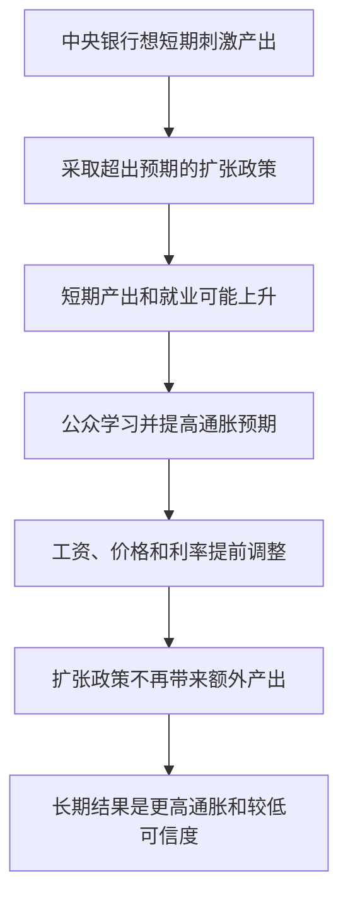
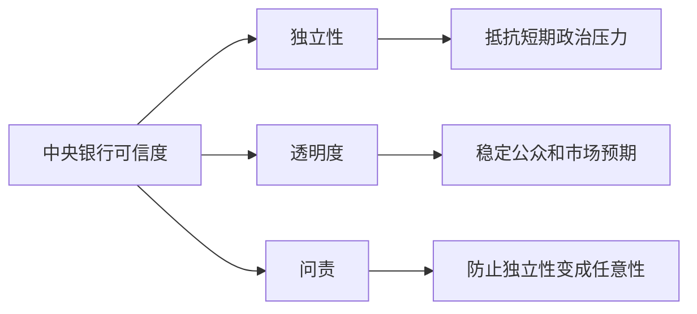

# 16.5 时间不一致性与政策可信度

来源：

- 主线：Mishkin《货币金融学》Ch.17
- 补充：Mishkin/Eakins Ch.10

货币政策最难的地方之一，是政策效果取决于公众是否相信中央银行。加息、降息和资产购买当然重要，但如果家庭、企业和金融市场不相信中央银行会坚持长期目标，政策效果就会被削弱。时间不一致性和政策可信度，正是理解这种问题的核心。

时间不一致性说的是：一个长期看最好的计划，到了短期执行时却变得很难坚持。货币政策中，长期看最好的计划通常是保持价格稳定，不用意外扩张去追求暂时产出收益；短期看，决策者却总有动机多刺激一点，因为这样可能暂时降低失业、提高产出或缓解金融市场压力。

## 短期诱惑为什么会带来长期坏结果

设想中央银行公开表示要控制通胀。工资合同和价格合同已经在这个承诺下签订。如果中央银行突然采取比公众预期更扩张的政策，短期内需求上升，企业销售增加，产出和就业可能暂时提高。

这看起来像是一个诱人的政策选择。但这个效果依赖于“意外”。一旦工人和企业学会预期中央银行会这样做，他们会在工资和价格中提前加入更高通胀补偿。企业预期成本会上升，会提前调价；工人预期物价会上升，会要求更高工资；金融市场预期通胀会上升，会要求更高名义利率。

最终，中央银行失去意外扩张带来的产出效果，却留下更高通胀。经济并没有获得永久更高就业，只是形成了更高的通胀预期和更差的政策可信度。

这个逻辑说明，货币政策不能只看某一次政策行动的即时收益。政策制定者今天的选择会改变公众明天的预期，而预期又会改变政策明天的效果。

## 生活中的时间不一致性

时间不一致性并不只存在于中央银行。一个人决定新年开始节食，长期看少吃甜食更好。但当甜点就在面前时，“只吃一口”的短期诱惑很强。如果每次都向短期诱惑让步，长期计划就失败。

父母教育孩子也类似。父母知道不能在孩子哭闹时立刻让步，否则孩子会学会哭闹有效。但在当下，为了让孩子马上安静下来，让步很有诱惑力。结果孩子形成预期：只要哭得足够久，就能得到想要的东西。以后哭闹会更多。

货币政策中的公众就像会学习的孩子和会调整行为的人。只要中央银行反复为了短期目标放弃长期承诺，公众就会把这种行为纳入预期。以后中央银行再承诺低通胀，可信度就会下降。

## 可信度为什么能降低政策成本

可信度指公众相信中央银行会实现其宣布目标的程度。一个可信的中央银行宣布要保持低通胀，家庭、企业和金融市场会更愿意相信未来通胀会低。工资和价格设定也会更接近这个预期。

可信度高时，控制通胀的成本较低。因为通胀预期已经稳定，中央银行不需要用极端紧缩来迫使公众相信它。相反，如果中央银行长期放任通胀，公众不相信它的反通胀承诺，那么即使中央银行宣布要控制通胀，工资和价格仍可能继续按高通胀预期设定。中央银行必须采取更强烈、更痛苦的紧缩，才能重建可信度。

20 世纪 70 年代美国的高通胀经验说明了失去名义锚的代价。政策没有充分遵守后面要讲的泰勒原则，通胀上升时名义利率没有足够上升，实际利率反而偏低，货币政策变得过于宽松。通胀最终升到两位数。后来沃尔克时期大幅收紧货币政策，才把通胀降下来，但代价是严重衰退和高失业。

这个经验的教训不是“永远越紧越好”，而是：如果中央银行长期让通胀预期失锚，之后重新建立可信度会非常昂贵。

反通胀成本可以从工资和价格合同中理解。假设很多工会和企业相信未来通胀会是 8%，于是工资合同和供货合同都按这个预期签订。中央银行现在宣布要把通胀降到 2%。如果公众不相信它，合同仍然按 8% 通胀预期签，企业成本和价格继续上升。为了迫使实际通胀下降，中央银行必须把需求压得很低，让企业没有能力继续涨价，让劳动市场变弱，工资增长放缓。这就是为什么缺乏可信度时，降低通胀往往伴随更高失业和更深衰退。

如果公众相信中央银行会实现 2% 通胀目标，工资和价格合同会更快围绕 2% 重新设定。需求不需要被压得那么低，通胀也能下降。可信度不是抽象声誉，而是通过工资、价格、利率和金融合同进入实际经济。

## 名义锚如何帮助建立可信度

名义锚能把政策可信度具体化。没有锚时，公众很难判断中央银行到底会如何权衡通胀和就业。每次政策变化都可能被解读为短期政治压力或市场压力的结果。

有了名义锚，公众至少知道中央银行长期承诺的方向。例如明确的通胀目标告诉公众：即使短期经济波动，中央银行也会在中期把通胀带回目标。货币政策仍有灵活性，但灵活性是在目标范围内进行的。

名义锚还能让偏离目标变得可见。如果通胀长期高于目标，中央银行必须解释原因；如果通胀长期低于目标，也需要说明怎样避免通胀预期下滑。公开目标使政策评价不再完全依赖中央银行自我解释。

名义锚还有一个容易被忽视的作用：它能帮助社会区分“暂时偏离”和“政策失控”。例如食品或能源价格突然上涨，短期通胀可能超过目标。若名义锚可信，公众更可能把这看成一次相对价格冲击，而不是长期通胀制度改变。工资谈判和长期利率就不一定跟着短期通胀完全上升。若名义锚不可信，同样的冲击可能引发更广泛的通胀预期上升，短期冲击变成持续通胀。

| 没有可信名义锚 | 有可信名义锚 |
| --- | --- |
| 公众难以判断长期政策方向 | 长期通胀目标更清楚 |
| 短期扩张诱惑更容易影响政策 | 政策受到公开目标约束 |
| 通胀预期更容易漂移 | 通胀预期更容易稳定 |
| 反通胀需要更高经济代价 | 控制通胀的预期成本较低 |

## 独立性、透明度和问责

可信度不是只靠中央银行说自己可信。它需要制度支持。

中央银行独立性有助于抵抗短期政治压力。政府和政治人物可能希望在选举前刺激经济，或希望降低政府债务融资成本。如果中央银行缺乏独立性，就更容易被迫采取过度扩张政策。工具独立性使中央银行在长期目标既定后，能选择合适工具实现目标。

透明度使公众理解中央银行为什么行动。中央银行如果解释目标、预测、风险和政策路径，市场就更容易形成稳定预期。含糊和神秘可能在短期给政策保留空间，但长期会增加猜测和波动。

问责使独立性不变成不受约束。中央银行影响就业、收入、资产价格和政府融资成本，不能完全脱离公众监督。向议会报告、发布会议纪要、公布预测和解释目标偏离，都是把独立性和民主约束结合起来的方式。

## 可信度不等于僵硬

有时读者容易误解：如果中央银行要可信，是不是就必须无论经济发生什么都死守一个数字？并不是。可信度要求的是长期目标可靠，而不是短期反应僵硬。

例如能源价格突然上涨会推高短期通胀。如果中央银行立刻大幅紧缩，可能造成严重产出损失；如果它完全不回应，又可能让公众怀疑通胀目标。更合理的做法，是判断冲击是否会影响中期通胀预期，并清楚说明政策路径。

金融危机中也一样。中央银行可能需要大幅降息、提供流动性、甚至暂时允许通胀偏离目标。只要公众相信这些措施是为了稳定经济，并且中央银行仍会在中期维护价格稳定，可信度就不一定受损。

真正损害可信度的，是反复以短期理由放弃长期承诺，却没有清楚框架解释何时回归目标。

因此，可信度也要求中央银行承认不确定性。过度承诺会带来反效果。如果中央银行承诺某个日期一定加息或一定不加息，但经济数据后来明显变化，它要么违背承诺损害信誉，要么坚持错误政策损害经济。更好的沟通通常是条件式的：如果通胀、就业和金融条件按某种路径发展，政策将如何反应；如果条件变化，政策也会相应调整。

这和平均通胀目标制的沟通尤其相关。允许通胀短期高于 2%，如果解释不清，公众可能以为中央银行容忍更高长期通胀；如果解释清楚，公众会理解短期高于目标是为了弥补过去低于目标，维护长期平均 2%。同一政策动作，在不同可信度和沟通环境下，可能产生完全不同的预期效果。

## 小结

时间不一致性解释了为什么货币政策会出现通胀偏向：长期看，保持价格稳定最好；短期看，中央银行和政治体系总有动机通过意外扩张刺激产出。公众一旦预期到这种行为，就会提高通胀预期，最终形成更高通胀而没有更高平均就业。政策可信度能降低通胀控制成本，因为工资、价格和利率会围绕可信目标形成预期。名义锚、中央银行独立性、透明沟通和问责机制，都是建立可信度的重要制度安排。可信度不是僵硬，而是在短期灵活和长期承诺之间保持一致。

## 自测问题

- 时间不一致性为什么会让货币政策产生通胀偏向？
- 为什么意外扩张只能带来短期产出效果？
- 政策可信度为什么能降低反通胀成本？
- 名义锚怎样帮助公众形成稳定预期？
- 为什么中央银行既需要独立性，也需要透明度和问责？
