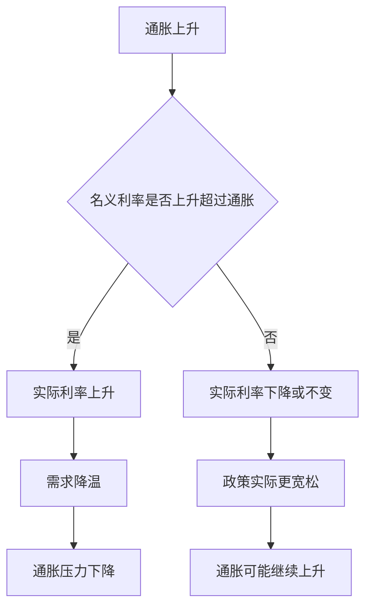

# 16.6 泰勒规则、央行沟通与市场预期

来源：

- 主线：Mishkin《货币金融学》Ch.17
- 补充：Mishkin/Eakins Ch.10

中央银行通常用短期利率作为主要政策工具变量。接下来的问题是：这个利率应该设在多高？如果通胀上升，利率应该上升多少？如果产出低于潜在产出，利率应该下降多少？泰勒规则就是为这个问题提供一个清晰的参考框架。

泰勒规则不是把中央银行变成自动机器，而是给政策讨论提供一个基准。它说明政策利率应该系统性地回应通胀偏离目标和产出偏离潜在水平。更重要的是，它让市场和公众看到，货币政策不是随机行动，而是围绕通胀和经济活动作出有规律的反应。

## 泰勒规则想解决什么问题

如果中央银行只说“我们会根据经济形势决定利率”，这句话太宽泛。市场不知道通胀高一点时央行会不会加息，也不知道经济疲弱时央行会降息多少。政策反应不清楚，预期就会更不稳定。

泰勒规则把政策利率与两个缺口联系起来：通胀缺口和产出缺口。

通胀缺口是当前通胀率与目标通胀率之间的差额。如果通胀高于目标，通胀缺口为正，政策利率应该上升；如果通胀低于目标，通胀缺口为负，政策利率应该下降。

产出缺口是实际 GDP 与潜在 GDP 之间的差距，通常用百分比表示。如果实际产出高于潜在产出，经济可能过热，政策利率应该上升；如果实际产出低于潜在产出，经济存在闲置资源，政策利率应该下降。

泰勒规则还包括两个基础部分：当前通胀率和均衡实际联邦基金利率。均衡实际利率可以理解为在长期充分就业和稳定通胀状态下合适的真实短期利率。

## 公式背后的直觉

教材中的泰勒规则可以写成：

```text
联邦基金利率目标
= 当前通胀率
+ 均衡实际联邦基金利率
+ 1/2 × 通胀缺口
+ 1/2 × 产出缺口
```

泰勒最初设定的例子中，均衡实际联邦基金利率是 2%，目标通胀率也是 2%，通胀缺口和产出缺口的权重都是 1/2。

假设当前通胀率是 3%，目标通胀率是 2%，所以通胀缺口是 1%。再假设实际 GDP 高于潜在 GDP 1%，产出缺口也是 1%。那么泰勒规则给出的联邦基金利率目标是：

```text
3% + 2% + 1/2 × 1% + 1/2 × 1% = 6%
```

这个结果的经济含义是：当通胀已经高于目标、经济又高于潜在产出时，货币政策应该明显收紧。政策利率不是只跟着通胀上升一点，而是要把实际利率也提高，从而抑制总需求和通胀压力。

再看相反情况。假设通胀率是 1%，目标仍是 2%，通胀缺口为 -1%；实际 GDP 低于潜在 GDP 2%，产出缺口为 -2%；均衡实际利率仍为 2%。泰勒规则给出的利率是：

```text
1% + 2% + 1/2 × (-1%) + 1/2 × (-2%) = 1.5%
```

这个例子说明，泰勒规则不是单纯的反通胀公式。它也会在通胀偏低、经济疲弱时建议降低利率。通胀目标制和泰勒规则都不是只关心物价、不关心产出的框架；它们的核心是让政策对通胀和实际经济状况作出系统反应。

还要注意，规则中的“当前通胀率 + 均衡实际利率”可以看成一种中性名义利率基准。如果通胀等于目标、产出等于潜在产出，两个缺口都为零，政策利率就等于当前通胀率加均衡实际利率。在泰勒最初设定中，这就是 2% 通胀加 2% 实际利率，得到 4% 名义利率。通胀或产出偏离正常状态时，政策利率再围绕这个基准上下调整。

## 泰勒原则为什么重要

泰勒规则中最关键的思想，是名义利率对通胀上升的反应必须超过一比一。也就是说，如果通胀率上升 1 个百分点，中央银行应当把名义政策利率提高超过 1 个百分点。这样实际利率才会上升。

实际利率大致等于名义利率减去预期通胀。假设通胀上升 1 个百分点，而名义利率只上升 0.5 个百分点，实际利率反而下降。实际利率下降意味着货币政策变得更宽松，这会刺激需求，进一步推高通胀。结果是通胀越高，政策反而越宽松，经济容易失去名义锚。

这就是泰勒原则：中央银行面对通胀上升时，名义利率必须上升得比通胀更多，使实际利率上升。

可以把泰勒原则理解成货币政策的“刹车方向”。如果汽车下坡速度越来越快，驾驶员踩刹车必须让实际速度降下来，而不是只是象征性碰一下刹车。通胀上升时，名义利率小幅上调看似是收紧，但如果实际利率没有上升，借款和支出受到的真实约束并没有增强。货币政策表面变紧，实质可能仍然宽松。

这也是为什么市场关心“实际利率”而不只关心“名义利率”。名义政策利率从 2% 升到 4%，如果通胀预期从 2% 升到 6%，实际利率反而从 0% 降到 -2%。借款人用未来购买力更低的钱还债，真实借款成本下降，需求可能继续扩张。泰勒原则要求中央银行避免这种情况。



20 世纪 70 年代美国高通胀的一个教训，就是政策没有充分遵守这种原则。通胀上升时，名义利率反应不够，实际利率偏低，通胀预期失去约束。1979 年以后，政策更强调对通胀作出有力反应，通胀表现和宏观稳定明显改善。

## 产出缺口为什么也进入规则

泰勒规则不仅回应通胀，也回应产出缺口。这有两种解释。

第一种解释是，中央银行本来就关心产出稳定和就业稳定。实际产出低于潜在产出时，经济有闲置资源和较高失业，政策应该更宽松；实际产出高于潜在产出时，经济可能过热，政策应该更紧。

第二种解释是，产出缺口可以帮助预测未来通胀。按照菲利普斯曲线思路，当产出高于潜在水平、失业率低于自然失业率时，工资和价格压力会上升；当产出低于潜在水平、失业率较高时，通胀压力会下降。因此，即使中央银行最终目标是价格稳定，也需要关注产出缺口，因为它包含未来通胀信息。

不过，产出缺口很难准确测量。潜在 GDP 不是直接观察到的数字，而是估计值。自然失业率也会变化。20 世纪 90 年代后期，美国失业率降到较低水平，但通胀没有像传统估计那样明显上升，这使很多人重新思考自然失业率和菲利普斯曲线的稳定性。

所以，泰勒规则中的产出缺口有用，但不能被当作精确仪表。

产出缺口的不确定性会带来实际政策风险。如果中央银行高估潜在产出，误以为经济还有大量闲置资源，它可能维持过低利率，结果需求过热、通胀上升。如果中央银行低估潜在产出，误以为经济已经过热，它可能过早收紧，压制本可以持续的就业增长。自然失业率估计错误也会造成类似问题。

因此，中央银行通常不会只用一个产出缺口估计。它会同时看失业率、劳动参与率、工资增长、职位空缺、产能利用率、企业调查、通胀预期和金融条件。泰勒规则提供骨架，但实际判断要用更多信息补充。

## 为什么不能让泰勒规则自动驾驶

既然泰勒规则给出清楚公式，为什么不让计算机直接决定利率？原因有几个。

第一，没有完美经济模型。通胀缺口相对容易观察，但产出缺口和均衡实际利率都需要估计。不同模型可能给出不同结论。

第二，货币政策必须前瞻。今天的利率影响未来产出和通胀，中央银行不能只看当前通胀和当前产出缺口。它还要预测未来经济走势。

第三，中央银行需要看更广泛的信息。金融危机中，信用利差、银行资产负债表、市场流动性和风险偏好都会改变政策利率对实体经济的影响。一个固定公式很难完全捕捉这些变化。

第四，规则系数未必永远不变。经济结构、金融体系、通胀形成机制和全球环境都会变化。固定权重在某个时期有用，不代表永远适用。

因此，泰勒规则更适合作为政策参考，而不是自动驾驶系统。如果中央银行设定的政策利率与泰勒规则相差很大，它至少应该问：偏离是否有充分理由？如果有，例如金融危机或有效下限约束，就需要解释；如果没有，偏离可能代表政策错误。

金融危机就是固定规则难以处理的例子。危机中，联邦基金利率可能已经接近零，但企业债利率和抵押贷款利率仍然很高，因为信用利差扩大。按普通泰勒规则看，短期利率已经很低；但从企业和家庭实际融资条件看，政策传导仍然很紧。此时中央银行可能需要非常规工具，如资产购买、流动性便利和前瞻指引。单一利率公式无法充分描述这种政策环境。

## 中央银行沟通如何影响市场预期

泰勒规则和前面讲的通胀目标制有一个共同点：它们都让政策更可理解。金融市场关心的不只是今天利率是多少，还关心未来利率路径。长期利率、股票价格、债券价格、汇率和贷款利率，都包含对未来货币政策的预期。

如果中央银行沟通清楚，市场更容易理解政策反应。例如，当通胀高于目标时，市场会预期中央银行更可能收紧；当经济明显低于潜在产出且通胀受控时，市场会预期中央银行更可能放松。这种预期本身会影响长期利率和金融条件。

央行沟通包括很多形式：政策声明、会议纪要、经济预测、通胀报告、新闻发布会、官员讲话和前瞻指引。沟通越清楚，政策越不需要通过突然行动来影响市场。相反，如果中央银行意图模糊，市场会不断猜测，金融价格更容易波动。

但沟通也有风险。如果中央银行表达得过于绝对，市场可能把它理解成无条件承诺，限制未来政策灵活性。如果表达过于含糊，沟通又失去稳定预期的作用。好的沟通要在清晰和条件性之间取得平衡。

例如，中央银行说“未来很长一段时间利率都会保持低位”，市场可能把这句话理解成无论通胀怎样变化都不会加息。若之后通胀明显上升，中央银行加息会被认为违背承诺；不加息又可能放任通胀。更稳妥的沟通是说明低利率取决于经济条件，例如通胀预期、就业恢复和金融稳定状态。这样市场知道政策方向，也知道什么条件会改变政策。

沟通还会影响政策传导速度。长期利率大致反映市场对未来短期利率的预期加上风险溢价。如果中央银行清楚表达未来政策路径，长期利率会先于实际政策动作变化。企业投资、住房贷款和资产价格因此会提前反应。现代货币政策越来越重视沟通，是因为预期本身已经成为政策传导机制的一部分。

泰勒规则也是连接宏观模型和政策操作的桥。通胀缺口来自价格稳定目标，产出缺口来自实际 GDP 与潜在 GDP 的比较，政策利率则影响 IS 曲线和总需求。读到后面的 AD-AS 和菲利普斯曲线时，可以把泰勒规则看成中央银行对宏观状态变量的反应函数。

## 小结

泰勒规则为短期政策利率设定提供了一个规则化参考：政策利率应等于当前通胀率、均衡实际利率、通胀缺口反应和产出缺口反应之和。它最重要的含义是泰勒原则：通胀上升时，名义利率必须上升超过通胀，使实际利率上升，否则政策会在通胀上升时反而变宽松。产出缺口进入规则，既因为中央银行关心就业和产出稳定，也因为产出缺口有助于预测未来通胀。泰勒规则不能机械自动决定利率，因为产出缺口、均衡利率和未来经济状态都不确定；但它能作为政策讨论和央行沟通的基准，帮助稳定市场预期。

## 自测问题

- 泰勒规则中的通胀缺口和产出缺口分别是什么意思？
- 为什么通胀上升时，名义利率必须上升超过通胀？
- 产出缺口为什么既关系就业，也关系未来通胀？
- 为什么泰勒规则不能直接变成自动驾驶式货币政策？
- 央行沟通为什么会影响长期利率和金融市场预期？
