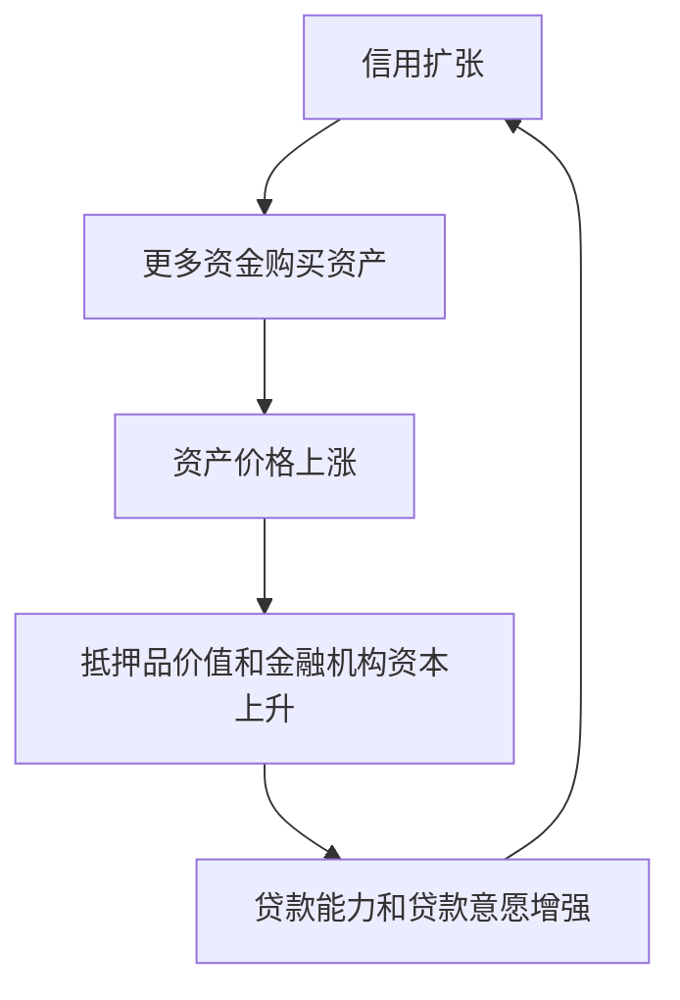
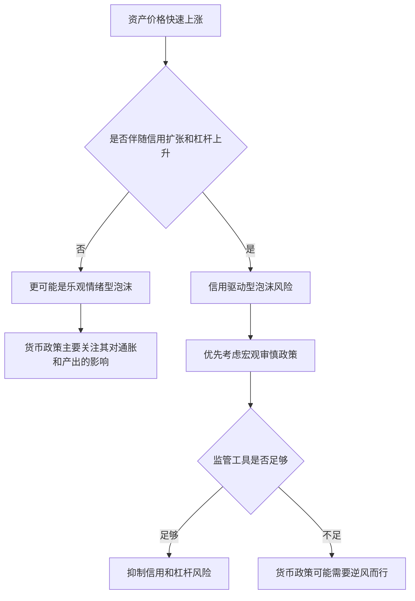

# 16.7 央行是否应对资产价格泡沫作出反应

来源：

- 主线：Mishkin《货币金融学》Ch.17
- 补充：Mishkin/Eakins Ch.10
- 延伸：Bodie/Kane/Marcus《Investments》Ch.12, Ch.24

通胀稳定、产出稳定，并不一定意味着金融体系稳定。2007-2009 年金融危机的重要教训之一，就是在通胀看起来不高、宏观波动看起来较小的时期，金融体系内部仍可能积累巨大风险。住房价格上涨、信用扩张、贷款标准下降和证券化风险叠加，最终造成严重危机。

这引出一个货币政策战略中的困难问题：中央银行是否应该主动应对资产价格泡沫？如果房价、股价或其他资产价格快速上涨，中央银行应该提高利率去“刺破泡沫”，还是等泡沫破裂后再降息和救助金融体系？这个争论常被概括为“逆风而行”与“事后清理”的争论。

## 什么是资产价格泡沫

资产价格泡沫指资产价格明显偏离其基本价值，并且这种上涨最终会以剧烈下跌结束。股票、房地产、债券、土地和其他金融资产都可能出现泡沫。

难点在于，基本价值本身并不容易精确观察。股票价格上涨可能是因为盈利前景改善，也可能是因为投资者过度乐观；房价上涨可能是因为人口增长和土地稀缺，也可能是因为贷款标准放松和投机需求。中央银行很难实时判断价格上涨中有多少是合理变化，有多少是泡沫。

但金融危机说明，某些泡沫破裂的代价非常高。美国住房泡沫破裂后，房价下跌、次贷违约、抵押贷款相关证券损失、金融机构资产负债表恶化、信用收缩和实体经济衰退相互强化。许多家庭失去住房，失业率上升，经济复苏缓慢。

因此，问题不是资产价格是否重要。资产价格当然重要，因为它们会影响消费、投资、抵押品价值和金融机构资产负债表。真正的问题是：中央银行是否应当在通胀和就业目标要求之外，额外使用货币政策去压制可能的泡沫。

资产价格进入实体经济有几条路径。房价上涨会提高家庭财富感，也会增加可抵押价值，使家庭更容易借款消费。股票价格上涨会降低企业股权融资成本，也会提高投资者财富。债券价格上涨、收益率下降，会降低企业和政府融资成本。反过来，资产价格暴跌会压缩财富、降低抵押品价值、削弱金融机构资本，并使贷款变得更难获得。因此，资产价格泡沫不是金融市场内部的“纸面波动”，它可能通过财富、抵押品、资本和信贷渠道进入真实经济。

## 两类泡沫

理解政策反应前，需要区分两类泡沫：信用驱动型泡沫和单纯乐观情绪驱动型泡沫。

信用驱动型泡沫来自信用扩张和资产价格上涨之间的正反馈。贷款更容易获得，人们可以借更多钱购买资产，资产需求上升，价格上涨。资产价格上涨又提高抵押品价值，使借款人更容易获得贷款，也改善金融机构资产负债表，使它们更愿意放贷。更多贷款继续推高资产价格，循环不断加强。

当这种泡沫破裂时，循环会反向运行。资产价格下跌，抵押品价值下降，贷款违约增加，金融机构损失扩大，信贷供给收缩，资产需求进一步下降，价格继续下跌。这种去杠杆过程会严重打击家庭支出、企业投资和金融市场功能。

住房市场特别容易形成这种循环。住房既是消费品，也是投资资产，还是贷款抵押品。房价上涨时，借款人看起来更安全，因为抵押品价值更高；银行看起来资本更充足，因为贷款违约损失似乎更低；投资者也更愿意购买与住房贷款相关的证券。于是更多资金进入住房市场，房价继续上涨。可一旦房价下跌，原来被认为安全的贷款变得危险，抵押品不足，证券价格下跌，银行资本受损，贷款标准突然收紧。原来的良性循环变成恶性循环。

这就是信用驱动型泡沫危险的原因：它把资产价格和金融体系资产负债表绑在一起。价格下跌不只是让投资者亏钱，还会削弱银行放贷能力，迫使整个经济去杠杆。

单纯乐观情绪驱动型泡沫则主要来自投资者过度乐观，而不是大规模信用扩张。20 世纪 90 年代末科技股泡沫就是典型例子。科技股价格大幅上涨并随后下跌，但它没有像住房泡沫那样伴随严重金融机构资产负债表恶化，因此对金融体系和实体经济的冲击较小，随后的衰退也较温和。

| 泡沫类型 | 推动因素 | 破裂后的典型风险 |
| --- | --- | --- |
| 信用驱动型泡沫 | 信用扩张、抵押品价值上升、杠杆增加 | 金融机构损失、去杠杆、信用收缩、严重衰退 |
| 乐观情绪驱动型泡沫 | 投资者过度乐观、价格脱离基本面 | 资产持有人损失，金融系统风险通常较低 |

这个区分非常重要。中央银行最需要警惕的，不一定是所有资产价格上涨，而是伴随信用快速扩张和贷款标准下降的资产价格上涨。

## “事后清理”的理由

在全球金融危机前，许多中央银行更倾向于不主动刺破泡沫，而是在泡沫破裂后迅速放松政策、稳定经济。这种观点有几个理由。

第一，泡沫很难识别。如果中央银行都能确定资产价格已经脱离基本价值，市场参与者为什么看不出来？既然基本价值难以估计，中央银行贸然判断泡沫，可能误伤正常资产价格上涨。

第二，提高利率未必能有效压制泡沫。泡沫时期，投资者可能预期资产价格快速上涨，即使利率提高，也挡不住投机需求。而且利率提高可能让泡沫破裂更剧烈，反而加大损失。

第三，货币政策是钝器。一个经济中有许多资产市场，泡沫可能只出现在其中一部分。加息会影响整个经济，包括没有泡沫的行业和家庭。为了压低某一类资产价格而提高全经济融资成本，代价可能过高。

第四，主动刺破泡沫可能伤害就业和产出。如果中央银行大幅加息，投资和消费会下降，失业可能上升，通胀可能低于目标。

第五，如果政策反应及时，泡沫破裂后的损害也许可以被控制。1987 年股市崩盘后，中央银行提供流动性，金融体系保持运行；2000 年科技股泡沫破裂后，衰退相对温和。这些经验曾支持“事后清理”的信心。

这些理由并不是没有道理。中央银行如果过早把正常上涨误判为泡沫，会压制真实投资机会。例如某个行业因技术进步盈利前景改善，股票价格上涨可能反映基本面变化，而不是非理性泡沫。此时加息“刺泡沫”会把健康增长也压下去。货币政策是全经济工具，不适合精确打击某个局部市场，这是事后清理观点最强的部分。

但事后清理观点依赖一个关键前提：泡沫破裂后的损害可以被货币政策和流动性支持控制住。2007-2009 年危机显示，这个前提对信用驱动型泡沫并不可靠。房价下跌引发金融机构损失、影子银行挤兑、证券市场冻结和信用收缩后，单纯降息很难迅速恢复金融中介功能。

## “逆风而行”的理由

全球金融危机削弱了单纯事后清理的信心。住房泡沫破裂后的损害极大，而且很难清理。信用驱动型泡沫一旦破裂，会通过金融机构资产负债表、抵押品价值和信贷供给影响整个经济。即使中央银行大幅降息并使用非常规工具，复苏也可能漫长。

更重要的是，价格稳定和产出稳定并不能保证金融稳定。危机前的“大缓和”时期，通胀和产出波动较低，反而可能让市场参与者低估风险，增加杠杆和风险承担。稳定环境如果导致过度自信，也可能孕育金融不稳定。

因此，危机后的政策思路更强调：中央银行和监管者不能对信用驱动型泡沫采取放任态度。问题不是要不要关心资产价格，而是要重点关注资产价格上涨背后的信用扩张、杠杆、贷款标准和金融机构风险承担。

这里的重点不是要求中央银行“准确预测每个泡沫何时破裂”。更可行的问题是：是否存在明显信用繁荣？贷款标准是否下降？杠杆是否快速上升？金融机构是否用短期资金购买长期风险资产？资产价格上涨是否越来越依赖新增借款？这些信号比判断基本价值更容易观察，也更直接关系金融稳定。

因此，危机后的讨论逐渐从“要不要刺破资产泡沫”转向“要不要抑制信用繁荣”。前者要求判断资产价格是否偏离基本价值，难度很高；后者关注信用增长、杠杆和风险承担，虽然也不容易，但更接近监管者可观察和可干预的范围。

## 宏观审慎政策

应对信用驱动型泡沫，最直接的工具往往不是普通利率政策，而是宏观审慎政策。宏观审慎政策关注整个金融体系的风险，而不是只看单家机构是否安全。

如果房地产价格快速上涨并伴随按揭贷款标准下降，监管者可以提高银行资本要求、提高贷款损失准备、限制贷款价值比、加强收入证明要求、限制高风险贷款增长，或者要求金融机构在繁荣时期积累更多资本缓冲。繁荣期提高资本要求、衰退期释放资本缓冲，就是逆周期监管思路。

宏观审慎政策的优势在于更有针对性。它可以直接作用于信用扩张和杠杆，而不必像加息那样同时压制整个经济。

但宏观审慎政策也有困难。金融机构会游说反对更严格监管，尤其在繁荣期利润很高时。金融创新还可能绕开监管，把风险转移到影子银行体系。监管者也可能低估风险或行动太慢。

宏观审慎政策和传统微观审慎监管的区别在于视角不同。微观审慎监管关心单家银行是否稳健，例如资本是否充足、风险管理是否合规。宏观审慎监管关心所有机构同时采取类似行为时，会不会造成系统性风险。单家银行增加房地产贷款可能看起来合理；如果所有银行同时放松房地产贷款标准，整个体系就可能形成信用泡沫。

逆周期资本缓冲体现了这种系统视角。繁荣期资产价格上涨、违约率很低，银行模型可能显示风险很小，资本看起来充足。但这恰恰可能是风险积累阶段。要求银行在繁荣期多持有资本，可以限制贷款过快扩张，也能为衰退期吸收损失。衰退期释放缓冲，则可以避免银行为了满足资本要求而同时收缩贷款。

贷款价值比限制也很直观。若购房者最多只能借房价的一定比例，就必须投入更多自有资金。房价下跌时，自有资金缓冲可以吸收部分损失，减少贷款变成负资产的概率。收入债务比限制则防止借款人承担相对收入过高的债务。这些工具直接瞄准信用泡沫的燃料：杠杆和过度借款。

## 货币政策是否也要参与

如果宏观审慎工具足够有效，货币政策可以主要专注价格稳定和产出稳定，把信用泡沫交给监管工具处理。但现实中，宏观审慎政策可能执行不足，金融机构可能规避监管，政治压力可能削弱监管强度。

这时，货币政策是否应该“逆风而行”就成为真实问题。低利率可能通过风险承担渠道鼓励金融机构寻找更高收益，增加杠杆和风险资产配置。低利率还会推高资产价格，提高抵押品价值，使贷款扩张更容易。因此，过度宽松的货币政策可能助长金融不稳定。

不过，用货币政策压制信用泡沫仍需谨慎。加息会影响整个经济，可能牺牲就业和产出。更合理的态度是：货币政策不能完全忽视信用扩张和资产价格风险，但首先应使用宏观审慎工具；当信用繁荣明显威胁金融稳定、监管工具不足时，货币政策可能需要把金融稳定风险纳入利率决策。

货币政策介入的理由，主要来自风险承担渠道。低利率环境下，安全资产收益率下降，资产管理人、银行和保险公司可能为了达到收益目标而购买更高风险资产。借款成本低也会鼓励更多杠杆。资产价格上涨后，抵押品价值提高，又进一步支持借款。这并不意味着低利率必然造成泡沫，但说明长期过度宽松可能增加金融脆弱性。

货币政策介入的反对理由同样强。假设房地产市场有泡沫，但制造业和服务业并不过热，通胀也低。若中央银行为了压制房价大幅加息，所有企业融资成本都会上升，失业可能增加，通胀可能低于目标。用全经济利率工具处理局部信用问题，成本可能过高。因此，利率政策应更多作为补充，而不是第一道防线。

一个较平衡的政策顺序是：先监测信用和杠杆；发现风险后优先使用宏观审慎工具；如果风险广泛、监管工具不足或金融体系整体风险承担明显过度，再考虑让货币政策比单纯通胀和产出目标所要求的路径更紧一些。这样既不放任信用泡沫，也不轻易把货币政策变成资产价格管理工具。

这节把金融稳定重新接回宏观经济学。资产价格泡沫破裂不是只改变金融财富，它会通过抵押品价值、银行资本、信用供给、消费和投资影响总需求。中央银行如果只看当前通胀和当前产出，可能错过金融体系中正在积累的风险；但如果直接用利率管理所有资产价格，又可能牺牲就业和产出。宏观政策因此需要同时看通胀缺口、产出缺口和金融脆弱性。

投资学给这个问题增加了一个视角：资产价格高不等于泡沫，估值高可能来自低折现率、真实盈利改善或风险溢价下降；但如果估值扩张同时伴随杠杆上升、期限错配和流动性承诺增加，回撤就会通过强制卖出和信用收缩被放大。央行真正需要警惕的不是“价格涨了”，而是价格上涨背后的融资结构是否把普通资产回撤变成系统性危机。

## 小结

资产价格泡沫会影响货币政策战略，尤其是信用驱动型泡沫。单纯由乐观情绪推动的泡沫破裂后，金融系统损害可能有限；信用驱动型泡沫则会通过抵押品、杠杆、金融机构资产负债表和信用收缩造成严重危机。危机前常见观点主张不主动刺破泡沫，而是在泡沫破裂后清理，因为泡沫难识别、利率是钝器、主动加息代价高。全球金融危机后，政策讨论更强调不能放任信用驱动型泡沫。应对这类风险，宏观审慎政策通常比普通利率政策更有针对性；但如果监管不足、信用繁荣威胁金融稳定，货币政策也可能需要把金融稳定风险纳入决策。

## 自测问题

- 为什么资产价格上涨不一定就是泡沫？
- 信用驱动型泡沫为什么比单纯乐观情绪型泡沫更危险？
- “事后清理”观点为什么反对中央银行主动刺破泡沫？
- 全球金融危机为什么增强了“逆风而行”的理由？
- 宏观审慎政策为什么通常比加息更适合应对信用泡沫？
- 为什么高估值本身不一定是泡沫，但高估值叠加杠杆会更危险？
