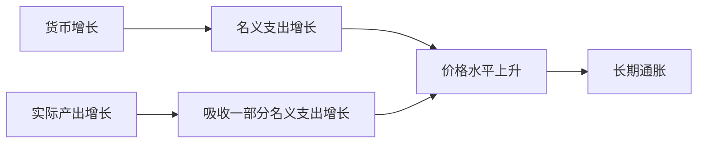

# 17.1 数量论、货币增长与长期通胀

来源：

- 主线：Mishkin《货币金融学》Ch.20
- 补充：Mankiw Ch.31, Ch.34-Ch.36
- 延伸：Bodie/Kane/Marcus《Investments》Ch.14, Ch.24

前面已经学过货币供给、银行体系和中央银行工具。现在要把这些内容接回宏观经济学中最核心的问题之一：货币增长和通胀之间到底是什么关系？

日常直觉容易把这个问题说得过于简单：“钱多了，物价就涨。”这句话在长期有重要道理，但如果不区分名义 GDP、实际 GDP、货币流通速度和短期价格黏性，就会误解货币政策。数量论的作用，是先建立一个长期基准：在货币流通速度大体稳定、实际产出由真实因素决定时，货币增长最终主要表现为价格水平上升。

## 从名义 GDP 开始

宏观经济学中，GDP 可以用名义值和实际值表示。实际 GDP 记作 `Y`，代表经济生产的最终商品和服务数量；价格水平记作 `P`；二者相乘 `P × Y` 就是名义 GDP，也就是以当期价格衡量的总支出或总收入。

如果一个经济一年生产 10 万亿单位实际产出，价格水平为 1，那么名义 GDP 是 10 万亿。如果实际产出不变，价格水平翻倍到 2，名义 GDP 就变成 20 万亿。这个例子说明，名义 GDP 的变化可能来自实际产出变化，也可能来自价格水平变化。

数量论要解释的，正是货币数量 `M` 和名义 GDP `P × Y` 之间的关系。

## 货币流通速度

同一美元一年可以被花很多次。一个人用 1 美元买咖啡，咖啡店再用这 1 美元买原料，原料商再用它支付工资。同一单位货币在一年中周转次数越多，给定货币数量能支持的交易和支出就越多。

货币流通速度 `V` 指的是一单位货币在一年中平均用于购买最终商品和服务的次数。公式是：

```text
V = (P × Y) / M
```

如果名义 GDP 是 10 万亿美元，货币供给是 2 万亿美元，那么：

```text
V = 10 / 2 = 5
```

这意味着平均每 1 美元一年被用于购买最终商品和服务 5 次。

把公式变形，可以得到交易方程式：

```text
M × V = P × Y
```

这条式子本身只是恒等式。它按定义成立：货币数量乘以每单位货币的使用次数，等于用于购买最终商品和服务的名义支出。仅凭这条式子，还不能说货币增加一定导致名义 GDP 增加，因为货币增加可能同时伴随流通速度下降。

## 为什么速度可能相对稳定

要把交易方程式变成理论，需要说明 `V` 由什么决定。古典数量论认为，货币流通速度主要由支付制度、金融技术和交易习惯决定，而这些因素通常变化较慢。

如果人们大量使用信用卡、电子支付或信用账户，同样的名义支出可能需要持有较少货币，流通速度会上升。若人们更依赖现金和支票，完成同样交易需要持有更多货币，流通速度会下降。

这些制度和技术会变化，但通常不会每天剧烈变化。因此，在古典分析中，短期内可以把流通速度看成相对稳定。这样，货币供给变化就会更直接地影响名义 GDP。

## 从交易方程式到数量论

如果 `V` 大体稳定，交易方程式就变成数量论：

```text
P × Y = M × V
```

在这个框架下，货币供给 `M` 增加，会推动名义 GDP `P × Y` 增加。假设流通速度是 5，货币供给是 2 万亿美元，则名义 GDP 是 10 万亿美元。如果货币供给增加到 4 万亿美元，流通速度仍为 5，那么名义 GDP 会增加到 20 万亿美元。

但名义 GDP 增加到底表现为实际产出增加，还是价格水平上升？这要看 `Y` 怎么决定。

古典经济学认为，在长期中，实际产出由劳动、资本、技术和制度等真实因素决定。货币数量不会永久改变经济能生产多少真实商品和服务。长期充分就业产出由生产能力决定，而不是由央行印了多少货币决定。

如果长期 `Y` 由真实因素决定，`V` 又相对稳定，那么货币 `M` 的增加最终主要反映在价格水平 `P` 上。

```text
P = (M × V) / Y
```

如果 `M` 翻倍，`V` 不变，`Y` 长期不变，那么 `P` 也会翻倍。

## 数量论怎样解释通胀

通胀率是价格水平的增长率。把交易方程式写成增长率形式：

```text
货币增长率 + 流通速度增长率 = 通胀率 + 实际产出增长率
```

如果流通速度长期大体不变，流通速度增长率约为 0，那么：

```text
通胀率 = 货币增长率 - 实际产出增长率
```

这条式子非常重要。它不是说任何货币增长都会带来同等通胀，而是说，如果实际产出也在增长，经济需要更多货币来支持更多交易。货币增长超过实际产出增长的部分，才会在长期表现为通胀。

例如，实际产出每年增长 3%，货币供给每年增长 5%，长期通胀率大约是 2%。如果货币增长率上升到 10%，实际产出增长仍是 3%，长期通胀率会升到约 7%。



## 长期数据和短期数据为什么不同

长期看，货币增长和通胀之间通常存在明显正关系。一个国家或一个时期如果货币供给长期快速增长，平均通胀率往往也更高。跨国比较中，高货币增长国家通常有更高通胀。这支持数量论作为长期通胀理论。

但短期中，货币增长和通胀关系并不稳定。某些年份货币增长很快，通胀却不高；某些年份货币增长变化不大，通胀却受能源价格、供应冲击或需求波动影响。原因在于短期内流通速度会变化，实际产出会偏离潜在产出，工资和价格也不会完全灵活。

这正是宏观经济学需要短期模型的原因。数量论给出长期基准：持续高货币增长最终会带来高通胀。但短期通胀和产出波动，还需要 IS 曲线、总需求总供给、菲利普斯曲线和货币政策传导机制来解释。

## 和前面宏观基础的连接

这一节把几个基础概念连起来：

| 前面学过的概念 | 在数量论中的位置 |
| --- | --- |
| 名义 GDP | `P × Y`，总名义支出 |
| 实际 GDP | `Y`，真实产出 |
| 价格水平 | `P`，把实际产出转化为名义值 |
| 通胀率 | `P` 的增长率 |
| 货币供给 | `M`，支持交易的货币数量 |
| 长期增长 | `Y` 的增长会吸收部分货币增长 |

数量论还解释了为什么中央银行长期必须关注货币和名义锚。如果货币增长长期超过实际产出增长太多，价格水平最终会持续上升。货币政策不能决定长期真实增长，但能决定长期通胀环境。

在投资学中，这个长期基准会进入名义资产和实际资产的区分。名义债券承诺固定货币支付，长期通胀越不稳定，投资者要求的通胀补偿和风险溢价越高；股票和房地产虽然不是固定名义支付，但其估值也会受通胀对折现率、利润率和税负的影响。数量论不是短期交易公式，而是提醒投资者：长期名义收益必须扣除货币购买力变化后才是实际收益。

## 小结

数量论从交易方程式 `M × V = P × Y` 出发，把货币供给、流通速度、价格水平和实际产出联系起来。流通速度表示货币平均周转次数。交易方程式本身只是恒等式；当流通速度相对稳定、长期实际产出由真实因素决定时，它变成数量论：货币增长长期主要决定名义收入和价格水平。增长率形式下，通胀率约等于货币增长率减去实际产出增长率。数量论适合解释长期通胀，但不能充分解释短期通胀和产出波动，因为短期中流通速度、产出缺口、工资价格黏性和冲击都会发挥作用。

## 自测问题

- 货币流通速度是什么意思？为什么它连接货币供给和名义 GDP？
- 为什么交易方程式本身只是恒等式，而不是理论？
- 在数量论中，为什么长期货币增长主要影响价格水平？
- 如果货币增长率为 8%，实际产出增长率为 3%，长期通胀率大约是多少？
- 为什么数量论适合解释长期通胀，却不适合解释短期通胀波动？
- 为什么名义债券投资者特别关心长期货币增长和通胀预期？
