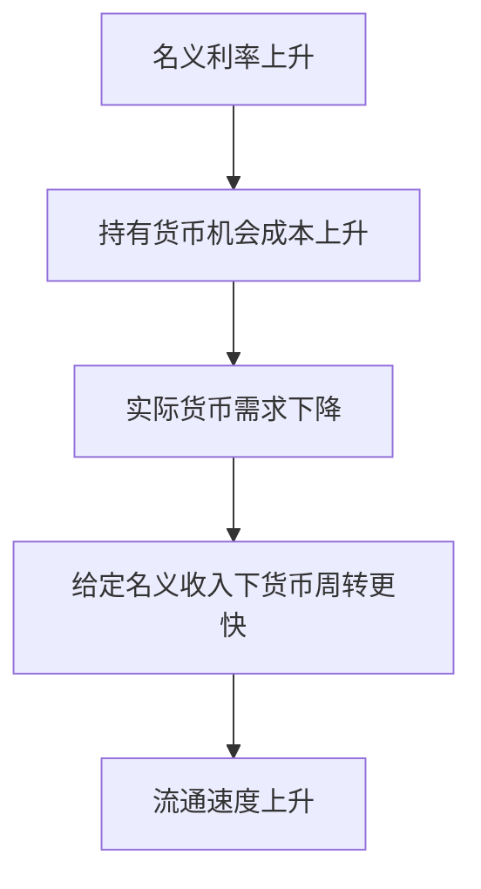

# 17.2 货币需求理论

来源：

- 主线：Mishkin《货币金融学》Ch.20
- 补充：Mankiw Ch.31, Ch.34-Ch.36
- 延伸：Bodie/Kane/Marcus《Investments》Ch.2, Ch.14

上一节数量论把货币供给、流通速度、名义 GDP 和通胀联系起来。它给出一个长期结论：如果流通速度相对稳定，实际产出长期由真实因素决定，那么货币增长超过实际产出增长的部分会表现为通胀。

但这个理论留下一个关键问题：人们为什么愿意持有货币？如果持有货币没有利息，为什么不把所有财富都放到债券、股票或其他收益资产中？货币需求理论要回答的就是：家庭、企业和金融机构想持有多少货币，这个数量受收入、利率、支付技术、财富、风险和其他资产流动性怎样影响。

理解货币需求很重要，因为货币需求不稳定时，货币供给和名义 GDP 的关系也会变得不稳定。流通速度不是天生固定的，它取决于人们愿意持有多少货币。

## 古典数量论中的货币需求

交易方程式是：

```text
M × V = P × Y
```

把它改写成货币需求形式：

```text
M = (1 / V) × P × Y
```

如果货币市场均衡中货币供给等于货币需求，可以写成：

```text
Md = k × P × Y
```

这里 `k = 1 / V`，表示人们愿意把名义收入中的多大比例以货币形式持有。古典数量论假设流通速度相对稳定，也就是 `k` 相对稳定。因此，货币需求主要取决于名义收入 `P × Y`。

这意味着：经济中交易越多、名义收入越高，人们需要持有的货币越多。收入高的家庭日常支出更大，企业销售额越高需要管理的交易余额越多，整个经济名义 GDP 越大，需要的货币余额越多。

古典数量论的一个重要特点是：利率不影响货币需求。人们持有货币主要是为了交易，交易规模由名义收入决定。

## 凯恩斯的流动性偏好

凯恩斯不同意货币流通速度可以简单看成稳定常数。他强调，利率会影响人们愿意持有多少货币。他把货币需求称为流动性偏好，因为货币最突出的特点是流动性强：可以立即用于支付。

凯恩斯提出三种持有货币的动机。

第一是交易动机。人们需要货币购买商品和服务，企业需要货币支付工资、原材料和日常费用。交易越多，收入越高，需要的货币越多。这一点和数量论一致。

第二是预防动机。人们会为意外支出或机会持有货币。例如突然有折扣商品、医疗支出或紧急维修，需要随时可用的支付手段。收入越高、支出规模越大，人们通常也会持有更多预防性货币余额。

第三是投机动机。货币也是一种财富储藏方式。虽然货币通常不支付利息或利息很低，但它没有债券价格波动风险。若债券利率上升，持有债券的收益更高，持有货币的机会成本上升，人们会减少货币持有。若利率下降，持有货币的机会成本下降，人们愿意持有更多货币。

| 动机 | 为什么持有货币 | 主要影响因素 |
| --- | --- | --- |
| 交易动机 | 日常购买和支付 | 收入、交易规模 |
| 预防动机 | 应对意外支出和机会 | 收入、不确定性 |
| 投机动机 | 在货币和债券等资产间选择 | 名义利率、资产收益 |

## 实际货币余额

货币需求要区分名义货币和实际货币。名义货币是手中有多少美元、人民币或其他货币单位；实际货币余额是这些货币能买到多少商品和服务。

如果所有价格都翻倍，手中 1000 元的购买力减半。人们真正关心的不是纸面数字，而是货币能购买的实际商品和服务。因此，货币需求理论通常写成实际货币余额需求：

```text
Md / P = L(i, Y)
```

这里 `Md / P` 是实际货币需求，`i` 是名义利率，`Y` 是实际收入。函数符号表达两个方向：

```text
实际货币需求随收入 Y 上升而上升
实际货币需求随名义利率 i 上升而下降
```

收入上升，交易更多，需要更多货币；利率上升，持有货币的机会成本更高，需要的货币减少。

## 利率为什么改变流通速度

货币流通速度是：

```text
V = (P × Y) / M
```

如果利率上升，人们不愿持有太多货币，会想办法用较少货币完成同样交易，比如更频繁地把债券或货币市场资产转换成支付余额。给定名义收入，货币需求下降，流通速度上升。

如果利率下降，持有货币的机会成本变低，人们愿意把更多财富放在货币中。给定名义收入，货币需求上升，流通速度下降。

这正是凯恩斯理论对数量论的修正：速度不是固定常数，而会随利率变化。只要利率明显波动，货币供给和名义 GDP 之间就不会保持机械比例关系。



## 资产组合视角

货币也是资产组合的一部分。人们在货币、债券、股票、基金、房地产等资产之间分配财富。资产组合理论说，一个资产的需求取决于财富、相对预期收益、相对风险和相对流动性。

收入和财富通常同向变化。收入更高的人拥有更多财富，也会持有更多货币余额，用于交易和安全储备。

利率上升时，债券等替代资产收益提高，而货币收益变化不大。货币相对收益下降，货币需求减少。

其他资产风险上升时，货币相对安全，货币需求可能增加。例如股票市场波动加剧，人们可能增加现金和存款持有。

但货币也有实际风险。如果通胀不稳定，货币的实际购买力变得不确定。高通胀或通胀波动大时，人们可能转向通胀保值资产，如通胀保值债券、黄金或房地产，货币需求下降。

金融创新也会改变货币需求。货币市场基金、电子支付、信用卡、经纪账户支付功能和住房净值信用额度，使人们可以少持有传统货币而仍然完成支付。其他资产越接近货币的流动性，传统货币需求越低。

| 因素上升 | 货币需求变化 | 原因 |
| --- | --- | --- |
| 收入 | 上升 | 交易规模更大 |
| 名义利率 | 下降 | 持有货币机会成本更高 |
| 支付技术便利度 | 下降 | 完成交易所需货币更少 |
| 财富 | 通常上升 | 可配置资产更多 |
| 其他资产风险 | 上升 | 货币相对更安全 |
| 通胀风险 | 下降 | 货币实际购买力风险更高 |
| 其他资产流动性 | 下降 | 货币流动性优势下降 |

## 和宏观政策的连接

货币需求理论把货币市场和总需求模型连接起来。中央银行增加货币供给或降低短期利率，能否刺激消费和投资，取决于人们对货币、债券和其他资产的选择。如果利率下降，人们愿意持有更多货币，债券价格和其他资产价格会调整，融资成本改变，总需求受到影响。

货币需求还解释了为什么中央银行后来更重视利率而不是单纯货币总量。若货币需求稳定，控制货币供给就能较好控制名义 GDP；若货币需求受利率、支付技术和金融创新影响而波动，货币总量和名义收入关系会不稳定。此时，中央银行用短期利率作为政策工具变量，会更直接地影响消费、投资和金融条件。

这一节也为 IS 曲线和货币政策曲线做准备。收入 `Y` 上升会提高交易性货币需求，利率 `i` 上升会降低货币需求；货币市场均衡变化会影响利率，而利率又影响投资和总需求。宏观模型正是在这些市场连接中建立起来的。

从资产配置角度看，货币需求就是投资者对流动性的需求。现金和活期存款收益低，但能立即支付、避免被迫卖出资产；债券和股票收益更高，却承担价格波动和交易成本。危机中货币需求上升，往往意味着投资者愿意牺牲收益换取流动性和安全性，这会推高安全资产价格、压低短端收益率，并削弱货币流通速度。

## 小结

货币需求理论解释人们为什么持有货币以及持有多少。古典数量论认为货币需求主要由名义收入决定，利率不起作用；凯恩斯的流动性偏好理论提出交易动机、预防动机和投机动机，强调实际货币需求随收入上升而上升、随名义利率上升而下降。资产组合理论进一步说明，财富、相对收益、风险、通胀风险和其他资产流动性也会影响货币需求。货币需求不稳定时，流通速度会波动，货币供给和名义 GDP 的短期关系就不稳定，这也是现代中央银行重视利率、预期和金融条件的重要原因。

## 自测问题

- 古典数量论中的货币需求为什么主要取决于名义收入？
- 凯恩斯提出的三种持有货币动机分别是什么？
- 为什么货币需求要用实际货币余额 `Md / P` 表示？
- 名义利率上升为什么会降低货币需求、提高流通速度？
- 金融创新为什么会削弱传统货币需求？
- 为什么危机中货币需求上升会压低短期安全资产收益率？
