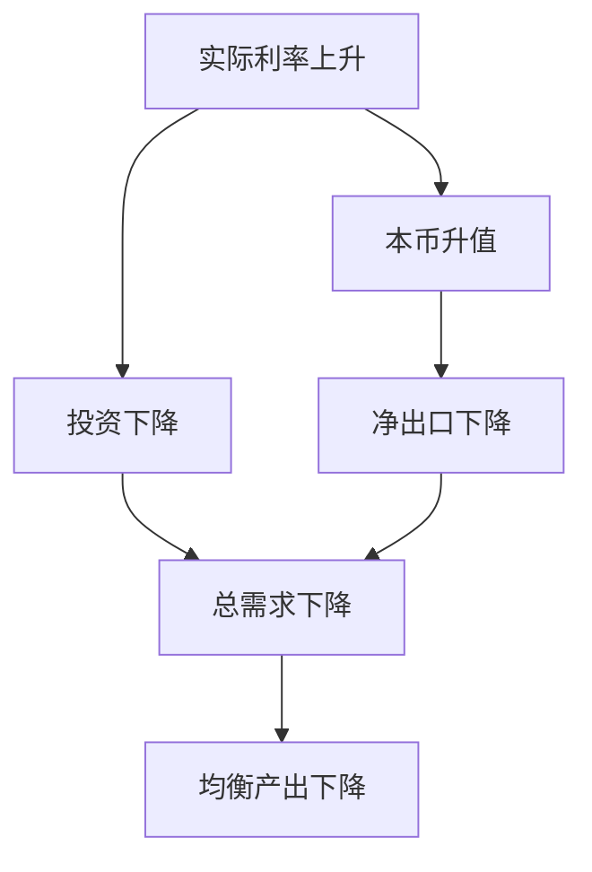

# 17.3 IS 曲线与总需求

来源：

- 主线：Mishkin《货币金融学》Ch.21
- 补充：Mankiw Ch.31, Ch.34-Ch.36
- 延伸：Bodie/Kane/Marcus《Investments》Ch.14, Ch.18

数量论解释长期通胀，货币需求解释货币和利率之间的关系。接下来要进入短期宏观波动：为什么实际 GDP 会在短期偏离潜在产出？利率、财政政策、投资信心和金融摩擦怎样影响总需求？

IS 曲线就是回答这些问题的第一块积木。它描述的是商品和服务市场均衡时，实际利率和总产出之间的关系。这里的“商品市场”不是某一个市场，而是整个经济中最终商品和服务的需求与产出之间的关系。

## 计划支出和总需求

宏观支出法已经学过：

```text
Y = C + I + G + NX
```

这里 `Y` 是实际 GDP，`C` 是消费，`I` 是投资，`G` 是政府购买，`NX` 是净出口。IS 曲线从同一框架出发，但更强调“计划支出”：家庭、企业、政府和外国人想购买多少国内最终商品和服务。

实际支出等于实际产出，因为生产出来的商品最终要么被购买，要么变成库存。但计划支出不一定一开始就等于产出。企业可能生产了 100 万辆车，却只卖出 90 万辆，剩下 10 万辆变成非计划库存。库存意外增加时，企业会削减生产；库存意外减少时，企业会增加生产。产出会朝计划支出等于产出的方向调整。

商品市场均衡条件是：

```text
实际产出 = 计划支出
Y = Yad
```

也就是：

```text
Y = C + I + G + NX
```

## 消费：收入如何进入总需求

消费主要由可支配收入决定。可支配收入是家庭在缴税之后可以用于消费和储蓄的收入：

```text
YD = Y - T
```

消费函数可以写成：

```text
C = C̄ + mpc × (Y - T)
```

`C̄` 是自主消费，表示不由当前收入直接解释的消费，例如受未来收入预期和财富影响的消费。`mpc` 是边际消费倾向，表示可支配收入每增加 1 元，消费增加多少。若 `mpc = 0.6`，收入增加 1 元，消费增加 0.6 元。

边际消费倾向是乘数机制的核心。因为一个人的支出是另一个人的收入。政府购买、投资或出口增加会先提高某些人的收入，这些人又把一部分新增收入用于消费，进而提高其他人的收入。总产出变化通常大于最初支出变化。

## 投资：实际利率和金融摩擦

投资在这里指经济学意义上的投资：企业购买新机器、电脑、厂房，家庭购买新住房，以及企业计划增加库存。它不是普通人说的买股票或债券。

投资受实际利率影响。企业是否购买一台新机器，要比较机器带来的收益和融资成本。实际利率高，更多项目无法覆盖借款成本，投资下降；实际利率低，更多项目变得值得做，投资上升。

即使企业不用借钱，实际利率仍然重要。企业可以把资金拿去买债券。如果债券实际收益很高，投资实物资本的机会成本就高；如果债券收益很低，实物投资更有吸引力。

教材还把金融摩擦放入投资函数。企业面对的真实借款成本不只是安全短期实际利率 `r`，还包括信用利差和融资障碍 `f`：

```text
ri = r + f
```

投资函数可以写成：

```text
I = Ī - d(r + f)
```

`Ī` 是自主投资，受企业信心和盈利预期影响；`d` 表示投资对借款成本有多敏感。金融摩擦 `f` 上升时，即使中央银行控制的安全利率不变，企业真实融资成本也会上升，投资下降。这把第 13 章金融危机机制直接接入宏观总需求。

## 政府购买和税收

政府通过两条路影响总需求。

政府购买 `G` 直接进入总需求。政府修路、购买设备、支付公务服务，都会直接购买商品和服务。政府购买上升，会在给定实际利率下提高总需求和均衡产出。

税收 `T` 通过可支配收入影响消费。税收上升，家庭可支配收入下降，消费下降；税收下降，家庭可支配收入上升，消费增加。税收对总需求的影响通常要乘以边际消费倾向，因为家庭不会把每一元减税都用于消费。

这解释了财政政策为什么能移动 IS 曲线。增加政府购买或减税，会提高给定利率下的总需求，使 IS 曲线右移；减少政府购买或增税，会降低总需求，使 IS 曲线左移。

## 净出口和实际利率

净出口等于出口减进口。实际利率也会影响净出口，主要通过汇率。

如果本国实际利率上升，本国资产收益相对更高，国际投资者更愿意持有本币资产，本币升值。货币升值会使本国商品对外国人更贵，出口下降；外国商品对本国居民更便宜，进口上升。出口下降、进口上升，净出口减少。

因此，实际利率上升不仅压低投资，也会通过汇率压低净出口。开放经济中，货币政策和利率变化不仅影响国内投资，还影响外汇市场和贸易需求。

净出口函数可以简化为：

```text
NX = NX̄ - x r
```

`NX̄` 是自主净出口，受外国收入、外国需求、本国消费者偏好等因素影响；`x` 表示净出口对实际利率的敏感程度。

## 商品市场均衡和 IS 曲线

把消费、投资、政府购买和净出口放在一起：

```text
Y = C + I + G + NX
```

代入各部分关系：

```text
Y = C̄ + mpc(Y - T) + Ī - d(r + f) + G + NX̄ - x r
```

整理后，可以得到 IS 曲线。形式不必死记，关键是理解两类因素：

第一，实际利率 `r` 上升，会降低投资和净出口，使总需求下降，均衡产出下降。所以 IS 曲线向下倾斜。

第二，自主消费、自主投资、政府购买、自主净出口、税收和金融摩擦会使整条 IS 曲线移动。



## 沿着 IS 曲线移动和 IS 曲线移动

要区分“沿着 IS 曲线移动”和“IS 曲线移动”。

实际利率变化导致投资和净出口变化，这是沿着 IS 曲线移动。例如中央银行提高实际利率，企业投资减少，本币升值，净出口下降，均衡产出沿 IS 曲线下降。

其他因素变化会移动 IS 曲线。例如政府购买增加，在任何给定实际利率下，总需求都更高，IS 曲线右移。税收增加使消费下降，在任何给定实际利率下，总需求更低，IS 曲线左移。企业信心增强，自主投资上升，IS 曲线右移。金融摩擦上升，投资下降，IS 曲线左移。

| 变化 | 对 IS 曲线的影响 | 原因 |
| --- | --- | --- |
| 实际利率上升 | 沿 IS 曲线向较低产出移动 | 投资和净出口下降 |
| 政府购买增加 | IS 右移 | 总需求直接增加 |
| 税收增加 | IS 左移 | 可支配收入和消费下降 |
| 自主投资增加 | IS 右移 | 企业信心或盈利预期改善 |
| 金融摩擦上升 | IS 左移 | 借款成本上升，投资下降 |
| 自主净出口增加 | IS 右移 | 外国需求上升或本国产品更受欢迎 |

## 为什么经济会走向商品市场均衡

如果实际产出高于计划支出，企业卖不完商品，库存意外增加。库存增加不是企业想要的投资，而是非计划库存。为了减少库存，企业会降低生产，产出下降。

如果实际产出低于计划支出，企业发现商品卖得比预期快，库存意外减少。企业会增加生产，产出上升。

只有当产出等于计划支出时，企业没有意外库存变化，也就没有调整生产的压力。IS 曲线上的每一点，都是某个实际利率下商品市场均衡的产出水平。

## 和前面宏观经济学的连接

IS 曲线把前面的 GDP 支出法变成一个短期波动模型。消费、投资、政府购买和净出口不再只是统计项目，而是决定总需求和实际产出的行为关系。

它也把金融章节接入宏观模型。第 13 章的金融摩擦会压低投资，使 IS 曲线左移；第 15 章的政策利率会影响实际利率，使经济沿 IS 曲线移动；第 18 章的汇率会影响净出口，改变开放经济中的总需求。

因此，IS 曲线是连接金融市场和实体经济的第一条宏观桥梁。

投资学可以把 IS 曲线理解成“折现率和现金流预期共同决定支出”的宏观版本。实际利率下降会降低资本成本，提高更多投资项目的净现值；金融摩擦上升则会让企业面对的外部融资成本高于无风险利率，使同样的政策利率对应更低投资。观察股票和信用债市场时，投资者也在做类似判断：企业现金流预期、信用利差和实际利率如何共同决定投资、产出和估值。

## 小结

IS 曲线描述商品市场均衡时实际利率和总产出之间的关系。总需求由消费、投资、政府购买和净出口构成。消费取决于可支配收入，投资取决于实际利率、金融摩擦和企业预期，政府购买直接进入总需求，税收通过消费影响总需求，净出口受实际利率和汇率影响。实际利率上升会降低投资和净出口，使均衡产出下降，因此 IS 曲线向下倾斜。政府购买、税收、自主消费、自主投资、金融摩擦和自主净出口等因素会移动 IS 曲线。

## 自测问题

- 计划支出和实际产出有什么区别？
- 为什么实际利率上升会降低投资？
- 金融摩擦为什么会使 IS 曲线左移？
- 政府购买增加和税收增加分别怎样移动 IS 曲线？
- 为什么实际利率变化是沿 IS 曲线移动，而自主投资变化是移动 IS 曲线？
- 为什么实际利率下降和信用利差下降都会提高企业投资意愿？
