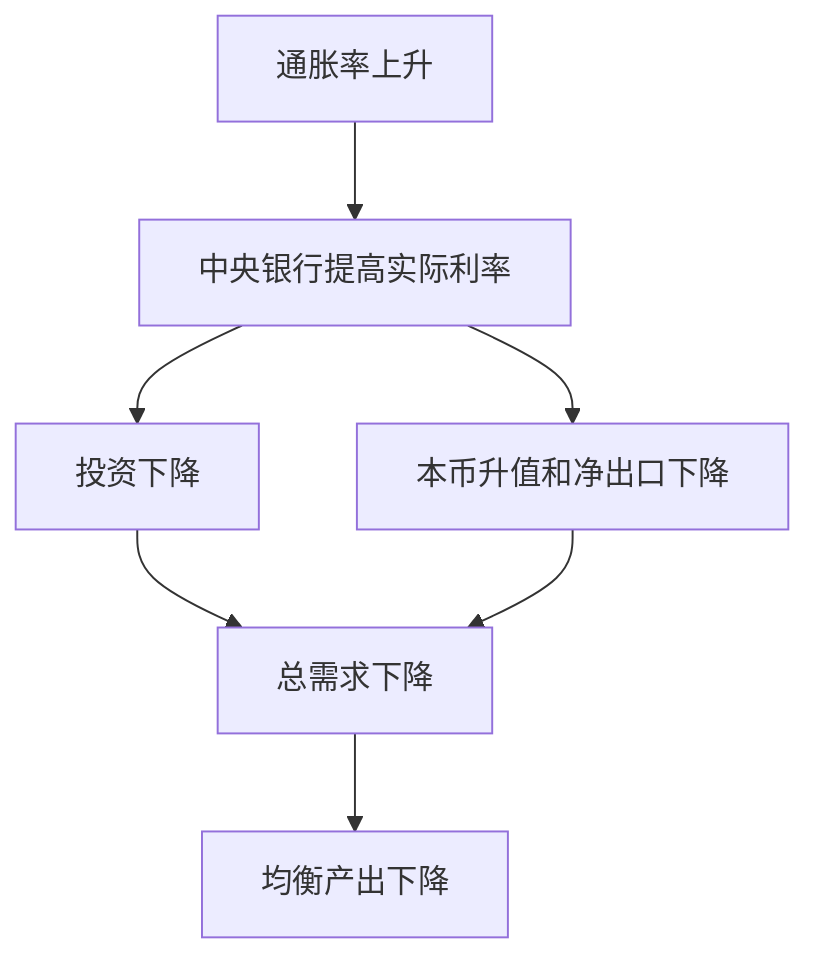

# 17.4 货币政策曲线与 AD 曲线

来源：

- 主线：Mishkin《货币金融学》Ch.22
- 补充：Mankiw Ch.31, Ch.34-Ch.36

IS 曲线说明实际利率怎样影响商品市场均衡和总产出。下一步要加入中央银行：当通胀变化时，中央银行怎样设置实际利率？这个政策反应又怎样形成总需求曲线？

这一节的核心链条是：

```text
通胀变化 → 中央银行调整实际利率 → 投资和净出口变化 → 总需求和产出变化
```

这条链条把第 15 章政策工具、第 16 章泰勒原则和第 17.3 节 IS 曲线连接起来。

## 名义利率如何影响实际利率

中央银行直接控制的是很短期的名义利率，例如联邦基金利率。可是 IS 曲线中影响投资和净出口的是实际利率。两者关系是：

```text
r = i - πe
```

`r` 是实际利率，`i` 是名义利率，`πe` 是预期通胀率。

短期内，价格和通胀预期通常不会立即完全调整。因此，当中央银行降低名义政策利率时，实际利率也会下降；提高名义政策利率时，实际利率也会上升。正因为短期价格和预期有黏性，中央银行才能通过名义利率影响真实经济活动。

如果所有价格和预期瞬间调整，名义利率变化可能只改变名义变量，而不影响实际利率和实际产出。但短期宏观波动分析正是建立在价格和预期调整不完全的基础上。

## 货币政策曲线

货币政策曲线，简称 MP 曲线，描述中央银行设定的实际利率和通胀率之间的关系。一个简单形式是：

```text
r = r̄ + λπ
```

`r̄` 是自主实际利率部分，表示在给定通胀之外，中央银行因为其他原因设定的政策立场；`λ` 表示中央银行对通胀的反应强度。

如果 `r̄ = 1.0`，`λ = 0.5`，那么：

```text
r = 1.0 + 0.5π
```

通胀为 1% 时，实际利率为 1.5%；通胀为 2% 时，实际利率为 2%；通胀为 3% 时，实际利率为 2.5%。通胀越高，中央银行设定的实际利率越高，MP 曲线向上倾斜。

## 为什么 MP 曲线向上倾斜

MP 曲线向上倾斜的政策含义，是中央银行遵循泰勒原则：通胀上升时，实际利率应该上升。

如果通胀上升，中央银行不提高实际利率，总需求可能继续过强，通胀压力会持续。提高实际利率会压低投资和净出口，使总需求降温，从而帮助通胀回到目标。

还有一个货币市场直觉。通胀上升意味着价格水平比原来更高，家庭和企业完成同样实际交易需要更多名义货币。如果中央银行不增加流动性，公众会卖出债券或减少银行存款来获得货币，债券价格下降、利率上升。短期预期通胀不变时，名义利率上升也意味着实际利率上升。

## 沿 MP 曲线移动和 MP 曲线移动

这里也要区分“沿曲线移动”和“曲线移动”。

通胀上升，中央银行按照正常反应提高实际利率，这是沿 MP 曲线移动。例如 2004-2006 年，美联储因通胀压力上升逐步提高联邦基金利率，可以理解为沿 MP 曲线向上移动。

如果中央银行在同一通胀率下改变实际利率，就是 MP 曲线移动。比如经济即将衰退，即使当前通胀没有下降，中央银行也可能主动降息，以防总需求大幅收缩。这是自主货币宽松，会使 MP 曲线下移。2007 年金融危机开始和 2020 年疫情冲击初期，美联储都在通胀并未明显下降时大幅降息，这更像是 MP 曲线下移，而不是沿曲线移动。

| 情况 | 图形含义 | 经济含义 |
| --- | --- | --- |
| 通胀上升，央行按规则加息 | 沿 MP 曲线向上移动 | 对通胀的内生反应 |
| 给定通胀下央行主动加息 | MP 曲线上移 | 自主紧缩 |
| 给定通胀下央行主动降息 | MP 曲线下移 | 自主宽松 |

## 从 MP 曲线到 AD 曲线

现在把 MP 曲线和 IS 曲线合在一起。

MP 曲线告诉我们：通胀越高，中央银行设定的实际利率越高。

IS 曲线告诉我们：实际利率越高，投资和净出口越低，商品市场均衡产出越低。

合起来就是：通胀越高，中央银行越会提高实际利率；实际利率越高，总需求越低，均衡产出越低。这条关系就是总需求曲线，即 AD 曲线。



因此，在以通胀率为纵轴、产出为横轴的图中，AD 曲线向下倾斜：通胀越高，总需求对应的均衡产出越低。

## 一个数字例子

假设 IS 曲线是：

```text
Y = 12 - r
```

MP 曲线是：

```text
r = 1 + 0.5π
```

把 MP 曲线代入 IS 曲线：

```text
Y = 12 - (1 + 0.5π)
Y = 11 - 0.5π
```

这就是 AD 曲线。通胀为 1% 时，产出为 10.5；通胀为 2% 时，产出为 10；通胀为 3% 时，产出为 9.5。通胀越高，中央银行设置的实际利率越高，均衡产出越低。

## AD 曲线为什么会移动

AD 曲线的移动来自两类因素。

第一，IS 曲线移动会带动 AD 曲线同向移动。政府购买增加、自主消费增加、自主投资增加、金融摩擦下降、自主净出口增加，都会提高给定通胀率下的总需求，使 AD 曲线右移。相反，税收增加、金融摩擦上升、企业信心下降，会使 AD 曲线左移。

第二，MP 曲线移动也会移动 AD 曲线。中央银行自主宽松，在任一通胀率下降低实际利率，会增加投资和净出口，使 AD 曲线右移。中央银行自主紧缩，在任一通胀率下提高实际利率，会使 AD 曲线左移。

| 变化 | 对 AD 曲线的影响 | 原因 |
| --- | --- | --- |
| 政府购买增加 | 右移 | IS 右移 |
| 税收增加 | 左移 | 消费下降，IS 左移 |
| 金融摩擦上升 | 左移 | 投资下降，IS 左移 |
| 企业信心增强 | 右移 | 自主投资上升 |
| 央行自主宽松 | 右移 | 给定通胀下实际利率下降 |
| 央行自主紧缩 | 左移 | 给定通胀下实际利率上升 |

## 和宏观经济学的连接

AD 曲线把货币政策放进总需求总供给框架。前面 GDP 章节告诉我们实际产出如何衡量；通胀章节告诉我们价格水平如何变化；IS 曲线解释实际利率如何影响总需求；MP 曲线解释中央银行如何对通胀设置实际利率。AD 曲线把这些关系合在一起。

它也解释了为什么中央银行既看通胀也看产出。通胀上升会引发利率上升和总需求下降；总需求下降会影响实际 GDP 和失业。货币政策抗通胀不是直接命令价格下降，而是通过实际利率影响总需求，再影响产出缺口和通胀压力。

## 小结

货币政策曲线描述中央银行设定的实际利率与通胀率之间的关系。由于短期价格和通胀预期调整缓慢，中央银行改变名义政策利率可以改变实际利率。MP 曲线向上倾斜，是因为中央银行通常遵循泰勒原则：通胀上升时提高实际利率。把 MP 曲线和 IS 曲线结合，可以推出 AD 曲线：通胀越高，中央银行设定的实际利率越高，投资和净出口越低，均衡产出越低。IS 曲线移动和 MP 曲线移动都会使 AD 曲线移动。

## 自测问题

- 为什么中央银行改变名义利率能在短期影响实际利率？
- MP 曲线为什么向上倾斜？
- 沿 MP 曲线移动和 MP 曲线移动有什么区别？
- 为什么 AD 曲线向下倾斜？
- 金融摩擦上升和央行自主宽松分别怎样移动 AD 曲线？
