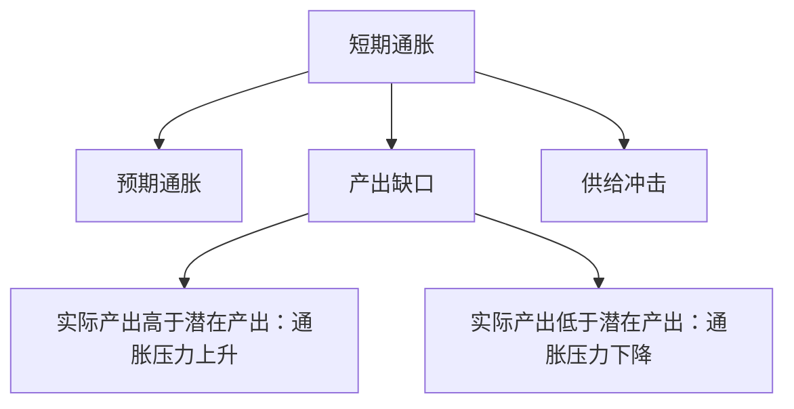

# 17.5 AD-AS 分析与短期经济波动

来源：

- 主线：Mishkin《货币金融学》Ch.23
- 补充：Mankiw Ch.31, Ch.34-Ch.36
- 延伸：Bodie/Kane/Marcus《Investments》Ch.14, Ch.24

AD 曲线解释在不同通胀率下，总需求对应的产出是多少。但仅有总需求还不够。短期宏观波动同时涉及产出和通胀：为什么有时产出下降、失业上升，通胀也下降？为什么有时油价冲击会让通胀上升而产出下降？这些问题需要把总需求和总供给放在一起。

AD-AS 分析就是把总需求曲线和总供给曲线结合起来，用来解释短期产出、就业和通胀的共同变化。

## 长期总供给：潜在产出

长期总供给曲线表示经济在长期能够持续生产的产出水平，也就是潜在产出 `Yp`。潜在产出由劳动、资本、技术、自然资源和制度决定，而不是由当前通胀率决定。

因此，长期总供给曲线是垂直的。无论通胀率是多少，长期产出都回到潜在产出附近。货币政策可以影响通胀和短期产出波动，但不能永久提高潜在产出。

这和前面长期增长章节一致：长期产出增长来自生产率、资本积累和技术进步。中央银行不能通过长期货币扩张创造真实生产能力。

## 短期总供给：通胀怎样形成

短期总供给曲线描述短期中产出和通胀之间的关系。它通常向上倾斜：产出高于潜在产出越多，通胀压力越大。

短期通胀由三个因素推动：

1. 预期通胀
2. 产出缺口
3. 供给冲击

可以写成直觉公式：

```text
通胀 = 预期通胀 + 产出缺口带来的压力 + 供给冲击
```

产出缺口是实际产出和潜在产出之间的差距。实际产出高于潜在产出时，企业用工紧张，设备利用率高，工资和成本上升，企业更容易涨价。实际产出低于潜在产出时，失业较高，需求疲弱，工资和价格压力下降。

供给冲击是直接影响生产成本或生产能力的冲击。例如油价大幅上涨，会提高运输和生产成本，使通胀上升、产出下降；技术进步或能源价格下降，则可能降低成本、提高产出。



## 为什么短期总供给向上倾斜

短期中工资和价格有黏性，不会立即完全调整。企业和工人通常基于预期通胀签工资合同、制定价格计划。如果实际需求比预期强，企业销售增加，产出扩大，劳动力市场趋紧，工资和价格会逐步上升。产出越高于潜在产出，通胀压力越强。

如果工资和价格完全灵活，经济会立刻回到潜在产出，短期总供给会像长期总供给一样垂直。但现实中合同、菜单成本、信息滞后和协调问题使调整需要时间，所以短期总供给向上倾斜。

## 短期均衡和长期均衡

短期均衡发生在 AD 曲线和短期 AS 曲线相交处。这个点决定当期实际产出和通胀率。

长期均衡要求实际产出等于潜在产出。若短期均衡产出高于潜在产出，经济过热，通胀压力上升。随着工资和预期通胀上调，短期 AS 曲线上移，经济逐步回到潜在产出，但通胀更高。

若短期均衡产出低于潜在产出，经济疲弱，失业高于自然水平。随着工资增长放缓和预期通胀下降，短期 AS 曲线下移，经济逐步回到潜在产出，但通胀更低。

这种工资、价格和预期调整使经济有自我修正机制。但自我修正可能很慢，期间会有失业和产出损失。

## 总需求冲击

总需求冲击是使 AD 曲线移动的冲击。政府购买增加、减税、企业信心改善、金融摩擦下降、中央银行自主宽松，都会使 AD 曲线右移。相反，金融危机、财政紧缩、企业信心下降、央行自主紧缩，会使 AD 曲线左移。

AD 右移时，短期产出上升、通胀上升。如果产出超过潜在水平，之后短期 AS 会逐渐上移，产出回到潜在水平，通胀保持较高。

AD 左移时，短期产出下降、通胀下降。经济出现负产出缺口和更高失业。若没有政策反应，工资和预期通胀逐渐下降，短期 AS 下移，产出回到潜在水平，但通胀更低。

这正是金融危机为什么会造成衰退：金融摩擦上升使投资下降、AD 左移，产出下降、失业上升。

## 供给冲击

供给冲击移动短期 AS 曲线。负面供给冲击，如油价上涨、供应链中断、自然灾害，会使 AS 上移：同一产出水平下通胀更高。结果是通胀上升、产出下降。这种组合叫滞胀。

正面供给冲击，如生产率提高或能源价格下降，会使 AS 下移：通胀下降、产出上升。

负面供给冲击对政策最困难。若中央银行收紧政策抑制通胀，AD 左移，产出会进一步下降；若中央银行放松政策支撑产出，AD 右移，通胀可能更高。政策必须在通胀稳定和产出稳定之间权衡。

## 自我修正机制为什么可能慢

理论上，产出低于潜在产出时，失业高、工资压力下降，通胀和预期通胀会下降，AS 下移，经济回到潜在产出。但现实中工资和价格调整慢，债务负担、金融摩擦和信心下降可能阻碍复苏。

例如金融危机后，产出低于潜在水平，但银行资本不足、企业去杠杆、家庭减少债务，使总需求恢复很慢。仅靠自我修正，失业可能长期偏高。因此，货币政策和财政政策常被用来稳定总需求。

## 和宏观经济学的连接

AD-AS 模型把前面几章合在一起：

| 模型部分 | 来自前面内容 |
| --- | --- |
| AD 曲线 | IS 曲线 + 货币政策曲线 |
| 长期 AS | 潜在产出、生产率、自然失业率 |
| 短期 AS | 通胀预期、产出缺口、供给冲击 |
| 短期波动 | AD 或 AS 冲击使产出偏离潜在产出 |
| 政策问题 | 如何稳定通胀和产出缺口 |

这个模型也是连接金融和宏观的工具。金融危机主要表现为 AD 左移；油价冲击主要表现为 AS 上移；技术进步会推动长期 AS 右移；货币政策通过 MP 曲线影响 AD。

AD-AS 框架也能解释资产类别在不同冲击下为何表现不同。负面需求冲击通常压低增长和通胀，利好高质量久期资产、打击股票盈利和信用资产；负面供给冲击则可能同时推高通胀、压低产出，使债券和股票都承压。投资者判断宏观数据时，关键是分辨冲击来自需求、供给还是金融条件，而不是只看 GDP 或通胀单个数字。

## 小结

AD-AS 分析解释短期产出和通胀如何共同决定。长期总供给由潜在产出决定，长期看货币政策不能永久提高真实产出。短期总供给取决于预期通胀、产出缺口和供给冲击，因工资和价格黏性而向上倾斜。AD 曲线和短期 AS 曲线相交决定短期产出和通胀。总需求冲击使产出和通胀同向变化；供给冲击可能使通胀和产出反向变化。经济有自我修正机制，但调整可能很慢，因此稳定政策在短期波动中很重要。

## 自测问题

- 为什么长期总供给曲线在潜在产出处垂直？
- 短期通胀由哪三个因素决定？
- 为什么短期总供给曲线向上倾斜？
- 总需求负冲击会怎样影响产出、失业和通胀？
- 负面供给冲击为什么会让政策选择更困难？
- 为什么需求冲击和供给冲击会让股票、债券出现不同联动？
