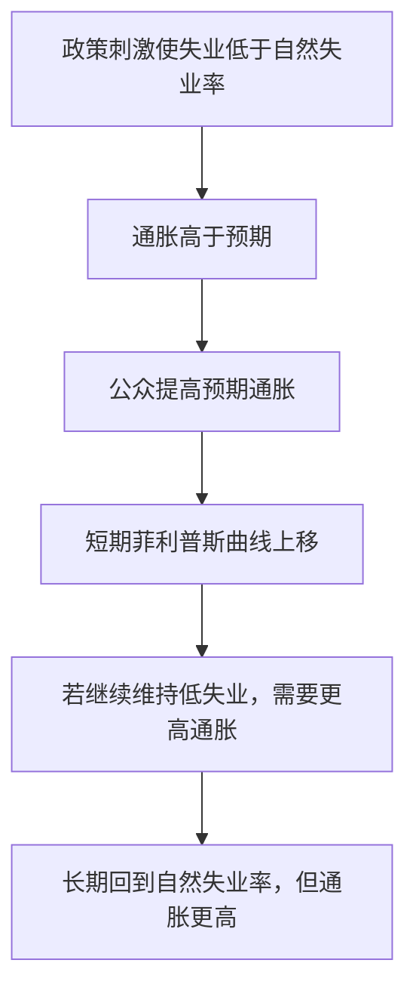

# 17.6 菲利普斯曲线、预期与政策权衡

来源：

- 主线：Mishkin《货币金融学》Ch.23, Ch.25
- 补充：Mankiw Ch.31, Ch.34-Ch.36

AD-AS 模型中，短期总供给曲线说明通胀取决于预期通胀、产出缺口和供给冲击。菲利普斯曲线从另一个角度讲同一件事：通胀和失业之间有什么关系？

这个问题曾经被理解得很简单：失业低，通胀高；失业高，通胀低。后来经济经验说明，这种简单权衡只在短期、且预期通胀给定时成立。长期中，失业会回到自然失业率，货币政策不能用更高通胀永久换取更低失业。

## 早期菲利普斯曲线的吸引力

早期菲利普斯曲线显示，失业率和通胀率似乎存在负相关。失业率低时，劳动力市场紧张，工资上涨更快，企业成本上升，物价上涨也更快。失业率高时，劳动者议价能力弱，工资和价格上涨压力较低。

这种关系看起来给政策制定者提供了一个菜单：如果愿意接受更高通胀，就可以选择更低失业；如果想要低通胀，就接受更高失业。20 世纪 60 年代，一些政策讨论正是这样理解通胀和失业的取舍。

但这套理解忽略了预期。工人和企业关心的是实际工资，也就是工资能买到多少商品和服务。如果他们预期物价会上涨，就会在工资和价格决策中提前反映这种预期。

## 预期增强的菲利普斯曲线

弗里德曼和费尔普斯指出，菲利普斯曲线必须加入预期通胀。一个常用形式是：

```text
π = πe - v(U - Un)
```

`π` 是实际通胀，`πe` 是预期通胀，`U` 是失业率，`Un` 是自然失业率，`U - Un` 是失业缺口。自然失业率是经济在工资和价格充分调整后仍会存在的失业率，包括摩擦性和结构性失业。

如果失业率低于自然失业率，`U - Un` 为负，通胀高于预期通胀；如果失业率高于自然失业率，通胀低于预期通胀。

关键在于，短期菲利普斯曲线是在给定预期通胀下画出来的。预期通胀变化时，整条短期菲利普斯曲线会移动。

## 为什么没有长期权衡

假设经济最初在自然失业率 5%、预期通胀 2% 处。政府和中央银行刺激总需求，使失业率下降到 4%。短期中，通胀可能上升到 3.5%。如果公众仍预期 2% 通胀，政策似乎成功用较高通胀换来较低失业。

但如果失业长期低于自然失业率，工资和价格压力会持续。人们观察到通胀高于预期，就会提高预期通胀。预期通胀上升后，短期菲利普斯曲线上移。为了继续把失业率维持在 4%，政策必须制造更高通胀。这个过程会不断推高实际和预期通胀。

最终，只有当失业率回到自然失业率时，通胀才不再加速。长期菲利普斯曲线因此是垂直的：长期失业率等于自然失业率，不取决于通胀率。



## 现代菲利普斯曲线

20 世纪 70 年代油价冲击使通胀上升，同时失业也很高。单纯的失业-通胀负相关无法解释这种滞胀。现代菲利普斯曲线加入供给冲击：

```text
π = πe - v(U - Un) + ρ
```

`ρ` 是通胀冲击或供给冲击。油价上涨、进口成本上升、供应链中断，会直接推高企业成本，使通胀上升，即使失业率并不低。

这说明通胀不只来自需求过热，也可能来自供给侧成本冲击。政策制定者必须判断通胀来源：如果通胀来自需求过热，收紧总需求更直接；如果通胀来自负面供给冲击，收紧政策会压低产出，但未必立即消除成本冲击。

## 适应性预期和通胀加速

一种简单预期模型是假设人们根据上一期通胀形成预期：

```text
πe = π(-1)
```

这叫适应性预期或后向预期。代入现代菲利普斯曲线：

```text
π = π(-1) - v(U - Un) + ρ
```

也可以写成：

```text
π - π(-1) = -v(U - Un) + ρ
```

这说明，如果失业率低于自然失业率，通胀会加速；如果失业率高于自然失业率，通胀会减速。自然失业率也因此被称为 NAIRU，即“不会使通胀加速的失业率”。

这个形式帮助理解 1970 年代的经验。政策若试图长期把失业压到自然失业率以下，通胀不会只停在一个较高水平，而会不断加速，直到政策收紧或失业回到自然水平。

## 奥肯定律：从失业缺口到产出缺口

菲利普斯曲线用失业缺口表达通胀压力，AD-AS 模型用产出缺口表达通胀压力。两者通过奥肯定律连接。

奥肯定律说明，失业缺口和产出缺口负相关。产出高于潜在产出时，失业率低于自然失业率；产出低于潜在产出时，失业率高于自然失业率。

一个常用经验关系是：产出相对潜在产出每高 1 个百分点，失业率大约低于自然失业率 0.5 个百分点。反过来，失业率每高于自然失业率 1 个百分点，产出大约低于潜在产出 2 个百分点。

因此，菲利普斯曲线可以转化为短期总供给曲线：

```text
π = πe + γ(Y - Yp) + ρ
```

产出高于潜在产出，通胀上升；产出低于潜在产出，通胀下降。

## 政策权衡到底在哪里

菲利普斯曲线带来的政策结论可以分三层。

第一，短期中存在权衡。在预期通胀给定时，扩张总需求可以降低失业、提高产出，但会提高通胀。

第二，长期中不存在稳定权衡。预期会调整，失业率回到自然失业率。用持续高通胀不能永久降低失业。

第三，供给冲击会制造更困难的权衡。负面供给冲击使通胀上升、产出下降。政策如果抗通胀，会加重产出下降；如果保产出，可能让通胀预期上升。

| 情况 | 通胀 | 失业/产出 | 政策难点 |
| --- | --- | --- | --- |
| 需求扩张 | 上升 | 失业下降、产出上升 | 防止过热和通胀预期上升 |
| 需求收缩 | 下降 | 失业上升、产出下降 | 避免深度衰退 |
| 负面供给冲击 | 上升 | 失业上升、产出下降 | 通胀和就业目标冲突 |
| 预期失锚 | 持续上升 | 长期失业不降 | 重建可信度成本高 |

## 和第 16 章的连接

第 16 章强调名义锚和可信度，原因在这里变得更清楚。如果公众相信中央银行会稳定长期通胀，预期通胀不容易因短期冲击大幅上升，短期菲利普斯曲线不会剧烈上移。抗通胀所需的产出损失较小。

如果中央银行缺乏可信度，任何需求刺激或供给冲击都可能迅速进入通胀预期。短期菲利普斯曲线上移，经济会面临更高通胀和更差的产出表现。

因此，菲利普斯曲线不是只讲失业和通胀之间的统计关系，它解释了为什么货币政策战略、预期管理和中央银行信誉会改变宏观政策效果。

## 小结

菲利普斯曲线描述通胀和失业之间的关系。早期菲利普斯曲线强调低失业和高通胀之间的短期负相关；预期增强的菲利普斯曲线加入预期通胀，说明短期权衡只在预期给定时存在。长期中，预期会调整，失业率回到自然失业率，因此不存在用更高通胀永久换取更低失业的稳定权衡。现代菲利普斯曲线还加入供给冲击，解释滞胀。通过奥肯定律，失业缺口可以转化为产出缺口，菲利普斯曲线也就成为短期总供给曲线的基础。

## 自测问题

- 为什么早期菲利普斯曲线看起来像政策菜单？
- 预期通胀为什么会使短期菲利普斯曲线移动？
- 为什么长期菲利普斯曲线是垂直的？
- 供给冲击怎样解释高通胀和高失业同时出现？
- 奥肯定律怎样把失业缺口和产出缺口联系起来？
