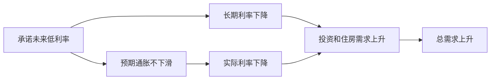

# 17.7 货币政策传导机制：利率、资产价格、汇率、信用渠道

来源：

- 主线：Mishkin《货币金融学》Ch.26
- 补充：Mankiw Ch.31, Ch.34-Ch.36
- 延伸：Bodie/Kane/Marcus《Investments》Ch.14, Ch.18, Ch.24

前面用 IS、MP 和 AD-AS 模型说明：中央银行改变利率，会影响总需求和产出。但现实中的传导不止一条路。货币政策不是从央行直接跳到 GDP，中间经过金融市场、银行、资产价格、汇率、企业资产负债表和家庭消费决策。

货币政策传导机制，就是研究政策行动怎样一步步影响总需求、产出、就业和通胀。理解这些渠道，才能解释为什么同样降息在正常时期可能有效，在金融危机中却可能传导受阻。

## 传统利率渠道

最基本的渠道是实际利率影响投资和消费。扩张性货币政策降低实际利率，借款成本下降，企业更愿意购买机器、建设厂房和增加库存，家庭更愿意购买住房、汽车和其他耐用品，总需求上升。

可以写成：

```text
实际利率下降 → 投资和耐用品消费上升 → 总需求上升
```

这里强调的是实际利率，而不是名义利率。企业和家庭关心的是借款成本扣除通胀后的真实成本。短期中价格和预期调整慢，中央银行降低名义利率通常能降低实际利率。

长期利率也很重要。住房贷款、企业长期投资和债券融资更受长期利率影响。根据期限结构的预期理论，长期利率大致反映未来短期利率的平均预期。因此，如果中央银行让市场相信短期利率会长期保持低位，长期利率也会下降，投资和住房需求会受到刺激。

## 有效下限下的实际利率渠道

当名义利率接近零时，中央银行不能继续大幅降低名义短期利率。但实际利率仍然等于：

```text
r = i - πe
```

如果名义利率 `i` 已经接近零，中央银行仍可以通过影响预期通胀 `πe` 来降低实际利率。若公众相信未来通胀会更高一些，实际利率下降，消费和投资可能上升。

这解释了前瞻指引的重要性。中央银行承诺较长时间维持低利率，不只是影响今天的隔夜利率，更是为了影响未来短期利率预期、长期利率和实际利率。



## 汇率渠道

开放经济中，利率还会通过汇率影响净出口。扩张性货币政策降低本国实际利率，本国资产相对外国资产吸引力下降，本币贬值。本币贬值使本国产品对外国人更便宜，出口上升；外国商品对本国居民更贵，进口下降。净出口增加，总需求上升。

传导链条是：

```text
实际利率下降 → 本币贬值 → 净出口上升 → 总需求上升
```

这个渠道把货币政策和第 18 章汇率决定连接起来。对贸易开放度高的经济体，汇率渠道可能很重要；对封闭程度较高的经济体，影响较弱。

## 股票价格、托宾 q 和投资

货币政策还会影响股票价格。实际利率下降时，债券收益下降，股票相对更有吸引力，股票需求上升，股价可能上升。股价上升后，企业市场价值相对于新建资本成本提高。

托宾 q 定义为：

```text
q = 企业市场价值 / 资本重置成本
```

如果 q 高，企业通过发行股票可以以较高价格筹资，购买机器和厂房相对便宜，投资更有吸引力。如果 q 低，企业市场价值低于新建资本成本，企业更不愿进行新增实物投资。

传导链条是：

```text
实际利率下降 → 股票价格上升 → 托宾 q 上升 → 投资上升 → 总需求上升
```

这个渠道说明，货币政策不只影响贷款利率，也通过资产估值影响企业融资和投资。

## 财富效应

股票和住房也是家庭财富的重要组成部分。扩张性货币政策降低利率，推高股票和住房价格时，家庭金融财富和住房财富上升。家庭觉得一生资源增加，更愿意消费。

这就是财富效应：

```text
利率下降 → 股票/房价上升 → 家庭财富上升 → 消费上升 → 总需求上升
```

财富效应把货币政策连接到消费 `C`，而不只是投资 `I`。住房价格尤其重要，因为住房既是资产，也是抵押品。房价上升还可能提高家庭借款能力，进一步支持消费。

## 银行贷款渠道

传统利率渠道假设借款人可以在市场上按利率借到资金。但第 10 章和第 13 章已经说明，信息不对称使银行贷款具有特殊作用。很多中小企业和家庭不能直接发行债券或股票，只能依赖银行。

扩张性货币政策增加银行准备金和存款，银行可贷资金增加，贷款供给上升。依赖银行贷款的企业获得更多资金，投资增加。

```text
准备金和存款上升 → 银行贷款上升 → 投资和消费上升 → 总需求上升
```

银行贷款渠道解释了为什么货币政策对不同主体影响不一样。大企业能直接进入债券市场，受银行贷款收缩影响较小；中小企业更依赖银行，受货币紧缩或银行危机影响更大。

## 资产负债表渠道

资产负债表渠道来自金融摩擦。企业净值越高，抵押品越多，贷款人越愿意放贷；企业净值越低，逆向选择和道德风险越严重，贷款人越谨慎。

货币宽松可以通过提高股票价格和资产价格来改善企业净值。企业净值上升后，贷款人面对的风险下降，贷款增加，投资上升。

```text
利率下降 → 资产价格上升 → 企业净值上升 → 逆向选择和道德风险下降 → 贷款和投资上升
```

这个渠道也是金融危机放大衰退的反向机制。危机中资产价格下跌，企业和家庭净值下降，金融摩擦上升，贷款收缩，投资和消费下降，AD 左移。

## 现金流渠道和意外价格水平渠道

货币政策降低名义利率，会改善企业和家庭现金流。短期债务利息支出下降，借款人更容易按时付款。现金流改善后，贷款人更愿意放贷，投资和消费上升。

这条渠道强调名义利率，因为许多债务合同按名义利率支付利息。短期债务多的企业和家庭，对这条渠道更敏感。

还有一个与债务通缩相反的渠道。若货币宽松导致价格水平意外上升，名义债务的实际负担下降，借款人实际净值上升，金融摩擦下降，贷款和投资增加。第 13 章讲债务通缩时，价格意外下降会加重债务负担；这里则说明价格意外上升会减轻债务负担。

## 家庭流动性渠道

家庭购买住房和耐用品时，也会考虑未来财务困境风险。住房、汽车等资产流动性差，急着出售可能亏损。如果家庭资产负债表脆弱，它们会减少这类支出，增加现金和安全资产。

货币宽松若提高股票和住房价格，改善家庭财富和现金流，就会降低家庭对财务困境的担忧，增加住房和耐用品消费。这条渠道说明，货币政策不仅影响企业投资，也影响家庭资产负债表和消费结构。

## 各渠道怎样汇入 GDP

货币政策传导渠道最终都会进入 GDP 的支出组成：

| 渠道 | 直接影响 | GDP 项目 |
| --- | --- | --- |
| 传统利率渠道 | 企业投资、住房和耐用品 | `I`、部分 `C` |
| 汇率渠道 | 出口和进口 | `NX` |
| 托宾 q | 企业固定投资 | `I` |
| 财富效应 | 家庭消费 | `C` |
| 银行贷款渠道 | 中小企业投资、家庭信贷 | `I`、`C` |
| 资产负债表渠道 | 贷款和投资能力 | `I`、`C` |
| 现金流渠道 | 债务偿付和贷款能力 | `I`、`C` |

这张表也说明，宏观模型中的一条 IS 曲线背后，其实有很多金融机制。利率变化只是起点，真正影响总需求的是融资成本、资产价格、净值、信用供给、汇率和预期的共同变化。

这一节也是投资学和宏观经济学交汇最密集的地方。货币政策通过无风险利率影响折现率，通过信用渠道影响企业外部融资溢价，通过汇率渠道影响跨国现金流，通过资产负债表渠道影响违约概率和风险溢价。投资者分析政策，不应只问“降息多少”，还要问哪条传导渠道最受约束、哪类资产现金流和折现率最敏感。

## 小结

货币政策传导机制解释中央银行政策怎样影响总需求和实际经济。传统利率渠道通过降低实际利率刺激投资、住房和耐用品消费；有效下限下，前瞻指引和通胀预期可以继续影响实际利率。汇率渠道通过本币贬值提高净出口。资产价格渠道包括托宾 q 和财富效应，影响企业投资和家庭消费。信用渠道强调银行贷款、企业和家庭资产负债表、现金流以及金融摩擦。所有渠道最终都通过消费、投资和净出口影响总需求、产出、就业和通胀。

## 自测问题

- 为什么货币政策传导中实际利率比名义利率更关键？
- 汇率渠道如何把降息转化为净出口增加？
- 托宾 q 为什么能解释股价和企业投资之间的关系？
- 银行贷款渠道为什么对中小企业尤其重要？
- 资产负债表渠道怎样把金融危机和总需求收缩联系起来？
- 分析货币政策影响资产价格时，为什么要区分利率渠道、信用渠道和汇率渠道？
