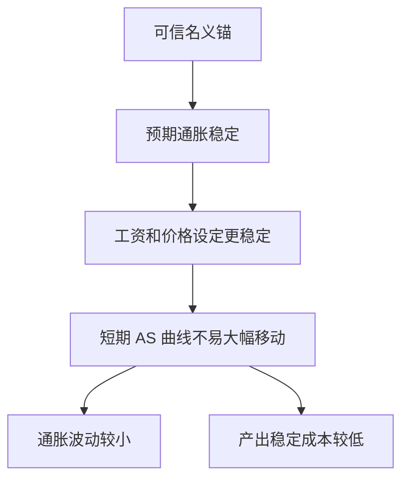

# 17.8 预期、可信度与货币政策效果

来源：

- 主线：Mishkin《货币金融学》Ch.25
- 补充：Mankiw Ch.31, Ch.34-Ch.36
- 延伸：Bodie/Kane/Marcus《Investments》Ch.14, Ch.24

本章前面建立了短期宏观模型：IS 曲线说明利率怎样影响总需求，MP 曲线说明中央银行怎样对通胀设置利率，AD-AS 和菲利普斯曲线说明产出缺口、失业和通胀怎样相互作用。最后还要加入一个决定政策效果的关键因素：预期。

货币政策影响经济，不只是因为它改变今天的利率和准备金，还因为它改变人们对未来利率、通胀、收入和政策反应的预期。家庭、企业和金融市场会根据这些预期提前行动。因此，同样的政策动作，在不同预期和可信度环境下，效果可能完全不同。

## 卢卡斯批判：政策改变会改变行为

传统政策评估常用过去数据估计关系，再把不同政策输入模型，看失业和通胀如何变化。例如，如果过去短期利率上升后长期利率只小幅上升，模型可能预测：现在把短期利率从 5% 提到 6%，长期利率影响也很小。

卢卡斯批判指出，这种做法可能错误，因为政策改变会改变公众预期，而预期改变会改变经济关系本身。

以长期利率为例。长期利率大致反映未来短期利率的平均预期。如果过去短期加息总是暂时的，市场看到短期利率上升，会预期它很快回落，长期利率只小幅上升。可是如果中央银行宣布并可信地转向长期紧缩，市场会预期未来短期利率长期更高，长期利率就会大幅上升。用旧数据估计出的关系，会低估政策影响。

这说明，政策不是在一个不变的机器上按按钮。政策本身会改变人们对机器运行方式的理解。

## 理性预期的含义

理性预期不是说每个人都预测准确，而是说人们会利用可得信息形成预期，不会系统性地犯同一种错误。如果中央银行反复用扩张政策制造通胀，人们最终会学会预期更高通胀。

这对货币政策有两层影响。

第一，意外政策和预期政策效果不同。出乎意料的扩张可能短期刺激产出；但如果公众已经预期中央银行会扩张，工资、价格和长期利率会提前调整，真实刺激效果较弱。

第二，政策框架比单次动作更重要。市场关心的不只是今天降息 25 个基点，而是这次降息意味着未来政策路径怎样改变。

## 规则、相机抉择和受约束相机抉择

预期问题让规则与相机抉择的讨论更重要。纯相机抉择给政策制定者灵活性，但也容易产生时间不一致性：长期看应该控制通胀，短期却总想刺激产出。公众预期到这种倾向后，会提高通胀预期，结果是更高通胀而没有更高平均产出。

政策规则可以约束这种倾向。固定货币增长规则、泰勒规则、通胀目标制都试图让公众知道政策会如何反应。规则的好处是稳定预期，降低通胀偏向。

但机械规则也有问题。金融危机、疫情、供给冲击和金融结构变化很难提前写进公式。政策需要判断。现代较实际的做法是受约束的相机抉择：目标和框架提前承诺，具体操作保留灵活性。

## 可信名义锚的作用

可信名义锚是预期管理的核心。若中央银行承诺 2% 通胀目标，并且公众相信它会实现这个目标，预期通胀就会围绕 2% 稳定。工资、价格和长期利率也会围绕这个预期调整。

可信名义锚有两个好处。

第一，它缓解时间不一致性。中央银行如果偏离目标，会受到公众和市场质疑，因此不容易为了短期产出刺激而放弃长期价格稳定。

第二，它稳定 AD-AS 模型中的短期 AS 曲线。短期 AS 取决于预期通胀、产出缺口和供给冲击。如果预期通胀稳定，需求冲击或供给冲击就不容易引发连续的 AS 曲线上移。

## 面对需求冲击时，可信度为什么重要

假设企业信心突然增强，投资增加，AD 曲线右移。短期中，产出高于潜在产出，通胀上升。若中央银行可信，公众相信它会采取措施把通胀带回目标，预期通胀不会明显上升。短期 AS 曲线保持相对稳定，央行收紧政策后，通胀可以回落。

若中央银行不可信，公众会担心央行容忍更高通胀，预期通胀上升。短期 AS 曲线上移，通胀进一步上升。即使央行后来收紧，通胀已经被预期放大，稳定成本更高。

负面需求冲击也是类似逻辑。消费信心下降使 AD 左移，产出下降。可信央行可以通过宽松政策支撑需求，同时保持通胀预期稳定。不可信央行即使宽松，也可能被市场解读为未来通胀风险，政策效果较弱。

## 面对供给冲击时，可信度更关键

负面供给冲击，如油价上涨，会使短期 AS 上移，通胀上升、产出下降。此时政策最难，因为抗通胀会进一步压低产出，保产出又可能加剧通胀。

如果央行可信，公众会相信油价冲击不会变成持续通胀。预期通胀不大幅上升，AS 曲线不会继续上移。央行可以在较小产出损失下稳定通胀。

如果央行不可信，油价冲击会引发工资和价格预期上调。短期 AS 进一步上移，经济面临更高通胀和更低产出。政策要重新稳定通胀，就需要更大紧缩和更高失业。

这解释了为什么同样的油价冲击，在可信度不同的时代可能造成不同通胀结果。

## 反通胀政策和可信度

当通胀已经很高时，中央银行要降低通胀。若公众不相信央行会坚持反通胀，预期通胀下降很慢，工资和价格合同仍按高通胀设定。央行必须大幅收紧总需求，使失业上升，才能迫使通胀下降。

若央行可信，公众相信反通胀会持续，预期通胀更快下降，短期 AS 曲线下移。实际产出不必下降太多，通胀也能回落。可信度因此能降低反通胀的产出成本。

这不是说可信度可以让反通胀完全没有成本。工资合同、价格黏性、债务负担和金融摩擦仍会造成调整成本。但可信度越高，预期调整越配合，政策代价通常越低。

## 本章模型怎样合在一起

到这里，第 17 章形成了一套完整短期宏观逻辑：

| 模块 | 解释的问题 |
| --- | --- |
| 数量论 | 长期货币增长和通胀 |
| 货币需求 | 利率、收入和持币意愿 |
| IS 曲线 | 实际利率和总需求 |
| MP 曲线 | 中央银行对通胀设置实际利率 |
| AD 曲线 | 通胀和总需求产出 |
| AS/菲利普斯曲线 | 产出缺口、失业、预期和通胀 |
| 传导机制 | 政策如何通过金融渠道影响 GDP |
| 预期和可信度 | 为什么政策效果取决于公众相信什么 |

这套框架把前面的经济学和金融学连接起来：GDP、通胀、失业是宏观结果；银行、债券、股票、汇率和资产负债表是传导渠道；中央银行工具和战略决定政策如何进入这些渠道；公众预期决定传导效果有多强。

在金融市场中，预期本身就是价格的一部分。长期债券价格反映未来短期利率路径和期限溢价，股票价格反映未来现金流和折现率，汇率反映未来相对利率和风险偏好。如果政策框架改变，历史相关性也会改变，这正是卢卡斯批判在投资中的含义：不能只用过去的价格反应机械外推新政策环境下的资产表现。

## 小结

预期会改变货币政策效果。卢卡斯批判指出，政策改变会改变公众预期，因此用旧数据关系机械评估新政策可能误导。理性预期意味着人们会根据政策框架调整行为，意外政策和预期政策效果不同。可信名义锚能稳定通胀预期，减少时间不一致性，使短期 AS 曲线不易因冲击大幅移动。面对需求冲击、供给冲击和反通胀政策时，可信度越高，稳定通胀和产出的成本通常越低。本章的宏观模型最终说明：货币政策不仅是利率操作，更是对金融条件、总需求、通胀预期和公众信任的管理。

## 自测问题

- 卢卡斯批判为什么说旧模型可能不能可靠评估新政策？
- 理性预期为什么会削弱系统性意外扩张政策的效果？
- 可信名义锚怎样影响短期总供给曲线？
- 面对负面供给冲击时，央行可信度为什么特别重要？
- 为什么反通胀政策的成本取决于公众是否相信中央银行？
- 为什么政策框架变化会让历史资产价格关系失效？
