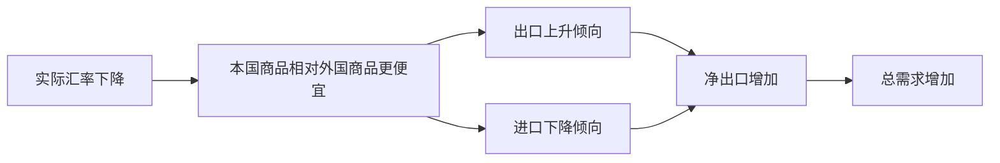
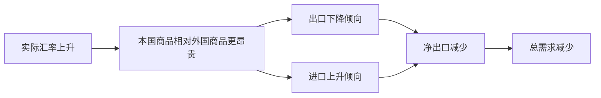

# 18.2 名义汇率、实际汇率与竞争力

来源：

- 主线：Mishkin《货币金融学》Ch.18
- 补充：Mishkin/Eakins Ch.15；Mankiw Ch.32
- 延伸：Bodie/Kane/Marcus《Investments》Ch.23

## 为什么只看“汇率数字”还不够

上一节把汇率理解为一种货币用另一种货币表示的价格。这个定义很重要，但还不够。一个企业真正关心的不是“美元兑日元是多少”这个数字本身，而是用这个汇率换算以后，本国商品和外国商品谁更便宜。一个消费者真正关心的也不是“欧元兑人民币是多少”这个报价本身，而是去欧洲旅行、买欧洲商品、购买欧洲金融资产时，实际要付出多少本国购买力。

所以，开放经济需要区分两类汇率：名义汇率和实际汇率。名义汇率比较的是货币和货币；实际汇率比较的是商品和商品。前者告诉我们“钱怎样换钱”，后者告诉我们“货币换算之后，一国商品相对另一国商品到底贵不贵”。

这个区别是学习外汇市场的关键。新闻报道通常先讲名义汇率，因为它每天都在变化，容易观察。但宏观经济中，影响出口、进口、贸易余额和总需求的，往往是实际汇率。名义汇率是入口，实际汇率才把货币市场和商品市场连接起来。

## 名义汇率：一种货币换另一种货币的比率

名义汇率是一个人用一国货币交换另一国货币的比率。例如，银行牌价显示 `1 美元 = 80 日元`，意思是交出 1 美元可以换到 80 日元；反过来，交出 80 日元可以换到 1 美元。现实中银行买入价和卖出价会略有不同，因为银行提供换汇服务要收取补偿，但理解基本概念时可以先忽略这个差异。

同一个名义汇率总能用两种方式表达：

| 表达方式 | 数字例子 | 含义 |
| --- | --- | --- |
| 外币/本币 | 80 日元/美元 | 1 美元能买 80 日元 |
| 本币/外币 | 1/80 美元/日元 | 1 日元能买 0.0125 美元 |

如果采用“外币/本币”的写法，本币能买到更多外币，就叫本币升值；本币能买到更少外币，就叫本币贬值。例如，汇率从 `80 日元/美元` 上升到 `90 日元/美元`，1 美元可以买到更多日元，美元升值；同时，日元相对美元贬值。若汇率从 `80 日元/美元` 下降到 `70 日元/美元`，1 美元可以买到的日元变少，美元贬值；同时，日元相对美元升值。

日常说一种货币“强”或“弱”，通常也是在说名义汇率最近的变化。货币升值时，人们说它变强，因为它可以购买更多外国货币；货币贬值时，人们说它变弱，因为它可以购买更少外国货币。这里要避免一个常见误解：强货币不一定总是好，弱货币也不一定总是坏。汇率是价格，价格变化会让一些人受益、另一些人受损。强货币让进口更便宜、出国旅行更便宜，但会让出口商面临更大竞争压力；弱货币帮助出口和进口替代行业，却会提高进口品价格和居民海外消费成本。

对一个国家来说，名义汇率也不止一个。美元可以兑日元、欧元、英镑、墨西哥比索、人民币等许多货币。若要描述一国货币整体上是升值还是贬值，经济学家常常使用汇率指数，把多个双边汇率按贸易权重或其他权重合成一个指标。这类似 CPI 把许多商品价格合成一个总体物价指数。单个汇率告诉我们某两种货币之间的价格；汇率指数告诉我们一国货币相对于一篮子外国货币的总体价值。

## 实际汇率：一国商品能换多少外国商品

名义汇率只处理货币之间的转换，但国际贸易最终比较的是商品和服务的相对价格。实际汇率就是完成这一步的概念。它表示一国商品和服务可以按什么比例换取另一国商品和服务。

可以先从一个具体商品理解。假设一蒲式耳美国大米价格是 100 美元，一蒲式耳日本大米价格是 16,000 日元，名义汇率是 `80 日元/美元`。美国大米的美元价格不能直接和日本大米的日元价格比较，必须先换成同一种货币。

美国大米价格换成日元是：

```text
100 美元 × 80 日元/美元 = 8,000 日元
```

日本大米价格是 16,000 日元。因此，美国大米只相当于日本大米价格的一半。换句话说，1 蒲式耳美国大米可以按价格比例换取 1/2 蒲式耳日本大米。这里的 `1/2` 就是这个例子中的实际汇率。

实际汇率可以写成：

```text
实际汇率 = 名义汇率 × 本国价格 ÷ 外国价格
```

如果用符号表示，设 `e` 为名义汇率，写成“每单位本国货币可换多少外国货币”；`P` 为本国价格水平；`P*` 为外国价格水平，则：

```text
实际汇率 = e × P / P*
```

这个公式的含义很直接：先用名义汇率把本国价格换算成外国货币，再和外国价格比较。如果换算后的本国商品价格相对外国商品价格更高，实际汇率上升；如果换算后的本国商品价格相对外国商品价格更低，实际汇率下降。

| 变量变化 | 对实际汇率的影响 | 直觉 |
| --- | --- | --- |
| 本国名义汇率 `e` 上升 | 实际汇率上升 | 本币升值，本国商品换成外币后更贵 |
| 本国价格水平 `P` 上升 | 实际汇率上升 | 本国商品本身更贵 |
| 外国价格水平 `P*` 上升 | 实际汇率下降 | 外国商品更贵，本国商品相对便宜 |

这个公式也说明，实际汇率不是单纯由外汇市场决定的。它同时取决于名义汇率和两国物价水平。一个国家即使名义汇率不变，如果国内通胀高于国外，本国商品也会逐渐变贵，实际汇率会上升，价格竞争力会下降。反过来，如果本国通胀较低，即使名义汇率变化不大，本国商品相对外国商品也可能变得更便宜。

## 竞争力不是口号，而是相对价格

经济新闻经常说“本币升值削弱出口竞争力”或“本币贬值改善竞争力”。这里的竞争力首先不是企业管理水平、技术创新或品牌能力，而是用共同货币比较后的相对价格。

如果美国大米换算成日元后比日本大米便宜，购买者会更愿意买美国大米；如果美国大米换算成日元后更贵，购买者会更愿意买日本大米。这种选择不只发生在大米市场，也发生在汽车、机械设备、旅游服务、教育服务和许多可贸易商品中。

实际汇率正是衡量这种相对价格的工具。实际汇率下降，表示本国商品相对外国商品变便宜。本国居民会减少购买进口品，外国居民会增加购买本国出口品，于是出口上升、进口下降，净出口增加。实际汇率上升，表示本国商品相对外国商品变贵。本国居民更愿意购买进口品，外国居民减少购买本国出口品，于是出口下降、进口上升，净出口减少。

可以把这个机制整理成一条宏观链条：



反向变化也成立：



这就是汇率与宏观经济结合的核心。封闭经济中，总需求主要由消费、投资和政府购买解释；开放经济中，还要加入净出口。而净出口不是凭空变化的，它受到实际汇率影响。实际汇率越高，本国商品越贵，净出口越弱；实际汇率越低，本国商品越便宜，净出口越强。

## 名义汇率变化不等于实际汇率变化

实际汇率公式还可以帮助我们避免另一个误解：名义汇率升值不一定等于实际竞争力同幅下降，名义汇率贬值也不一定等于实际竞争力同幅改善。

假设本国货币名义升值 5%，但外国价格水平也同时上升很多，外国商品本身变贵，那么本国商品相对外国商品未必贵太多。再比如，本国货币名义贬值 10%，但本国通胀也很高，企业成本和本国商品价格快速上涨，那么名义贬值带来的价格优势可能被国内通胀抵消。

因此，分析一国出口竞争力时，不能只盯着名义汇率。必须同时看：

| 问题 | 需要观察的变量 |
| --- | --- |
| 本币相对外币是升值还是贬值 | 名义汇率 |
| 本国物价是否比外国上涨更快 | 本国价格水平与外国价格水平 |
| 本国商品相对外国商品是更贵还是更便宜 | 实际汇率 |
| 进出口需求可能怎样变化 | 实际汇率和收入水平 |

这也是为什么宏观经济学把实际变量和名义变量区分得很清楚。前面学习通胀、GDP、利率时已经反复遇到这个区分：名义 GDP 要扣除物价变化才得到实际 GDP；名义利率要扣除预期通胀才接近实际利率；名义汇率也要结合两国价格水平，才得到实际汇率。经济决策最终依赖的是实际购买力和实际相对价格。

## 汇率、价格水平与通胀

实际汇率还把外汇市场和通胀连接起来。若本国价格水平上升快于外国价格水平，在名义汇率不变时，本国商品相对外国商品会变贵，实际汇率上升，出口竞争力下降。长期看，这种相对通胀差异会给名义汇率带来调整压力。后面学习购买力平价时会看到，如果一国物价水平长期比另一国上涨更快，它的货币通常有贬值压力。

但短期中，名义汇率也会反过来影响国内通胀。本币贬值会提高进口品和进口原材料的本币价格，可能推高消费价格指数和企业生产成本；本币升值会降低进口品价格，帮助压低通胀。对中央银行来说，汇率不仅影响净出口和产出，还会影响价格稳定目标。

因此，开放经济中的宏观分析至少有三层价格：

| 价格类型 | 衡量内容 | 主要影响 |
| --- | --- | --- |
| 国内价格水平 | 本国商品和服务总体价格 | 通胀、实际收入、实际利率 |
| 名义汇率 | 货币之间的价格 | 换汇成本、外币资产本币价值 |
| 实际汇率 | 本国商品相对外国商品的价格 | 净出口、国际竞争力、总需求 |

这三层价格互相影响。国内通胀改变实际汇率；名义汇率改变进口价格；实际汇率改变净出口；净出口又进入总需求，影响产出和就业。第 18 章后面的内容，就是在这个基础上解释汇率长期和短期如何决定。

实际汇率也是分析跨国企业盈利的重要变量。本币实际升值会削弱出口收入的价格竞争力，也会把海外利润折算成本币时压低；但它可能降低进口原材料和外币债务成本。本币实际贬值则可能提高出口商收入，却压缩依赖进口投入的企业利润率。投资者分析一家公司时，要看它的收入、成本和债务分别暴露在哪些货币上，而不能只看总部所在国家。

## 小结

名义汇率是两种货币之间的交换比率，回答“钱怎样换钱”。实际汇率是本国商品和外国商品之间的相对价格，回答“换算成同一种货币后，谁的商品更便宜”。实际汇率由名义汇率、本国价格水平和外国价格水平共同决定。

实际汇率是理解国际竞争力和净出口的关键。实际汇率下降，本国商品相对外国商品变便宜，出口倾向于增加、进口倾向于减少，净出口上升；实际汇率上升，本国商品相对外国商品变贵，净出口下降。这个机制把外汇市场和开放经济宏观中的总需求、通胀、产出和货币政策联系起来。

## 自测问题

- 名义汇率和实际汇率分别回答什么问题？
- 如果 `1 美元 = 80 日元` 变成 `1 美元 = 90 日元`，美元和日元分别是升值还是贬值？
- 为什么分析出口竞争力不能只看名义汇率？
- 根据 `实际汇率 = e × P / P*`，本国通胀高于外国通胀会怎样影响实际汇率？
- 实际汇率下降为什么通常会增加净出口？
- 为什么同一次本币贬值可能利好出口企业，却伤害依赖进口原材料的企业？
