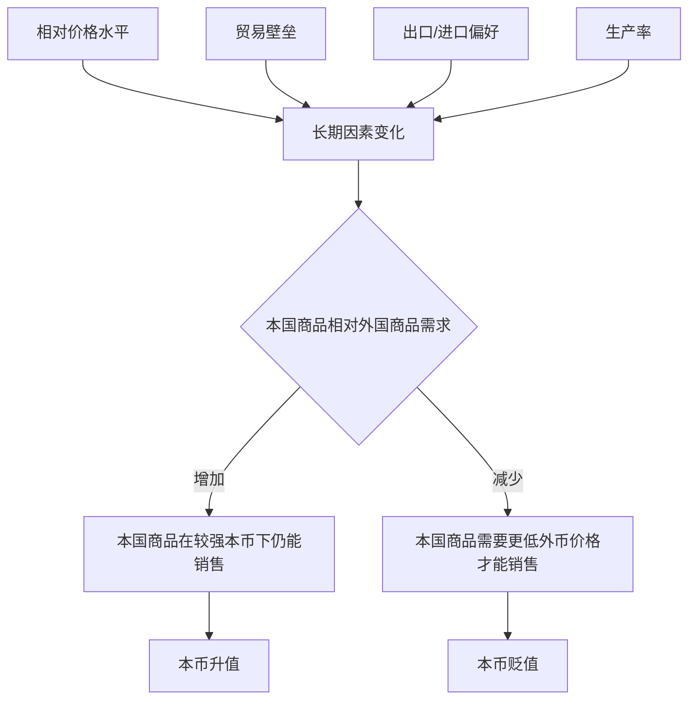

# 18.4 汇率的长期决定因素

来源：

- 主线：Mishkin《货币金融学》Ch.18
- 补充：Mishkin/Eakins Ch.15；Mankiw Ch.32
- 延伸：Bodie/Kane/Marcus《Investments》Ch.23

## 从购买力平价走向更完整的长期分析

购买力平价给出一个强有力的长期基准：如果一国价格水平相对另一国上升，该国货币在长期有贬值压力。但真实世界中的长期汇率不只由相对价格水平决定。即使两个国家通胀差不多，贸易政策、消费者偏好、生产率差异也会改变人们对本国商品和外国商品的需求，从而改变本币的长期价值。

理解长期汇率时，可以抓住一条主线：任何提高本国可贸易商品相对外国可贸易商品需求的因素，都倾向于使本币升值；任何降低本国商品相对需求、提高外国商品相对需求的因素，都倾向于使本币贬值。

这条主线背后的直觉是：如果本国商品即使在本币更贵时仍然卖得好，本币就有升值空间；如果本国商品只有在本币更便宜时才卖得动，本币就有贬值压力。汇率长期调整的作用之一，就是让国际商品需求重新达到可持续状态。

## 相对价格水平：通胀差异会改变货币购买力

相对价格水平是购买力平价最直接的应用。假设本国商品价格上升，而外国商品价格不变。本国商品相对外国商品变贵，消费者会减少对本国商品的需求，转向外国商品。为了让本国商品重新具有吸引力，本币往往需要贬值。贬值会让外国人购买本国商品更便宜，也会让本国人购买外国商品更贵，从而支撑本国商品需求。

反过来，如果外国商品价格上升，而本国商品价格不变，本国商品相对外国商品变便宜，需求会增加。本国商品即使在本币更强时也能卖得好，因此本币有升值压力。

用长期结论表述就是：

| 变化 | 对本国商品相对需求的影响 | 本币长期倾向 |
| --- | --- | --- |
| 本国价格水平相对外国上升 | 本国商品变贵，需求下降 | 贬值 |
| 本国价格水平相对外国下降 | 本国商品变便宜，需求上升 | 升值 |

这与前面宏观经济学中的货币数量论相连。长期看，货币供给增长过快会推高本国价格水平。如果本国通胀长期高于外国，本国商品相对变贵，本币购买力下降，汇率上就表现为贬值压力。因此，汇率长期趋势常常反映不同国家货币政策和通胀表现的差异。

## 贸易壁垒：限制进口会提高本国商品需求

贸易壁垒包括关税和配额。关税是对进口品征税，配额是限制进口数量。它们都会使外国商品进入本国市场更困难或更昂贵，从而提高本国居民对本国商品的相对需求。

假设印度提高对英国机械的关税，或者减少英国机械可以进口到印度的数量。英国机械在印度市场上变贵或变少，印度企业和消费者会更多购买印度机械。印度商品需求上升后，印度卢比就有升值压力，因为印度商品即使在卢比更强时也能保持销售。

这给出一个长期结论：提高贸易壁垒倾向于使本币升值。

不过，这个结论要按教材逻辑理解，不应简单理解为“贸易保护一定好”。贸易壁垒可能让本国货币升值，但它也会扭曲资源配置、提高消费者成本、降低贸易收益，并可能引发其他国家报复。前面福利经济学已经讲过，关税和配额会产生无谓损失。这里的重点只是说明，贸易壁垒通过改变进口需求和本国商品需求，能够影响长期汇率。

从开放经济宏观看，贸易壁垒对净出口和汇率的影响并不等于对总产出一定有利。进口减少可能暂时提高净出口，但本币升值又会削弱出口竞争力；贸易伙伴反制还可能压低出口。长期中，政策效果要同时考虑价格、数量、福利和国际反应。

## 对本国商品和外国商品的偏好

消费者偏好变化也会影响长期汇率。如果外国消费者更喜欢本国出口品，本国商品需求上升，本币倾向于升值。假设英国消费者突然更喜欢印度香料和服装。英国对印度商品需求增加，印度出口更强，卢比会有升值压力，因为印度商品在卢比较强时仍能卖得好。

相反，如果本国消费者更喜欢外国商品，进口需求上升，本币倾向于贬值。假设印度消费者更偏好英国羊毛制品，对英国商品需求增加。印度居民需要更多英镑来购买英国商品，对卢比资产的相对需求下降，卢比会有贬值压力。

可以概括为：

| 偏好变化 | 贸易方向 | 本币长期倾向 |
| --- | --- | --- |
| 外国更喜欢本国商品 | 出口需求上升 | 升值 |
| 本国更喜欢外国商品 | 进口需求上升 | 贬值 |

偏好不是短期广告口号，而是会影响长期贸易结构的力量。一个国家的产品质量、品牌信誉、技术特征、文化吸引力和消费习惯，都可能改变国际需求。如果本国出口品持续受到全球欢迎，本币长期会更容易保持强势；如果本国居民持续偏好进口品，而出口需求不足，本币会更容易承受贬值压力。

这也连接到 GDP 中的净出口。出口需求上升会直接增加净出口，推动总需求；但本币升值会部分抵消这种推动，因为升值让出口品变贵。长期均衡通常不是单个因素单独决定，而是需求变化和汇率调整共同作用的结果。

## 生产率：更高效率会提高可贸易品竞争力

生产率是长期经济增长的核心，也是长期汇率的重要因素。一个国家生产率提高，尤其是可贸易品部门生产率提高，会降低本国可贸易商品相对外国商品的成本。成本下降使本国商品更有吸引力，需求上升，本币就有升值压力。

假设一个国家制造业技术进步很快，同样投入可以生产更多汽车、机械、电子产品。单位成本下降后，本国商品在国际市场更具竞争力。外国消费者增加购买，本国出口需求上升。本国货币可以升值，因为即使升值后，本国商品仍然具备价格或质量优势。

相反，如果一国生产率落后于其他国家，本国可贸易品相对外国商品会变贵，需求下降，本币有贬值压力。贬值在一定程度上可以降低外国人购买本国商品的价格，帮助本国商品继续销售。

生产率和汇率的联系也把本章拉回长期增长理论。前面宏观部分讲过，长期生活水平取决于生产率。现在进一步看到，生产率不仅影响实际 GDP 和工资，也影响一国商品在世界市场上的相对价格，进而影响长期汇率。高生产率经济体往往可以在较强货币下维持出口能力；低生产率经济体可能需要较弱货币来维持价格竞争力。

## 四个因素如何统一到同一条逻辑

长期汇率因素看起来有四类，但它们都通过同一个中间环节发挥作用：本国商品相对外国商品的需求。

| 长期因素上升 | 对本国商品相对需求 | 本币长期影响 |
| --- | --- | --- |
| 本国价格水平相对外国上升 | 下降 | 贬值 |
| 贸易壁垒上升 | 上升 | 升值 |
| 进口需求上升 | 下降 | 贬值 |
| 出口需求上升 | 上升 | 升值 |
| 本国生产率相对外国上升 | 上升 | 升值 |

这里采用的汇率报价方式是“每单位本币可兑换多少外币”。在这种报价下，本币升值表现为汇率上升，本币贬值表现为汇率下降。如果采用“每单位外币需要多少本币”的报价，方向会相反。因此，做题或读新闻时仍然要先确认报价方式。

可以用一张图统一整理：

## 长期因素为什么不能解释每日波动

相对价格水平、贸易壁垒、消费偏好和生产率都很重要，但它们通常变化缓慢。通胀差异往往要几年才能明显累积，生产率变化更是长期过程，贸易政策和偏好也不会每天剧烈改变。可是现实中的汇率可以在一天内变化几个百分点。

这说明，长期因素只能解释汇率的长期方向和长期基准，不能解释短期剧烈波动。短期汇率需要另一种分析方法。外汇市场不仅是商品交易的辅助市场，也是资产市场。人们持有美元资产、欧元资产、日元资产或人民币资产，是在比较不同货币资产的预期收益、风险和流动性。短期中，资产持有决策的规模远远大于进出口交易规模，因此汇率会对利率、预期和金融消息迅速反应。

下一节开始，分析会从长期商品需求转向短期资产市场。长期因素仍然重要，因为它们影响人们对未来汇率的预期；但短期汇率的直接推动力，往往是投资者在本币资产和外币资产之间重新配置财富。

这些长期因素也会影响国家层面的风险溢价。生产率持续提高、出口竞争力增强、通胀较低且政策可信的经济体，通常更容易吸引长期资本，货币也更容易获得估值支撑。相反，如果货币看似便宜但背后是生产率停滞、贸易条件恶化或长期通胀失控，低汇率未必代表投资机会，可能只是基本面风险的价格反映。

## 小结

长期汇率由影响本国商品相对外国商品需求的因素决定。相对价格水平上升会削弱本国商品需求，使本币贬值；贸易壁垒提高会增加本国商品需求，使本币升值；出口需求上升会使本币升值，进口需求上升会使本币贬值；生产率相对提高会降低本国可贸易品成本，增加需求，使本币升值。

这些因素把外汇市场和宏观经济的长期部分连接起来：通胀差异来自货币政策和价格水平变化，生产率来自长期增长，出口和进口需求进入净出口，贸易壁垒涉及政策与福利。长期汇率不是一个孤立金融变量，而是开放经济中价格水平、生产能力和国际商品需求共同作用的结果。

## 自测问题

- 为什么“本国商品相对需求上升”会带来本币升值压力？
- 本国价格水平相对外国上升时，为什么本币长期倾向于贬值？
- 贸易壁垒为什么可能使本币升值？这是否意味着贸易保护一定提高福利？
- 出口需求和进口需求分别怎样影响本币长期汇率？
- 生产率提高为什么会使一国货币长期更容易升值？
- 为什么长期汇率分析要同时看生产率、通胀和贸易条件，而不只看“便宜或昂贵”？
