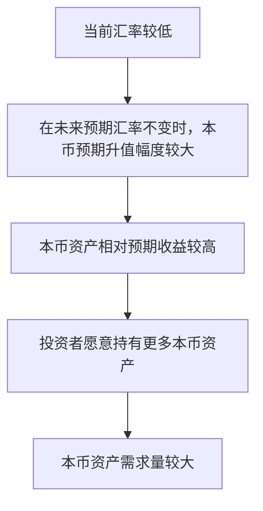
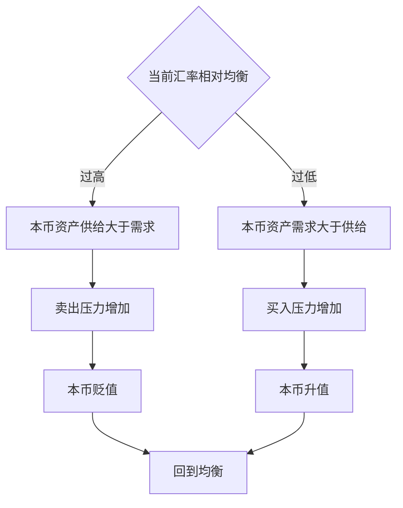
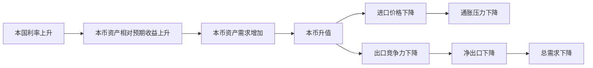

# 18.5 汇率的短期资产市场分析

来源：

- 主线：Mishkin《货币金融学》Ch.18
- 补充：Mishkin/Eakins Ch.15；Mankiw Ch.32

## 为什么短期汇率不能只靠进出口解释

长期汇率分析从商品市场出发：本国商品和外国商品谁更便宜，出口和进口需求怎样变化，货币长期应当升值还是贬值。这个思路适合解释几年甚至更长时间里的汇率趋势，但很难解释现实中汇率每天、每小时的波动。

原因在于，短期外汇交易的规模远远超过商品贸易结算的需要。一个国家一年进出口额可能很大，但外汇市场每天成交的货币资产交易规模更大。银行、基金、企业、保险公司、中央银行和其他投资者不断在不同货币资产之间转换：持有本币银行存款、本币债券、本币股票，还是持有外币存款、外币债券、外币股票。短期汇率主要反映的是这些资产持有决策。

因此，短期汇率分析要把汇率看成一种资产价格。更准确地说，汇率是本国货币资产相对于外国货币资产的价格。若投资者更愿意持有本币资产，本币需求上升，本币升值；若投资者更愿意持有外币资产，本币需求下降，本币贬值。

这与前面学习资产需求理论完全一致。投资者选择资产时，会比较预期收益、风险和流动性。外汇市场中的本币资产和外币资产也是资产，投资者同样会问：哪一种资产预期回报更高？哪一种风险更大？哪一种更容易买卖？本节先集中讨论预期收益这一条主线。

## 把外汇市场画成本币资产市场

为了看清短期均衡，可以假设本国是印度，本币资产是以卢比计价的银行存款、债券和股票；外国资产用英镑计价。汇率写成“每 1 卢比可换多少英镑”。在这种报价方式下，汇率上升表示卢比升值，汇率下降表示卢比贬值。

短期模型中，卢比资产供给主要由已经存在的银行存款、债券和股票数量决定。为了简化，可以把卢比资产供给看成相对于当前汇率固定。也就是说，无论当前汇率是多少，短期内可供持有的卢比资产总量大体不变。因此，供给曲线是垂直的。

需求曲线表示在每一个当前汇率下，投资者愿意持有多少卢比资产。需求取决于卢比资产相对于英镑资产的预期收益。这里最关键的是：当前汇率越低，在未来预期汇率不变时，卢比未来升值空间越大，持有卢比资产的预期收益越高，投资者愿意持有的卢比资产越多。因此，本币资产需求曲线向下倾斜。



这条逻辑看起来和普通商品需求曲线有些相似：价格越低，需求越高。但这里的原因不是“东西便宜所以多买”，而是“当前本币价格低，若未来回到预期水平，本币升值收益更大，所以本币资产更有吸引力”。

## 一个数字例子：为什么需求曲线向下倾斜

假设投资者预期下一期卢比汇率为 `0.02 英镑/卢比`。现在比较三个当前汇率：

| 当前汇率 | 预期未来汇率 | 预期升值率 | 对卢比资产需求的影响 |
| --- | --- | --- | --- |
| 0.015 英镑/卢比 | 0.02 英镑/卢比 | 约 33% | 有吸引力 |
| 0.010 英镑/卢比 | 0.02 英镑/卢比 | 100% | 更有吸引力 |
| 0.005 英镑/卢比 | 0.02 英镑/卢比 | 300% | 非常有吸引力 |

计算方式是：

```text
预期升值率 = (预期未来汇率 - 当前汇率) ÷ 当前汇率
```

当前汇率越低，若未来预期汇率不变，预期升值率越高。投资者持有卢比资产不仅能获得卢比资产本身的利息或股息，还可能获得卢比升值带来的汇率收益。因此，在较低当前汇率下，卢比资产需求量更高。

这解释了短期资产市场分析中的需求曲线形状：

| 当前本币汇率 | 预期升值空间 | 本币资产相对预期收益 | 本币资产需求 |
| --- | --- | --- | --- |
| 较高 | 较小 | 较低 | 较少 |
| 较低 | 较大 | 较高 | 较多 |

## 均衡汇率怎样形成

外汇市场均衡出现在本币资产需求量等于本币资产供给量的位置。供给曲线垂直，需求曲线向下倾斜，两者交点给出均衡汇率。

如果当前汇率高于均衡水平，本币资产供给大于需求。换句话说，想卖出卢比资产的人多于想买入卢比资产的人。为了卖出这些资产，卖方必须接受更低的卢比价格，卢比汇率下降，直到回到均衡。

如果当前汇率低于均衡水平，本币资产需求大于供给。想买入卢比资产的人多于想卖出卢比资产的人，买方竞争推高卢比价格，卢比汇率上升，直到超额需求消失。



这个均衡机制和普通供求分析有相同形式，但解释对象不同。普通商品市场中，价格调整让商品供给和商品需求相等；外汇资产市场中，汇率调整让本币资产供给和本币资产需求相等。

## 什么会移动本币资产需求曲线

在简化模型中，本币资产供给短期固定，因此汇率变化主要来自需求曲线移动。需求曲线移动的根本原因是本币资产相对外币资产的预期收益发生变化。

判断需求曲线如何移动，可以问一个问题：在当前汇率不变时，某个因素变化会让投资者更愿意还是更不愿意持有本币资产？

如果本币资产相对预期收益上升，投资者在每个汇率下都想持有更多本币资产，需求曲线右移，本币升值。如果本币资产相对预期收益下降，投资者在每个汇率下都想持有更少本币资产，需求曲线左移，本币贬值。

| 变化 | 本币资产相对预期收益 | 需求曲线 | 本币汇率 |
| --- | --- | --- | --- |
| 上升 | 增加 | 右移 | 升值 |
| 下降 | 减少 | 左移 | 贬值 |

接下来可以把具体因素放进这个框架。

## 本国利率上升为什么会使本币升值

假设本币资产支付的利率上升，而当前汇率、外币资产利率和未来预期汇率都不变。本币资产直接收益更高，投资者更愿意持有本币资产。本币资产需求曲线右移，均衡汇率上升，本币升值。

反过来，如果本国利率下降，本币资产收益相对外币资产下降，投资者减少本币资产需求，需求曲线左移，本币贬值。

这条机制把外汇市场和货币政策直接连接起来。央行提高政策利率时，通常会推高本国短期利率，使本币资产更有吸引力，带来本币升值压力。央行降息时，本币资产吸引力下降，本币可能贬值。前面学习货币政策传导时，汇率渠道正是建立在这个逻辑上：利率变化影响资本流动和汇率，汇率再影响净出口和通胀。

## 外国利率上升为什么会使本币贬值

如果外国资产利率上升，而本国利率和其他因素不变，外国资产变得更有吸引力。本币资产的相对预期收益下降，投资者会减少本币资产需求，需求曲线左移，本币贬值。

反过来，外国利率下降会提高本币资产相对吸引力，需求曲线右移，本币升值。

这个结论解释了为什么一国汇率不仅受本国央行影响，也受外国央行影响。即使本国政策没有变化，如果美国、欧元区、日本或其他重要经济体的利率变化，全球投资者也会重新比较资产收益，资本流动和汇率随之变化。开放经济中的货币政策环境因此具有外部性：一个国家的利率决策会影响其他国家的汇率和金融条件。

## 预期未来汇率为什么会立即影响当前汇率

资产价格的一个特点是，它不仅取决于现在，还取决于未来。股票价格取决于预期未来利润，债券价格取决于预期未来利率和还款，汇率也取决于投资者对未来汇率的预期。

如果投资者预期未来本币会更强，那么在当前汇率不变时，持有本币资产的预期升值收益增加。本币资产需求曲线右移，本币现在就会升值。反过来，如果投资者预期未来本币会更弱，本币资产预期收益下降，需求曲线左移，本币现在就会贬值。

这说明，未来消息会提前进入当前汇率。市场不需要等到未来真的发生变化，预期本身就能改变今天的资产需求。例如，投资者如果相信本国未来通胀会下降、生产率会提高、出口需求会增强，可能预期本币未来升值，于是今天就增加本币资产持有，本币现在升值。若投资者相信本国未来通胀会上升、进口需求会扩大、生产率会落后，可能预期本币未来贬值，于是今天减少本币资产持有，本币现在贬值。

## 长期因素怎样进入短期汇率

上一节讲的长期因素并没有在短期模型中消失。它们通过“预期未来汇率”进入当前需求曲线。

| 预期变化 | 对未来本币汇率的判断 | 当前本币资产需求 | 当前本币汇率 |
| --- | --- | --- | --- |
| 预期本国相对价格水平下降 | 未来本币更强 | 增加 | 升值 |
| 预期本国贸易壁垒提高 | 未来本币更强 | 增加 | 升值 |
| 预期本国进口需求下降 | 未来本币更强 | 增加 | 升值 |
| 预期外国对本国出口需求上升 | 未来本币更强 | 增加 | 升值 |
| 预期本国生产率相对提高 | 未来本币更强 | 增加 | 升值 |
| 预期本国相对价格水平上升 | 未来本币更弱 | 减少 | 贬值 |
| 预期本国进口需求上升 | 未来本币更弱 | 减少 | 贬值 |

这正是汇率高度波动的原因。许多消息都会改变人们对未来价格水平、通胀、贸易政策、生产率、进口需求、出口需求和货币政策的判断。预期一变，本币资产相对预期收益立刻变化，汇率也立刻变化。汇率不是等到长期因素实际发生后才调整，而是会在预期改变时提前调整。

## 与宏观经济的连接：汇率是金融条件的一部分

短期资产市场分析使汇率成为宏观金融条件的一部分。央行加息不仅影响企业投资和居民消费，也通过提高本币资产收益影响汇率；汇率升值又会降低进口价格、压低净出口；汇率贬值会提高进口价格、刺激净出口。这样，利率、汇率、总需求和通胀被连在一起。

可以把短期政策传导整理为：



这也是为什么第 16 章讨论货币政策战略时，开放经济央行必须关注汇率。即使央行没有设定汇率目标，汇率仍会影响通胀和产出；即使央行只盯住通胀和就业，汇率也是政策传导的重要变量。

## 小结

短期汇率更适合用资产市场方法解释。汇率是本币资产相对于外币资产的价格，投资者根据相对预期收益决定持有本币资产还是外币资产。短期中，本币资产供给可以近似看作固定，需求曲线向下倾斜，因为当前本币汇率越低，在未来预期汇率不变时，本币预期升值空间越大，本币资产越有吸引力。

本币资产需求曲线移动会改变当前汇率。本国利率上升、外国利率下降、预期未来本币升值，都会提高本币资产相对预期收益，使需求曲线右移，本币升值。相反，本国利率下降、外国利率上升、预期未来本币贬值，会使需求曲线左移，本币贬值。

长期因素通过预期未来汇率影响短期汇率，因此汇率会对新闻和政策预期快速反应。开放经济中，汇率把利率、资本流动、净出口、通胀和总需求连接起来，是货币政策传导的重要渠道。

## 自测问题

- 为什么短期汇率不能只用进出口需求解释？
- 在未来预期汇率不变时，为什么当前本币汇率越低，本币资产需求越高？
- 本国利率上升为什么会使本币资产需求曲线右移？
- 外国利率上升为什么会使本币贬值？
- 长期因素怎样通过“预期未来汇率”影响当前汇率？
