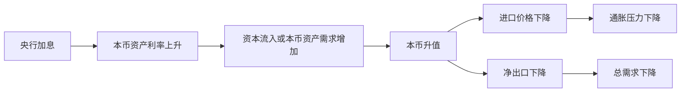

# 18.6 利率平价与资本流动

来源：

- 主线：Mishkin《货币金融学》Ch.18
- 补充：Mishkin/Eakins Ch.15；Mankiw Ch.32
- 延伸：Bodie/Kane/Marcus《Investments》Ch.23

## 投资者比较的不是利率本身，而是同一货币下的预期收益

上一节用供求图解释了短期汇率：投资者比较本币资产和外币资产的相对预期收益，相对预期收益变化会移动本币资产需求曲线。利率平价把这个直觉写成一个更明确的条件。

先从一个最常见的误解开始。假设美国存款利率是 4%，欧元区存款利率是 5%。能不能立刻说欧元资产更好？不能。因为美国投资者如果买欧元资产，未来还要把欧元换回美元；欧洲投资者如果买美元资产，未来还要把美元换回欧元。最终收益不仅取决于存款或债券利率，还取决于持有期间汇率如何变化。

国际投资比较必须把两类收益加在一起：

```text
外币资产的总预期收益 = 外币资产利率 + 外币相对本币的预期升值率
本币资产的总预期收益 = 本币资产利率
```

如果从外国投资者角度看本币资产，也可以写成：

```text
本币资产以外币计的预期收益 = 本币资产利率 + 本币相对外币的预期升值率
```

关键不是站在哪个国家，而是要把所有收益换算成同一种货币。只有在同一货币单位下比较，才能判断哪种资产真正更有吸引力。

## 汇率收益怎样进入资产收益

假设本国是美国，本币资产以美元计价，外国资产以欧元计价。美元资产支付利率 `iD`，欧元资产支付利率 `iF`。汇率 `Et` 写成“每 1 美元可换多少欧元”，所以 `Et` 上升表示美元升值。下一期预期汇率写作 `Eᵉt+1`。

美元相对欧元的预期升值率是：

```text
(Eᵉt+1 - Et) / Et
```

如果美元资产利率是 4%，并且美元预计相对欧元升值 3%，那么从欧元投资者角度看，美元资产的预期收益约为 7%。这 7% 来自两部分：4% 是美元资产本身支付的利息，3% 是未来把美元换回欧元时美元更值钱带来的汇率收益。

如果美元预计贬值 3%，那么美元资产以欧元计的预期收益约为 1%。同样的 4% 美元利息，会被 3% 汇率损失抵消一部分。

| 美元资产利率 | 预期美元汇率变化 | 以欧元计的美元资产预期收益 |
| --- | --- | --- |
| 4% | 升值 3% | 约 7% |
| 4% | 不变 | 约 4% |
| 4% | 贬值 3% | 约 1% |

这个例子说明，跨国资产收益不是“利率”一个数字。高利率货币如果预计贬值，未必有高回报；低利率货币如果预计升值，也可能有吸引力。

## 相对预期收益

美元资产相对于欧元资产的预期收益，可以写成：

```text
美元资产相对预期收益
= 美元利率 - 欧元利率 + 美元预期升值率
= iD - iF + (Eᵉt+1 - Et) / Et
```

如果这个值为正，美元资产预期收益高于欧元资产，投资者会增加美元资产持有、减少欧元资产持有。美元需求上升，美元升值。如果这个值为负，欧元资产预期收益更高，投资者会减少美元资产持有，美元贬值。

这里的“投资者”不只包括外国人，也包括本国居民。欧洲投资者会比较美元资产和欧元资产，美国投资者也会比较美元资产和欧元资产。只要把收益换算成同一种货币，二者得到的相对收益判断是一致的。若美元资产相对收益上升，国内外投资者都会更愿意持有美元资产；若美元资产相对收益下降，国内外投资者都会更不愿意持有美元资产。

这就是资本流动的基础。资本不是因为国界而自然停留在某一国资产中，而是会追逐经过汇率调整后的预期收益。当然，现实中还存在风险、管制、税收和流动性差异；但在教材的基本模型中，先假设本外币资产风险和流动性相近，以便看清利率和预期汇率的核心关系。

## 利率平价：两类资产的预期收益必须相等

在资本可以自由流动、国内外资产风险和流动性相似的情况下，本币资产和外币资产可以被看作接近完全替代品。若美元资产预期收益高于欧元资产，投资者都会想持有美元资产；若欧元资产预期收益高于美元资产，投资者都会想持有欧元资产。

但市场上既有美元资产，也有欧元资产。要让投资者愿意同时持有两类资产，二者预期收益必须相等。这个均衡条件就是利率平价。

用上面的符号表示，利率平价要求：

```text
iD - iF + (Eᵉt+1 - Et) / Et = 0
```

也就是：

```text
iD = iF - (Eᵉt+1 - Et) / Et
```

这个式子看起来有点绕，可以用语言解释：

```text
本国利率 = 外国利率 - 本币预期升值率
```

等价地，也可以说：

```text
本国利率 = 外国利率 + 外币预期升值率
```

如果本国利率高于外国利率，为什么投资者不全买本国资产？因为市场均衡时，本币通常会被预期贬值，或者外币被预期升值，用汇率损失抵消本国较高利率。反过来，如果本国利率低于外国利率，本币可能被预期升值，用汇率收益弥补较低利率。

利率平价不是说各国利率必须相同，而是说利率差必须由预期汇率变化补偿。投资者最终比较的是“利率加汇率变化”后的总预期收益。

## 一个利率平价例子

假设美国利率是 6%，日本利率是 3%。如果两国资产风险和流动性相同，资本可以自由流动，那么为什么投资者不全部持有美元资产？利率平价的回答是：日元必须被预期升值 3%，才能补偿日元资产较低的利率。

可以这样看：

| 资产 | 利率 | 预期汇率收益 | 总预期收益 |
| --- | --- | --- | --- |
| 美元资产 | 6% | 0 | 6% |
| 日元资产 | 3% | 日元预期升值 3% | 6% |

如果日元不被预期升值，日元资产总预期收益只有 3%，投资者会转向美元资产。对美元资产的需求上升会推动当前美元升值、当前日元贬值，直到未来日元相对当前水平存在足够升值空间，使两类资产预期收益相等。

这个调整过程说明，利率平价不是一个静态公式，而是资本流动推动汇率调整后的均衡结果。只要某一边资产预期收益更高，资金就会流向那一边，汇率就会变化，直到超额收益被消除。


## 利率变化怎样通过资本流动影响汇率

利率平价也能重新推出上一节的供求结论。把利率平价改写为：

```text
Et = Eᵉt+1 / (1 + iF - iD)
```

这个表达式说明，在预期未来汇率 `Eᵉt+1` 和外国利率 `iF` 不变时，本国利率 `iD` 上升，分母变小，当前汇率 `Et` 上升，本币升值。直觉是，本国利率上升使本币资产更有吸引力，资本流入推动本币升值。

在本国利率和预期未来汇率不变时，外国利率 `iF` 上升，分母变大，当前汇率 `Et` 下降，本币贬值。直觉是，外国资产收益更高，资本流向外国资产，本币资产需求下降。

在本国利率和外国利率不变时，预期未来汇率 `Eᵉt+1` 上升，当前汇率 `Et` 也上升。本币预期未来更强，会提高本币资产预期收益，资本今天就流入本币资产，推动本币现在升值。

| 变化 | 利率平价中的作用 | 当前本币汇率 |
| --- | --- | --- |
| 本国利率上升 | 本币资产利息收益更高 | 升值 |
| 外国利率上升 | 外币资产利息收益更高 | 贬值 |
| 预期未来本币升值 | 本币资产汇率收益更高 | 升值 |
| 预期未来本币贬值 | 本币资产汇率收益更低 | 贬值 |

这说明，资本流动不是盲目追逐高利率，而是追逐经过预期汇率调整后的收益。高利率可能吸引资金流入，也可能只是补偿未来货币贬值风险。判断汇率时，必须同时看利率差和汇率预期。

## 和宏观经济中的真实利率、资本流动相连接

开放经济宏观中，资本流动和利率紧密相连。前面学习可贷资金市场时，实际利率协调储蓄和投资；在开放经济中，国内储蓄可以流向国外，外国储蓄也可以流入国内。资本跨境流动时，投资者会比较不同国家资产的实际回报和汇率风险。

利率平价使用的是金融市场中的名义利率和预期汇率变化。但从宏观角度看，名义利率背后包含真实利率和预期通胀。若一国名义利率上升是因为真实利率上升，资产吸引力可能增强；若名义利率上升只是因为通胀预期上升，投资者可能同时预期该国货币未来贬值，汇率未必升值。

这点非常重要。单看“某国利率更高”不足以判断该国货币会升值。要看高利率来自哪里：

| 高利率来源 | 对汇率的含义 |
| --- | --- |
| 真实回报提高、政策收紧、风险可控 | 可能吸引资本流入，本币升值 |
| 通胀预期上升、货币购买力下降 | 可能伴随未来贬值预期，本币未必升值 |
| 风险溢价上升、违约或危机担忧 | 高利率可能是风险补偿，资本未必流入 |

因此，利率平价不是机械地说“高利率货币一定升值”，而是提供一个分析框架：利率差、预期汇率变化和资产风险共同决定资本流动。教材的基本条件假设风险和流动性相近，是为了先理解最核心的无套利关系；现实分析还要把风险和制度因素加回来。

## 利率平价和货币政策传导

利率平价把货币政策的汇率渠道写得更清楚。央行加息会提高本币资产收益，若没有被未来贬值预期完全抵消，本币会升值。本币升值会降低进口品本币价格，减轻通胀压力；同时，本币升值会让出口品对外国人更贵，压低净出口，降低总需求。

央行降息则相反。若降息降低本币资产相对收益，本币会贬值。贬值会推高进口价格，增加通胀压力；同时改善出口价格竞争力，支撑净出口和总需求。



这也是为什么开放经济中的中央银行不能只看国内利率和国内产出。利率决策会影响资本流动和汇率，而汇率会反过来影响通胀和 GDP。第 16 章讲货币政策战略时强调央行沟通和预期管理，在开放经济中尤其重要：如果市场相信央行会长期维持低通胀，本币未来价值预期更稳定，汇率也更容易稳定；如果市场怀疑央行会容忍高通胀，本币可能提前贬值。

投资实践中，利率平价是外汇套保和套利定价的底线。远期汇率通常会把两国利率差反映进去，因此“买高利率货币并远期锁汇”不会无风险地产生超额收益。未套保的高息货币投资可能有较高票息，但投资者承担的是汇率风险、流动性风险和危机时资本外流风险。所谓套息交易赚的不是免费午餐，而是承担这些风险后的补偿。

## 小结

利率平价说明，在资本自由流动、国内外资产风险和流动性相似时，本币资产和外币资产的预期收益必须相等。跨国投资比较不能只看利率，还要把预期汇率升值或贬值加进去。高利率货币如果预计贬值，总预期收益未必高；低利率货币如果预计升值，也可能有吸引力。

利率平价把本国利率、外国利率和预期汇率变化连接起来。本国利率上升通常提高本币资产吸引力，使本币升值；外国利率上升通常降低本币资产相对吸引力，使本币贬值；预期未来本币升值会提高当前本币需求，使本币现在升值。

从宏观角度看，利率平价解释了资本流动和货币政策汇率渠道。央行利率政策会改变本币资产收益，影响资本流动和汇率，进而影响净出口、进口价格、通胀和总需求。

## 自测问题

- 为什么国际投资比较不能只看两国利率？
- 如果美元资产利率为 4%，美元预计相对欧元升值 3%，以欧元计的美元资产预期收益是多少？
- 利率平价为什么要求本币资产和外币资产的预期收益相等？
- 如果美国利率是 6%、日本利率是 3%，在利率平价下日元应当有怎样的预期变化？
- 为什么“高利率货币一定升值”这个说法不严谨？
- 为什么高息货币套息交易不是无风险套利？
