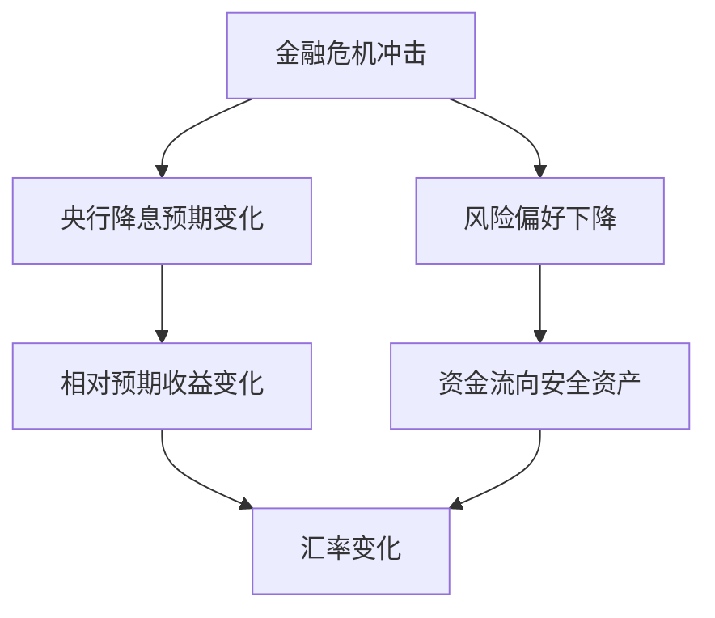

# 18.7 汇率变动对经济和金融市场的影响

来源：

- 主线：Mishkin《货币金融学》Ch.18
- 补充：Mishkin/Eakins Ch.15；Mankiw Ch.32

## 汇率为什么不是“越强越好”或“越弱越好”

学完汇率决定以后，还要回到一个更现实的问题：汇率变化到底会怎样影响经济和金融市场？

日常讨论里，人们很容易把强货币和弱货币看成好坏判断。货币升值似乎代表经济强，货币贬值似乎代表经济弱。但经济学分析不能停在这种直觉上。汇率是价格，价格变化总是同时改变不同人的收益和成本。本币升值会让进口商品和海外旅行更便宜，却会削弱出口商竞争力；本币贬值会帮助出口商和进口替代行业，却会提高进口品价格并压缩消费者购买力。

因此，评价汇率变化时，要问它通过哪些渠道影响经济，而不是先判断它“好”或“坏”。本节把这些渠道整理起来：商品贸易、通胀、总需求、金融资产、资产负债表、预期和政策。

## 对商品贸易的影响：实际汇率决定净出口压力

汇率影响经济最直接的渠道是商品和服务贸易。若本币升值，外国商品对本国居民更便宜，本国商品对外国居民更昂贵。本国进口倾向上升，出口竞争力下降，净出口倾向于减少。若本币贬值，外国商品对本国居民更贵，本国商品对外国居民更便宜，出口倾向上升，进口倾向下降，净出口倾向于增加。

不过，真正决定贸易竞争力的是实际汇率，而不只是名义汇率。实际汇率结合了名义汇率和两国价格水平。如果本币名义贬值，但本国通胀很高，本国商品价格也快速上涨，贬值带来的竞争力改善可能被通胀抵消。若本币名义升值，但本国生产率提高、成本下降，出口竞争力未必严重恶化。

开放经济宏观中，净出口进入 GDP 支出法：

```text
Y = C + I + G + NX
```

其中 `NX` 是净出口。汇率通过改变出口和进口影响 `NX`，进而影响总需求。


反过来：


这个机制解释了为什么出口导向行业通常不喜欢本币快速升值，而依赖进口原材料或进口消费品的行业可能受益于本币升值。

## 对通胀的影响：进口价格和成本渠道

汇率还会影响通胀。本币贬值时，进口商品以本币计价变贵。如果居民消费篮子中有大量进口商品，CPI 会受到直接推升。如果企业使用进口能源、粮食、半导体、机械设备或其他中间品，生产成本也会上升，成本上升可能进一步传导到最终商品价格。

本币升值则相反。进口消费品更便宜，进口原材料成本下降，通胀压力减轻。对于依赖进口能源和食品的国家，升值有时能明显缓解输入性通胀。

可以把汇率对通胀的影响分成两层：

| 渠道 | 本币贬值的影响 | 本币升值的影响 |
| --- | --- | --- |
| 进口消费品价格 | 本币价格上升，直接推高 CPI | 本币价格下降，压低 CPI |
| 进口中间品和能源 | 企业成本上升，可能推高最终价格 | 企业成本下降，缓解成本压力 |
| 通胀预期 | 若贬值持续，可能提高未来通胀预期 | 若升值持续，可能压低通胀预期 |

这与 AD-AS 框架相连。贬值一方面可能通过净出口提高总需求，另一方面可能通过进口成本提高短期总供给曲线中的成本压力。升值一方面可能压低净出口，另一方面可能降低进口成本和通胀压力。央行面对汇率变化时，必须判断哪条渠道更强。

## 对金融资产和资产负债表的影响

汇率也是金融资产价格。银行、企业、基金和家庭如果持有外币资产或外币负债，汇率变化会改变资产负债表。

假设一家本国企业借了美元债务，但收入主要是本币。本币贬值后，每 1 美元债务需要用更多本币偿还，企业实际债务负担上升，资产负债表恶化。若企业外币收入不足以覆盖美元债务，贬值可能引发财务压力。相反，如果一家企业拥有大量美元收入或美元资产，本币贬值会提高这些外币收入和资产的本币价值。

金融机构也会受到影响。国际银行持有多种货币资产和负债，汇率变化会影响资本充足率、风险敞口和利润。基金经理如果预期欧元升值、日元贬值，可能减少日元资产、增加欧元资产；外汇交易部门也可能根据汇率预测买卖货币。问题在于，汇率预测并不容易，预测错误会造成损失。

| 主体 | 本币贬值可能带来的影响 | 本币升值可能带来的影响 |
| --- | --- | --- |
| 出口企业 | 外币收入换成本币更多，竞争力改善 | 外币收入换成本币更少，竞争力下降 |
| 进口企业 | 进口成本上升 | 进口成本下降 |
| 外币债务企业 | 本币偿债负担上升 | 本币偿债负担下降 |
| 外币资产持有者 | 外币资产本币价值上升 | 外币资产本币价值下降 |
| 消费者 | 进口品和海外消费更贵 | 进口品和海外消费更便宜 |

这说明，汇率变化会重新分配收入和风险。宏观上看，汇率影响总需求和通胀；微观上看，它改变企业利润、家庭购买力和金融机构资产负债表。

## 金融危机中的汇率：利率、避险和预期

短期资产市场分析可以解释金融危机中的汇率变化。全球金融危机早期，美国经济受到冲击更明显，美联储大幅降息以抵消经济收缩，而欧洲央行起初降息较慢。当美元资产相对收益下降时，美元资产需求下降，美元贬值。

但危机扩散后，情况发生变化。欧洲和其他地区也受到严重影响，市场预期外国央行也会降息，外国资产相对收益下降。同时，在危机最紧张阶段，投资者追求安全资产，大量资金流向美国国债。美元资产需求上升，美元反而升值。

这个案例说明，同一场危机中，汇率方向可能分阶段变化。早期看利率差，美元可能贬值；后期看全球避险需求和安全资产需求，美元可能升值。外汇市场不是只对一个变量反应，而是同时吸收利率、风险、预期和资产安全性的变化。



这也和第 13 章金融危机机制相连。危机中，不确定性上升、资产价格波动、信用收缩和流动性需求会共同影响资本流动。外汇市场会把这些压力快速反映到汇率中。

## Brexit 为什么能让英镑一天内大幅下跌

英国脱欧公投提供了另一个典型例子。公投结果意味着英国未来可能失去欧盟单一市场的部分便利，尤其是金融服务等重要行业可能面对更高贸易壁垒。市场因此预期未来英国商品和服务出口需求下降，英镑未来价值降低。

在资产市场框架中，预期未来英镑价值下降，会降低英镑资产相对预期收益。投资者在每一个当前汇率下都更不愿意持有英镑资产，英镑资产需求曲线左移，英镑立即贬值。公投结果公布后，英镑对美元在一天内明显下跌，正是预期未来贸易条件和资产收益变化迅速进入当前汇率的结果。

这个例子有两个学习重点。

第一，汇率会提前反映未来预期。英国并不是在公投第二天就完成所有贸易制度改变，但市场已经把未来可能的贸易壁垒和出口需求下降计入英镑资产价格。

第二，长期因素可以通过预期影响短期汇率。贸易壁垒本来是长期汇率因素，但一旦市场预期未来贸易壁垒上升，短期汇率会立即调整。

## 名义利率上升不一定让本币升值

金融新闻常说“某国利率上升，货币走强”。这在某些情况下成立，但不是无条件成立。必须区分名义利率上升的来源。

根据费雪方程：

```text
名义利率 = 实际利率 + 预期通胀
```

如果名义利率上升是因为实际利率上升，而预期通胀不变，本币资产真实回报提高，投资者更愿意持有本币资产，本币倾向于升值。

如果名义利率上升是因为预期通胀上升，结论可能相反。更高预期通胀意味着未来本币购买力下降，本币未来可能贬值。若这种未来贬值预期超过名义利率上升带来的收益，本币资产相对预期收益反而下降，本币可能贬值。

| 名义利率上升原因 | 对本币资产相对收益的含义 | 汇率倾向 |
| --- | --- | --- |
| 实际利率上升 | 真实回报提高 | 本币升值 |
| 预期通胀上升 | 未来货币购买力下降，预期贬值增强 | 本币贬值 |

这个区分把汇率分析和前面宏观课程紧密连接起来。名义变量不能直接解释真实决策。就像名义利率要拆成实际利率和预期通胀，名义汇率也要结合价格水平看实际汇率。开放经济中的金融市场会同时关注实际回报和通胀预期。

## 对货币政策的含义

汇率变化会影响央行的政策环境。若本币大幅贬值，净出口可能改善，但进口价格上升会带来通胀压力，外币债务负担也可能上升。央行如果加息支持本币，可能抑制通胀和资本外流，但也会压低投资和消费，拖累产出。若本币大幅升值，通胀压力可能下降，但出口和总需求可能走弱，央行可能担心经济过冷。

这就是开放经济政策取舍。封闭经济中，央行主要通过利率影响消费和投资；开放经济中，利率还会影响汇率，汇率再影响净出口和进口价格。政策效果因此更复杂。


这条链条也说明，汇率不是央行可以完全忽视的变量。即使央行采用通胀目标制，汇率仍会通过进口价格影响通胀；即使央行关注就业和产出，汇率仍会通过净出口影响总需求。汇率在开放经济中是货币政策传导机制的一部分。

## 本章的完整逻辑

本章从外汇市场是什么开始，逐步建立了汇率分析的两个层次。

长期中，汇率受相对价格水平、贸易壁垒、进出口需求和生产率影响。这些因素主要通过本国商品相对外国商品的需求发挥作用。购买力平价提供长期基准：高通胀国家的货币长期有贬值压力。

短期中，汇率是资产价格。投资者比较本币资产和外币资产的相对预期收益。利率、预期未来汇率、风险和长期因素的预期变化，都会迅速进入当前汇率。资本流动使汇率对消息高度敏感。

最后，汇率变动会反过来影响宏观经济：它影响净出口、通胀、资产负债表、金融市场风险和货币政策传导。开放经济中的汇率不是边缘变量，而是连接商品市场、资产市场和宏观政策的核心价格。

## 小结

汇率变动会通过多条渠道影响经济和金融市场。本币贬值通常改善出口价格竞争力、抑制进口、提高净出口，但也会推高进口价格、增加通胀压力，并提高外币债务的本币负担。本币升值通常降低进口价格和通胀压力，但会削弱出口竞争力和净出口。

金融市场中，汇率变化会改变外币资产和外币负债的本币价值。危机和重大政治事件会通过利率预期、风险偏好和未来贸易条件预期迅速影响汇率。名义利率变化的汇率影响取决于它来自实际利率还是预期通胀。

把本章放回宏观框架，汇率影响 `NX`，`NX` 进入总需求；汇率影响进口价格，进口价格进入通胀；汇率影响资本流动，资本流动改变金融条件。开放经济中的货币政策必须理解这些连接。

## 自测问题

- 为什么不能简单说本币升值一定好，或本币贬值一定坏？
- 本币贬值怎样同时影响净出口和通胀？
- 外币债务企业为什么害怕本币大幅贬值？
- 为什么金融危机中汇率可能先贬值、后因避险需求升值？
- 名义利率上升在什么情况下会使本币升值？在什么情况下反而可能使本币贬值？
