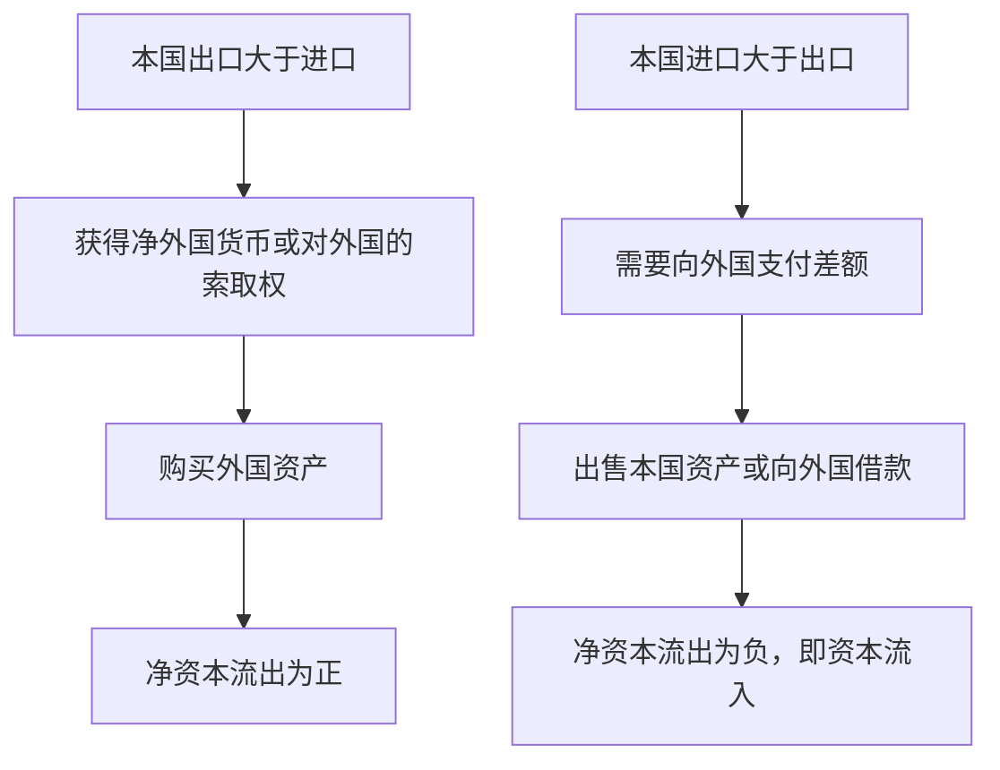
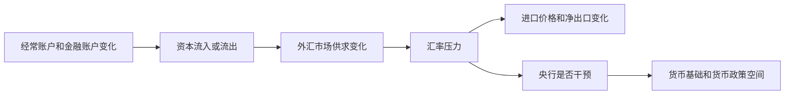

# 19.1 国际收支与资本流动

来源：

- 主线：Mishkin《货币金融学》Ch.19
- 补充：Mishkin/Eakins Ch.16；Mankiw Ch.32, Ch.33
- 延伸：Bodie/Kane/Marcus《Investments》Ch.23, Ch.24

## 为什么学习国际金融体系要先看“账本”

上一章解释了外汇市场：汇率如何决定，为什么利率、预期和长期贸易因素会影响货币价值。进入国际金融体系以后，问题变得更制度化：一个国家采用固定汇率还是浮动汇率？央行能不能同时稳定汇率和独立制定货币政策？资本能不能自由进出？IMF 为什么会在危机中出现？

这些问题的起点是国际收支。国际收支不是一个政策口号，而是一套账本。它记录一个国家的居民、企业、金融机构和政府与外国之间发生的交易。商品出口、服务进口、海外投资收益、侨汇、购买外国股票、外国人购买本国债券、央行买卖外汇储备，都会进入这套账本。

为什么要从账本开始？因为开放经济中的每一笔跨境交易都有两面：一面是商品、服务或资产的流动，另一面是资金或金融索取权的流动。一个国家如果购买的外国商品多于卖给外国的商品，就必须用某种方式付款；如果一个国家经常从外国借钱，就会在未来面对还本付息或资产收益流出的压力。国际收支把这些关系系统地记录下来。

国际收支也是货币政策的基础信息。央行干预外汇市场会改变外汇储备和本国货币基础；资本流入会影响金融条件和汇率；经常账户赤字需要融资，融资条件变化会影响汇率和危机风险。因此，理解国际金融体系前，必须先能读懂国际收支账户。

## 经常账户：当前商品、服务和收入流动

经常账户记录的是一个国家当期与外国之间不涉及购买或出售金融资产的交易。它主要包括三部分：贸易余额、净投资收入和转移支付。

第一部分是商品和服务贸易余额。出口是本国生产并卖给外国人的商品和服务，进口是外国生产并卖给本国人的商品和服务。出口减进口就是净出口，也常被称为贸易余额。

```text
贸易余额 = 商品和服务出口 - 商品和服务进口
```

如果出口大于进口，国家有贸易顺差；如果进口大于出口，国家有贸易逆差。比如，一个国家出口汽车、软件、旅游服务和教育服务，同时进口能源、消费品和设备。把所有商品和服务的出口价值加总，再减去所有进口价值，就得到贸易余额。

第二部分是净投资收入。居民和企业持有外国资产会获得利息、股息和利润；外国人持有本国资产也会获得利息、股息和利润。二者相减，就是净投资收入。一个国家即使贸易余额为正，如果过去大量向外国借债或让外国人持有本国资产，也可能支付很多投资收入给外国，使净投资收入为负。

第三部分是转移支付。转移支付是不直接交换商品、服务或资产的资金流动，包括侨汇、养老金、政府援助等。海外工人把收入汇给家人，政府向外国提供援助，居民向海外亲属转账，都属于这一类。

因此，经常账户余额可以写成：

```text
经常账户余额 = 贸易余额 + 净投资收入 + 转移支付
```

可以用表格整理：

| 项目 | 记录内容 | 例子 |
| --- | --- | --- |
| 贸易余额 | 商品和服务出口减进口 | 出口软件、进口石油、外国游客消费 |
| 净投资收入 | 从外国资产收到的收入减支付给外国资产持有者的收入 | 海外债券利息、跨国公司利润汇回、外资股息 |
| 转移支付 | 不对应商品、服务或资产交易的单向资金流 | 侨汇、养老金、外国援助 |

经常账户余额告诉我们，一个国家在当期商品、服务和收入流动上是净收款还是净付款。经常账户顺差意味着该国从外国收到的当前收入多于付给外国的当前支出；经常账户逆差意味着该国当前对外国付款多于从外国收款。

## 经常账户逆差必须被融资

经常账户逆差本身不是一个神秘现象。它的含义是，一个国家当期向外国支付的钱超过从外国收到的钱。既然支出超过收入，差额就必须以某种方式融资。

一个家庭如果支出超过收入，可能动用储蓄、出售资产或借钱。国家整体也类似。经常账户逆差意味着本国需要通过出售资产给外国人、向外国人借款，或者减少本国持有的外国资产来融资。换句话说，经常账户逆差通常对应资本流入：外国人增加对本国资产的持有，或者本国人减少对外国资产的持有。

经常账户顺差则相反。一个国家卖给外国的商品、服务和收入索取权超过它从外国购买的部分，它会积累对外国的金融索取权。它可以购买外国债券、股票、企业、房地产，也可以增加外汇储备。顺差国家本质上是在把一部分当期收入借给外国或投资到外国。

这就是国际收支账本的基本思想：经常账户不是孤立的，它必须和金融账户对应。

## 金融账户：资产买卖和资本流动

金融账户记录涉及购买和出售金融资产的国际交易。国内居民购买外国资产，或者外国居民购买本国资产，都会进入金融账户。

可以先从两个方向理解：

| 交易 | 资本流动方向 | 含义 |
| --- | --- | --- |
| 本国居民购买外国股票、债券、存款或企业 | 资本流出 | 本国居民增加对外国资产的持有 |
| 外国居民购买本国股票、债券、存款或企业 | 资本流入 | 外国居民增加对本国资产的持有 |

如果外国人增加持有本国资产的规模超过本国人增加持有外国资产的规模，本国就是净资本流入。它相当于本国对外国负债增加，或外国对本国资产索取权增加。反过来，如果本国居民购买外国资产超过外国人购买本国资产，本国就是净资本流出。

金融账户可以包括直接投资和证券投资。直接投资通常意味着投资者在外国企业中拥有较强控制权，例如跨国公司在外国建厂或收购企业。证券投资则更偏向被动持有金融资产，例如购买外国公司股票或外国政府债券。两者都是跨境资本流动，只是控制程度不同。

这与前面学习金融体系时的“储蓄转化为投资”相连。在封闭经济中，一国储蓄只能为本国投资提供资金；在开放经济中，本国储蓄可以购买外国资产，外国储蓄也可以为本国投资提供资金。金融账户记录的正是这种跨境资金配置。

## 净出口等于净资本流出

开放经济中有一个重要会计恒等式：

```text
NX = NCO
```

`NX` 是净出口，`NCO` 是净资本流出。净资本流出等于本国居民购买外国资产减去外国居民购买本国资产。

这个等式不是经济理论假设，而是会计恒等式。每一笔交易都会同时影响商品服务流动和资本流动，因此从整个经济看，净出口必须等于净资本流出。

用一个软件出口例子理解。一个美国程序员把软件卖给日本消费者，收到 10,000 日元。这笔交易使美国出口增加，净出口上升。接下来这 10,000 日元会怎样？

第一种可能，程序员直接持有日元。这相当于美国居民持有日本货币资产，美国净资本流出增加。

第二种可能，程序员用日元购买日本股票或债券。这也是美国居民购买外国资产，净资本流出增加。

第三种可能，程序员用日元购买日本电视。这样美国进口增加，与前面的软件出口抵消，净出口回到原来水平；同时美国居民没有净增加外国资产，净资本流出也没有增加。

第四种可能，程序员把日元卖给银行换美元。银行拿到日元后仍然必须处理：购买日本资产、购买日本商品，或卖给另一个需要日元的人。无论经过多少中间环节，最终净出口和净资本流出都会对应起来。

同样，如果美国从中国进口服装，中国收到美元。中国可以购买美国国债，这意味着外国人购买美国资产，美国净资本流出下降；也可以购买美国飞机，使美国出口增加，抵消进口。无论具体路径如何，商品流和资本流是一枚硬币的两面。



## 储蓄、投资和国际资本流动

前面宏观经济学已经学习过 GDP 支出恒等式：

```text
Y = C + I + G + NX
```

把消费 `C` 和政府购买 `G` 移到左边：

```text
Y - C - G = I + NX
```

`Y - C - G` 是国民储蓄 `S`，所以：

```text
S = I + NX
```

又因为 `NX = NCO`，可以得到：

```text
S = I + NCO
```

这条恒等式非常重要。它说明一国储蓄有两个用途：一是为本国国内投资融资，二是购买外国资产形成净资本流出。在封闭经济中，`NCO = 0`，所以 `S = I`；在开放经济中，储蓄可以流向国外，投资也可以由外国储蓄融资。

不同贸易状态可以这样理解：

| 状态 | 净出口 | 储蓄与投资关系 | 资本流动 |
| --- | --- | --- | --- |
| 贸易顺差 | `NX > 0` | `S > I` | 净资本流出为正，本国购买外国资产 |
| 贸易平衡 | `NX = 0` | `S = I` | 净资本流出为零 |
| 贸易逆差 | `NX < 0` | `S < I` | 净资本流出为负，外国资本流入 |

这能澄清一个常见误解：贸易逆差不只是“进口太多”，它也意味着本国投资超过本国储蓄，需要外国资金补足。贸易顺差也不只是“出口强”，它意味着本国储蓄超过本国投资，剩余储蓄流向国外。

## 经常账户赤字一定坏吗

经常账户赤字意味着一个国家当前对外付款超过收款，需要通过资本流入融资。这可能带来风险，但不能机械地说一定坏。

如果一个国家因为国内投资机会很多，吸引外国资本流入，用这些资本建设工厂、基础设施和生产能力，那么经常账户赤字可能伴随未来产出提高。外国资本帮助本国弥补储蓄不足，支持长期增长。

但如果经常账户赤字来自消费过度、政府预算长期失衡或缺乏生产性投资，未来就可能形成偿付压力。外国人持有本国资产越多，本国未来支付给外国的利息、股息和利润可能越多。若投资者突然怀疑本国偿付能力，资本流入停止甚至逆转，汇率和金融体系会承受压力。

所以，经常账户赤字的含义取决于融资用途和可持续性：

| 赤字来源 | 可能含义 |
| --- | --- |
| 高生产性投资、资本形成 | 可能支持未来增长 |
| 政府预算赤字、低储蓄 | 可能增加未来债务负担 |
| 消费繁荣、资产泡沫 | 可能积累外部脆弱性 |
| 临时进口价格冲击 | 可能是短期收入转移和通胀压力 |

经常账户顺差也不一定总是好。顺差意味着本国储蓄流向国外，如果国内有高回报投资机会却长期没有投资，可能反映国内需求不足或金融体系配置效率问题。国际收支数字本身不直接给出福利判断，关键要看背后的储蓄、投资、生产率和风险。

## 国际收支如何连接汇率和货币政策

国际收支账户把外汇市场和宏观政策连起来。经常账户赤字需要资本流入融资。如果资本流入稳定，赤字可以持续一段时间；如果投资者信心下降，资本流入减少，外汇需求和供给会变化，本币可能贬值。贬值会影响进口价格、通胀、净出口和资产负债表。

资本流动还会影响货币政策。资本大量流入时，本币升值压力上升，央行如果希望稳定汇率，可能需要买入外汇、卖出本币，这会扩大货币基础；资本流出时，本币贬值压力上升，央行可能卖出外汇储备、买入本币，这会收缩货币基础。下一节开始讨论固定汇率、外汇干预和冲销操作时，这些机制会成为核心。

用一条链条概括：



这就是为什么国际收支不是单纯统计。它帮助我们看清一国开放经济中的资金来源、资金用途、外部融资压力和政策约束。

从投资组合角度看，国际收支还能帮助判断跨境资本流动的性质。经常账户赤字如果由长期直接投资和股权资本融资，意味着外国投资者更多承担经营风险，并且资金通常更不容易突然撤离；如果主要由短期外债、银行同业资金和投机性证券资金融资，一旦全球风险偏好下降或本国信用受疑，资本流入可能迅速停止甚至逆转。对债券、股票和外汇投资者来说，重点不只是赤字规模，还包括外部融资缺口、外汇储备、资本流动期限结构和资金用途。

## 小结

国际收支是记录一国与外国之间交易的账本。经常账户记录商品、服务、投资收入和转移支付等当前交易；金融账户记录资产买卖和资本流动。经常账户逆差意味着当前对外付款超过收款，需要资本流入或出售资产融资；经常账户顺差意味着本国积累对外国的金融索取权。

开放经济中，净出口等于净资本流出：`NX = NCO`。这是一条会计恒等式，因为每笔国际交易都会同时影响商品服务流动和金融资产流动。进一步结合 GDP 支出恒等式，可以得到 `S = I + NCO`。一国储蓄要么用于国内投资，要么用于购买外国资产；如果国内投资超过储蓄，就需要外国资本流入。

经常账户赤字或顺差本身不能简单判断好坏。关键要看赤字如何融资、资金用于生产性投资还是消费，顺差是否反映高储蓄和有效对外投资，还是国内需求和投资不足。国际收支为后面理解固定汇率、资本管制、危机和 IMF 角色提供基础。

## 自测问题

- 国际收支为什么是理解国际金融体系的起点？
- 经常账户由哪几项组成？贸易余额和经常账户余额有什么区别？
- 为什么经常账户逆差必须被融资？
- 用自己的话解释 `NX = NCO` 为什么一定成立。
- `S = I + NCO` 说明开放经济中的储蓄有哪两个用途？
- 为什么同样的经常账户赤字，由长期直接投资融资和由短期外债融资，风险含义不同？
