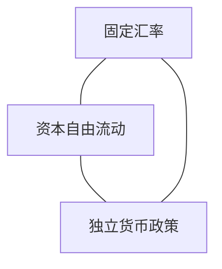
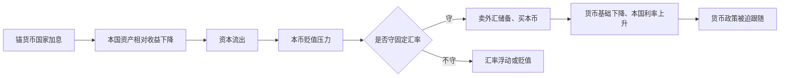

# 19.4 三元悖论、货币主权与资本管制

来源：

- 主线：Mishkin《货币金融学》Ch.19
- 补充：Mishkin/Eakins Ch.16；Mankiw Ch.32, Ch.33
- 延伸：Bodie/Kane/Marcus《Investments》Ch.23, Ch.24

## 为什么汇率制度会限制货币政策

上一节讲外汇干预时已经看到，固定汇率不是免费的。央行如果承诺把本币固定在某个平价，就必须在市场有贬值压力时买入本币、卖出外汇储备；在市场有升值压力时卖出本币、买入外汇储备。这些操作会影响货币基础、货币供给和利率。

问题在于，利率本来也是货币政策的核心工具。前面宏观章节反复强调，央行通过利率影响消费、投资、总需求、通胀和就业。如果央行为了守汇率不得不改变利率，它就不能完全按国内宏观需要来设定利率。

这就是国际金融体系的核心约束：一个国家不能同时拥有固定汇率、资本自由流动和独立货币政策。这个结果叫政策三元悖论，也叫不可能三角。

## 三个目标分别是什么

三元悖论中的三个目标是：

第一，资本自由流动。国内居民可以自由购买外国资产，外国居民也可以自由购买本国资产。资本可以根据利率、风险和预期收益跨境流动。

第二，固定汇率。央行承诺把本币对某种锚货币维持在固定水平，或者至少维持在非常狭窄的区间内。

第三，独立货币政策。央行可以根据本国通胀、失业、产出缺口和金融稳定状况自主设定利率和货币供给，而不必被外国央行或汇率目标牵着走。

这三个目标单独看都很有吸引力。资本自由流动有助于资金流向高回报用途；固定汇率降低贸易和投资中的汇率不确定性；独立货币政策可以稳定国内经济。但三者放在一起会冲突。

三角形的含义是：一个国家最多只能选择其中两边，不能同时占有三个角。

## 为什么三者不能同时成立

假设一个小国把本币固定在一个大国货币上，同时允许资本自由流动。现在大国央行为了抑制通胀提高利率。大国资产收益上升，小国资产相对吸引力下降。资本会从小国流向大国，小国本币面临贬值压力。

如果小国坚持固定汇率，就必须卖出锚货币储备、买入本币，防止本币贬值。这个操作会收缩小国货币基础，提高小国利率。小国利率上升后，本币资产相对收益恢复，固定汇率才可能维持。

但注意，这时小国利率上升不是因为小国国内经济需要紧缩，而是因为大国加息和固定汇率约束迫使它加息。小国失去了独立货币政策。

如果小国试图冲销干预，也就是卖出外汇储备、买入本币后，再通过公开市场买入本国债券把货币基础补回来，那么本国利率不会上升。本币资产相对收益仍然不足，资本继续流出，央行继续损失外汇储备。只要资本自由流动，冲销无法长期维持被压力冲击的固定汇率。储备用完后，小国最终必须贬值或放弃固定汇率。

这条逻辑可以画成：

因此，在资本自由流动和固定汇率同时存在时，货币政策必须服务于汇率稳定，不能完全独立。

## 三种可选组合

三元悖论不是说国家没有选择，而是说只能在三种组合中选择一种。

| 选择 | 保留什么 | 放弃什么 | 典型含义 |
| --- | --- | --- | --- |
| 选项 1 | 资本自由流动 + 独立货币政策 | 固定汇率 | 接受浮动汇率，如美国、欧元区整体 |
| 选项 2 | 资本自由流动 + 固定汇率 | 独立货币政策 | 利率跟随锚货币，如香港联系汇率制度 |
| 选项 3 | 固定汇率 + 独立货币政策 | 资本自由流动 | 使用资本管制，如一些实行管制的经济体 |

选项 1 的国家允许资本自由流动，并让央行根据国内目标设定利率。由于利率不必跟随锚货币，汇率就必须浮动。当资本流入增加，本币升值；资本流出增加，本币贬值。汇率吸收国际金融冲击。

选项 2 的国家维持固定汇率并允许资本自由流动。为了防止套利和资本流动冲击固定汇率，本国利率必须跟随锚货币利率。本国央行放弃大部分独立货币政策。香港联系汇率制度常被用来说明这种组合。

选项 3 的国家希望维持固定汇率，同时又希望保留一定货币政策自主性。为了防止资本自由流动破坏这两个目标，必须限制资本跨境流动。资本管制就成为这一组合的制度条件。

## 货币主权到底指什么

货币主权不是简单地说“一个国家有自己的货币”。如果一个国家虽然发行自己的货币，但把汇率固定在另一种货币上，并且资本可以自由流动，那么它的利率和货币供给会受到锚货币国家政策的强烈约束。它形式上有自己的货币，实质上货币政策空间有限。

真正的货币政策自主性，是央行能够根据本国宏观状况调整利率和货币供给。例如，当本国经济衰退、失业上升、通胀压力较低时，央行可以降息刺激总需求；当本国通胀过高时，央行可以加息抑制需求。固定汇率和资本自由流动会削弱这种能力。

这与第 16 章货币政策战略直接相连。通胀目标制、泰勒规则、央行沟通、政策可信度，都假设央行有能力使用利率工具。如果一个国家选择固定汇率并开放资本账户，央行利率可能必须跟随锚货币国家，那么通胀目标和产出稳定就要服从汇率目标。

因此，汇率制度是货币政策框架的一部分，而不是外汇市场的边缘技术安排。

## 中国外汇储备的例子

中国曾长期把人民币对美元维持在较稳定水平。随着生产率快速增长、通胀相对较低，人民币长期均衡价值上升，市场对人民币资产需求增加。按照外汇市场模型，人民币会有升值压力。

如果央行不干预，人民币会升值。为了防止人民币快速升值，央行需要卖出人民币、买入美元资产。这样，外汇储备增加。长期、大规模干预会使央行积累大量美元资产，特别是美国政府债券。

这个过程体现了固定或准固定汇率下的基本机制：当本币被低估、有升值压力时，央行买入外汇资产、卖出本币，国际储备上升。中国在 2014 年前积累了巨额外汇储备，正是这种机制的结果。

同时，这个例子也体现三元悖论。为了在一定程度上维持汇率目标并保留货币政策空间，资本流动必须受到某些限制。若资本完全自由流动，央行要同时维持汇率和独立货币政策会困难得多。即便存在管制，大规模外汇干预仍可能带来货币供给增长和通胀压力，因此后来汇率安排逐步更灵活。

## 资本管制：为什么有吸引力

资本管制是限制资本跨境自由流动的政策。它可以限制居民把资金转移到国外，也可以限制外国资金进入本国金融市场。

对新兴市场国家来说，资本管制有吸引力，是因为资本流动可能很不稳定。大量资本流入可能推高信贷、资产价格和银行风险；突然资本流出又可能导致汇率贬值、外债负担上升和金融危机。如果限制资本流动，政府似乎可以减少这些波动，并在固定汇率和货币政策自主性之间保留更多空间。

资本流出管制尤其常在危机时被讨论。当居民和外国投资者同时把资金撤出一国，本币会面临剧烈贬值压力。政府可能希望通过限制资金流出，避免汇率崩溃和银行体系失稳。

资本流入管制则用于防止短期投机资金大量涌入。支持者认为，如果投机性资本进不来，就不会在情绪逆转时突然撤出，从而减少危机风险。前面金融危机章节已经讲过，资本流入可能助长信贷繁荣和银行过度冒险，这为资本流入管制提供了一定理由。

## 资本管制的问题

资本管制也有明显代价。

对资本流出管制来说，第一，危机中往往效果有限。私人部门可能通过贸易发票、地下渠道、复杂金融工具或其他方式绕过管制。第二，管制可能削弱信心。投资者看到政府限制资金流出，可能更担心未来政策和偿付能力，反而加剧资本外逃动机。第三，管制容易滋生腐败，因为获得批准或规避限制可能需要行政权力。第四，管制可能让政府推迟金融体系改革，以为限制流出就能解决根本问题。

对资本流入管制来说，问题是它可能挡住本可用于生产性投资的资金。外国资本并不总是投机性资金，也可能为基础设施、企业扩张和技术引进提供融资。如果一刀切限制流入，可能降低投资效率。随着贸易开放和金融工具复杂化，资本管制也越来越容易被绕开，长期会造成资源错配。

| 管制类型 | 可能优点 | 主要问题 |
| --- | --- | --- |
| 资本流出管制 | 危机时试图减缓资本外逃和汇率崩溃 | 容易被规避，削弱信心，滋生腐败，延误改革 |
| 资本流入管制 | 降低短期资本涌入、信贷繁荣和突然逆转风险 | 可能阻挡生产性投资，造成资源错配，执行困难 |

因此，教材对资本流出管制较为怀疑，对资本流入管制则承认有一定理由但强调代价。更根本的办法通常是改善银行监管和金融监管，限制银行过快扩张和过度冒险，而不是只限制资本流动的表面症状。

## 与宏观稳定的连接

三元悖论把开放经济宏观的几条主线合在一起。

第一，固定汇率影响总需求和通胀。为了守汇率，央行可能被迫加息或降息，从而影响消费、投资和净出口。

第二，资本自由流动影响国内金融条件。资本流入会压低融资成本、推高资产价格，也可能引发信贷繁荣；资本流出会推高利率、压低汇率，并可能触发金融危机。

第三，独立货币政策关系到央行能否稳定产出和价格。若货币政策被锚货币国家牵引，本国经济周期和锚货币国家不一致时，政策会很难合适。

因此，汇率制度选择不是“固定更稳”或“浮动更自由”这么简单。它取决于一个国家更重视哪种稳定：汇率稳定、资本自由配置，还是国内货币政策自主。

三元悖论对资产配置的含义是，制度选择本身就是风险因子。资本自由且汇率固定时，国内利率、债券估值和银行融资成本更容易受外部货币周期约束；资本管制可以减少短期资本外流冲击，但也会带来流动性折价、退出风险和政策不确定性；浮动汇率则把一部分宏观调整放到汇率和外币收益波动上。投资者不能只看一个国家的增长率和利率，还要看资本账户、汇率制度和央行目标是否相互一致。

## 小结

三元悖论说明，一个国家不能同时实现资本自由流动、固定汇率和独立货币政策。若资本自由流动且汇率固定，本国利率必须跟随锚货币国家，货币政策独立性下降。若要保留货币政策独立性和资本自由流动，就必须接受汇率浮动。若要固定汇率并保持一定货币政策自主性，就必须限制资本流动。

货币主权不只是拥有本国货币，还包括央行能否根据本国通胀、失业和产出状况自主调整政策。固定汇率和自由资本流动会削弱这种能力。资本管制可以在一定程度上放松约束，但会带来规避、腐败、资源错配和信心问题。

三元悖论是理解后面货币联盟、货币局、美元化、投机攻击和 IMF 角色的基础。很多国际金融危机，本质上都是国家试图维持某种不稳定的三角组合，直到市场压力迫使其调整。

## 自测问题

- 三元悖论中的三个目标分别是什么？
- 为什么固定汇率和资本自由流动会削弱独立货币政策？
- 如果一个国家想保留资本自由流动和独立货币政策，它必须放弃什么？
- 资本流出管制在危机中为什么可能效果有限？
- 为什么改善银行监管可能比简单限制资本流入更能处理金融脆弱性？
- 为什么资本管制可能降低危机时资本外流，却提高资产的流动性折价？
