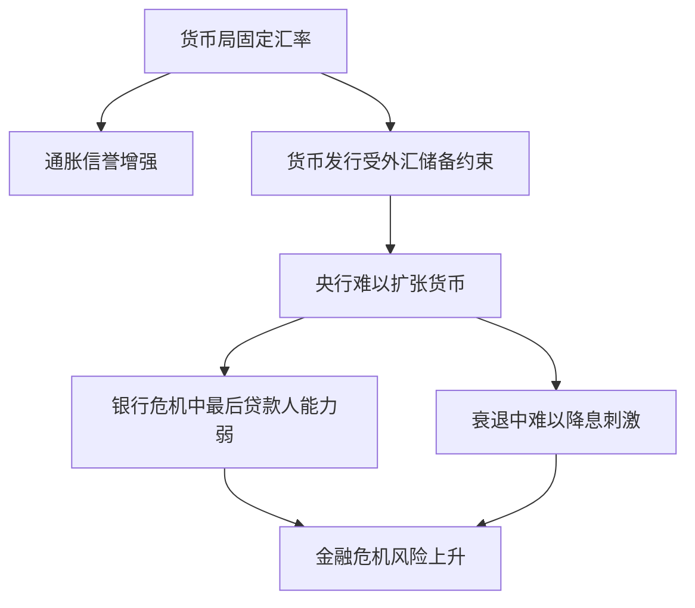

# 19.5 货币联盟、货币局与美元化

来源：

- 主线：Mishkin《货币金融学》Ch.19
- 补充：Mishkin/Eakins Ch.16；Mankiw Ch.32, Ch.33
- 延伸：Bodie/Kane/Marcus《Investments》Ch.23, Ch.24

## 固定汇率承诺可以有多强

固定汇率制度有不同强度。普通固定汇率是央行承诺把本币维持在某个平价，但在压力过大时仍可能贬值、重估或退出。货币联盟、货币局和美元化则是更强的承诺形式。它们共同的目的，是通过放弃一部分甚至全部本国货币政策自主权，换取更稳定的汇率、更低的通胀预期和更强的政策可信度。

但承诺越强，代价也越大。一个国家越是把自己的货币制度绑在外部货币上，就越难用本国货币政策应对本国经济衰退、银行危机和财政压力。这里的核心问题不是“强承诺好不好”，而是这种承诺适合什么经济条件，代价由谁承担。

可以把三种制度看成固定汇率的三个强化版本：

| 制度 | 做法 | 承诺强度 | 主要代价 |
| --- | --- | --- | --- |
| 货币联盟 | 多国使用共同货币 | 很强 | 成员国失去独立货币政策 |
| 货币局 | 本币 100% 由外币储备支持，按固定汇率兑换 | 很强 | 央行创造货币和最后贷款人能力受限 |
| 美元化 | 放弃本币，直接使用外国货币 | 最强 | 完全失去本国货币政策和铸币税收入 |

## 货币联盟：用共同货币固定成员国之间的汇率

货币联盟是指一组国家采用共同货币。采用共同货币以后，成员国之间不再有双边汇率波动，因为它们使用同一种钱。欧元区是现代最重要的例子。1999 年，最初一批欧洲国家采用欧元，后来成员扩展。更早的例子也可以从美国历史中看到：十三个殖民地组成美国后，放弃各自货币，使用美元。

货币联盟的最大经济好处是降低交易成本。成员国之间商品、服务和资产都用同一种货币计价，企业不用频繁换汇，消费者更容易比较价格，跨境贸易和投资更方便。价格透明度提高后，竞争也可能增强。

想象如果美国每个州都有自己的货币，纽约企业卖货到加州要先考虑纽约货币兑加州货币汇率，消费者比较不同州价格也要换算。统一货币消除了这些成本。欧洲采用欧元的经济理由之一，也是希望降低成员国之间的交易摩擦，使市场更一体化。

## 货币联盟的代价：成员国没有自己的货币政策

货币联盟的代价也非常清楚：成员国放弃本国独立货币政策。欧元区成员国不再由本国央行独立决定货币供给和政策利率，而是由欧洲中央银行为整个欧元区制定货币政策。

如果所有成员国经济状况相似，这个代价较小。统一利率可能大体适合所有国家。但如果成员国经济周期不同，问题就会出现。某些国家衰退严重、失业高，需要更低利率和更宽松政策；另一些国家经济较强、通胀压力较大，需要较高利率。共同央行只能制定一套政策，不可能同时完全适合所有成员。

全球金融危机后，欧元区南部国家受到严重冲击，失业上升、政府预算恶化、主权债务压力加剧。对这些国家来说，更宽松的货币政策和本币贬值本可以刺激总需求、改善净出口。但它们使用欧元，不能让自己的货币贬值，也不能单独降息。欧洲中央银行必须考虑整个欧元区，而不是某个受冲击成员国。

这就是货币联盟的“紧身衣”效应。它提高了货币稳定和一体化程度，但也限制了成员国面对本国需求不足时的调整工具。

从 AD-AS 角度看，成员国失去的是通过本国利率和本币汇率影响总需求的能力。衰退国家不能单独降息推动 `C` 和 `I`，也不能通过本币贬值提高 `NX`。调整压力可能转向工资下降、财政紧缩、失业上升或跨国财政转移。

## 货币局：本币由外币储备完全支持

货币局是一种更严格的固定汇率制度。它要求本国货币由外币储备 100% 支持，并承诺公众可以按固定汇率把本币兑换成外币。货币发行机构只有在持有相应外币资产时才发行本币。

假设一个国家实行对美元的货币局，规定 `1 本币 = 1 美元`。如果公众拿 1 单位本币来兑换，货币局必须交出 1 美元；如果公众拿 1 美元来兑换，货币局发行 1 单位本币。因为本币发行受到外汇储备严格约束，政府和央行难以随意印钞融资。

货币局的吸引力在于，它可以帮助一个有高通胀历史或政策信誉不足的国家“借用”锚货币国家的货币纪律。小国如果把本币严格钉住美元、欧元等低通胀货币，并用规则限制本国货币发行，公众可能更相信通胀会下降。

但货币局的代价是央行能力被大幅削弱。央行不能随意创造本币，也就难以在银行危机中充当最后贷款人。若公众恐慌，把本币换成外币，货币基础会收缩，银行准备金减少，利率上升，经济可能急剧收缩。货币局不能像普通央行那样通过扩张货币来缓冲这种冲击。

## 阿根廷货币局的教训

阿根廷曾长期经历高通胀，甚至出现极高通胀率。为结束通胀循环，阿根廷在 1991 年采用货币局制度，把比索和美元按一比一固定兑换。公众可以按固定比率把比索换成美元，也可以把美元换成比索。

早期效果看起来非常成功。通胀大幅下降，经济增长加快。固定汇率和强规则提高了货币政策可信度，帮助打破高通胀预期。

但制度缺陷在冲击中暴露出来。墨西哥比索危机后，市场担心阿根廷经济和银行体系，公众从银行取出资金并把比索换成美元。银行存款下降，银行体系准备金收缩，利率上升，经济活动下滑。由于货币局限制央行创造比索，央行很难作为最后贷款人支持银行体系。

后来阿根廷再次陷入严重衰退，失业高企，政府债务压力上升，银行危机和主权违约爆发。央行在货币局下无法独立扩张货币、降低利率或通过本币贬值刺激经济。2002 年货币局最终崩溃，比索大幅贬值，金融危机和通胀随之出现。

这个案例说明，货币局可以在短期内带来反通胀信誉，但如果经济需要灵活货币政策和最后贷款人支持，货币局会成为严重约束。

## 美元化：放弃本币，直接使用外国货币

美元化是比货币局更极端的制度。一个国家不再发行自己的货币，而是直接采用另一国货币，通常是美元，也可能是欧元或其他稳定货币。巴拿马长期使用美元，厄瓜多尔和萨尔瓦多也采用过美元化。

美元化的优点是，它几乎完全消除了对本币贬值的投机攻击。因为已经没有本国货币可供攻击，不能再出现“卖出本币、买入美元等待本币贬值”的传统固定汇率危机。美元化也可以强力限制本国央行制造通胀，因为本国政府不能随意发行美元。

但美元化的代价比货币局更大。第一，国家完全失去独立货币政策。国内经济衰退时，无法通过本国央行降息和扩张货币；国内银行危机时，也无法由本国央行创造货币作为最后贷款人。第二，国家失去铸币税收入。铸币税是政府发行货币并用其购买有收益资产所获得的收入。放弃本国货币后，这部分收益转移给发行外国货币的国家。

美元化还意味着国内价格和工资调整更重要。因为名义汇率不能调整，若本国竞争力下降，只能通过降低国内成本、提高生产率或接受更高失业来调整。对工资和价格不够灵活的经济体，这种调整会很痛苦。

## 三种制度如何对应三元悖论

货币联盟、货币局和美元化都可以放回三元悖论里理解。

货币联盟内部固定了成员国之间汇率，并通常允许资本自由流动。因此，成员国放弃独立货币政策，把货币政策交给共同央行。

货币局维持非常严格的固定汇率。如果同时允许资本自由流动，本国货币政策必须高度服从锚货币和外汇储备变化。央行很难独立调节利率和货币供给。

美元化直接放弃本币，固定汇率问题被消除，因为本国使用的就是外国货币。但这也意味着货币政策完全由外国央行决定，本国没有货币政策主权。

| 制度 | 固定汇率程度 | 资本流动 | 本国货币政策 |
| --- | --- | --- | --- |
| 货币联盟 | 成员国之间完全固定 | 通常自由 | 成员国放弃，交给共同央行 |
| 货币局 | 对锚货币严格固定 | 若自由流动，则政策受强约束 | 受外汇储备和兑换承诺限制 |
| 美元化 | 直接使用外国货币 | 通常高度开放 | 完全放弃本国货币政策 |

这三种制度的共同点，是用更强制度承诺换取更高货币信誉。它们适合不适合，取决于一国是否愿意为了低通胀和汇率稳定牺牲货币政策工具。

## 与宏观经济的连接

从宏观经济角度看，这些制度都改变了经济面对冲击时的调整方式。

在有独立货币政策和浮动汇率的国家，负面需求冲击可以通过降息、货币扩张和汇率贬值来缓冲。降息刺激消费和投资，贬值改善净出口。

在货币联盟、货币局和美元化下，这些工具受限。经济必须更多依靠财政政策、工资价格调整、劳动力流动、银行体系韧性和外部援助。如果财政空间有限、工资价格粘性强、银行体系脆弱，冲击会更容易表现为失业上升和债务危机。

这就是为什么讨论欧元区、阿根廷货币局和美元化时，不能只看汇率稳定和低通胀，还要看经济是否具有足够的调整机制。货币制度是宏观稳定框架的一部分。

从金融市场角度看，货币联盟、货币局和美元化会改变风险的表现形式。汇率风险下降以后，投资者更关注财政可持续性、银行体系韧性、内部价格调整能力和债务重组风险。成员国或实行强钉住的国家不能靠本币贬值恢复竞争力时，压力会转向工资、失业、财政赤字、银行资产质量和主权债务利差。低汇率风险不等于低信用风险。

## 小结

货币联盟、货币局和美元化都是强化固定汇率承诺的制度。货币联盟让多个国家采用共同货币，降低交易成本并促进贸易，但成员国失去独立货币政策。货币局要求本币由外币储备 100% 支持，并按固定汇率兑换，可以提高反通胀信誉，但会削弱央行最后贷款人能力和宏观稳定能力。美元化直接放弃本币，几乎消除本币贬值投机攻击，但完全失去本国货币政策和铸币税。

这些制度的核心权衡是：更强的货币承诺带来更高的信誉和更低的汇率不确定性，但也减少应对本国经济冲击的政策工具。理解它们，必须放在三元悖论和 AD-AS 宏观稳定框架中。

## 自测问题

- 货币联盟为什么能降低成员国之间的交易成本？
- 欧元区成员国为什么不能单独用货币政策应对本国衰退？
- 货币局为什么能帮助降低高通胀国家的通胀预期？
- 阿根廷货币局为什么在银行危机和衰退中暴露出严重问题？
- 美元化相比货币局有什么更强的优点和更大的代价？
- 为什么加入货币联盟会降低成员国汇率风险，却不一定降低主权信用风险？
