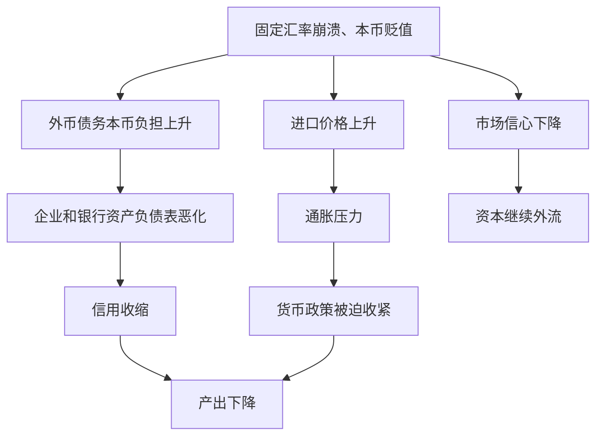

# 19.6 投机攻击与汇率危机

来源：

- 主线：Mishkin《货币金融学》Ch.19
- 补充：Mishkin/Eakins Ch.16；Mankiw Ch.32, Ch.33

## 固定汇率最怕什么

固定汇率制度看起来稳定，但它有一个脆弱点：如果市场相信官方平价无法维持，稳定承诺会迅速变成危机。投资者会卖出被认为将要贬值的货币，买入更强的货币或外汇资产。央行为了维持平价，必须买入本币、卖出外汇储备，并提高本国利率。如果储备不足，或加息代价太大，央行最终可能放弃固定汇率。

这种大量卖出弱货币或大量买入强货币，并导致汇率急剧变化的过程，称为投机攻击。投机攻击不是单个交易者的行为，而是许多投资者基于同一预期进行资产转换的结果。

固定汇率下的危机常被称为国际收支危机，因为央行外汇储备会大幅变化。为了守住本币，央行卖出储备；如果储备不断流失，国际收支账户中的官方储备项目会显著恶化。

## 投机攻击为什么可能自我强化

投机攻击的核心是预期。假设一个国家把本币固定在某个平价，但市场认为这个平价高估了本币。本币未来很可能贬值。投资者如果继续持有本币资产，可能遭受汇率损失；如果现在卖出本币、买入外币，一旦贬值发生，就能避免损失甚至获利。

于是，越来越多投资者卖出本币。本币资产需求下降，本币贬值压力更大。央行必须投入更多外汇储备买入本币，并可能提高利率来吸引投资者继续持有本币资产。但利率越高，对国内经济的伤害越大。市场看到央行守汇率的代价上升，反而更相信固定汇率难以维持，卖出压力进一步增强。

这个循环说明，固定汇率危机并不一定等到储备完全耗尽才发生。只要市场相信央行不愿或不能承担守汇率的代价，攻击就可能提前爆发。

## 1992 年欧洲汇率机制危机的背景

欧洲货币体系中的汇率机制要求成员国货币之间维持在狭窄区间内。英国英镑需要相对德国马克保持在规定范围内。这个制度本质上是固定汇率或准固定汇率安排。

德国统一后，德国面临通胀压力。为了抑制通胀，德国央行提高利率，利率接近较高水平。德国利率上升意味着德国马克资产收益提高。对投资者来说，英镑资产相对马克资产的预期收益下降。英镑需求减少，英镑相对马克出现贬值压力。

为了维持英镑在汇率机制中的下限，英国有两个选择。第一，英格兰银行提高英国利率，增强英镑资产吸引力，把需求曲线推回去。第二，德国央行降低德国利率，减少马克资产吸引力，缓解英镑压力。

但现实中，两边都不愿采取足够行动。德国央行以抗通胀为首要目标，不愿大幅降息。英国当时处于严重衰退中，提高利率会进一步压低总需求，加重失业和经济下滑。于是，汇率承诺与国内宏观目标发生冲突。

## 从利率冲击到预期贬值

德国加息先降低了英镑资产相对预期收益，使英镑需求曲线左移。如果没有干预，英镑均衡汇率会低于固定汇率下限。为了守住平价，英国必须提高利率或持续买入英镑。

关键转折发生在市场意识到：英国不愿为守汇率承受足够高的利率，德国也不愿为了英国汇率放弃抗通胀。也就是说，固定汇率承诺缺乏可信政策支持。投资者开始预期英镑很快会贬值。

预期贬值会进一步降低英镑资产预期收益。即使英镑利率较高，如果未来英镑要贬值，汇率损失会抵消利息收益。于是，英镑资产需求曲线进一步左移，卖出压力急剧扩大。

| 阶段 | 触发因素 | 对英镑资产需求的影响 |
| --- | --- | --- |
| 第一阶段 | 德国利率上升 | 英镑相对收益下降，需求左移 |
| 第二阶段 | 市场预期英国会贬值 | 英镑预期汇率收益下降，需求进一步左移 |
| 第三阶段 | 大量卖出英镑 | 央行需要更大干预和更高利率 |

这正是上一章短期资产市场分析的应用。汇率不是等到政策正式宣布才动，预期未来汇率变化本身就会改变当前资产需求。

## 央行为什么可能守不住

央行面对投机攻击时，可以提高利率和使用外汇储备。但两种工具都有上限。

提高利率会提高本币资产收益，理论上能吸引投资者持有本币。但高利率会压低消费和投资，增加企业融资成本，伤害银行资产质量，并可能加重经济衰退。如果经济本来已经疲弱，央行很难长期维持极高利率。

使用外汇储备也有限。央行买入本币需要卖出外汇资产。储备越少，市场越容易怀疑央行防线无法持续。一旦投资者相信央行迟早耗尽储备，攻击反而更猛烈。

1992 年危机中，英国曾大幅提高利率并进行干预，但仍无法守住英镑。英国最终退出汇率机制，允许英镑相对德国马克贬值。其他欧洲货币也受到攻击，一些国家被迫贬值，央行付出大量干预成本。

这说明，固定汇率的可信度不仅取决于央行“愿不愿意说要守”，还取决于央行是否有足够储备、是否愿意承受高利率代价、国内政治和经济是否支持这种政策。

## 投机者的“一边倒赌注”

在某些固定汇率危机中，投机者面对的是一种不对称收益。若央行守住汇率，汇率可能基本不变；若央行守不住，本币会大幅贬值。只要投机者认为守住的概率不高，卖出本币、买入强货币就像是一种“亏损有限、获利较大”的下注。

以英镑危机为例，如果英镑维持在下限，卖出英镑买入马克的收益有限；但如果英国被迫贬值，马克相对英镑升值，投机者可以获得汇率收益。市场越相信央行政策不可持续，这种交易越有吸引力。

这也解释了为什么投机攻击可能很猛烈。它不是投资者“恶意制造危机”这么简单，而是固定汇率承诺与宏观基本面不一致时，资产收益结构诱导投资者同时行动。固定汇率如果缺乏可信支持，会把汇率调整压力积累起来，最后以危机方式释放。

## 汇率危机与前面金融危机机制的联系

第 13 章讲过金融危机会通过资产价格下跌、不确定性上升、资产负债表恶化和信用收缩放大经济下行。汇率危机也有类似放大机制。

本币突然贬值会提高进口价格，推高通胀；如果企业和银行有外币债务，本币贬值会提高本币偿债负担，资产负债表恶化；利率大幅上升会增加融资成本，压低投资和消费；外汇储备损失会削弱市场信心；银行体系如果持有大量外币错配风险，可能进一步陷入危机。

这就是为什么汇率危机常常和银行危机、债务危机、经济衰退同时出现。汇率不是孤立价格，尤其在有大量外币负债的经济体中，汇率变化会直接改变金融体系偿付能力。

## 宏观政策教训

投机攻击的核心教训是，固定汇率必须和宏观政策一致。一个国家如果通胀长期高于锚货币国家、财政赤字难以控制、银行体系脆弱、外汇储备不足，却仍承诺固定汇率，市场迟早会怀疑这个承诺。

若要维持固定汇率，国家需要接受货币政策约束，保持足够储备，并让财政和金融体系支持这个承诺。若国内宏观目标需要独立货币政策，浮动汇率可能更合适。试图同时守住固定汇率、保持自由资本流动、又不愿让货币政策服从汇率目标，往往会走向危机。

因此，投机攻击不是国际金融中的偶然噪音，而是三元悖论在压力状态下的表现。

## 小结

投机攻击是投资者大量卖出弱货币或买入强货币，导致汇率急剧变化的过程。固定汇率制度如果被市场认为不可持续，就容易遭遇投机攻击。央行为守汇率必须提高利率和消耗外汇储备，但高利率会伤害国内经济，外汇储备也有限。

1992 年欧洲汇率机制危机说明，当德国加息使英镑资产相对收益下降，而英国又不愿为守汇率大幅收紧货币政策时，市场预期英镑将贬值。预期贬值进一步降低英镑资产需求，引发大规模卖出，最终迫使英国退出机制并让英镑贬值。

汇率危机还会通过进口价格、外币债务、银行资产负债表、资本流动和信用收缩影响宏观经济。它与金融危机机制高度相关。

## 自测问题

- 什么是投机攻击？它为什么常发生在固定汇率制度下？
- 为什么预期本币未来贬值会立刻降低本币资产需求？
- 1992 年英镑危机中，德国加息为什么给英镑带来压力？
- 央行为什么不能无限通过加息和卖出外汇储备守住固定汇率？
- 汇率危机如何通过外币债务和银行体系放大为金融危机？
