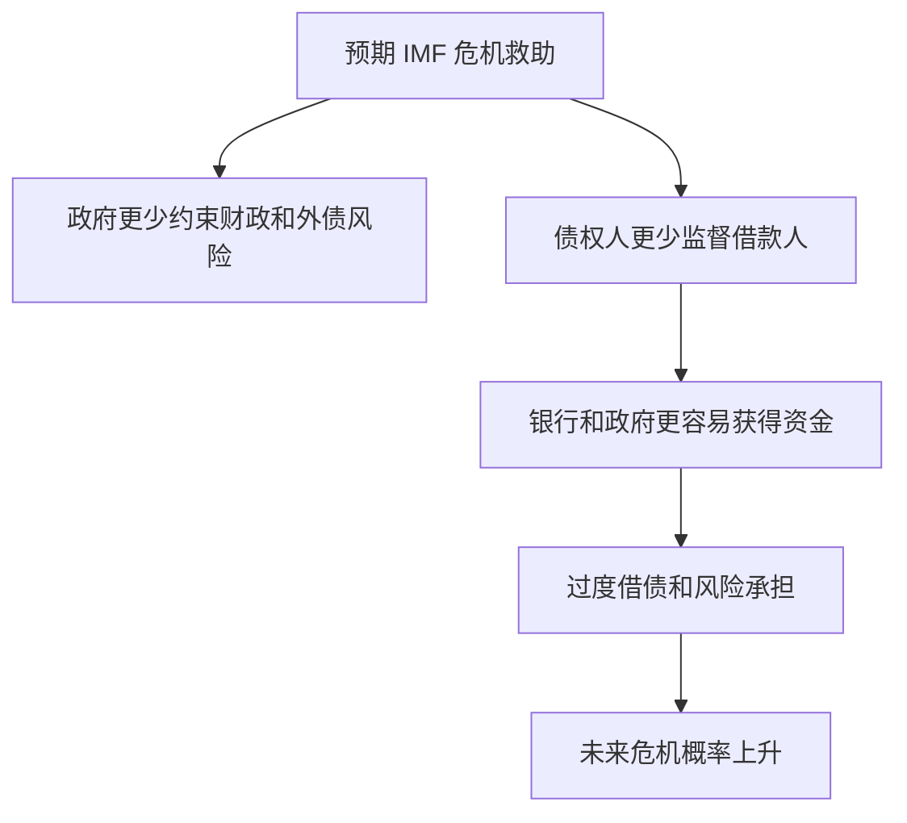
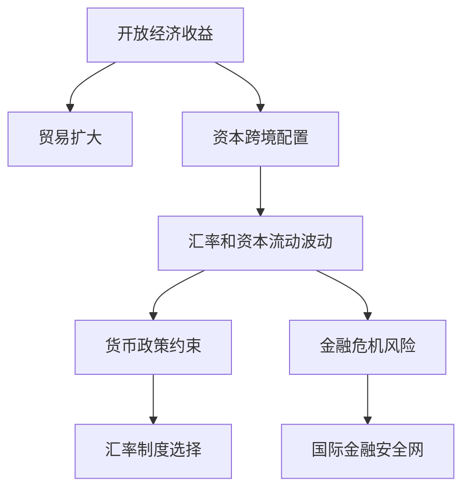

# 19.7 IMF、国际最后贷款人与国际金融安全网

来源：

- 主线：Mishkin《货币金融学》Ch.19
- 补充：Mishkin/Eakins Ch.16；Mankiw Ch.32, Ch.33

## 为什么国际金融体系需要危机救助机制

国内金融体系中，中央银行可以充当最后贷款人。当银行体系出现恐慌、流动性突然枯竭时，央行可以向金融机构提供流动性，防止暂时流动性问题变成全面金融崩溃。第 13 章讨论金融危机时已经看到，流动性危机会引发资产抛售、信用收缩和经济下行，最后贷款人可以减轻危机严重程度。

国际金融体系也会出现类似问题。一个国家可能因为资本突然外流、外债到期、银行体系危机、主权债务压力或汇率崩溃，短时间内缺少外汇流动性。单个国家的央行可以创造本币，却不能随意创造美元、欧元或其他国际储备货币。如果危机国家需要外币来偿还债务、稳定银行或支付进口，本国央行可能无能为力。

这就是国际最后贷款人问题。谁能在国家层面的国际金融危机中提供外币资金？谁能防止一国危机蔓延到其他国家？国际货币基金组织就是在这个背景下变得重要。

## IMF 原本是为固定汇率体系服务的

国际货币基金组织最初是在布雷顿森林体系下建立的。当时世界主要国家实行固定汇率制度，各国需要维持本币对美元的固定汇率。如果一个国家出现国际收支逆差，外汇储备下降，固定汇率面临压力，它可能需要临时贷款来避免立即贬值。

IMF 最初的任务包括：帮助成员国处理国际收支问题，向出现逆差的国家贷款，监督固定汇率规则，促进世界贸易增长，并收集和标准化国际经济数据。固定汇率体系需要一个机构提供规则、监督和临时融资，否则单个国家在逆差时很容易被迫放弃平价。

1970 年代布雷顿森林固定汇率体系崩溃后，IMF 不再以维护全球固定汇率为核心任务，但它并没有消失。它继续收集数据、提供技术援助，并逐渐强化了国际危机贷款功能。

## IMF 如何变成国际最后贷款人

IMF 作为国际贷款人的角色在多次危机中变得突出。1980 年代第三世界债务危机中，IMF 帮助发展中国家应对偿债困难。1994-1995 年墨西哥金融危机、1997-1998 年东亚金融危机中，IMF 向受冲击国家提供大规模贷款，试图帮助它们恢复金融稳定，并防止危机扩散。2010 年以后，IMF 又向希腊、爱尔兰、葡萄牙等国家提供贷款，帮助它们避免政府债务违约。

这时 IMF 的功能类似国际最后贷款人：当国家遭遇严重国际金融压力，市场不愿继续提供资金，国内央行也无法创造所需外币时，IMF 提供外部融资。

这个机制的宏观意义很清楚。若没有外部流动性支持，一国可能被迫突然大幅紧缩财政和货币政策、压缩进口、让汇率暴跌或违约。这些调整会使总需求急剧下降、失业上升、金融体系恶化，并可能通过贸易和资本市场传染到其他国家。

## 国际最后贷款人的好处

IMF 贷款的第一项好处是缓解流动性危机。有些国家的问题可能不是长期完全无偿付能力，而是短期无法滚动债务或稳定外汇市场。临时贷款可以避免恐慌式违约，让政府有时间调整政策。

第二项好处是防止危机传染。一国债务违约或汇率崩溃可能让投资者重新评估其他类似国家风险，引发区域性资本外流。IMF 介入可以向市场传递国际支持信号，降低恐慌扩散。

第三项好处是弥补国内央行能力不足。国内央行可以创造本币流动性，但如果银行和政府需要美元债务偿付，本币流动性不够。IMF 提供的是国际购买力，能补充外汇储备和外币资金。

第四项好处是推动政策调整。IMF 贷款通常附带条件，要求借款国进行财政、金融或结构改革。支持者认为，这些条件有助于解决危机根源，而不是只提供资金。

这些好处和国内最后贷款人类似：危机中及时提供流动性，可以防止自我实现的恐慌把问题放大。

## 道德风险：救助也会改变行为

最后贷款人机制的最大问题是道德风险。道德风险指的是，受到保护的一方因为不用承担全部后果，而更愿意冒险。

IMF 作为国际最后贷款人可能产生两类道德风险。

第一，政府道德风险。如果政府相信危机时 IMF 会救助，它可能在平时更愿意实行不负责任的财政政策、过度借债，或推迟必要改革。反正问题严重时可以向 IMF 求助。

第二，金融机构和债权人道德风险。政府常常用 IMF 资金保护银行存款人和其他债权人，避免他们遭受损失。如果债权人预期危机时会被保护，就会减少对银行和政府风险的监督，更愿意把钱借给高风险借款人。银行和政府得到廉价资金后，也可能承担更大风险。

这与前面银行监管章节完全一致。存款保险和政府安全网能防止挤兑，但也会降低存款人监督银行的动力。IMF 救助在国际层面也有类似问题。

## 条件性贷款与紧缩政策争议

为了限制道德风险，国际最后贷款人不能无条件放款。它需要要求借款国改善财政状况、改革金融监管、限制银行过度冒险，并提高政策透明度。否则，贷款可能只是推迟危机，并鼓励未来继续冒险。

但条件性贷款也引发争议。IMF 常被批评要求借款国实行紧缩政策，例如削减政府支出、提高税收、提高利率。这些政策有时可以改善财政和外部平衡，但在经济已经衰退时，会进一步压低总需求，提高失业率，甚至引发政治不稳定。

从 AD-AS 框架看，紧缩政策会让总需求左移。削减政府支出直接减少 `G`，提高税收压低消费，提高利率压低投资并可能吸引资本流入支持汇率。短期中，这些措施可能降低外部融资需求和通胀压力，却会增加产出缺口和失业。

| 政策条件 | 可能目的 | 短期宏观代价 |
| --- | --- | --- |
| 削减政府支出 | 降低财政赤字和债务风险 | 总需求下降、失业上升 |
| 提高税收 | 增加政府收入 | 可支配收入下降、消费下降 |
| 提高利率 | 支持汇率、抑制资本外流和通胀 | 投资下降、债务负担上升 |
| 金融监管改革 | 降低银行风险 | 短期信贷可能收缩 |

因此，IMF 的争议不是“救不救”这么简单，而是如何在危机稳定、道德风险控制和短期宏观痛苦之间平衡。

## 国际金融安全网不只是 IMF

IMF 是国际金融安全网的重要部分，但不是全部。国际金融安全网还包括各国外汇储备、央行之间的互换安排、区域金融安排、开发银行贷款以及私人部门债务重组机制。

外汇储备是国家自我保险。储备越充足，一国越能在资本外流时提供外币流动性。但大量储备有持有成本，也可能反映国际体系中缺少足够可靠的共同保险机制。

央行互换安排是两个央行之间交换货币的协议。危机时，一国央行可以通过互换获得外币流动性，再提供给本国金融机构。全球金融危机期间，主要央行互换安排在缓解美元流动性紧张中发挥过重要作用。

区域金融安排则是在某一区域内建立共同救助或流动性支持机制。它们可以补充 IMF，但规模、条件和协调能力各不相同。

从宏观角度看，国际金融安全网的目标是防止流动性冲击变成偿付危机，防止局部危机变成系统性危机。但如果安全网设计不当，也会强化道德风险。

## 本章的收束：国际金融体系的核心矛盾

第 19 章从国际收支开始，解释了开放经济中的资金流和商品流如何对应；接着讨论固定汇率、浮动汇率和管理浮动；再分析外汇干预、冲销操作和外汇储备；然后用三元悖论说明汇率稳定、资本自由流动和货币政策自主之间的不可兼得；最后讨论货币联盟、货币局、美元化、投机攻击和 IMF。

这些内容围绕同一个核心矛盾：开放经济希望获得国际贸易和资本流动的好处，但资本流动和汇率变化会限制国内宏观政策，并可能引发危机。制度安排的任务不是消除这个矛盾，而是在不同目标之间作取舍。

## 小结

IMF 最初服务于布雷顿森林固定汇率体系，帮助国家应对国际收支问题。固定汇率体系崩溃后，IMF 继续提供数据和技术援助，并逐渐强化国际危机贷款角色。作为国际最后贷款人，IMF 可以在国家面临外汇流动性短缺、债务压力和金融危机时提供贷款，帮助稳定市场并防止危机传染。

IMF 救助也会带来道德风险。政府可能因为预期救助而过度借债或推迟改革，债权人也可能减少对风险的监督。为限制道德风险，IMF 往往附加财政、货币和金融改革条件，但这些条件可能在短期内压低总需求、提高失业，并引发政治争议。

国际金融安全网的难题，是在危机稳定和激励约束之间取得平衡。它必须提供足够流动性防止恐慌扩散，又不能让政府和金融机构相信风险最终总由别人承担。

## 自测问题

- IMF 最初在布雷顿森林体系中的作用是什么？
- 为什么国内央行不能完全替代国际最后贷款人？
- IMF 作为国际最后贷款人有哪些潜在好处？
- IMF 救助为什么会产生政府和债权人的道德风险？
- 为什么 IMF 附加的紧缩条件可能在短期内加重衰退？
