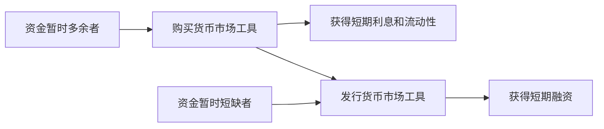

# 20.1 货币市场的定义、功能与参与者

来源：

- 主线：Mishkin/Eakins Ch.11
- 补充：Mishkin《货币金融学》Ch.2 中货币市场工具
- 延伸：Bodie/Kane/Marcus《Investments》Ch.2, Ch.5

## 为什么一家大公司会持有大量短期资产

想象一家大型科技公司，账上有大量现金和短期证券。它并不是每天都把这些钱用于建厂、研发或收购，也不是把所有钱都长期买成股票和长期债券。它需要一部分资金随时可用：如果出现投资机会，可以立即行动；如果经营中出现临时支出，可以及时支付；如果市场风险上升，也不至于被迫在不利价格下卖出长期资产。

这些资金通常不会只躺在现金账户里。现金最安全、最方便，但不产生利息。持有大量闲置现金有机会成本：如果这笔钱可以放在安全、短期、流动性高的工具中，它至少能获得一些利息收入。货币市场就是为这种短期资金管理服务的市场。

“货币市场”这个名称容易误导。这里交易的不是纸币本身，而是期限很短、违约风险低、流动性强的债务工具。它们接近货币，因为很快到期、容易出售、价格波动小，持有人可以把它们当作临时停放资金的地方。

## 什么是货币市场

货币市场交易的是短期债务工具。这些工具有三个共同特征。

第一，通常以大额面值发行和交易。许多货币市场交易规模很大，常常超过 100 万美元，因此它首先是批发市场，不是普通个人直接频繁参与的零售市场。

第二，违约风险低。货币市场工具的发行人通常是政府、大型银行、大型企业或其他信誉较高的机构。因为期限短，信用风险暴露时间也短。

第三，原始期限为一年或一年以内，很多工具期限不到 120 天。期限越短，价格越不容易因利率变化大幅波动，流动性也越强。

| 特征 | 含义 | 为什么重要 |
| --- | --- | --- |
| 大额交易 | 通常面向机构和批发市场 | 降低单位交易成本，适合大规模资金管理 |
| 低违约风险 | 发行人信用较强，期限短 | 适合暂时停放资金 |
| 短期限 | 一年以内，常常几天到几个月 | 降低利率风险，提高流动性 |

货币市场交易没有一个集中大厅。交易通常由银行、证券公司、交易商和经纪商通过电话和电子系统完成。许多工具有活跃的二级市场，也就是已经发行的证券可以再次买卖。二级市场活跃，意味着持有人需要现金时更容易卖出工具，发行人也更容易在一级市场融资。

这种结构让货币市场成为金融体系中的“短期资金管道”。资金暂时多余的一方可以把钱放进去，资金暂时短缺的一方可以从中借出。

## 为什么有银行还需要货币市场

直觉上，短期融资似乎应该由银行完成。银行吸收短期存款，发放短期贷款；银行长期和客户打交道，了解借款人信息，似乎能比市场更有效地解决信息不对称问题。既然如此，为什么还需要货币市场？

答案在于，并不是所有短期融资都需要银行中介。银行确实擅长处理信息不对称，特别是中小企业和个人借款这类信息复杂、需要持续监督的贷款。但银行也受到监管、准备金要求、存款保险成本和其他制度约束。对信用质量很高、信息透明的大型借款人来说，直接在货币市场发行短期工具，可能比向银行借款成本更低。

货币市场的存在，反映了金融体系中两种融资方式的分工。

| 情形 | 更适合银行 | 更适合货币市场 |
| --- | --- | --- |
| 借款人信息不透明 | 是 | 否 |
| 借款人信用高、信息公开 | 不一定 | 是 |
| 融资规模小 | 是 | 否 |
| 融资规模大、期限短 | 不一定 | 是 |
| 需要关系型监督 | 是 | 否 |

货币市场并没有取代银行，而是在特定场景下绕开银行更低成本地完成短期资金融通。大型企业、政府、金融机构可以利用货币市场直接筹集短期资金；银行本身也会使用货币市场管理流动性。

## 利率管制为什么推动了货币市场发展

货币市场在 19 世纪早期就已经存在，但在 20 世纪后期变得特别重要。一个关键背景是银行利率管制。

1930 年代的银行监管试图降低银行之间的激烈竞争，提高银行体系稳定性。其中一种做法是限制银行可以向存款支付的利率。后来，当通胀和短期市场利率在 1970 年代和 1980 年代明显上升时，银行受监管限制，不能给存款人支付足够高的利率。存款人发现，把钱放在银行收益太低，于是资金流向能投资货币市场工具的账户和基金。

这类资金流出银行体系的现象，说明当市场利率高于受管制存款利率时，投资者会寻找替代工具。货币市场工具短期、安全、流动性强，又能支付更接近市场水平的收益，因此迅速吸引资金。即使后来银行利率上限被取消，货币市场已经建立起来，并继续成为短期资金配置的重要渠道。

这个历史例子也连接到前面金融创新的逻辑。金融监管如果限制某类机构的价格或业务，市场参与者会寻找新的工具和渠道来绕开限制。货币市场的发展部分体现了金融体系对利率管制和资金需求变化的适应。

## 货币市场的两个核心用途

货币市场的第一项功能，是为资金暂时多余者提供停放资金的地方。企业、基金、保险公司、养老金和其他机构有时会持有暂时不用的现金。如果直接持有现金，会损失利息；如果买长期债券或股票，又承担价格波动和流动性风险。货币市场工具提供了中间选择：比现金收益高，又比长期资产更安全、更容易变现。

这可以称为“资金仓库”功能。资金不是永久投资，而是临时存放，等待未来用途。投资顾问可能把部分资金放在货币市场，等待更好的股票或债券投资机会；共同基金可能持有货币市场工具，以应对投资者赎回；企业可能把暂时不用的销售收入放入短期工具，等待支付工资、采购或税款。

第二项功能，是为资金暂时短缺者提供低成本短期融资。政府税收收入和支出并不总在同一时间发生。政府全年都有支出，但税收可能集中在特定月份，所以需要短期借款平滑现金流。企业收入和支出也不完全同步，可能先支付原材料、工资和库存成本，之后才收到销售收入。货币市场可以帮助这些机构低成本借到短期资金。

货币市场因此同时服务资产管理和负债管理。对投资者来说，它减少闲置现金的机会成本；对借款人来说，它解决现金流时间不匹配。

## 货币市场和宏观经济的关系

货币市场不是只属于企业财务部门的细节。它与宏观经济中的货币政策传导直接相连。

中央银行通过影响短期利率来实施货币政策，而货币市场正是短期利率形成和传导的关键场所。联邦基金利率、回购利率、国库券收益率、商业票据利率等，都会反映短期资金供求和央行政策立场。当央行收紧货币政策，短期利率上升，企业短期融资成本提高，投资和库存融资可能受到影响；当央行放松货币政策，短期利率下降，短期融资条件改善。

货币市场还影响金融稳定。因为很多金融机构依赖短期融资，一旦货币市场失去流动性，机构可能难以滚动债务，被迫出售资产，进而放大危机。第 13 章讲金融危机时提到的流动性危机，在货币市场中表现得非常直接：短期资金突然不愿续借，安全资产需求上升，风险较高的短期工具融资困难。

所以，货币市场的宏观意义至少有三层：

| 层面 | 作用 |
| --- | --- |
| 货币政策 | 短期利率是央行政策传导的第一环 |
| 实体经济 | 企业和政府通过短期融资管理现金流 |
| 金融稳定 | 短期融资市场冻结会放大危机 |

## 谁参与货币市场

货币市场参与者不能简单分成“借款人”和“贷款人”，因为很多机构两边都做。大型商业银行可能发行大额存单筹资，同时购买国库券管理流动性；大型企业可能发行商业票据筹资，也可能购买货币市场工具停放现金。

主要参与者包括以下几类。

美国财政部是最大的货币市场借款者之一。它发行短期国库券，为政府支出提供资金，或者用新发行工具替换到期债务。财政部通常是资金需求方，而不是资金供应方。

中央银行是最有影响力的参与者。以美联储为例，它通过买卖国债影响银行体系准备金和短期利率。央行并不是为了赚取短期收益而参与，而是为了执行货币政策。

商业银行既购买货币市场工具，也发行货币市场工具。银行持有国库券等安全资产管理流动性，也发行大额可转让存单，参与联邦基金和回购市场。大型货币中心银行还为客户交易货币市场工具。

企业使用货币市场管理现金。大型企业会购买短期工具停放剩余资金，也会发行商业票据筹集短期资金。由于交易规模大，这类活动主要由大公司参与。

证券公司和交易商帮助市场保持流动性。它们持有一定库存，随时买卖货币市场工具，使卖方更容易找到买方、买方更容易找到卖方。

金融公司通过发行商业票据等工具筹资，再把资金贷给消费者，用于汽车、耐用品或其他消费融资。

保险公司和养老金也会持有货币市场工具。保险公司需要应对赔付的不确定性，必须保持流动性；养老金的现金流更可预测，但也会持有一部分短期工具，以便等待长期投资机会或满足支付需求。

个人通常不直接参与批发货币市场，而是通过货币市场共同基金间接参与。基金把许多小投资者的钱集中起来，购买大额货币市场工具。

| 参与者 | 典型角色 |
| --- | --- |
| 财政部 | 发行国库券，筹集短期财政资金 |
| 中央银行 | 买卖国债，实施货币政策 |
| 商业银行 | 管理流动性，发行大额存单，参与联邦基金和回购市场 |
| 大型企业 | 停放现金，发行商业票据 |
| 证券公司和交易商 | 做市和撮合买卖，提高市场流动性 |
| 金融公司 | 发行短期工具筹资，再向消费者放贷 |
| 保险公司和养老金 | 持有短期工具以保持流动性 |
| 个人 | 通过货币市场基金间接参与 |

从投资学角度看，货币市场是组合中“现金资产”的主要载体。现金资产不是为了追求高收益，而是为了提供流动性、降低组合波动、满足保证金和赎回需求，并等待更好的风险资产买入机会。它也有代价：短期安全工具收益率通常低于长期债券和股票的预期收益，长期持有过多现金会形成现金拖累；在通胀较高时，名义安全并不等于实际购买力安全。因此，资产配置要把货币市场工具放在流动性需求、风险预算和机会成本之间权衡。

## 小结

货币市场交易的是短期、低风险、高流动性的债务工具，而不是纸币本身。它们通常面值大、期限短、违约风险低，适合机构管理短期资金。货币市场是批发市场，交易多通过电子系统和交易商完成，活跃二级市场使这些工具容易变现。

货币市场存在，是因为在信息不对称不严重、借款人信用较高、融资规模较大的短期融资场景中，市场融资可能比银行融资成本更低。它既为资金暂时多余者提供停放现金的工具，也为政府、银行和企业提供短期融资来源。

从宏观角度看，货币市场是短期利率和货币政策传导的重要场所，也是金融稳定的重要环节。短期资金市场顺畅时，企业、政府和金融机构可以低成本管理流动性；货币市场冻结时，流动性危机会迅速传导到整个金融体系。

## 自测问题

- 为什么“货币市场”并不是交易纸币的市场？
- 货币市场工具通常具备哪三个共同特征？
- 既然银行提供短期存贷款，为什么还需要货币市场？
- 货币市场怎样降低持有闲置现金的机会成本？
- 为什么货币市场和中央银行货币政策传导密切相关？
- 为什么投资组合需要现金资产，但长期持有过多货币市场工具也会有机会成本？
