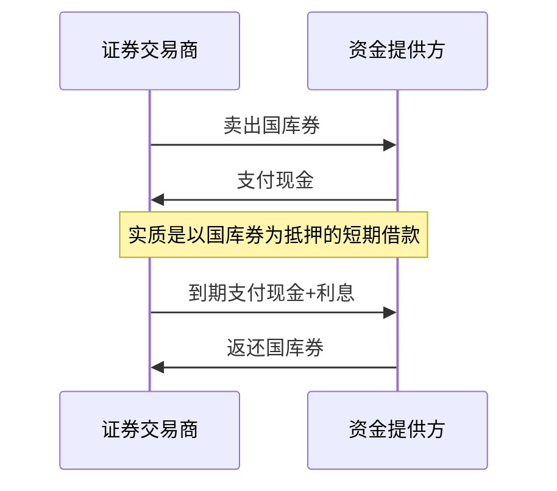

# 20.2 国库券、联邦基金与回购协议

来源：

- 主线：Mishkin/Eakins Ch.11
- 补充：Mishkin《货币金融学》Ch.2 中货币市场工具

## 三种工具分别解决什么问题

货币市场不是一个单一工具市场，而是一组短期融资工具的集合。不同工具服务不同需求：政府需要弥补短期财政现金流缺口，银行需要每天调剂准备金，证券交易商和其他机构需要用安全抵押品获得短期融资。国库券、联邦基金和回购协议就是这三类需求的典型工具。

学习这些工具时，不要先记名词，而要先问：谁需要资金？谁有闲置资金？风险由谁承担？工具怎样到期还款？利率怎样形成？

| 工具 | 主要借款方 | 主要资金提供方 | 是否有抵押 | 典型期限 | 核心用途 |
| --- | --- | --- | --- | --- | --- |
| 国库券 | 美国财政部 | 银行、基金、企业、个人等 | 无抵押，但政府信用支持 | 4、13、26、52 周等 | 政府短期融资，投资者停放安全资金 |
| 联邦基金 | 银行等存款机构 | 有超额准备金的银行 | 通常无抵押 | 隔夜为主 | 银行准备金调剂 |
| 回购协议 | 证券交易商、银行、金融机构等 | 银行、基金、企业等 | 有证券抵押 | 几天到几周为主 | 抵押化短期融资和流动性管理 |

这三种工具共同体现货币市场的基本特征：期限短、流动性强、风险相对低，并且与货币政策和短期利率紧密相关。

## 国库券：政府发行的短期折价证券

美国财政部为了筹集资金，会发行多种债务证券。其中最重要的短期工具是国库券，也常称 T-bills。国库券通常有 4 周、13 周、26 周和 52 周等期限。它们是货币市场中最安全、最流动的工具之一。

国库券的一个重要特点是通常不直接支付票面利息。投资者以低于面值的价格买入，到期时按面值收回资金。买入价格和到期面值之间的差额，就是投资者的收益。这种发行方式叫折价发行。

例如，一张面值 1000 美元、28 天后到期的国库券，投资者可能以 999.81 美元买入。到期时财政部支付 1000 美元。投资者获得的收益是：

```text
1000 - 999.81 = 0.19 美元
```

金额看起来很小，但因为期限只有 28 天，把它年化后就得到国库券收益率。

折价发行适合短期证券，因为它简化了到期支付。发行人不需要在短期内另行支付利息，只需要到期支付面值；投资者的收益已经体现在买入价格低于面值中。

## 国库券的收益率为什么有不同算法

国库券报价中常见两个收益率概念：贴现率和投资率。

贴现率的公式是：

```text
贴现率 = (面值 - 购买价格) / 面值 × 360 / 到期天数
```

投资率的公式是：

```text
投资率 = (面值 - 购买价格) / 购买价格 × 365 / 到期天数
```

两者差别有两个。第一，贴现率用面值做分母，而投资者实际投入的是购买价格。因为购买价格低于面值，用面值做分母会低估投资者实际收益率。第二，贴现率使用 360 天年化，而投资率使用 365 天年化，更接近投资者实际年度收益。

用上面的例子计算。假设面值 1000 美元，购买价格 999.81333 美元，期限 28 天。

```text
贴现率 = (1000 - 999.81333) / 1000 × 360 / 28
       ≈ 0.240%

投资率 = (1000 - 999.81333) / 999.81333 × 365 / 28
       ≈ 0.243%
```

投资率略高，因为它使用实际购买价格做分母，并使用 365 天年化。

这个例子不仅是计算技巧，也说明金融市场报价常常有约定俗成的方式。读利率时要知道分母是谁、期限怎样年化、收益是否按折价方式体现。

## 国库券为什么接近无风险

国库券被视为极低违约风险工具。原因是它由美国财政部发行，期限很短，并且政府具有强大的征税能力和货币发行相关支持。正因为违约风险低，国库券利率通常也是经济中最低的利率之一。

但“低风险”不等于“高收益”。国库券常被用于暂时停放资金，而不是长期提高财富。因为收益率很低，在通胀较高时期，国库券实际收益率可能为负。投资者收到的名义金额增加了，但购买力未必增加。前面学习名义利率和实际利率时已经知道：

```text
实际利率 ≈ 名义利率 - 通胀率
```

如果国库券名义收益率为 3%，通胀率为 5%，实际收益率约为 -2%。这说明，国库券适合短期安全储存，不一定适合长期对抗通胀。

国库券的另一个优势是市场深度和流动性。深度市场有大量买方和卖方；流动市场可以快速买卖，交易成本低。国库券市场深而且流动，因此投资者需要现金时通常可以迅速卖出。

## 国库券拍卖和记账式证券

财政部通过拍卖发行国库券。投资者可以提交竞争性投标，也可以提交非竞争性投标。

竞争性投标中，投资者说明想买多少证券，以及愿意接受的收益率或价格。财政部按照有利于自己融资的顺序接受投标，直到达到发行规模。竞争性投标者可能买到，也可能买不到。

非竞争性投标中，投资者只说明想买多少，不说明价格。财政部接受所有非竞争性投标，成交价格按照竞争性投标中确定的结果执行。非竞争性投标者可以确保买到证券，但不能控制成交收益率。

| 投标方式 | 投资者提交什么 | 是否保证买到 | 适合谁 |
| --- | --- | --- | --- |
| 竞争性投标 | 数量和价格/收益率 | 不保证 | 大型机构、专业交易者 |
| 非竞争性投标 | 数量 | 保证 | 不想参与价格竞争的投资者 |

现代国库券不是纸质凭证，而是记账式证券。所有权记录在电子系统中，不再依赖实物证券。这样降低了发行、保管和转让成本，也提高了市场交易效率。

## 联邦基金：银行之间的隔夜准备金融通

联邦基金听起来像政府基金，但名称有误导性。它不是财政部资金，也不是联邦政府支出资金，而是存款机构存放在联邦储备银行账户中的准备金。联邦基金市场是金融机构之间短期借出和借入这些准备金的市场。

银行每天都要管理自己的准备金头寸。有的银行当天准备金多余，有的银行当天准备金不足。准备金不足的银行可以向准备金多余的银行借入联邦基金。多数联邦基金交易是隔夜交易，第二天资金归还。

交易过程可以这样理解：A 银行发现自己有 5000 万美元超额准备金，B 银行发现自己准备金不足。A 银行把准备金借给 B 银行。达成协议后，联邦储备银行把 A 银行在央行账户中的准备金转到 B 银行账户。第二天，B 银行归还资金并支付利息。


多数联邦基金借款没有抵押，依赖参与机构信用和短期期限。因为期限很短，且参与者通常是金融机构，市场可以高效调剂银行体系内部准备金。

## 联邦基金利率为什么是货币政策核心指标

联邦基金利率由准备金市场供求决定。准备金供给多，银行之间借钱容易，联邦基金利率下降；准备金供给少，银行争抢准备金，联邦基金利率上升。

中央银行不能像给商品贴标签一样直接命令市场每笔交易利率是多少，但可以通过改变银行体系准备金供给来影响联邦基金利率。美联储买入证券，会向银行体系注入准备金，联邦基金利率下降；美联储卖出证券，会从银行体系抽走准备金，联邦基金利率上升。

这和前面货币政策章节完全一致：


联邦基金利率直接影响的交易对象看起来很窄，主要是银行隔夜准备金。但它是整个短期利率体系的锚。国库券利率、商业票据利率、回购利率等会随之变化。金融市场分析者密切关注联邦基金利率，因为它反映美联储希望货币政策向紧还是向松移动。

这也解释了为什么货币市场是宏观政策的第一站。央行政策先进入准备金市场和短期利率，再通过银行贷款、债券收益率、资产价格、汇率和预期影响总需求与通胀。

## 回购协议：用证券作抵押的短期借款

回购协议通常简称 repo。它的形式是：一方卖出证券，同时承诺在未来某个日期按约定价格买回这些证券。经济实质上，这是一笔有抵押的短期贷款。

假设一家证券交易商持有国库券，但今天需要短期现金。它可以把国库券卖给一家银行，并承诺明天或几天后买回。银行今天支付现金，交易商得到融资；国库券作为抵押品留在银行手里。如果交易商不能按约定买回，银行可以处置抵押品。



回购协议和联邦基金相似，都属于短期融资。但区别在于，回购协议有抵押，且非银行也可以参与；联邦基金主要是银行之间准备金借贷，通常无抵押。

| 比较 | 联邦基金 | 回购协议 |
| --- | --- | --- |
| 参与者 | 主要是存款机构 | 银行、证券交易商、基金、企业等 |
| 抵押 | 通常无抵押 | 通常有证券抵押 |
| 期限 | 隔夜为主 | 3 到 14 天常见，也可更长 |
| 核心用途 | 准备金调剂 | 抵押化短期融资和流动性管理 |

## 回购市场的用途和风险

政府证券交易商经常使用回购协议管理流动性。交易商持有大量证券库存，需要短期资金支持持仓；repo 可以让它们用证券作为抵押借到现金。美联储也会使用回购和逆回购工具进行短期准备金调节，从而实施货币政策。

因为回购协议通常以国库券等高质量证券作抵押，利率较低，风险也较低。但低风险不等于没有风险。风险主要来自抵押品价值、重复抵押、对手方违约和市场流动性。

历史上曾出现机构用同一证券作为多笔借款抵押，导致损失。2007-2008 年金融危机中，回购市场也受到严重冲击。当抵押品质量受到怀疑，资金提供者不愿继续借出，借款机构短期融资迅速收缩。回购市场冻结会迫使机构出售资产，进一步压低资产价格，形成流动性螺旋。

这与第 13 章危机机制直接相关。短期抵押融资平时看起来安全，因为期限短、抵押品高质量；但如果市场突然怀疑抵押品价值或借款人偿付能力，融资会快速消失。货币市场工具越依赖滚动融资，越容易在信心冲击中放大危机。

## 三种工具如何共同构成短期利率体系

国库券、联邦基金和回购协议之间不是彼此孤立。它们共同构成短期安全利率和短期融资条件的基础。

国库券利率反映政府短期无风险融资成本，也为许多短期工具提供基准。联邦基金利率反映银行体系准备金价格，是货币政策操作的重要目标或参考。回购利率反映抵押化短期融资成本，连接国债市场、证券交易商和央行流动性操作。

当央行收紧政策，联邦基金利率上升，回购利率和国库券利率通常也会上升。短期融资成本提高，企业和金融机构的现金管理和资产持有决策会调整。反过来，当市场出现避险情绪，投资者大量买入国库券，国库券收益率可能下降；如果回购市场紧张，回购利率可能上升，显示短期融资压力。

## 小结

国库券是财政部发行的短期折价证券，违约风险极低、流动性很强，常被用作安全资金停放工具和短期利率基准。它通常不支付票面利息，而是以低于面值的价格出售，到期按面值偿还。

联邦基金是存款机构之间借入和借出在央行账户中准备金的市场，通常为隔夜交易。联邦基金利率由准备金供求决定，是货币政策传导的核心短期利率。

回购协议是用证券作抵押的短期融资，形式上是卖出证券并承诺未来买回，实质上是抵押贷款。回购市场为证券交易商、银行和其他机构提供流动性，也被央行用于短期货币政策操作。三者共同构成货币市场中最重要的短期安全融资体系。

## 自测问题

- 国库券为什么通常以折价方式发行？
- 贴现率和投资率在计算国库券收益时有什么区别？
- 联邦基金为什么不是“联邦政府的资金”？
- 美联储怎样通过准备金供给影响联邦基金利率？
- 回购协议为什么可以理解为有抵押的短期贷款？
