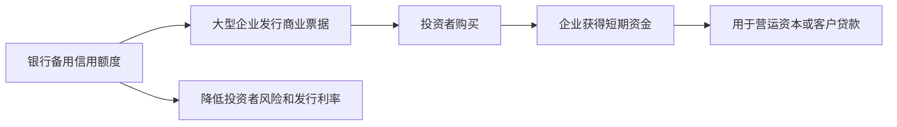
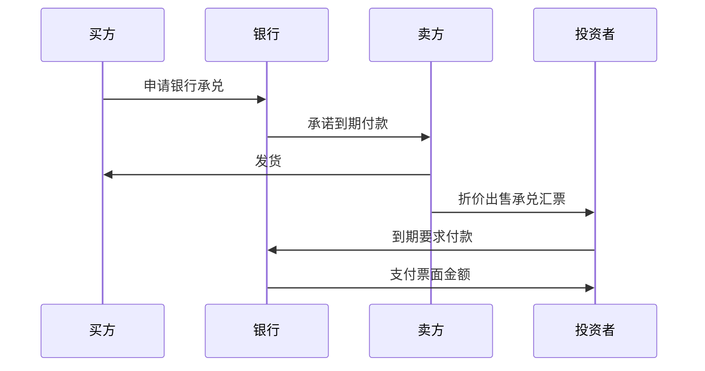

# 20.3 大额可转让存单、商业票据、银行承兑汇票

来源：

- 主线：Mishkin/Eakins Ch.11
- 补充：Mishkin《货币金融学》Ch.2 中货币市场工具

## 从政府和银行准备金，走向银行、企业和贸易融资

上一节讲的国库券、联邦基金和回购协议，分别对应政府短期融资、银行准备金调剂和抵押化短期融资。货币市场还有另一组重要工具，它们更直接服务银行筹资、企业短期融资和国际贸易结算：大额可转让存单、商业票据和银行承兑汇票。

这三种工具的共同点是期限短、面向机构投资者、通常在货币市场中交易。但它们解决的问题不同。银行需要在不依赖普通活期存款的情况下筹集大额资金；大型企业希望绕开银行贷款，以较低成本直接向市场借短期资金；国际贸易买卖双方彼此不熟悉，需要银行信用介入，降低付款和交货之间的不确定性。

| 工具 | 发行或承诺主体 | 主要用途 | 核心风险来源 |
| --- | --- | --- | --- |
| 大额可转让存单 | 银行 | 银行吸收大额短期资金 | 银行信用风险 |
| 商业票据 | 大型企业或金融公司 | 企业短期无担保融资 | 企业信用风险和展期风险 |
| 银行承兑汇票 | 银行承兑付款 | 国际贸易融资 | 银行信用风险和贸易背景风险 |

这些工具体现了货币市场的另一个侧面：它不仅是“安全资产停放处”，也是大型机构绕开传统贷款、快速完成短期融资的渠道。

## 大额可转让存单：银行把存款变成可交易证券

普通存款通常是存款人与银行之间的关系。存款人把钱放进银行，银行承诺支付利息并在约定条件下归还本金。大额可转让存单则把这种存款关系证券化。它是银行发行的一种证券，证明持有人在银行有一笔定期存款，写明利率和到期日。

“可转让”是关键。普通定期存款通常不能随意转让；如果提前支取，可能损失利息或受到限制。可转让存单可以在到期前买卖。谁在到期时持有这张存单，谁就收到本金和利息。因此，它也具有不记名或持有人凭证的性质。

大额可转让存单通常面值很大，从 10 万美元到 1000 万美元不等，实际交易中很多低于 100 万美元的工具并不常见。交易商市场常以 100 万美元为标准交易单位。期限通常为 1 到 4 个月，也有 6 个月期限，但更长期限需求较少。

对银行来说，大额可转让存单是重要资金来源。银行可以通过发行 CD 吸引企业、货币市场基金、慈善机构和政府机构等大额资金。对投资者来说，它比普通活期存款收益更高，又比长期债券期限更短。

## 大额可转让存单的历史意义

大额可转让存单的发展与银行竞争有关。20 世纪中期，大型企业越来越精细地管理现金，不愿把大量资金放在不支付或低支付利息的银行账户里。它们会把闲置资金投向国库券等安全短期工具。银行为了留住这些资金，需要提供一种支付市场利率、又能吸引大额存款人的工具。

1961 年，花旗银行发行了第一批大额可转让存单。它的吸引力在于支付市场利率，并且可以转让。企业资金管理者不必把资金锁死到到期日，如果需要现金，可以在二级市场卖出。

但利率管制曾限制银行支付的利率。当市场利率上升超过监管允许水平时，银行发行 CD 的吸引力下降，市场萎缩。后来监管放松，特别是较大面额 CD 获得豁免，CD 市场迅速扩大。它后来成为仅次于国库券的重要货币市场工具之一。

这个历史再次说明，金融创新往往来自资金需求和监管约束之间的张力。企业需要更高收益和流动性，银行需要大额资金来源，监管限制传统存款利率，于是可转让存单成为新的工具。

## 商业票据：大型企业的短期无担保借款

商业票据是大型企业发行的短期无担保本票。它通常不超过 270 天到期，很多实际期限只有 20 到 45 天。它没有抵押品支持，因此只有规模大、信誉好、财务状况稳健的企业才能以较低成本发行。

商业票据一般也以折价方式发行。投资者以低于面值的价格买入，到期收到面值。发行企业支付的利率取决于自己的信用风险。信用越强，利率越低；信用越弱，市场可能根本不愿购买其商业票据。

为什么期限常低于 270 天？因为在美国，满足特定条件的短期证券可以免于证券监管机构的注册要求，其中一个关键条件就是原始期限短于 270 天，并用于当前交易。短期限降低了发行成本和监管成本。

商业票据的发行方式有两种。大型发行人可以直接卖给最终投资者，称为直接发行或直接配售，这样可以节省交易商佣金。其他发行人通过商业票据交易商找到买方。与国库券不同，商业票据的二级市场不强，投资者通常持有到期。如果投资者急需现金，交易商可能帮助赎回或转售，但这不是市场主要功能。

## 商业票据为什么能比银行贷款便宜

商业票据成为银行贷款的重要替代品，主要因为成本较低。大型信用良好的公司如果向银行借款，需要支付银行贷款利率；如果直接发行商业票据，可以绕过银行资产负债表和监管成本，直接从货币市场获得资金。

金融公司尤其常用商业票据。它们发行商业票据筹集短期资金，再把资金贷给消费者购买汽车、耐用品或其他商品。企业也可以用商业票据为应收账款、库存和短期营运资本融资。

不过，商业票据是无担保工具，投资者担心发行人到期不能还款。为了降低投资者风险，很多发行人会获得银行备用信用额度。备用信用额度意味着，如果企业到期不能偿还或展期商业票据，银行承诺向企业贷款用于偿付。银行收取承诺费，企业则因为信用支持降低商业票据利率。

这说明，即使商业票据是市场融资，银行仍然没有完全消失。银行可能不直接提供贷款，但通过备用信用额度提供信用支持。

## 资产支持商业票据与危机教训

商业票据还有一种特殊形式：资产支持商业票据。它与普通商业票据不同，背后有一组资产支持，例如应收账款、贷款或证券化资产。2004 到 2007 年期间，许多资产支持商业票据背后的资产与证券化抵押贷款有关。

表面上，资产支持商业票据有抵押，比无担保商业票据更安全。但问题在于，投资者并不总能清楚理解抵押资产质量。次级抵押贷款风险暴露后，市场开始怀疑这些资产支持商业票据的真实价值。投资者不愿继续购买或展期，市场出现类似挤兑的行为。

这个过程波及货币市场基金。货币市场基金持有商业票据和资产支持商业票据，如果这些工具无法按面值变现，基金可能“跌破一美元净值”，也就是投资者原本以为 1 美元基金份额可以赎回 1 美元，实际只能赎回低于 1 美元。2008 年危机中，美联储和政府采取措施防止货币市场基金市场崩溃，并帮助有序处理相关资产。

这条危机链说明，货币市场工具虽然短期、看似安全，但如果背后资产质量不透明，或者依赖持续展期，就可能在信心消失时迅速冻结。

## 银行承兑汇票：用银行信用解决贸易中的不信任

银行承兑汇票是一种在指定日期向持有人支付指定金额的付款命令，由银行承兑后成为银行的付款承诺。它历史悠久，在国际贸易中尤其重要。

可以从一个贸易场景理解。美国一家建筑公司想从日本企业购买推土机。日本卖方不认识美国买方，不愿意先发货后收款，因为如果买方不付款，跨国追索成本很高。美国买方也不愿意先付款后等货，因为如果卖方不发货或货物有问题，追回资金也困难。

银行可以介入。买方的银行承兑一张汇票，承诺在未来某个日期付款。卖方看到的不再只是买方信用，而是银行信用。银行信用通常比陌生买方信用更容易被市场接受，于是卖方愿意发货。银行承兑汇票可以在到期前出售给投资者，卖方可以提前拿到现金。

银行承兑汇票降低了贸易中的信息不对称。卖方不必完全相信陌生买方，只要相信承兑银行；投资者购买承兑汇票时，也主要评估银行信用。

## 银行承兑汇票的市场属性

银行承兑汇票通常可以转让，持有人到期获得付款。因此，它可以在到期前买卖。和国库券、商业票据类似，银行承兑汇票常以折价方式出售。投资者低价买入，到期按票面金额收款，差额就是收益。

承兑汇票利率通常较低，因为银行承兑降低了违约风险。它适合融资尚未完成交付的货物，尤其适合国际贸易。货物从卖方发出到买方收到需要时间，付款和交货之间存在不确定性，银行承兑汇票把这种时间差变成可交易的短期金融工具。

它与商业票据的区别在于，商业票据主要依赖发行企业信用，银行承兑汇票则依赖承兑银行信用，并且往往与具体贸易交易相连。

| 比较 | 商业票据 | 银行承兑汇票 |
| --- | --- | --- |
| 信用基础 | 企业信用 | 银行承兑信用 |
| 是否通常无担保 | 是 | 有银行付款承诺 |
| 典型用途 | 企业营运资本、金融公司融资 | 国际贸易和货物运输融资 |
| 二级市场 | 较弱，通常持有到期 | 可以折价转让 |

## 三种工具如何改变银行与市场的边界

大额可转让存单、商业票据和银行承兑汇票共同显示，银行和市场不是简单替代关系，而是相互交织。

大额可转让存单让银行直接从市场筹集大额资金。商业票据让大型企业直接从市场借钱，但银行又通过备用信用额度提供支持。银行承兑汇票让银行信用嵌入贸易融资，使贸易债权可以在市场中交易。

这与金融结构章节中的信息不对称逻辑一致。市场适合标准化、短期、信用质量较高的融资；银行适合提供信用评估、承诺和流动性支持。货币市场工具常常把二者结合起来。

从宏观和金融稳定角度看，这种结合也意味着风险可以在银行和市场之间传导。商业票据市场冻结会迫使企业动用银行信用额度，压力回到银行体系；货币市场基金赎回压力会迫使基金抛售短期工具，影响企业融资；银行信用受损会影响 CD 和承兑汇票需求。

## 小结

大额可转让存单是银行发行的可交易定期存款证券，帮助银行吸收大额短期资金，也给机构投资者提供短期收益工具。商业票据是大型信用良好企业发行的短期无担保本票，常用于营运资本和金融公司贷款融资，成本通常低于银行贷款，但依赖发行人信用和持续展期能力。银行承兑汇票则通过银行付款承诺解决国际贸易中的买卖双方不信任问题，并可以折价转让。

这三种工具体现了货币市场对传统银行融资的补充和重组。银行既是资金筹集者，也是信用支持者；企业既可以绕开银行直接融资，也常需要银行备用信用额度；国际贸易通过银行承兑把贸易债权变成短期可交易工具。

## 自测问题

- 大额可转让存单和普通定期存款有什么关键区别？
- 商业票据为什么通常只有信用良好的大型企业才能发行？
- 为什么很多商业票据发行人需要银行备用信用额度？
- 资产支持商业票据在 2007-2008 年危机中暴露了什么问题？
- 银行承兑汇票如何解决国际贸易中买方和卖方互不信任的问题？
