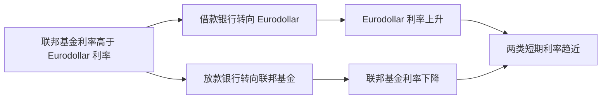

# 20.4 Eurodollars 与跨境短期资金

来源：

- 主线：Mishkin/Eakins Ch.11
- 补充：Mishkin《货币金融学》Ch.2 中货币市场工具
- 延伸：Bodie/Kane/Marcus《Investments》Ch.2, Ch.23

## 为什么美元可以在美国境外形成市场

国际贸易和金融中，美元被广泛使用。许多合同以美元计价，许多企业、银行和政府需要持有美元来支付进口、偿还债务或进行投资。直觉上，美元存款似乎应该放在美国银行。但现实中，大量美元存款存放在美国境外的银行，例如伦敦、新加坡、巴哈马或开曼群岛的银行。这些美国境外的美元存款，就是 Eurodollars。

Eurodollars 这个词容易误解。它不是欧元，也不一定在欧洲。它指的是存放在美国境外银行中的美元存款。类似地，存放在日本境外银行中的日元存款可以叫 Euroyen。更一般地，存放在本国境外银行中的外币存款，称为 Eurocurrencies。

为什么市场会需要这种安排？因为国际交易需要美元，但持有者有时不想把美元放在美国境内；同时，美国境外银行也愿意吸收美元存款并提供美元贷款。结果，美元在美国之外形成了一个庞大的离岸短期资金市场。

## Eurodollars 如何产生

Eurodollars 的产生可以从一个简单例子理解。假设英国 Rolls-Royce 公司收到一张 100 万美元支票，这张支票对应美国银行账户。Rolls-Royce 把这张支票存入伦敦的一家银行，并要求这笔存款以美元计价。于是，伦敦银行账上出现一笔 100 万美元存款，这就是 Eurodollar 存款。

需要注意的是，伦敦银行可能仍把相应美元资产放在美国银行账户中。Eurodollar 的产生并不意味着美国银行体系中的美元存款一定减少。它更像是美国境外银行对客户开出了一笔美元负债，同时持有相应美元资产。

Eurodollar 存款大多是定期存款，很多期限为 30 天以上，也有隔夜资金。交易规模通常很大，最低交易额常见为 100 万美元左右。因此，它主要是银行、跨国公司、政府和大型机构使用的市场，普通个人通常不会直接接触。

## Eurodollar 市场的历史起源

Eurodollar 市场的诞生有一个具有讽刺意味的历史背景。冷战时期，苏联持有大量美元余额，但担心这些美元如果放在美国银行，可能被美国政府冻结。它又希望继续持有美元，因为美元便于国际交易。解决办法是把美元存款转移到欧洲银行，但仍以美元计价。这样，美元仍可用于国际支付，却不直接放在美国境内。

这个安排后来扩展为一个全球离岸美元市场。伦敦因为长期是国际金融中心，成为 Eurodollar 市场的重要中心。后来，新加坡、巴哈马、开曼群岛等离岸金融中心也参与其中。

这个历史说明，金融市场的发展不仅来自收益率比较，也来自政治风险、监管差异和国际支付需求。市场参与者需要美元，但也关心资产所在司法辖区、冻结风险、监管成本和资本流动限制。

## 为什么企业和银行愿意使用 Eurodollars

企业愿意持有 Eurodollars，首先因为美元是国际贸易中最重要的货币之一。跨国公司可能在多个国家收付款，如果合同以美元计价，持有美元存款可以降低换汇需求。

其次，Eurodollars 是离岸存款。它们在美国境外，通常不受美国国内银行监管规则的完全约束。过去，美国银行面临准备金要求、存款利率限制和其他监管成本时，境外美元存款可能支付更高利率，或者贷款利率更有吸引力。

银行愿意经营 Eurodollar 业务，是因为它们可以在国际市场吸收美元存款，再向需要美元的银行、企业和政府贷款。由于监管成本较低，国际银行可以接受更窄的存贷利差：存款人获得较高利率，借款人获得较低利率，银行仍能盈利。

可以把它理解为一个跨境短期资金池：

| 资金供给方 | 为什么提供美元资金 |
| --- | --- |
| 跨国公司 | 暂时持有贸易收入或投资资金 |
| 政府和中央银行 | 持有国际储备或美元流动性 |
| 银行 | 调剂全球美元头寸 |

| 资金需求方 | 为什么借入美元资金 |
| --- | --- |
| 跨国公司 | 支付进口、营运资本、美元债务 |
| 银行 | 弥补短期美元流动性缺口 |
| 政府或机构 | 进行国际融资和支付 |

## 伦敦银行同业市场和 LIBOR

Eurodollar 市场的重要组成部分是伦敦银行同业市场。大型银行在这个市场上相互借入和借出美元及其他货币的短期资金。

银行买入资金愿意支付的利率称为伦敦银行同业买入利率，传统上叫 LIBID。银行卖出资金要求收取的利率称为伦敦银行同业拆放利率，传统上叫 LIBOR。因为许多银行参与，市场竞争激烈，买入价和卖出价之间的差距通常较小。

Eurodollar 存款通常是定期存款，不能随时支取。期限可以是隔夜、几天、几个月，不同期限对应不同利率。由于银行可以在联邦基金市场和 Eurodollar 市场之间替代融资，隔夜 Eurodollar 利率和联邦基金利率往往接近。

假设联邦基金利率明显高于隔夜 Eurodollar 利率。需要借款的银行会倾向于借 Eurodollars，因为更便宜；有资金可贷的银行会倾向于贷出联邦基金，因为收益更高。这种资金流动会推高 Eurodollar 利率、压低联邦基金利率，直到二者重新接近。反过来也一样。

这说明全球短期资金市场是相互连接的。美国国内银行准备金市场和境外美元市场并不是完全分割的两个世界。

## Eurodollar 可转让存单与其他 Eurocurrencies

由于 Eurodollar 存款通常是定期存款，到期前流动性有限。金融市场为解决这个问题，又创造了 Eurodollar 可转让存单。它把 Eurodollar 定期存款变成可以转让的证券，使持有人在到期前更容易出售。

不过，因为很多 Eurodollar 存款本身期限很短，可转让存单市场相对普通 Eurodollar 存款规模较小，流动性也较薄。

Eurodollar 市场不是唯一的离岸货币市场。任何本国境外持有的外币存款都可以形成类似市场。例如，在伦敦或纽约银行持有的日元存款可以称为 Euroyen。只是由于美元在国际贸易、金融合约和储备资产中的地位最重要，Eurodollar 市场规模最大、影响最广。

## 跨境短期资金与宏观经济的连接

Eurodollar 市场把货币市场从国内扩展到全球。它说明短期利率、银行流动性和货币政策不只在一国边界内运行。

第一，Eurodollar 市场影响全球美元流动性。许多美国境外银行和企业有美元负债，需要不断获得美元资金。如果 Eurodollar 市场紧张，全球美元融资成本上升，可能影响国际贸易、跨境贷款和金融市场稳定。

第二，Eurodollar 市场会影响货币政策传导。美联储改变美元短期利率，会通过联邦基金、回购、国库券和 Eurodollar 市场传导到全球美元融资条件。即使企业不在美国，只要借的是美元，也会受到美元利率变化影响。

第三，Eurodollar 市场与资本流动和汇率有关。美元融资成本上升，可能使借美元的外国企业和银行面临压力；如果它们需要买入美元偿还债务，可能推高美元需求，影响汇率。前面第 18、19 章讲到的资本流动、汇率压力和外汇储备，在这里会通过短期美元资金市场具体表现出来。

第四，离岸市场也带来监管问题。资金在境外银行体系中流动，可能避开某些国内监管要求。这提高了效率和灵活性，也可能使风险积累在监管较弱或信息较不透明的地方。

从国际投资角度看，Eurodollar 市场是美元资产定价和外汇套保的重要底层市场。非美国投资者买美元债券、美国投资者买海外资产并做外汇套保，都要面对短期美元融资利率和远期汇率中的美元资金成本。全球美元紧张时，离岸美元利率和外汇掉期基差可能上升，使套保成本增加、美元债务滚续更难，并把美联储政策传导到美国境外的资产价格和资本流动。

## 小结

Eurodollars 是存放在美国境外银行中的美元存款。它们不是欧元，也不一定在欧洲，而是离岸美元存款。Eurodollar 市场产生于国际交易对美元的需求、政治和监管因素，以及银行跨境经营的发展。

Eurodollar 市场让企业、政府和银行能够在全球范围内借入和贷出美元。伦敦银行同业市场是其重要组成部分，传统上的 LIBID 和 LIBOR 反映银行间美元资金的买入和卖出利率。由于银行可以在联邦基金市场和 Eurodollar 市场之间选择，相关短期利率往往相互靠近。

从宏观角度看，Eurodollar 市场把美元货币市场扩展为全球美元流动性体系。美元利率变化会通过离岸市场影响全球融资条件、资本流动和汇率压力。

## 自测问题

- Eurodollars 为什么不是欧元？
- 一个美国境外银行怎样创造 Eurodollar 存款？
- 为什么冷战背景有助于解释 Eurodollar 市场的诞生？
- 为什么隔夜 Eurodollar 利率和联邦基金利率通常会相互接近？
- Eurodollar 市场如何把美国货币政策和全球美元融资条件连接起来？
- 为什么全球美元融资紧张会提高外汇套保成本，并影响非美国美元债务人？
