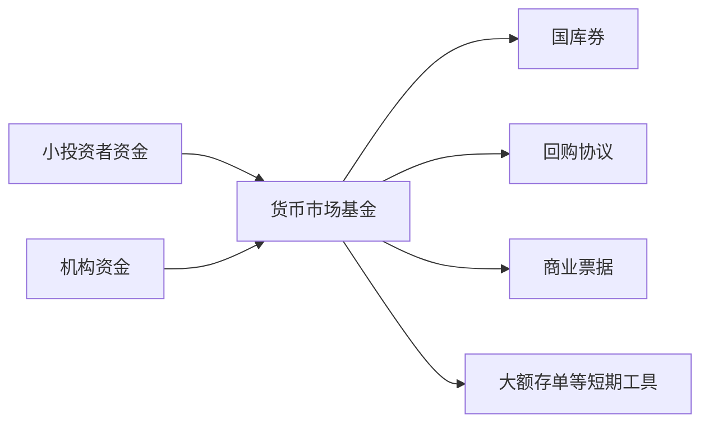

# 20.6 货币市场基金与流动性危机

来源：

- 主线：Mishkin/Eakins Ch.11
- 补充：Mishkin《货币金融学》Ch.2 中货币市场工具
- 延伸：Bodie/Kane/Marcus《Investments》Ch.2, Ch.26

## 小投资者怎样进入批发货币市场

前面反复看到，货币市场是批发市场。许多工具面值很大，交易通常超过 100 万美元，普通个人很难直接买卖商业票据、回购协议、大额可转让存单或 Eurodollar 存款。但个人和小型机构也有短期现金管理需求：他们希望资金比普通现金赚更多利息，又希望随时可以取用。

货币市场基金就是连接小投资者和批发货币市场的中介。它把许多投资者的小额资金集中起来，购买大额货币市场工具。投资者持有的是基金份额，基金持有的是国库券、政府机构证券、回购协议、商业票据和其他短期工具。

货币市场基金因此做了两件事。第一，它把大额批发工具拆成小额可投资份额，让个人也能间接参与货币市场。第二，它提供流动性服务，投资者可以赎回基金份额，而不必自己去卖出底层证券。

## 货币市场基金为什么会流行

货币市场基金在 1970 年代初出现，但早期吸引力有限。因为当时市场利率并没有明显高于银行受监管存款利率。后来通胀和短期利率大幅上升，而银行存款利率受到 Regulation Q 的上限限制。银行储蓄账户收益率被压住，货币市场工具收益率却显著更高，投资者开始大量转向货币市场基金。

货币市场基金还提供便利。券商客户可以把卖出股票或债券后的资金暂时放入货币市场基金，也可以从基金中划出资金购买证券。有些货币市场基金提供支票书写功能，使它们看起来接近银行存款账户。

这解释了货币市场基金的吸引力：

| 特征 | 对投资者的吸引力 |
| --- | --- |
| 投资短期低风险工具 | 风险看起来接近现金 |
| 收益随市场利率变化 | 通常高于受限存款利率 |
| 开放式基金 | 可以申购和赎回 |
| 有些有支票功能 | 使用上接近交易账户 |
| 汇集小额资金 | 小投资者可以间接买大额工具 |

但这里也埋下一个关键问题：货币市场基金像存款，却不是存款。银行存款通常有存款保险，货币市场基金没有同样的保险保护。投资者愿意承担这点差异，是因为长期以来底层工具被认为很安全，基金损失概率很低。

## 货币市场基金的底层资产

货币市场基金通常投资于高质量、短期限工具，包括国库券、政府机构证券、回购协议、商业票据等。不同类型基金风险不同。只买政府证券和国库券的基金风险较低；投资企业商业票据和其他私营部门短期债务的 prime money market funds 风险更高。

许多投资者把货币市场基金当作现金等价物，因为基金通常力图维持每份 1 美元的净值。只要底层资产价格稳定，投资者就感觉自己可以随时按 1 美元赎回 1 美元。

问题在于，基金资产端和负债端存在流动性错配。投资者可以很快赎回基金份额，但基金持有的某些工具不一定能在压力下立刻按接近账面价值卖出。平时这种错配不明显；危机时，大量赎回会迫使基金卖资产，资产市场越不流动，基金越难维持稳定净值。

## “跌破一美元净值”为什么会引发恐慌

货币市场基金的一大心理基础，是投资者相信 1 美元基金份额可以赎回 1 美元。如果基金因为底层资产损失，只能以低于 1 美元的价格赎回，就叫“跌破一美元净值”。

一旦投资者担心基金可能跌破一美元，就会产生先跑优势。早赎回的人可能还按 1 美元拿回资金；晚赎回的人可能承担损失。于是，理性的投资者会争先赎回。这类似银行挤兑：即使很多资产长期看能还本，只要短期无法立即变现，集中赎回就会制造流动性危机。

这条机制和第 13 章银行挤兑、流动性危机高度相似。不同的是，货币市场基金不是银行，传统上不享有同样的存款保险和央行贴现窗口支持。

## 2008 年：商业票据、雷曼和货币市场基金挤兑

2007-2008 年金融危机中，货币市场基金的安全形象受到冲击。许多基金持有商业票据和资产支持商业票据。虽然这些工具期限短，发行人通常信用较好，但危机期间市场突然怀疑底层资产质量和发行人偿付能力。商业票据市场流动性蒸发，基金难以按正常价格出售资产。

雷曼兄弟在 2008 年 9 月破产后，Reserve Primary Fund 因持有相关资产而无法维持每份 1 美元净值，出现跌破一美元净值。这一事件引发全球范围内货币市场基金赎回潮。投资者担心其他基金也可能持有有问题资产，于是迅速撤出资金。

赎回压力威胁到更多基金的流动性。如果基金为了应对赎回而抛售商业票据，商业票据价格下跌、融资市场冻结，企业短期融资会进一步困难。危机可能从基金投资者赎回，传导到企业融资和实体经济。

政府和央行随后采取措施。美国财政部宣布临时担保计划，美联储提供融资支持，帮助购买货币市场基金持有的资产支持商业票据。这些措施恢复了部分信心，使市场避免无序崩溃。

## 2020 年：疫情冲击和 prime money market funds 赎回

2020 年疫情冲击期间，prime money market funds 再次遭遇大额赎回。疫情造成企业现金流压力、失业上升、经济停摆和消费者需求下降。家庭、企业和机构都更想持有直接现金，而不是持有稍有风险的短期基金份额。

prime money market funds 持有的不只是最安全的国库券，还包括公司债务、政府机构债务或政府支持企业相关债务等工具。市场压力上升时，投资者担心这些资产流动性和价格，开始赎回。美联储调整规则，向购买 prime money market funds 份额的金融机构提供贷款，目的是帮助基金满足赎回需求。

这个案例说明，货币市场基金危机不只来自信用损失，也可能来自突发流动性需求。即使底层资产最终损失不大，只要投资者同时要现金，基金也会面临流动性压力。

## 货币市场基金如何连接实体经济

货币市场基金不是孤立投资产品。它们是企业短期融资的重要资金来源。基金购买商业票据、资产支持商业票据、回购协议和其他短期工具，实际上把投资者资金提供给企业、金融机构和政府相关机构。

如果基金遭遇赎回，它们会减少购买商业票据，甚至卖出已有工具。企业就更难通过商业票据市场滚动短期债务，必须转向银行信用额度或削减支出。银行也可能同时承受企业提款压力和市场融资压力。

从宏观角度看，这就是金融加速器的一种表现。短期资金市场紧张会提高融资成本、压缩信用、降低投资和营运支出，最终影响总需求和就业。

## 为什么监管关注货币市场基金

货币市场基金的风险来自它们“像银行但不是银行”的特征。投资者把它们当作安全、可随时赎回的现金管理工具；但基金没有银行资本要求、没有普通存款保险，也不能像银行那样直接获得传统央行最后贷款人支持。它们持有的资产虽然短期，但在压力时期可能不够流动。

监管因此关注几个问题。

第一，基金资产质量。基金应持有高质量、短期限、分散化资产，降低信用损失。

第二，流动性缓冲。基金需要持有足够可立即变现资产，以应对赎回。

第三，净值机制。如果投资者相信自己总能按固定 1 美元赎回，就会在风险出现时有强烈先跑动机。如何设计净值规则、赎回费用或流动性工具，会影响挤兑风险。

第四，央行支持边界。如果危机中政府和央行总是救助，可能降低投资者和基金管理人的风险约束，产生道德风险；但如果完全不救助，挤兑可能扩散到企业融资和宏观经济。

这和前面学过的金融监管逻辑一致：安全网能稳定市场，但也可能诱发风险承担。监管目标是减少危机概率，并在危机时避免无序崩溃。

对资产配置来说，货币市场基金常被放在“现金等价物”栏里，但风险管理上不能把它和银行活期存款完全等同。基金的安全性取决于底层资产质量、加权平均期限、日度和周度流动性、投资者结构以及赎回规则。机构投资者尤其要区分政府型基金和 prime 基金，并考虑在市场压力下赎回是否会形成拥挤交易。现金管理的目标不是只追求最高七日年化收益，而是在收益、可取用性和极端情形下的本金稳定之间取舍。

## 小结

货币市场基金把许多小额资金集中起来，投资于大额短期货币市场工具，使小投资者能够间接进入批发货币市场。它们因为收益高于受限银行存款、流动性强、使用便利而迅速发展。

货币市场基金的风险在于，它们看起来像现金或存款，却不是受存款保险保护的银行存款。基金份额可以快速赎回，但底层资产在危机中未必能快速按账面价值出售。若投资者担心基金跌破一美元净值，就会争先赎回，形成类似银行挤兑的流动性危机。

2008 年雷曼破产后货币市场基金挤兑，以及 2020 年疫情期间 prime money market funds 赎回，都说明短期安全资产市场也可能在信心冲击中冻结。货币市场基金连接投资者、商业票据市场、银行信用额度和企业现金流，因此其稳定性具有宏观金融意义。

## 自测问题

- 货币市场基金如何让小投资者间接参与批发货币市场？
- 为什么货币市场基金看起来像存款，但风险性质不同？
- “跌破一美元净值”为什么会引发赎回潮？
- 2008 年货币市场基金危机如何传导到商业票据市场？
- 监管为什么既要防止货币市场基金挤兑，又要警惕救助带来的道德风险？
- 为什么把货币市场基金当作现金等价物时，仍然要区分政府型基金和 prime 基金？
