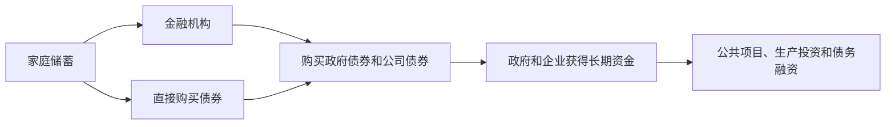
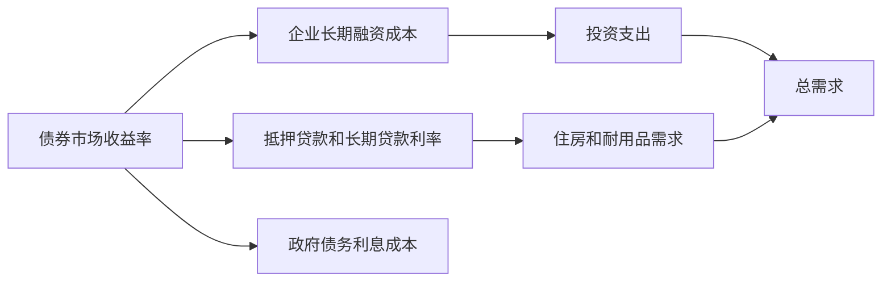

# 21.1 债券市场的功能、参与者与交易逻辑

来源：

- 主线：Mishkin/Eakins Ch.12
- 补充：Mishkin《货币金融学》Ch.4-Ch.6
- 延伸：Bodie/Kane/Marcus《Investments》Ch.14, Ch.15

## 为什么长期融资不能总靠短期市场

上一章讲货币市场，核心是短期资金。企业、银行、政府和基金用货币市场停放现金、调剂流动性、弥补临时资金缺口。货币市场工具通常一年以内到期，很多只有几天或几个月。它们适合解决“现在有钱暂时不用”或“现在缺钱很快会还”的问题。

但经济中还有另一类问题：长期投资。企业要建新工厂，政府要修学校和公路，地方政府要建设基础设施，家庭要为退休积累财富。这些需求不是几天或几个月就结束，而是跨越几年甚至几十年。用短期工具为长期项目融资，会产生很大的再融资风险。

假设一家企业决定建新工厂。工厂需要多年才能收回投资。如果企业用商业票据这种短期工具融资，只要短期利率不变，一切似乎正常；但如果利率上升，企业必须不断以更高利率发行新短期债务来替换到期债务。工厂现金流原本按较低资金成本测算，一旦再融资成本上升，项目可能变得难以承受。

长期债券的作用，就是把长期资金成本提前锁定。借款人支付较高但相对稳定的长期利率，减少未来短期利率上升带来的风险。这个风险降低不是免费的。长期利率通常高于短期利率，因为投资者要求补偿更长期间的不确定性和利率风险。

这就是债券市场作为资本市场核心部分的原因。资本市场服务的是期限超过一年的证券，包括债券、股票和抵押贷款。债券市场则是其中最重要的长期债务市场。

## 债券是什么

债券是一种债务证券。发行人向投资者借钱，并承诺在未来按照约定支付利息和本金。投资者购买债券，本质上是把钱借给发行人；发行人出售债券，本质上是在市场上借款。

债券通常包含几个基本要素。

票面价值，也叫面值、到期价值或本金，是发行人到期必须偿还的金额。例如，一张债券面值为 1000 美元，到期时发行人应偿还 1000 美元。

票面利率是发行人承诺支付的利率。票面利息通常按固定金额定期支付。例如，面值 1000 美元、票面利率 8% 的债券，每年支付 80 美元利息。如果半年付息一次，则每半年支付 40 美元。

到期日是发行人偿还本金的日期。债券期限越长，投资者等待本金回收的时间越长，利率风险和不确定性通常越高。

如果发行人不能按约定支付利息或本金，债券持有人对发行人资产有索取权。这个索取权和股票不同。股票代表所有权，股东是剩余索取者；债券代表债权，发行人必须先向债权人履行偿付义务，之后才轮到股东分享剩余收益。

| 要素 | 含义 |
| --- | --- |
| 面值 | 到期应偿还的本金 |
| 票面利率 | 约定支付利息的利率 |
| 票息支付 | 定期支付给债券持有人的利息 |
| 到期日 | 偿还本金的日期 |
| 债权索取权 | 违约时债券持有人对发行人资产有要求权 |

## 谁发行债券

债券市场的主要发行人包括中央政府、地方政府和公司。

中央政府发行国债，为政府支出和已有债务再融资提供资金。美国财政部发行中长期国债以支持国债融资。与货币市场中的国库券不同，国债票据和国债债券期限超过一年。

州和地方政府发行市政债券，为学校、监狱、道路、水利设施等资本项目融资。地方政府不能发行股票，因为政府不能出售所有权；它们主要通过税收、收费和债券融资。

公司发行债券，为扩张、收购、设备投资、长期项目或债务结构调整融资。公司也可以发行股票，因此公司面对一个重要选择：用债务融资还是用股权融资。债务和股权的组合称为资本结构。

| 发行人 | 为什么发行债券 |
| --- | --- |
| 中央政府 | 为财政赤字、国债再融资和长期支出融资 |
| 州和地方政府 | 为公共基础设施和资本项目融资 |
| 公司 | 为扩张、投资、收购和长期资金需求融资 |

债券市场健康，对企业部门尤其重要。2008-2009 年金融危机中，债券和股票市场接近瘫痪，企业扩张资金枯竭，商业活动减少，失业上升，增长放缓。只有市场信心恢复后，融资渠道重新打开，经济才逐步修复。这说明债券市场不仅是投资者买卖证券的场所，也是实体经济获得长期资金的管道。

## 谁购买债券

债券市场的最终资金来源主要是家庭储蓄。家庭不一定直接购买债券，但它们通过银行、共同基金、养老金、保险公司等金融机构间接持有债券。金融机构把家庭储蓄集中起来，购买政府债券、公司债券和其他资本市场工具。

机构投资者在债券市场中非常重要。保险公司需要长期资产来匹配未来赔付，养老金需要长期收益来支付未来退休金，债券基金为投资者提供多样化债券组合，银行也持有政府债券和其他安全资产管理流动性与收益。

可以把债券市场看成储蓄和长期投资之间的桥梁：

这和宏观经济中的可贷资金市场一致。储蓄是资金供给，投资和政府借款是资金需求。债券市场把这种抽象的“可贷资金”落实为具体证券和交易。

## 一级市场和二级市场

债券交易分为一级市场和二级市场。

一级市场是新债券发行的市场。发行人在这里出售新证券并获得资金。企业或政府首次发行某批债券时，购买者支付资金，资金进入发行人手中。投资银行常帮助发行人承销证券、定价并分销给投资者。

二级市场是已发行债券再交易的市场。投资者之间买卖已有债券，发行人通常不再获得新资金。例如，投资者 A 买了某公司债券，后来卖给投资者 B，这笔交易让 A 获得现金、B 获得债券，但公司本身没有新资金流入。

二级市场为什么重要？第一，它提高流动性。如果投资者知道未来可以卖出债券，就更愿意在一级市场购买长期债券。第二，二级市场价格为一级市场定价提供参考。发行人要发行新债，投资者会看类似旧债在二级市场的价格和收益率。旧债价格越高、收益率越低，发行人新债融资成本越低。

| 市场 | 交易内容 | 资金流向 | 作用 |
| --- | --- | --- | --- |
| 一级市场 | 新发行债券 | 投资者资金流向发行人 | 发行人获得融资 |
| 二级市场 | 已发行债券转手 | 投资者之间转移资金和债券 | 提供流动性和价格发现 |

## 债券市场的交易组织

资本市场证券可以在有组织交易所交易，也可以在场外市场交易。有组织交易所有集中场所和明确规则；场外市场则由交易商和经纪商通过电子系统、电话和报价网络完成交易。

股票市场中，有组织交易所更为公众熟悉。债券市场虽然也有交易所交易，但许多债券交易发生在场外市场。原因是债券种类极多，同一公司可能有多期债券，每期到期日、票面利率、条款不同，单个债券交易不一定像大公司股票那样集中活跃。交易商在债券市场中提供报价、持有库存并撮合交易。

这与货币市场类似：很多交易依赖交易商网络而不是集中大厅。但债券期限更长、条款更复杂，价格对利率和信用风险变化更敏感，因此投资者更需要理解定价和风险。

## 债券市场和利率的关系

债券市场是理解利率的核心场所。前面已经学过，债券价格和利率反向变化。债券承诺未来支付固定现金流；当市场要求收益率上升时，这些固定现金流的现值下降，债券价格下跌；当市场要求收益率下降时，现值上升，债券价格上涨。

债券收益率又影响宏观经济。长期国债收益率常被看作长期无风险利率基准，公司债、市政债、抵押贷款利率等都在此基础上加上信用风险、流动性风险和税收因素。企业投资项目会用长期资金成本折现未来现金流；家庭购房也会受长期利率影响；政府债务利息支出也取决于债券收益率。

因此，债券市场既是金融市场，也是宏观传导机制。中央银行短期利率政策会影响预期未来短期利率、通胀预期和期限溢价，最终反映到长期债券收益率上。长期债券收益率再影响投资、消费和资产价格。

从投资组合角度看，债券市场提供的是两类核心风险暴露：期限风险和信用风险。投资者买长期国债，主要承担利率和通胀预期变化带来的久期风险；买公司债，则在此基础上进一步承担信用利差和违约损失风险。债券市场的收益率曲线因此既是宏观预期的价格，也是组合管理的基准：股票估值、房地产贴现率、企业资本成本和养老金负债折现率，都会直接或间接受它影响。

## 小结

债券市场属于资本市场，服务期限超过一年的长期融资需求。企业和政府发行债券，是为了锁定长期资金、降低再融资风险，并为长期项目筹集资金。债券是发行人对投资者的债务承诺，通常包括面值、票面利率、票息支付和到期日。

债券市场参与者包括发行人和投资者。中央政府、地方政府和公司是主要发行人；家庭通过金融机构或直接投资成为最终资金提供者。一级市场让发行人获得资金，二级市场让已发行债券流通，提高流动性并提供价格发现。

债券市场和宏观经济紧密相连。长期债券收益率影响企业投资、住房融资、政府利息支出和总需求，是货币政策从短期利率传导到实体经济的重要环节。

## 自测问题

- 为什么长期项目不适合完全依赖短期货币市场工具融资？
- 债券的面值、票面利率和到期日分别是什么意思？
- 政府为什么发行债券而不发行股票？
- 一级市场和二级市场对发行人和投资者分别有什么作用？
- 债券收益率为什么会影响企业投资和宏观总需求？
- 为什么债券投资需要同时区分期限风险和信用风险？
