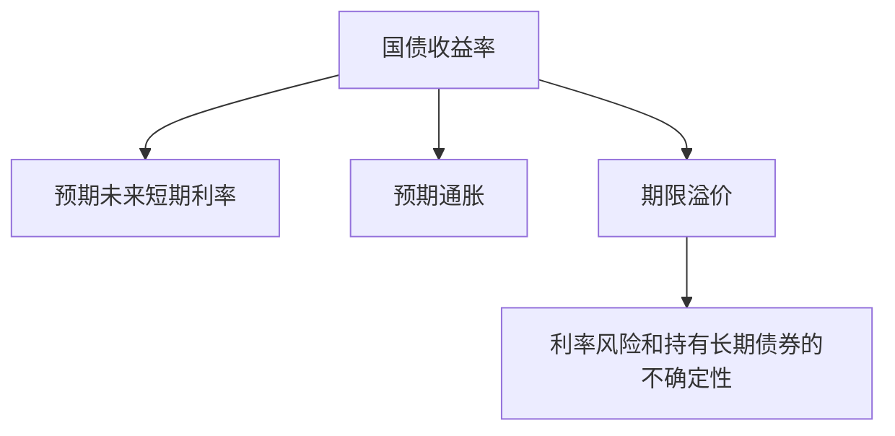

# 21.2 国债、机构债、市政债

来源：

- 主线：Mishkin/Eakins Ch.12
- 补充：Mishkin《货币金融学》Ch.4-Ch.6
- 延伸：Bodie/Kane/Marcus《Investments》Ch.14, Ch.15

## 公共部门为什么需要债券市场

债券市场不只是公司融资的地方。政府部门同样需要长期资金。中央政府可能需要为财政赤字、到期债务再融资、战争或公共支出融资；州和地方政府可能需要修学校、公路、供水系统和交通设施；一些由政府支持的机构可能需要为住房、农业或其他政策目标筹集资金。

这些需求有一个共同点：支出通常发生在现在，收益或服务却分布在未来多年。学校建成后服务许多届学生，公路建成后被长期使用，住房融资改善的是长期居住条件。如果完全要求当期税收覆盖全部建设成本，税负会集中在现在的纳税人身上；如果通过长期债券融资，偿还负担可以分布到未来，也更接近这些公共项目收益的时间分布。

从宏观经济角度看，公共部门债券把财政政策和金融市场连接起来。政府发行债券，意味着它进入可贷资金市场借款。借款规模增加，会提高资金需求；在其他条件不变时，实际利率可能上升，私人投资可能受到挤出。反过来，如果债券融资用于提高生产率的公共资本，例如交通、教育和基础设施，长期供给能力也可能改善。因此，公共部门债券既有融资功能，也会影响储蓄、投资、利率和长期增长。


理解国债、机构债和市政债，就是理解公共部门在债券市场中的不同身份。

## 国债票据和国债债券

美国财政部发行国债来为国家债务融资。按期限区分，国库券期限短于一年，属于货币市场工具；国债票据期限通常为 1 到 10 年；国债债券期限通常为 10 到 30 年。上一章的货币市场已经讨论过国库券，本章关心的是期限更长的国债票据和国债债券。

| 类型 | 期限 | 所属市场 |
| --- | --- | --- |
| 国库券 | 少于 1 年 | 货币市场 |
| 国债票据 | 1 到 10 年 | 资本市场 |
| 国债债券 | 10 到 30 年 | 资本市场 |

国债通常被视为没有违约风险。原因是中央政府拥有征税能力，并且在必要时可以通过货币发行来履行本币债务。这并不意味着国债没有任何风险。长期国债仍然有利率风险和通胀风险。

利率风险来自债券价格和市场利率的反向关系。假设投资者持有一张固定票息国债，如果市场利率上升，新发行国债提供更高收益，旧债固定票息就变得不那么有吸引力，价格会下降。只要投资者持有到期并且政府按时还本付息，名义现金流不会改变；但如果投资者在到期前卖出，可能遭受资本损失。

通胀风险来自货币购买力变化。长期国债支付的是名义金额。如果通胀率高于购买时预期，债券收到的利息和本金在实际购买力上会缩水。20 世纪 70 年代和 80 年代初，长期国债收益率一度低于通胀率；2022 年通胀上升时，也出现过债券利率滞后于通胀的情况。投资者获得了名义利息，却可能承受实际收益下降。

这正好对应宏观经济中“名义变量”和“实际变量”的区分。债券合约写的是名义美元，但投资者真正关心的是这些美元未来能买到多少商品和服务。名义利率、预期通胀和实际利率之间的关系，决定了国债对储蓄者是否有吸引力，也决定了政府实际融资成本。

## 为什么长期国债利率通常高于短期国库券

长期国债和短期国库券都是财政部证券，违约风险都很低，但收益率通常不同。多数时期，10 年期国债利率高于 90 天国库券利率。原因不在于政府违约风险突然变高，而在于期限更长带来更多不确定性。

短期国库券很快到期，投资者较快拿回本金，可以重新投资。长期国债要锁定很多年，期间市场利率、通胀、经济周期都可能变化。如果未来利率上升，长期债券价格会下跌；如果未来通胀高于预期，固定名义付款的实际价值会下降。投资者通常要求额外补偿，才愿意持有长期债券。

不过短期利率往往比长期利率波动更大。短期利率直接受中央银行政策和短期通胀预期影响，经济扩张、衰退、通胀冲击和政策转向都会迅速反映在短端利率上。长期利率包含对未来多年短期利率的平均预期，也包含期限溢价，因此不会像短期利率那样频繁剧烈地随当下数据变化。



这也是收益率曲线具有宏观含义的原因。短端反映当前货币政策更明显，长端反映市场对未来增长、通胀和政策路径的综合判断。

## 通胀保值债券：把本金和价格指数联系起来

普通国债承诺支付固定名义本金和固定名义票息。问题是，如果通胀上升，固定金额的实际价值会下降。为降低这种通胀风险，美国财政部从 1997 年开始发行通胀保值债券，即 TIPS。

TIPS 的票面利率在债券期限内不变，但用于计算利息的本金会根据消费者价格指数调整。到期时，投资者得到通胀调整后的本金和原始面值中较高者。这样，投资者不会因为物价水平上升而让本金实际价值被侵蚀。

可以用一个简化例子理解。假设一张 TIPS 的原始本金为 1000 美元，票面利率为 2%。如果物价指数上升后，调整本金变成 1050 美元，利息就按 1050 美元计算，而不是按原来的 1000 美元计算。普通国债的名义付款固定，TIPS 则把本金基础随通胀调整。

TIPS 的意义不只是保护投资者。它还帮助市场区分名义利率和实际利率。普通国债收益率包含实际利率和预期通胀补偿；TIPS 收益率更接近实际收益率。两者的差额常被用来观察市场隐含的通胀补偿。这个逻辑和宏观经济中的费雪效应相连：名义利率大致反映实际利率加预期通胀。

## STRIPS：把同一张国债拆成多个零息证券

国债还可以被拆分。STRIPS 是把国债的各期利息支付和最终本金支付分离，让每一笔未来现金流成为可以单独交易的零息证券。

例如，一张还剩 5 年到期、每半年付息一次的国债，有 10 次利息支付和 1 次本金支付。拆分后，原来的一张国债变成 11 个证券：每个证券只在某个特定日期支付一次现金流。这些证券没有期间票息，因此也称为零息证券。

STRIPS 的核心不是创造新的政府偿付能力，而是重新包装现金流。不同投资者可能需要不同时间点的确定现金流。一个养老金计划可能更想锁定某一年要支付退休金的现金流；另一个投资者可能想买一个折价发行、到期一次收回本金的零息工具。债券市场通过拆分和重组现金流，使同一组政府付款更适合不同投资需求。

## 机构债：政府支持企业和隐性安全网

除了财政部证券，还有一类由美国政府授权机构或政府支持企业发行的债券，通常称为机构债。它们的发行人包括服务住房、农业、退伍军人等政策目标的机构或政府支持企业。

机构债通常没有财政部国债那样的明确政府担保，但投资者常认为政府不会轻易让这些机构违约。原因包括：这些机构承担国会认为具有公共意义的任务；它们的资产往往由贷款等项目支持；部分机构可以使用与财政部相关的信用额度；如果它们失败，可能冲击住房贷款和其他重要信用市场。

这种“不是明确担保、却被市场认为有政府支持”的结构非常重要。它降低了机构债融资成本，使相关机构能更便宜地筹资，进而支持住房贷款等政策目标。但它也会带来道德风险。如果投资者和管理层相信最终有政府兜底，机构可能承担过多风险。

2007-2009 年金融危机中，Fannie Mae 和 Freddie Mac 的问题说明了这一点。这两家公司是政府支持企业，承担促进住房融资的政策角色，同时又有私人股东、利润目标和管理层激励。危机前，它们大量持有或担保抵押贷款和抵押贷款支持证券，其中包含风险较高的次级贷款和 Alt-A 资产；资本缓冲却很薄。当住房价格下跌、次贷违约增加时，它们损失扩大，投资者信心下降。由于这两家机构在抵押贷款市场中的地位太重要，政府最终接管并提供支持。


这个案例把前面几章的内容串起来：政府安全网降低融资成本，但如果监管不足，会加剧道德风险；住房金融扩张会推高资产价格；资产价格下跌又会损害金融机构资产负债表，导致信用收缩，并通过投资、消费和总需求影响宏观经济。

## 市政债：地方政府的长期融资工具

市政债券由州、县、市等地方政府发行，用于公共项目融资，例如学校、公用事业、道路和交通系统。它和中央政府国债不同：地方政府不能发行货币，也不能像中央政府那样依靠国家货币权力偿付债务。因此，市政债有违约风险。

市政债的一个重要特点是，许多用于基本公共项目的市政债利息可以免征联邦所得税。税收优惠使投资者愿意接受较低的票面利率。对地方政府来说，这意味着借款成本降低；对高边际税率投资者来说，较低的免税收益率可能比看起来更高的应税债券收益率更有吸引力。

比较应税债券和免税市政债时，要看税后收益。公式是：

```text
等价免税利率 = 应税利率 × (1 - 边际税率)
```

如果一张公司债的应税利率为 5%，投资者边际税率为 28%，它对应的税后利率为：

```text
5% × (1 - 28%) = 3.6%
```

如果一张免税市政债收益率为 3.75%，它高于 3.6%，对这个投资者就更有吸引力。这里的重点不是记公式，而是理解税收改变资产需求。免税待遇提高了市政债的税后回报，使需求增加、价格上升、收益率下降，地方政府因此可以用更低成本融资。

## 一般责任债和收益债

市政债主要分为一般责任债和收益债。

一般责任债没有特定项目现金流作为还款来源，而是由发行政府的整体信用支持。所谓整体信用，意味着地方政府承诺动用可用资源履行偿债义务，通常包括税收能力。由于还款来源是政府整体财政能力，许多一般责任债发行需要纳税人批准。

收益债则由特定项目产生的现金流偿还。例如，地方政府为修收费公路发行债券，未来用过路费偿还本金和利息。如果项目收入不足，债券可能违约。收益债的风险更直接地取决于项目本身的需求、成本和运营表现。

| 类型 | 还款来源 | 风险重点 |
| --- | --- | --- |
| 一般责任债 | 发行政府整体税收和信用 | 地方财政状况、税基、政治约束 |
| 收益债 | 特定项目现金流 | 项目收入、成本超支、使用需求 |

收益债的风险可以很具体。1983 年，Washington Public Power Supply System 使用收益债为两个核电站建设融资。由于能源价格下降和成本严重超支，项目没有投入运营，债券购买者遭受巨大损失。这个例子说明，公共项目并不自动安全；项目现金流失败时，收益债投资者可能面临损失。

## 市政债也会违约

市政债有税收优惠，但不是无风险资产。地方政府不能印钞，税收能力也有限。经济衰退时，地方税收下降，公共支出压力上升，违约风险会增加。如果提高税率过高，居民和企业可能迁出，税基反而受损。

这和宏观经济周期密切相关。衰退会同时影响市政债的两个方面：一方面，地方政府收入减少、财政压力增加；另一方面，投资者风险偏好下降，要求更高风险补偿，市政债融资成本可能上升。此时，如果地方政府削减支出或推迟项目，会进一步压低地方总需求。

市政债市场因此是地方财政和宏观波动之间的连接点。经济繁荣时，税收充足、融资便利，地方建设更容易推进；经济疲弱时，税收下降、风险利差扩大，地方政府反而更难融资，而这时公共服务和逆周期支出需求可能更强。

在投资管理中，公共部门债券不是一个同质资产类别。名义国债常被用作安全资产、抵押品和收益率曲线基准；TIPS 更适合表达实际利率和通胀补偿；机构债收益率通常包含对政府支持强弱的判断；市政债则带有明显税收客户效应，高税率投资者的税后需求会压低其税前收益率。选择这些债券时，投资者要把违约风险、通胀保护、流动性、税后收益和政策安全网分开看。

## 小结

国债、机构债和市政债都是公共部门或准公共部门融资工具，但风险来源不同。国债违约风险最低，却仍有利率风险和通胀风险；TIPS 通过把本金与价格指数相连来降低通胀风险；STRIPS 把国债现金流拆成零息证券，满足不同期限现金流需求。

机构债服务政策目标，融资成本较低，但政府支持预期可能带来道德风险。Fannie Mae 和 Freddie Mac 的危机说明，隐性安全网如果缺乏足够监管，可能使住房金融风险积累，最终转化为财政和宏观风险。

市政债由地方政府发行，常用于公共基础设施。税收优惠降低了地方政府融资成本，但市政债并非没有违约风险。一般责任债依赖地方政府整体财政能力，收益债依赖特定项目现金流。理解这些债券，需要同时看现金流、税收、违约风险、利率风险和宏观经济周期。

## 自测问题

- 为什么国债没有明显违约风险，但仍然有利率风险和通胀风险？
- 国债票据、国债债券和国库券在期限上有什么区别？
- TIPS 如何保护投资者免受通胀侵蚀？
- 机构债为什么可能带来道德风险？
- 市政债的免税待遇为什么会降低地方政府融资成本？
- 一般责任债和收益债的主要区别是什么？
- 为什么 TIPS 收益率和普通国债收益率的差额能帮助观察通胀补偿？
