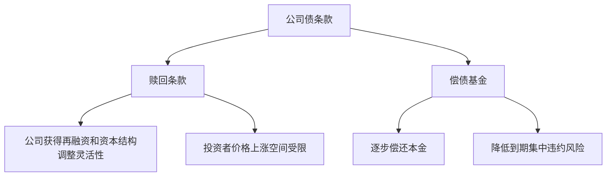

# 21.3 公司债、可转换债与高收益债

来源：

- 主线：Mishkin/Eakins Ch.12
- 补充：Mishkin《货币金融学》Ch.4-Ch.6

## 公司为什么发行债券

大型公司需要长期资金时，可以发行股票，也可以发行债券。发行股票意味着出售所有权，新增股东分享未来利润，并参与剩余索取；发行债券则意味着借钱，公司承诺按期支付利息和本金。债券不会直接稀释原股东所有权，但会增加固定偿付压力。

公司债在现实中非常重要。很多年份里，公司通过债券市场筹集的资金远多于股票市场。原因并不难理解。成熟公司拥有稳定现金流，愿意用债务融资扩张、收购、建设新项目或调整资本结构；投资者也愿意购买债券，因为债券的现金流比股票股利更确定，而且在公司出现困难时，债权人通常先于股东获得偿付。

这和宏观经济中的投资支出直接相关。企业投资取决于项目未来收益和融资成本。公司债市场越顺畅，企业越容易把储蓄转化为资本支出；公司债收益率上升，意味着长期资金成本上升，一些边际投资项目会被推迟或取消。金融危机中，公司债市场冻结会迅速传导为投资下降、生产放缓和就业压力。

公司债看似只是“借钱”，但它实际上是宏观储蓄、企业投资和金融风险之间的连接点。

## 公司债的基本结构

多数公司债有固定面值，常见面值为 1000 美元，并按半年支付利息。假设一张公司债面值 1000 美元，票面利率 8%，每年利息为 80 美元；如果半年付息一次，每半年支付 40 美元。到期时，公司偿还本金。

公司债通常附有债券契约，也就是 indenture。债券契约是债权人和发行公司之间的法律合同，说明债权人的权利、公司的义务、利率、到期日、抵押品、限制性条款、赎回条款、可转换条款等内容。

为什么需要这么详细的合同？因为债权人不是公司所有者，也不直接控制公司经营。公司经理通常由代表股东利益的董事会任免和激励。股东希望公司价值最大化，但股东的收益结构和债权人不同：如果公司冒险成功，股东获得大部分上行收益；如果冒险失败，债权人承担较大损失。这就产生道德风险。

例如，公司发行债券后，管理层可能用资金投资更高风险项目。项目成功时股价上涨，股东受益；项目失败时，公司偿债能力下降，债权人受损。债权人预见到这种风险，就会要求更高利率，或者在债券契约中加入限制性条款。

## 限制性条款：债权人如何保护自己

限制性条款是债券契约中约束公司行为的规则。它们的目的不是替公司经营，而是减少公司做出损害债权人利益的行为。

常见限制包括限制公司支付过高股利，防止公司把现金分给股东后削弱偿债能力；限制公司新增债务，防止后来债权人稀释原债权人的安全垫；限制并购、资产出售或其他重大财务政策，防止公司突然改变风险结构。

限制性条款越强，债券对投资者越安全，投资者要求的利率通常越低。反过来，公司获得的经营灵活性越少。债券合同因此是在融资成本和经营自由之间做权衡。

| 条款目的 | 可能限制的行为 | 对债权人的作用 | 对公司的代价 |
| --- | --- | --- | --- |
| 保留现金 | 高额股利、股票回购 | 提高偿债能力 | 股东分配受限 |
| 控制杠杆 | 继续大量举债 | 降低违约风险 | 融资灵活性下降 |
| 控制风险变化 | 高风险并购、资产出售 | 防止风险突然上升 | 战略选择受限 |

这和前面“金融机构为何存在”中的信息不对称逻辑一致。债权人无法完全观察公司未来行动，只能通过契约、抵押品、评级和持续监督降低逆向选择与道德风险。

## 赎回条款和偿债基金

很多公司债包含赎回条款。赎回条款赋予发行公司在到期前按约定价格买回债券的权利。对公司来说，这是一种灵活性；对投资者来说，它限制了债券价格上涨空间。

假设公司发行一张 10% 票息债券。几年后市场利率下降到 6%，原债券的高票息变得很有价值，债券价格会上涨。此时公司可能选择赎回旧债，再以较低利率发行新债。投资者本来可以享受高票息债券价格上涨带来的收益，但赎回条款让公司提前结束这份合约。因此，投资者通常不喜欢赎回条款，会要求更高收益率补偿。

公司仍然愿意发行可赎回债券，是因为它有几个好处。第一，利率下降时可以再融资，降低未来利息成本。第二，如果债券契约限制了公司未来活动，公司可以通过赎回旧债摆脱限制。第三，公司可以调整资本结构，例如在现金流充裕、投资机会减少时降低债务负担。

偿债基金也是常见条款。偿债基金要求公司每年偿还一部分债券本金，而不是等到到期日一次性偿还全部债务。对债权人来说，这降低了到期时公司无力偿还大额本金的风险；对公司来说，债券更安全可以降低利率，但也意味着每年必须安排现金偿付。

## 可转换债券：债券加股票选择权

有些公司债可以转换为普通股。可转换债券赋予债券持有人在一定条件下把债券换成公司股票的权利。它的本质是“债券 + 股票选择权”：如果公司前景很好、股价大幅上涨，投资者可以转换成股票分享上行收益；如果公司表现一般，投资者仍可以保留债权人的固定利息和本金请求权。

可转换债券对投资者有吸引力，因此公司可以用较低利率发行。投资者接受较低票息，是因为转换权本身有价值。

公司为什么愿意发行可转换债券？一个重要原因与信息不对称有关。公司内部管理层比外部投资者更了解公司价值。如果公司直接发行股票，市场可能怀疑管理层认为股票被高估，所以趁价格高时卖股票。这种怀疑会使股价承压。可转换债券提供一种折中方式：如果管理层确实相信公司未来表现好，可以先发行债券；未来股价上涨时，债券持有人转换成股票，融资最终类似股权融资，但转换价格可能更符合公司成长后的价值。

不过，可转换债券也有代价。若公司成功，转换会稀释原股东权益；若公司失败，债务仍然存在，公司需要偿付利息和本金。它不是免费融资，而是把债务保护和股权上行结合在同一工具中。

## 抵押、无抵押和清偿顺序

公司债还可以按是否有抵押品以及违约时的清偿顺序区分。

有担保债券附有抵押品。例如，公司为建设某栋建筑发行抵押债券，建筑本身可以作为抵押资产。如果公司不能按期付款，债权人有权要求处置抵押资产以获得偿付。设备信托证书也属于有担保债券，抵押品可以是飞机、重型设备等有形资产。因为有抵押品，这类债券风险较低，利率通常也较低。

无担保债券没有特定抵押品，依靠发行公司的整体信用支持。若公司违约，债权人只能通过法律程序要求公司偿付，并且不能优先获得已经抵押给其他债权人的资产。无担保债券风险高于类似的有担保债券，因此利率通常更高。

次级债券的清偿顺序更靠后。如果公司违约，次级债权人只有在优先债权人得到充分偿付后才能获得偿付。因此，次级债券承担更高违约损失风险，通常需要更高收益率。

| 类型 | 是否有特定抵押 | 违约时地位 | 通常利率 |
| --- | --- | --- | --- |
| 有担保债券 | 有 | 对抵押资产有优先请求 | 较低 |
| 无担保债券 | 无 | 依赖公司整体信用 | 较高 |
| 次级债券 | 通常无或地位较低 | 在优先债务之后受偿 | 更高 |

这些分类背后的统一逻辑是风险定价。债权人越可能按时收到现金流，要求的利率越低；越可能遭受违约损失，要求的利率越高。

## 浮动利率债券：应对利率波动

固定利率债券的票息不随市场利率变化，这会造成利率风险。市场利率上升时，旧固定票息债券价格下降；市场利率下降时，旧固定票息债券价格上升。对投资者和发行人来说，利率波动越大，固定利率合约的不确定性越明显。

浮动利率债券把票面利率与某个市场利率相连，并定期调整。例如，债券利率可能随国债利率或其他参考利率变化。这样，市场利率上升时，债券票息也随之上升；市场利率下降时，票息也下降。

浮动利率债券降低了投资者面对的价格波动风险，因为现金流会随市场利率调整。但它把一部分利率风险转移给发行人：当市场利率上升时，公司利息支出也会上升。对宏观经济来说，这说明利率上升不仅通过新融资影响企业，也会通过浮动利率债务直接提高已有债务的偿付压力。

## 高收益债：风险、流动性和市场形成

信用评级较低的公司债通常被称为高收益债，也常被称为垃圾债。评级达到 Moody's Baa 或 Standard & Poor's BBB 及以上，通常被视为投资级；低于这个水平，通常属于投机级。投机级不代表一定违约，而是说明发行人偿债能力更依赖有利的商业、经济和金融条件。

高收益债的收益率高，是因为投资者要补偿更高违约风险、更低流动性和更大不确定性。经济扩张时，公司收入增长、违约率较低，投资者愿意承担风险，高收益债需求增加，利差可能收窄。经济衰退或金融危机时，投资者转向安全资产，高收益债价格下跌、利差扩大，融资条件迅速恶化。

20 世纪 70 年代以前，新发行的投机级债券很少。许多垃圾债原本是投资级债券，后来因公司财务恶化而被降级。由于缺乏成熟二级市场，投资者很难出售这些债券，流动性差进一步压低需求。

20 世纪 70 年代末和 80 年代，高收益债市场发展起来。投资银行通过承销、做市和提供持续交易支持，提高了这些债券的流动性。投资者如果相信高收益足以补偿违约风险，就愿意购买。高收益债也被大量用于杠杆收购：公司通过发行大量债务收购其他企业，再出售部分资产或依靠未来现金流偿债。

这个市场的兴起说明了一个重要金融逻辑：风险资产能否融资，不只取决于风险本身，还取决于是否有价格、流动性、信息和持续交易机制。风险可以被定价，但如果投资者无法判断风险、无法退出头寸，市场就很难发展。

## 高收益债和宏观周期

高收益债与宏观周期联系尤其紧密。投资级公司债的违约概率较低，主要受利率风险和信用利差变化影响；高收益债则更依赖企业利润、现金流和融资环境。经济放缓时，销售下降、利润收缩，债务负担变重，投机级公司更容易违约。投资者预期违约上升，会要求更高收益率，公司再融资难度进一步增加。

这会形成金融加速器机制。经济下行导致企业资产负债表恶化，风险利差上升；利差上升提高融资成本，使企业削减投资、裁员或出售资产；投资和就业下降又压低总需求，使经济进一步走弱。

因此，高收益债利差常被用作观察金融压力和信用周期的指标。它不是单纯的债券市场价格，而是反映投资者对未来违约、流动性和宏观经济环境的综合判断。

## 小结

公司债是企业长期融资的重要工具。它让企业在不直接出售所有权的情况下筹集资金，但也带来固定偿付义务。债券契约、限制性条款、赎回条款、偿债基金、抵押品和清偿顺序，都是围绕债权人保护、公司灵活性和融资成本之间的权衡设计出来的。

可转换债券把债券和股票选择权结合起来，让投资者在保留债权保护的同时分享股价上涨收益，也帮助公司在信息不对称环境下融资。高收益债则展示了风险和收益的直接交换：信用风险越高，投资者要求的补偿越高；经济下行时，高收益债市场会更敏感地反映融资压力。

从宏观角度看，公司债市场影响企业投资、总需求和金融周期。利率上升、信用利差扩大或市场流动性恶化，都会提高公司融资成本，并可能通过投资和就业传导到实体经济。

## 自测问题

- 公司为什么发行债券而不是只发行股票？
- 债券契约为什么需要限制公司行为？
- 赎回条款为什么对公司有利、对投资者不利？
- 可转换债券为什么可以被理解为“债券 + 股票选择权”？
- 有担保债券、无担保债券和次级债券的风险差异在哪里？
- 为什么高收益债利差会随经济衰退而扩大？
