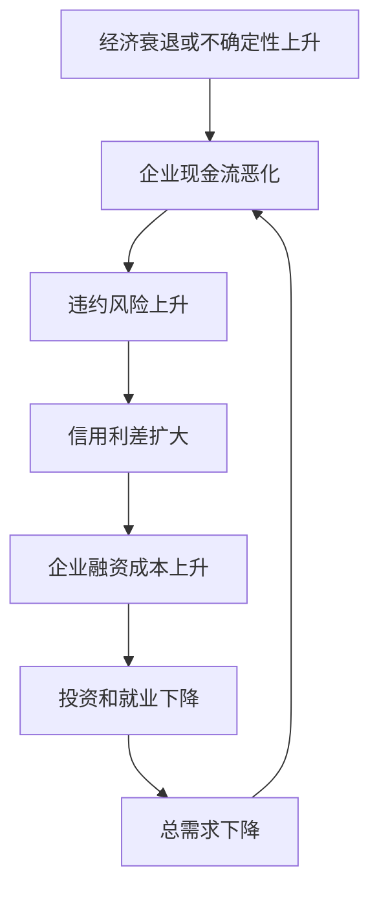

# 21.4 债券评级、信用风险与信用利差

来源：

- 主线：Mishkin/Eakins Ch.12
- 补充：Mishkin《货币金融学》Ch.4-Ch.6

## 为什么同期限债券的利率不同

如果两张债券期限相同，是否应该有同样的利率？直觉上也许会这样想：都是 10 年后还本，为什么收益率不同？但债券投资者真正关心的不是“名义上承诺支付什么”，而是“这些承诺有多大概率兑现、需要多快变成现金、税后收益是多少”。

因此，同期限债券的利率会因为风险、流动性和税收待遇不同而不同。10 年期美国国债、10 年期 AAA 公司债、10 年期 BBB 公司债、10 年期市政债，期限可能相近，但收益率通常不同。它们之间的利率差异，被称为利率的风险结构。

风险结构的核心问题是：当其他条件尽量相同，债券自身属性如何改变投资者要求的收益率。最重要的属性有三个：

| 属性 | 问题 | 对收益率的影响 |
| --- | --- | --- |
| 违约风险 | 发行人会不会不能按时还本付息 | 风险越高，收益率越高 |
| 流动性 | 能不能快速、低成本卖出 | 流动性越低，收益率越高 |
| 税收待遇 | 利息收入税后能留下多少 | 税收优惠越强，税前收益率可越低 |

债券评级、信用风险和信用利差都围绕第一个因素展开，但现实中的利差往往同时包含违约风险和流动性风险。

## 违约风险和风险溢价

违约是指债券发行人不能或不愿按承诺支付利息或本金。公司如果遭遇严重亏损、现金流枯竭或融资渠道关闭，就可能暂停支付利息，甚至无法偿还本金。地方政府如果税收下降、财政负担过重，也可能违约。中央政府本币国债通常被视为无违约风险资产，因为中央政府可以征税，也可以发行货币履行本币债务。

有违约风险的债券，必须提供比无违约风险债券更高的利率，投资者才愿意持有。这个额外利率就是风险溢价。更准确地说，风险溢价是同期限风险债券利率与同期限无违约风险国债利率之间的差额。

```text
风险溢价 = 风险债券利率 - 同期限无违约风险债券利率
```

假设同期限国债收益率为 4%，某公司债收益率为 6%，那么这张公司债相对于国债的风险溢价为 2 个百分点。这个 2 个百分点不是“免费高收益”，而是投资者为承担违约可能性、价格波动和流动性不足所要求的补偿。

违约风险上升时，公司债需求会下降。投资者认为公司更可能不能支付利息或本金，于是减少购买该公司债，转而购买更安全的国债。公司债价格下降、收益率上升；国债需求增加、价格上升、收益率下降。两者收益率差距扩大。


这个过程解释了为什么危机时期常出现“安全资产抢购”。投资者不是简单地厌恶所有债券，而是从风险债券转向更安全、更流动的国债。

## 债券评级的作用

投资者需要判断发行人违约概率，但单个投资者很难持续分析大量公司和地方政府。信用评级机构提供债券评级，评估公司债和市政债的违约风险。主要评级机构包括 Moody's、Standard & Poor's 和 Fitch。

评级越高，表示违约风险越低。AAA 或 Aaa 通常代表最高信用质量；BBB 或 Baa 及以上通常被称为投资级；低于 BBB 或 Baa 的债券被称为投机级，也常称为高收益债或垃圾债。

| 大致等级 | 含义 | 市场称呼 |
| --- | --- | --- |
| AAA/Aaa | 最高质量，偿付能力极强 | 投资级 |
| AA/Aa、A/A | 高质量或中上质量 | 投资级 |
| BBB/Baa | 中等质量，仍具备投资级特征 | 投资级 |
| BB/Ba 及以下 | 依赖较有利环境，违约风险更高 | 投机级/高收益债 |
| D | 已违约 | 违约债券 |

评级影响债券收益率。评级高的债券风险较低，投资者要求的收益率较低；评级低的债券风险较高，必须提供更高收益率。AAA 公司债通常比 BBB 公司债利率低，BBB 公司债又通常比国债利率高。

评级还影响机构投资者行为。一些基金、保险公司或养老金的投资规则可能限制其持有投机级债券。如果一张债券被降级到投资级以下，不仅风险评价变差，还可能引发强制卖出，进一步压低价格、推高收益率。

## 评级不是风险本身

评级很重要，但不能把评级等同于真实风险。评级是对违约概率的判断，不是担保。评级机构可能判断错误，也可能受到利益冲突影响。

2007-2009 年金融危机前，评级机构在结构化金融产品中扮演了争议角色。一些由次级抵押贷款现金流支持的复杂证券获得了很高评级。问题在于，评级机构不仅给这些产品评级，还向发行方提供如何设计产品以获得较高评级的建议，并从评级服务中获得费用。当住房价格下跌、次级贷款违约上升时，许多原本高评级产品被连续下调，投资者损失巨大，持有这些资产的金融机构也陷入困境。

这个案例说明，评级降低了信息成本，却不能消除信息问题。投资者如果只看评级而不理解底层资产、杠杆结构和宏观风险，就可能低估真正的违约风险。评级机构本身也需要监管和市场约束。

## 信用利差为什么随周期变化

信用利差不是固定的。经济扩张时，企业销售增长、利润改善、现金流充足，违约概率下降。投资者风险偏好较高，愿意持有公司债和高收益债，信用利差往往收窄。

经济衰退时，情况相反。收入下降、需求减少、利润收缩，企业现金流恶化。评级较低的公司更难再融资，违约风险上升。投资者减少风险债券需求，转向国债等安全资产，信用利差扩大。

历史上，经济危机时期信用利差往往急剧上升。大萧条期间，商业失败和违约大量增加，低评级公司债相对国债的风险溢价显著扩大。2008 年金融危机中，投资者强烈追求安全资产，公司债尤其是低评级债券遭到抛售，信用利差上升。2020 年疫情冲击初期，封锁和社交距离措施打击企业现金流，Baa 公司债相对国债的利差在短时间内大幅扩大。

这里的宏观逻辑很重要。信用利差扩大不仅反映经济变差，还会进一步使经济变差。企业融资成本上升后，会减少投资、压缩库存、推迟扩张或裁员。投资下降和就业压力又降低总需求，使衰退加深。



这就是金融市场和宏观经济相互放大的机制。债券市场不是被动反映实体经济，它也会通过信用条件影响实体经济。

## 流动性也会进入利差

公司债相对国债的利差，通常不只是违约风险补偿，还包括流动性补偿。流动性是指资产能否快速、低成本地变成现金。美国国债市场规模大、交易活跃、买卖成本低，是长期债券中流动性最高的市场之一。单个公司发行的债券数量有限，条款多样，交易不一定频繁，卖出时可能需要让价。

如果公司债流动性下降，投资者会减少需求。公司债价格下跌、收益率上升；相对更流动的国债更受欢迎，价格上升、收益率下降。于是公司债和国债之间的利差扩大。

因此，所谓“风险溢价”常常更准确地说是“风险与流动性溢价”。在平稳时期，投资者可能低估流动性需求；危机时期，大家同时想卖出风险资产、持有现金或国债，流动性突然变得极其珍贵，利差会迅速扩大。

## 税收待遇为什么能压低市政债利率

市政债提供一个看似反常的例子：它有违约风险，也不如国债流动，却常常可以用低于国债的税前利率融资。原因是许多市政债利息免征联邦所得税。税收优惠提高了市政债的税后回报。

假设投资者处于 40% 边际税率。某国债面值 1000 美元，票息 100 美元，税前利率 10%。税后只能留下 60 美元，税后收益率为 6%。如果某市政债也卖 1000 美元，票息 80 美元，税前利率只有 8%，但利息免税，税后仍为 8%。对这个投资者来说，市政债税前利率更低，却税后收益更高。

税收优惠提高市政债需求，使其价格上升、收益率下降；同时，部分投资者从国债转向市政债，国债需求相对下降，国债收益率可能相对上升。这解释了为什么市政债在很多时期可以有低于国债的税前利率。

税率变化也会影响这个关系。如果高收入者所得税率下降，免税市政债的税收优势变小，市政债需求下降，价格下降、收益率上升；国债相对更有吸引力，需求增加，收益率下降。这样，市政债相对国债的利率可能上升。

## 信用利差如何连接货币政策

中央银行通常直接控制短期政策利率，但企业和地方政府真正面对的是更广泛的信用条件。政策利率下降，并不必然意味着公司债融资成本同幅下降。如果危机中信用利差大幅扩大，公司债收益率可能仍然很高。

可以把企业融资成本拆成两部分：

```text
公司债收益率 ≈ 同期限国债收益率 + 信用/流动性利差
```

扩张性货币政策可能降低国债收益率，但如果违约风险和流动性压力上升，利差会抵消一部分效果。2007-2009 年金融危机和 2020 年疫情冲击中，央行除了降低政策利率，还通过流动性工具和资产购买稳定市场，目的之一就是压低异常扩大的风险和流动性溢价，让信用市场重新运转。

这也解释了为什么宏观政策不能只看一个利率。联邦基金利率、国债收益率、公司债利差、抵押贷款利率和银行贷款标准共同决定总需求。信用利差是货币政策传导是否顺畅的重要观察窗口。

## 小结

同期限债券利率不同，是因为债券的违约风险、流动性和税收待遇不同。违约风险越高，投资者要求的风险溢价越高；流动性越差，投资者要求额外补偿；税收优惠则可以让某些债券以较低税前收益率吸引投资者。

债券评级帮助投资者判断违约概率，但评级不是担保。评级错误和利益冲突可能放大金融风险。投资级和投机级的区分影响债券定价，也影响机构投资者能否持有相关资产。

信用利差具有强烈宏观含义。经济衰退、金融危机或不确定性上升时，违约风险和流动性压力增加，信用利差扩大，企业融资成本上升，并通过投资、就业和总需求反过来影响经济。

## 自测问题

- 什么是风险溢价？它和信用利差有什么关系？
- 为什么违约风险上升会同时推高公司债收益率、压低国债收益率？
- 投资级债券和投机级债券如何区分？
- 为什么评级不能被理解为违约担保？
- 公司债相对国债的利差为什么包含流动性补偿？
- 市政债为什么可能以低于国债的税前利率发行？
