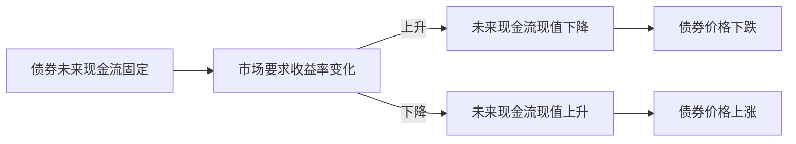
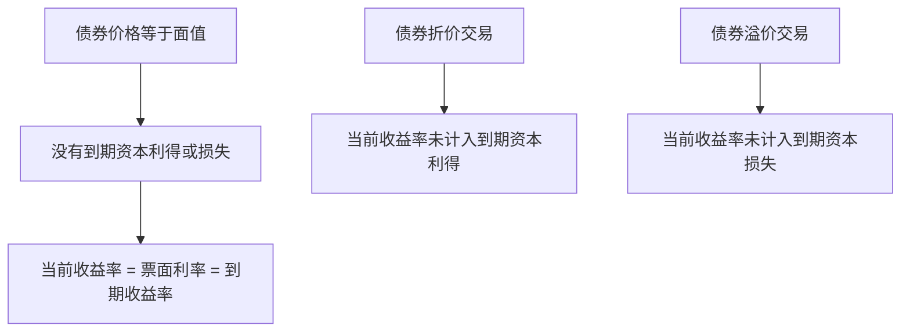

# 21.5 债券定价、当前收益率与到期收益率

来源：

- 主线：Mishkin/Eakins Ch.12
- 补充：Mishkin《货币金融学》Ch.4-Ch.6

## 债券价格为什么会变

债券合约写得很清楚：票面利率是多少，多久付一次息，到期还多少本金。既然现金流已经约定，债券价格为什么每天还会变？

答案是：债券价格不是由票面金额决定的，而是由未来现金流的现值决定的。债券承诺未来支付一组现金流，投资者今天愿意付多少钱，取决于这些现金流用什么利率折回今天。这个折现率不是债券发行时写在合约里的票面利率，而是市场上同风险、同期限债券当前要求的收益率。

如果市场利率上升，未来固定现金流折现后的现值下降，债券价格下跌。如果市场利率下降，未来固定现金流折现后的现值上升，债券价格上涨。



这个逻辑和前面学习现值时完全一致。一笔未来 100 美元，如果市场利率是 10%，今天价值低于未来 100 美元；如果市场利率更高，今天价值更低；如果市场利率更低，今天价值更高。债券只是把很多笔未来现金流组合在一起。

## 先识别现金流，再选择折现率

任何金融资产估值都要先回答三个问题：

第一，持有这个资产会收到哪些现金流？对普通息票债来说，现金流包括定期票息和到期本金。

第二，投资者要求什么折现率？折现率应该反映市场上同期限、同风险证券的收益率。如果一张公司债风险较高，折现率应高于国债；如果债券期限更长、利率风险更大，也可能要求更高收益率。

第三，用这个折现率把未来现金流折回今天。所有未来现金流现值相加，就是债券价格。

```text
债券价格 = 所有未来票息的现值 + 到期本金的现值
```

这里最容易混淆的是票面利率和市场利率。票面利率只用来计算债券每期付多少利息；市场利率用于折现这些利息和本金。票面利率是合约条款，市场利率是当前机会成本。

| 概念 | 用途 | 是否随市场变化 |
| --- | --- | --- |
| 票面利率 | 计算票息现金流 | 通常固定 |
| 市场利率/要求收益率 | 折现未来现金流 | 随市场变化 |
| 债券价格 | 未来现金流现值 | 随市场利率变化 |

## 半年度付息债券如何定价

现实中，许多公司债每半年支付一次利息。如果一张债券面值 1000 美元，票面利率 10%，每年票息为 100 美元；如果半年付息，每半年支付 50 美元。

定价时也要把年市场利率换成半年期利率。假设市场上同风险、同期限债券的年收益率为 12%，半年折现率就是 6%。如果债券还有两年到期，就有四个半年期。持有人会收到四次 50 美元票息，并在最后一次同时收到 1000 美元本金。

现金流时间线如下：

| 时间 | 现金流 |
| --- | --- |
| 0.5 年 | 50 美元 |
| 1.0 年 | 50 美元 |
| 1.5 年 | 50 美元 |
| 2.0 年 | 50 美元 + 1000 美元本金 |

债券价格就是这四笔票息和本金按 6% 半年利率折现后的总和：

```text
P = 50/(1.06) + 50/(1.06)^2 + 50/(1.06)^3 + 50/(1.06)^4 + 1000/(1.06)^4
```

计算结果约为 965.35 美元。它低于 1000 美元面值，因为这张债券票面利率为 10%，而市场要求收益率为 12%。新债能提供更高收益，旧债必须降价，才能让买方最终获得接近市场水平的收益率。

## 折价、平价和溢价

债券价格与面值之间的关系，可以分为折价、平价和溢价。

如果债券价格低于面值，称为折价交易。折价通常出现在市场利率高于票面利率时。旧债票息太低，必须降价才能吸引投资者。

如果债券价格等于面值，称为平价交易。此时票面利率等于市场要求收益率。投资者按 1000 美元买入 1000 美元面值债券，收到的票息正好与市场收益水平一致。

如果债券价格高于面值，称为溢价交易。溢价通常出现在市场利率低于票面利率时。旧债票息高于新债市场收益，投资者愿意多付钱买入。

| 市场利率与票面利率关系 | 债券价格 | 交易状态 | 直觉 |
| --- | --- | --- | --- |
| 市场利率 > 票面利率 | 低于面值 | 折价 | 票息偏低，价格必须下降 |
| 市场利率 = 票面利率 | 等于面值 | 平价 | 票息正好符合市场要求 |
| 市场利率 < 票面利率 | 高于面值 | 溢价 | 票息偏高，投资者愿意加价 |

这个表背后的统一逻辑仍然是现值。债券价格调整到一个水平，使买入者从未来现金流中获得市场要求的收益率。

## 当前收益率

当前收益率是一个常见但不完整的收益率指标。它等于年度票息除以债券当前市场价格：

```text
当前收益率 = 年度票息 / 当前债券价格
```

假设一张债券面值 1000 美元，票面利率 10.95%，每年票息为 109.50 美元；当前市场价格为 921.01 美元。当前收益率为：

```text
109.50 / 921.01 = 11.89%
```

当前收益率容易计算，也容易理解：花 921.01 美元买入，每年收到 109.50 美元票息，票息相对于买入价格的比例就是 11.89%。

但它只看票息，没有考虑到期时本金偿还带来的资本利得或损失。上例中，债券价格低于 1000 美元面值，如果持有到期且发行人不违约，投资者还会获得从 921.01 美元回到 1000 美元的资本利得。当前收益率没有把这部分收益算进去。

当前收益率作为到期收益率的近似，在两种情况下比较好用：债券期限很长，类似永续债；债券价格接近面值。期限越短、价格越偏离面值，当前收益率与真实到期收益率的差距越大。

## 到期收益率

到期收益率是债券收益最重要的衡量方式。它指的是：如果投资者按当前市场价格买入债券，并持有到期，且发行人按时支付所有票息和本金，使未来现金流现值等于当前价格的那个利率。

换句话说，到期收益率是解下面这个问题得到的利率：

```text
当前价格 = 未来所有票息按该利率折现后的现值 + 到期本金按该利率折现后的现值
```

到期收益率比当前收益率完整，因为它同时考虑三部分：

第一，定期收到的票息。

第二，买入价格与到期面值之间的差额。如果折价买入，持有到期会有资本利得；如果溢价买入，持有到期会有资本损失。

第三，现金流发生的时间。越早收到的现金流现值越高，越晚收到的现金流现值越低。

因此，到期收益率是债券估值和比较中最有经济意义的指标。它告诉投资者，在按当前价格买入并持有到期的假设下，这张债券提供的综合收益率是多少。

## 当前收益率和到期收益率的关系

当前收益率和到期收益率总是同方向变化。债券价格上升时，年度票息不变，当前收益率下降；同时，价格越高，未来现金流相对于买入成本越低，到期收益率也下降。债券价格下降时，当前收益率和到期收益率都会上升。

但二者不一定相等。只有在债券价格等于面值时，当前收益率、票面利率和到期收益率才相等。原因是此时没有折价或溢价带来的资本利得或损失，年度票息正好反映投资者的综合收益。



例如，一张面值 1000 美元、票面利率 10% 的债券，价格也是 1000 美元时，每年票息 100 美元，当前收益率为 10%，到期收益率也是 10%。如果价格升到 1100 美元，当前收益率变成 100/1100，即 9.09%，但到期时只能拿回 1000 美元本金，还会有资本损失，因此到期收益率低于当前收益率。相反，如果价格跌到 900 美元，当前收益率上升，还会有到期资本利得，到期收益率会更高。

## 利率风险：收益率不是实际持有回报的保证

到期收益率有一个关键假设：投资者持有到期。如果中途卖出，实际回报可能与买入时的到期收益率不同。

假设投资者买入一张长期固定利率债券，买入时到期收益率为 5%。一年后市场利率上升，新发行类似债券收益率为 7%。旧债票息固定，吸引力下降，价格下跌。如果投资者必须卖出，就会遭受资本损失，实际一年回报可能远低于原来看到的 5%。

这就是利率风险。期限越长，债券价格对利率变化越敏感。因为长期债券的大部分现金流发生在更远未来，折现率变化对现值影响更大。短期债券很快到期，价格受利率变化影响较小。

这个道理对金融机构尤其重要。银行、保险公司、养老金和债券基金都可能持有大量债券。如果它们的资产期限很长、负债期限较短，当市场利率快速上升时，债券资产价格下跌，资产负债表会承压。前面银行经营章节中的利率风险，在债券定价这里有了最直接的数学基础。

## 久期和凸性：更精确地衡量利率敏感度

“期限越长，利率风险越大”只是第一层直觉。投资组合管理中，更常用**久期**衡量债券价格对收益率变化的敏感度。Macaulay 久期可以理解为债券现金流现值的加权平均到达时间；修正久期则直接近似价格变化：

```text
债券价格百分比变化 ≈ - 修正久期 × 收益率变化
```

如果一只债券修正久期为 6，市场收益率上升 1 个百分点，价格大约下降 6%。高票息债券因为较早收到更多现金流，久期通常短于低票息债券；零息债券只有到期一笔现金流，久期等于到期期限。

久期是线性近似，而债券价格和收益率之间的真实关系是弯曲的。**凸性**用来修正这种弯曲。普通债券通常具有正凸性：利率下降时价格上涨幅度会略大于久期预测，利率上升时价格下跌幅度会略小于久期预测。可赎回债券和抵押贷款支持证券可能出现负凸性，因为利率下降时发行人或借款人更可能提前赎回或提前还款，限制投资者的上涨收益。

久期和凸性把债券从“有固定票息的资产”变成可以精确管理的利率风险暴露。债券基金、养老金和保险公司通常不是只看到期收益率，而是同时管理组合久期、凸性、现金流期限和负债期限。

## 债券定价和宏观经济

债券定价把宏观变量压缩进一个价格。市场利率上升可能来自多种原因：经济扩张导致资金需求上升，通胀预期上升，中央银行提高短期政策利率，或政府赤字扩大增加债券供给。无论原因是什么，只要市场要求收益率上升，旧债价格就会下降。

反过来，债券收益率也影响宏观经济。长期国债收益率是很多长期利率的基准，公司债、抵押贷款和地方政府债券利率都在此基础上形成。长期利率上升会抑制企业投资和住房需求，降低总需求；长期利率下降则可能刺激投资、住房和资产价格。

因此，债券价格变化不是金融市场内部现象。它是货币政策、通胀预期、财政融资、风险偏好和长期增长预期共同作用的结果，也是这些因素传导到实体经济的渠道。

## 小结

债券价格等于未来现金流的现值。定价时先识别票息和本金现金流，再用同风险、同期限证券的市场利率折现。票面利率决定票息，市场利率决定价格；混淆这两者，是理解债券定价时最常见的错误。

当前收益率等于年度票息除以当前价格，计算简单，但没有考虑到期资本利得或损失。到期收益率是更完整的收益率指标，它使债券未来全部现金流的现值等于当前价格。

债券价格和市场利率反向变化。市场利率高于票面利率时，债券折价；市场利率等于票面利率时，债券平价；市场利率低于票面利率时，债券溢价。长期债券对利率变化更敏感，久期和凸性可以更精确地度量这种敏感度。

## 自测问题

- 为什么债券票息固定，债券价格仍然会变化？
- 票面利率和市场利率分别在债券定价中起什么作用？
- 什么情况下债券会折价交易？什么情况下会溢价交易？
- 当前收益率为什么不是完整的债券收益率？
- 到期收益率的经济含义是什么？
- 为什么长期债券比短期债券有更高利率风险？
