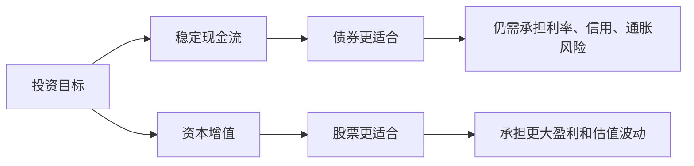
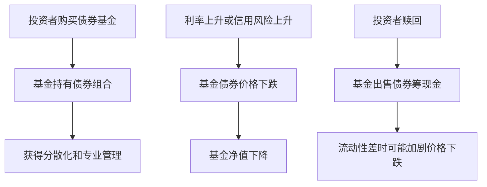

# 21.6 债券投资、债券基金与债券市场监管

来源：

- 主线：Mishkin/Eakins Ch.12
- 补充：Mishkin《货币金融学》Ch.4-Ch.6

## 为什么投资者持有债券

债券是股票之外最重要的长期投资工具之一。股票代表公司所有权，收益取决于股利、增长和市场估值；债券代表债权，收益主要来自票息和本金偿还。债券没有股票那样的所有权上行空间，但在公司偿付顺序中通常优先于股票。

这种优先顺序很重要。如果公司经营困难，债权人应先于股东获得利息和本金。如果公司清算，债权人的索取权也排在股东之前。因此，高等级债券通常比股票风险低，价格波动也相对较小。很多退休投资者、保险公司、养老金和保守型基金愿意持有债券，是因为债券能够提供相对稳定的现金流。

但“相对稳定”不等于“没有风险”。债券投资至少面对四类风险：违约风险、利率风险、流动性风险和通胀风险。前面几节已经看到，违约风险影响信用利差，利率风险影响债券价格，流动性风险影响买卖成本，通胀风险影响实际购买力。

| 风险 | 含义 | 典型影响 |
| --- | --- | --- |
| 违约风险 | 发行人不能按时还本付息 | 信用利差扩大、价格下跌 |
| 利率风险 | 市场利率变化导致债券价格变化 | 利率上升时旧债价格下降 |
| 流动性风险 | 难以快速低成本卖出 | 需要折价出售 |
| 通胀风险 | 固定名义现金流实际价值下降 | 实际收益低于预期 |

投资债券的关键，不是把它当成“安全资产”，而是先判断它的现金流来源、期限、信用质量和可交易性。

## 债券和股票的投资角色

债券和股票在投资组合中的角色不同。股票收益更不确定，但如果公司长期增长，股东可以分享企业价值上升。债券收益上限更明确，投资者主要收取利息和本金，即使公司表现很好，普通债券持有人通常也不会分享额外利润。

债券的吸引力在于现金流和优先偿付。对需要稳定收入的人来说，定期票息比不确定股利更容易安排支出。对机构投资者来说，债券可以匹配未来负债。例如，保险公司未来需要赔付，养老金未来需要支付退休金，长期债券能够提供相对可预测的现金流。

不过，债券价格会随利率变化。如果投资者能持有到期，且发行人不违约，名义本金和票息较确定；但许多投资者并不会持有到期，或者通过债券基金间接持有，实际价值会随市场价格波动。因此，债券在投资组合中降低了部分风险，却引入了另一类风险。

## 直接买债券的难点

个人投资者可以直接购买债券，但直接投资债券并不简单。

第一，债券品种多。同一家公司可能有多期债券，每期到期日、票面利率、赎回条款、抵押品、清偿顺序和契约限制都不同。理解这些条款需要专业知识。

第二，分散化困难。股票投资者可以较容易购买很多公司的股票；债券投资者如果想分散信用风险，需要购买许多不同发行人的债券。单张债券面值、交易单位和价格可能使小额投资者很难充分分散。

第三，交易透明度不如股票。许多债券在场外市场交易，报价和成交信息不像大型股票那样直观公开。个人投资者可能面对较高买卖价差或不利价格。

第四，信用分析成本高。判断一个公司或地方政府未来能否偿债，需要分析财务报表、现金流、行业前景、债务结构、宏观环境和法律条款。评级能提供帮助，但不能替代判断。

这些困难解释了为什么许多个人投资者通过债券基金而不是直接买单只债券。

## 债券基金的作用

债券基金把许多投资者的资金集中起来，由专业管理人购买债券组合。基金可以持有大量不同发行人、不同期限和不同类型的债券，从而分散单一发行人违约风险。投资者只需购买基金份额，就能间接持有一篮子债券。

债券基金的好处包括专业管理、分散化、较低交易成本和更方便的申购赎回。货币市场基金、短期债券基金、投资级公司债基金、高收益债基金、市政债基金、国债基金等，满足不同风险和期限偏好的投资者。

但债券基金和单只债券不同。单只债券如果持有到期且不违约，投资者可以收到约定本金；开放式债券基金通常没有固定到期日，基金净值随市场债券价格变化。如果利率上升，基金持有债券价格下跌，基金净值也会下降。投资者赎回时，可能承受损失。

债券基金还会面临赎回压力。市场恐慌时，投资者可能大量赎回基金份额，基金为了筹集现金不得不出售债券。如果市场流动性差，基金可能以较低价格卖出，进一步压低净值。这种机制在信用债和高收益债基金中尤其重要。

这和宏观金融稳定有关。债券基金扩大了投资者进入债券市场的渠道，也可能在压力时期放大卖出压力。

## 债券投资中的久期直觉

前面讲过，长期债券利率风险更大。实际投资中，常用久期来衡量债券价格对利率变化的敏感程度。这里不需要复杂公式，只要把久期理解为“收回现金流的加权平均时间”和“利率敏感度的近似指标”。

如果一张债券大部分现金流发生在很远的未来，久期较长。市场利率稍有变化，远期现金流现值变化就较大，债券价格波动更明显。零息债券没有期间票息，全部现金流都在到期日，因此久期等于期限，利率风险很高。高票息债券较早收到较多现金流，久期较短，利率风险较低。

对投资者来说，久期选择取决于投资期限和利率判断。如果投资者未来很快需要用钱，却持有长期债券或长期债券基金，就可能在利率上升时被迫卖出并承受损失。如果投资者有长期负债，例如养老金未来多年后需要支付，较长期债券反而可以匹配负债期限。

这个逻辑和银行资产负债管理相通。银行如果用短期存款支持长期固定利率资产，当利率上升时，负债成本上升、资产价格下跌，净值承压。债券投资的利率风险，也是金融机构稳健经营的核心风险之一。

## 金融保证和信用保护

一些信用较弱的债券发行人会购买金融保证，以降低债券风险。金融保证承诺如果发行人违约，保证方会向债券持有人支付本金和利息。这样，投资者关心的不再只是发行人信用，也会关注保证方信用。若保证方信用强，债券风险下降，发行人可以用较低利率融资。

金融保证是否值得，取决于保证费用是否低于由此节省的利息成本。若保证费用很高，而利率下降有限，发行人没有必要购买；若保证显著提高信用质量、降低融资成本，就可能划算。

信用违约互换，即 CDS，也可以提供违约保护。最简单的形式是，购买者支付保费，卖方承诺在某项债务违约时赔付。CDS 可以用于套期保值，例如投资者买了某公司债，同时买 CDS 防止该公司违约损失。

但 CDS 也可以被用于投机。投资者即使没有持有某项债券，也可能购买 CDS 来押注该债务会违约。2000 年以后，CDS 市场快速扩大，到 2008 年金融危机前规模巨大。Lehman Brothers、Bear Stearns 和 AIG 等机构都与 CDS 风险密切相关。AIG 因承担大量信用保护而在危机中需要政府救助。

这里的教训是：风险转移不等于风险消失。金融保证和 CDS 可以把信用风险从一个主体转移到另一个主体，但如果保证方或 CDS 卖方资本不足，风险会在系统中重新集中。

## 为什么债券市场需要监管

股票通常在公开市场交易，买价、卖价和成交价格较容易观察。债券市场则更多在场外交易，交易商通过网络、电话或电子系统报价，成交细节过去不一定及时公开。信息不透明会给投资者带来问题：他们可能不知道合理价格，也可能面对过高加价、不适当推荐或延迟报告。

监管债券市场的一个目标，是提高透明度和交易公平性。2002 年，美国证券监管机构推动建立 TRACE，即交易报告与合规系统。TRACE 的任务包括规定哪些债券交易必须公开报告，并提供交易数据平台，让市场参与者更容易获得成交信息。

TRACE 由 FINRA 负责。FINRA 是金融业监管机构，证券交易公司必须成为其成员。通过交易报告、记录保存、销售行为监管和处罚机制，监管者试图减少债券市场中的欺诈、过度交易、不合理加价、迟报交易、资本不足和不适当推荐等问题。

透明度提升并不意味着市场没有风险。它只是让价格发现更有效，让投资者和监管者更容易观察交易活动。债券本身仍然有利率风险、信用风险和流动性风险。

## 监管和宏观稳定

债券市场监管不仅保护单个投资者，也关系宏观金融稳定。企业债、市政债、机构债和抵押贷款相关债券都是长期融资渠道。如果这些市场失去透明度、评级失真、风险转移链条不清晰，问题会在繁荣期积累，在衰退或利率上升时集中暴露。

2007-2009 年金融危机说明，债券市场和衍生品市场中的信息不透明会放大系统性风险。抵押贷款被证券化后，风险被分层、打包、评级、出售，再通过 CDS 转移。许多投资者以为风险已经被分散，实际上部分风险集中在资本不足或高度杠杆的机构中。当底层住房贷款违约上升，复杂证券价格下跌，信用保护卖方承压，金融机构之间互不信任，信贷市场冻结，最终影响投资、消费、产出和就业。

因此，债券市场监管与宏观经济政策不是完全分开的。中央银行可以降低短期利率，但如果债券市场信息不透明、信用风险无法定价、交易流动性枯竭，货币政策传导会受阻。相反，透明、有纪律、有足够资本缓冲的债券市场，更有利于储蓄稳定流向长期投资。

## 投资债券时应该问什么

学习完债券市场后，分析一张债券或一个债券基金，可以按几个问题展开。

第一，发行人是谁？是中央政府、地方政府、政府支持机构还是公司？

第二，现金流是什么？票面利率多少，多久付息，到期日何时，是否有本金偿还安排？

第三，信用风险多大？评级如何，现金流来源是什么，是否有抵押品或保证？

第四，利率风险多大？期限和久期多长，市场利率变化会怎样影响价格？

第五，流动性如何？能否快速卖出，交易是否活跃，买卖成本是否高？

第六，税收待遇如何？利息是否免税，税后收益率是否真的有吸引力？

第七，是否通过基金持有？如果是基金，还要看组合期限、信用质量、赎回机制、费用和历史风险暴露。

这些问题不是投资建议，而是理解债券的基本框架。债券看似比股票简单，因为它写明利息和本金；但真正的风险隐藏在能否兑现、何时兑现、以什么价格卖出以及实际购买力是否保住。

## 小结

债券为投资者提供相对稳定的现金流和优先于股票的偿付地位，但并非无风险。违约风险、利率风险、流动性风险和通胀风险都可能影响债券回报。债券适合现金流管理和资产负债匹配，但投资者必须理解期限、信用和市场价格波动。

债券基金通过专业管理和分散化降低单一债券选择难度，但基金净值会随市场价格变化，也可能在赎回压力下被迫卖出资产。金融保证和 CDS 可以转移信用风险，但不能让风险消失，若风险集中在脆弱机构中，反而会成为系统性风险来源。

债券市场监管的重点在于透明度、交易报告、销售行为和市场纪律。TRACE 和 FINRA 等机制改善了场外债券市场的信息环境。一个透明、流动、风险定价有效的债券市场，有助于长期融资，也有助于货币政策和宏观经济稳定。

## 自测问题

- 债券为什么通常比股票风险低？为什么又不能说债券没有风险？
- 个人投资者直接买债券会遇到哪些困难？
- 债券基金和单只债券在风险上有什么不同？
- 久期为什么可以帮助理解利率风险？
- 金融保证和 CDS 为什么只是转移风险，而不是消灭风险？
- TRACE 这类交易报告系统为什么能改善债券市场？
- 债券市场监管为什么会影响宏观金融稳定？
