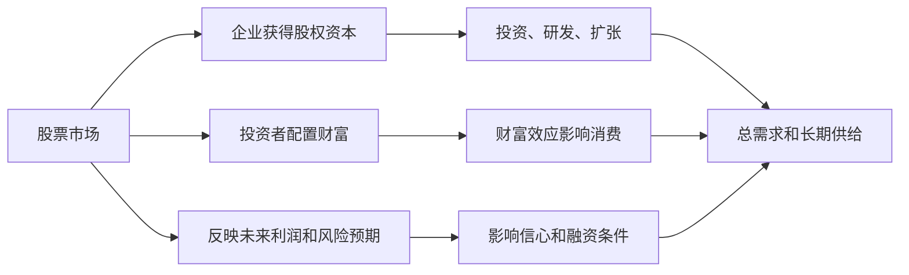
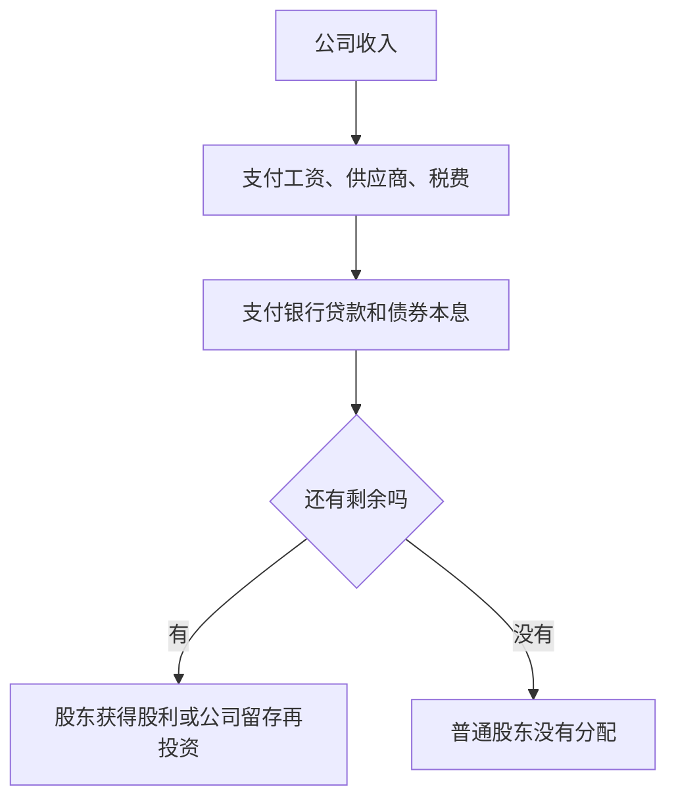
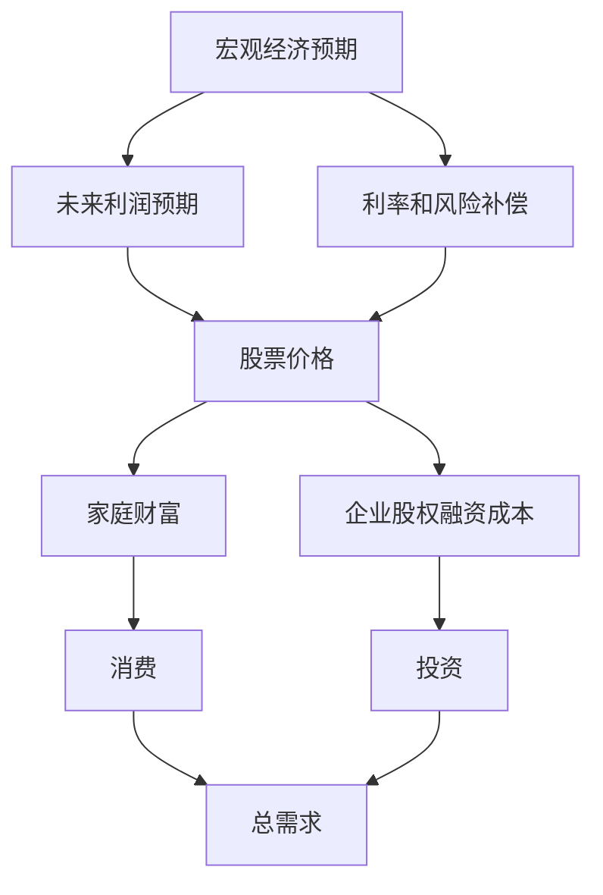

# 22.1 股票市场的功能

来源：

- 主线：Mishkin/Eakins Ch.13
- 补充：Mishkin《货币金融学》Ch.7

## 为什么股票市场值得单独学习

上一章讲债券市场。债券是借款合约：发行人承诺支付利息和本金，投资者是债权人。股票不同。股票代表所有权，股票持有人不是把钱借给公司，而是拥有公司的一部分。公司经营好，股东可能获得股利和股价上涨；公司经营差，股东可能什么也得不到。

股票市场之所以受到大量关注，是因为它同时连接三件事：企业融资、投资者财富和宏观预期。

对企业来说，股票市场提供股权资本。企业不必承诺固定还本付息，而是出售所有权来获得长期资金。成长型企业可以用这些资金扩张、研发、进入新市场或收购其他公司。对投资者来说，股票市场提供分享企业增长的渠道。对宏观经济来说，股票价格汇集了市场对未来利润、利率、风险和经济增长的判断。

股票市场波动也会影响实体经济。股价上涨会增加家庭财富，可能提高消费；股价下跌会压低财富、削弱信心，并使企业更难通过发行股票融资。股票市场不是 GDP 本身，但它会通过财富效应、融资成本和预期影响消费、投资和总需求。

因此，学习股票市场不是学习“涨跌技巧”，而是理解股权融资如何把储蓄、企业增长和宏观预期联系起来。

## 股票代表什么

一股股票代表公司的一部分所有权。股东拥有公司的一个比例权益，这个比例取决于他持有的股份占全部流通股份的比例。

如果一家公司共有 100 万股股票，一个投资者持有 1 万股，他拥有公司 1% 的股权。这个 1% 不意味着他能直接拿走公司 1% 的资产，而是意味着他对公司剩余收益有相应比例的索取权，并通常拥有相应投票权。

股票没有固定到期日。债券会写明到期日期、面值和票面利率；股票证书通常不写到期日、面值偿还或固定利息。只要公司持续存在，股票就可以持续存在。投资者如果想退出，通常是在二级市场把股票卖给其他投资者，而不是要求公司到期还本。

这一区别非常重要。债券的核心是承诺，股票的核心是剩余。债券持有人关心发行人能否履约；股票持有人关心公司在支付工资、供应商、债权人、税收和其他义务后，还能剩下多少价值。

| 项目 | 债券 | 股票 |
| --- | --- | --- |
| 法律关系 | 债权 | 所有权 |
| 现金流 | 约定利息和本金 | 股利和出售价格 |
| 到期日 | 通常有 | 通常没有 |
| 公司困难时的顺序 | 债权人优先 | 股东靠后 |
| 上行收益 | 通常有限 | 可能很高 |

## 股票收益来自哪里

投资者持有股票，可能从两个来源获得收益。

第一，股价上涨。投资者以较低价格买入股票，以较高价格卖出，就获得资本利得。股价上涨可能来自公司利润增长、投资者提高对未来增长的预期、市场要求回报下降，或整体风险偏好上升。

第二，公司支付股利。股利是公司把部分利润分配给股东。并非所有公司都会支付股利。快速成长的公司可能把利润留在公司内部，用于扩张和投资；成熟公司投资机会较少，可能更稳定地支付股利。

股票的收益不确定。股利不是像债券利息那样必须支付的固定义务，股价上涨也没有保证。公司经营失败时，股东承担损失；公司成功时，股东也能分享债权人无法获得的上行收益。

这就是股票比债券风险更高、但潜在回报也更高的根本原因。债券投资者通常得到固定利息，不会因为公司特别成功而获得额外利润；股票投资者承担剩余风险，也获得剩余收益。

## 股东是剩余索取者

股东的权利可以从“剩余索取者”这个概念理解。公司收入进入后，要先支付各种明确义务：员工工资、供应商货款、税费、银行贷款利息、债券利息和到期本金。如果这些义务都满足之后还有剩余，股东才有权分享这些剩余。

如果公司没有剩余，股东可能得不到股利。若公司破产清算，债权人通常先获得偿付；债权人、供应商和其他优先索取者满足后仍有资产，普通股东才可能拿到剩余。很多情况下，公司失败时普通股价值可能接近零。

但也正因为股东是剩余索取者，公司成功时股东收益可能很高。公司利润增长、市场份额扩大、未来现金流预期改善，都会反映到股价中。债权人最多按约定拿回本息，股东则可以分享公司价值上升。

这个结构也解释了为什么股票价格对利润预期非常敏感。小幅利润变化可能显著改变股东剩余价值。

## 股票市场如何帮助企业融资

股票市场最直接的功能是帮助企业筹集股权资本。企业可以通过发行股票向投资者出售部分所有权，获得资金。与债务融资相比，股权融资没有固定利息和到期还本压力，因此对现金流不稳定、成长机会多的企业尤其重要。

初创企业和快速成长企业往往没有足够稳定的现金流来承担大量债务。如果它们通过股票融资，投资者愿意承担更高风险，换取未来公司成功后的高回报。成熟企业也可能发行新股，用于扩张、收购、降低杠杆或补充资本。

股票融资对宏观经济有两层作用。短期看，企业获得资金后可以增加投资支出，影响总需求。长期看，如果资金投向研发、设备、人力资本和生产率提升，经济的长期供给能力也会改善。

不过，发行股票会稀释原股东权益。新增股份让公司总股份增加，原股东拥有的比例下降。公司只有在认为融资带来的项目价值超过稀释成本时，才愿意发行股票。投资者也会根据发行用途判断公司是否值得提供资本。

## 二级市场为什么重要

公司真正获得资金，通常发生在一级市场的新股发行中。投资者买入公司新发行股票，资金进入公司。但是，大量股票交易发生在二级市场，也就是投资者之间互相买卖已经发行的股票。二级市场交易本身不直接给公司带来新资金，那么它为什么重要？

第一，二级市场提供流动性。如果投资者知道以后可以方便卖出股票，就更愿意在一级市场购买股票。没有流动性，投资者会要求更高回报，企业融资成本会上升。

第二，二级市场提供价格发现。股票二级市场价格反映投资者对公司未来现金流和风险的判断。企业如果要发行新股，会参考现有市场价格。股价越高，公司用同样数量新股能筹集更多资金，股权融资成本越低。

第三，二级市场影响公司治理。股价变化会反映市场对管理层决策的评价。表现差的公司可能面临股价下跌、融资困难、被收购压力或管理层更换压力。

| 市场 | 交易对象 | 公司是否获得新资金 | 主要功能 |
| --- | --- | --- | --- |
| 一级市场 | 新发行股票 | 是 | 股权融资 |
| 二级市场 | 已发行股票 | 通常否 | 流动性、价格发现、公司治理 |

因此，不能因为二级市场“不直接融资”就低估它。没有活跃二级市场，一级市场也很难有效运转。

## 交易所、场外市场和流动性

股票可以在有组织交易所交易，也可以在场外市场交易。传统有组织交易所有固定交易场所、上市标准和交易规则。纽约证券交易所是最著名的例子之一。大型公司通常更容易满足交易所上市要求，因为它们市值大、交易量高、信息披露较充分。

场外市场没有一个统一交易大厅，而是通过通信和电子网络完成交易。NASDAQ 就是在电子报价系统基础上发展起来的场外市场。交易商为股票做市：投资者想卖时，交易商从库存买入；投资者想买时，交易商从库存卖出。做市商通过买入价和卖出价之间的差额获得补偿。

交易所和场外市场的共同作用是提供流动性。流动性越好，投资者越容易以接近合理价值的价格买卖股票。小公司、区域性公司或交易量低的股票，如果没有交易商愿意持续报价，投资者会担心买入后难以卖出，从而不愿提供资本。

流动性对宏观融资也有意义。流动性高，投资者要求的流动性补偿低，企业更容易融资；流动性枯竭，投资者要求更高回报，企业股权融资成本上升。

## 电子交易和市场结构变化

股票交易方式不断变化。传统交易所依赖交易大厅和人工撮合，现代股票交易越来越多通过电子系统完成。电子通信网络和替代交易系统允许买卖双方更直接地匹配订单，尤其受到机构投资者欢迎。

电子交易的优势包括透明度、较低交易成本、更快执行和盘后交易。未成交订单信息可以帮助交易者判断供求；自动撮合减少人工中介和佣金；快速执行对需要及时调整组合的投资者很重要；盘后交易使投资者可以在交易所收盘后对新闻作出反应。

但电子交易并不对所有股票同样有效。交易活跃的大公司股票更容易在电子系统中快速找到买方和卖方；交易清淡的小公司股票可能长时间没有对手方，仍然需要做市商提供流动性。

这一点和债券市场相似：交易制度的核心问题不是“有没有技术”，而是“能否持续把买方和卖方连接起来，并形成可信价格”。市场结构越能降低交易成本、提高透明度，证券越容易被投资者接受。

## ETF 为什么属于股票市场创新

交易所交易基金，即 ETF，是股票市场中的重要创新。ETF 通常由一篮子证券组成，并把这一篮子资产变成可以在交易所像股票一样买卖的份额。最简单的 ETF 跟踪某个指数，例如 S&P 500 或 Dow Jones Industrial Average。

ETF 兼有指数基金和股票交易的特征。它像指数基金一样追踪一篮子资产，提供分散化；又像股票一样在交易所交易，投资者可以在交易日内买卖，使用限价单、卖空或保证金交易。ETF 的管理费用通常低于主动管理基金，也常没有传统共同基金那样的最低投资额。

ETF 的价格通常接近其持有资产的净值，因为市场参与者可以利用价格差进行套利。如果 ETF 价格高于其底层资产价值，套利者有动力卖出 ETF、买入底层资产；如果 ETF 价格低于底层资产价值，套利方向相反。这种机制帮助 ETF 价格贴近资产净值。

ETF 的意义在于降低分散投资成本。普通投资者不必分别购买数百只股票，就可以通过一个 ETF 获得广泛市场暴露。它也使股票市场和资产管理行业更紧密地结合起来。

## 股票市场和宏观经济的联系

股票市场和宏观经济不是简单的“股市涨，经济就好；股市跌，经济就差”。股票价格是对未来现金流和风险的折现，包含预期，因此常常领先或放大现实经济变化。

从估值角度看，股票价格取决于未来股利或现金流、增长率和投资者要求回报。经济增长预期上升，企业销售和利润可能改善，股票价格上升。通胀和利率上升，折现率提高，股票价格可能下降。金融不确定性上升，投资者要求更高风险补偿，也会压低股票价格。

股票市场还通过财富效应影响消费。家庭持有股票或股票基金时，股价上涨会提高财富，增加消费信心；股价下跌会降低财富，压制消费。股票价格也影响企业投资。股价高时，企业发行股票更容易，资本成本较低；股价低时，股权融资变贵，投资可能减少。

这也是为什么股票市场会对央行政策、通胀数据、就业数据、财政政策和国际冲击迅速反应。市场参与者不断把新信息转化为对未来现金流和折现率的修正。

## 小结

股票代表公司所有权，股票市场帮助企业筹集股权资本，也让投资者分享企业成长。股票收益来自股利和股价上涨，但股东是剩余索取者，偿付顺序低于债权人，因此股票风险通常高于债券。

股票市场不仅包括公司发行股票的一级市场，也包括投资者买卖已发行股票的二级市场。二级市场提供流动性、价格发现和公司治理压力，是一级市场有效运转的基础。交易所、场外市场、做市商、电子交易系统和 ETF 都围绕降低交易成本、提高流动性和便利投资配置展开。

从宏观角度看，股票市场连接未来利润预期、利率、风险补偿、财富效应和企业融资成本。它既反映宏观经济，也通过消费和投资影响总需求。

## 自测问题

- 股票和债券在法律关系、现金流和风险上有什么根本区别？
- 为什么说股东是剩余索取者？
- 二级股票市场不直接给公司融资，为什么仍然重要？
- 交易所和场外市场如何提供流动性？
- ETF 为什么可以降低普通投资者分散投资的成本？
- 股票市场通过哪些渠道影响宏观经济？
