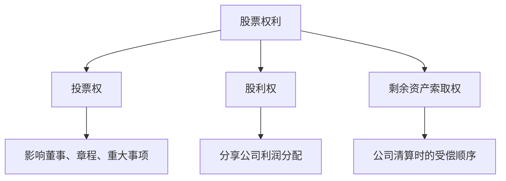
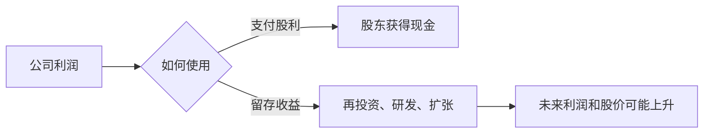

# 22.2 普通股、优先股与股东权利

来源：

- 主线：Mishkin/Eakins Ch.13
- 补充：Mishkin《货币金融学》Ch.7
- 延伸：Bodie/Kane/Marcus《Investments》Ch.4, Ch.18

## 股票不是单一工具

上一节把股票定义为所有权。但现实中的股票并不完全一样。最重要的区分是普通股和优先股。它们都属于股权，但在收益形式、投票权、清偿顺序和风险特征上有明显差异。

理解这个区分很重要，因为投资者买入股票时，买到的不是一个抽象的“公司好坏”，而是一组具体权利。不同股票类别可能对应不同投票权、不同股利安排和不同索取顺序。如果只看公司名称，不看股份权利，投资者可能误解自己真正持有的资产。

股票权利主要围绕三个问题展开：

第一，能否参与公司控制，也就是投票权。

第二，能否获得公司分配，也就是股利权。

第三，公司清算或破产时排在什么位置，也就是资产索取权。

## 普通股：公司所有权的基本形式

普通股是最典型的股票。普通股股东拥有公司的所有权份额，通常享有投票权，可以收取股利，并希望股票价格上涨。

普通股股东的收益不固定。公司可能支付股利，也可能不支付；股价可能上涨，也可能下跌。普通股的价值取决于市场对公司未来利润、股利、增长机会和风险的判断。公司发展好，普通股股东分享上行收益；公司失败，普通股股东通常承担最大损失。

普通股股东通常可以对董事会成员投票，也可以对某些重大事项投票，例如公司章程修订、并购、发行新股等。董事会代表股东监督管理层，任命高管，并决定重大公司政策。因此，投票权是普通股作为所有权工具的重要体现。

不过，普通股的具体权利并不总是完全相同。许多公司有不同类别的普通股，常用 A 类、B 类等表示。这些类别没有跨公司的统一含义：有的差异在投票权，有的差异在股利分配，有的差异在上市流通安排。投资者必须看具体公司章程和发行文件，不能仅凭类别名称判断权利。

## 普通股的剩余索取权

普通股股东是公司最典型的剩余索取者。公司收入要先满足合同性义务，包括工资、供应商、税收、银行贷款、债券利息和本金等。剩下的价值才属于普通股股东。

这个结构同时带来高风险和高收益。普通股股东排在最后，所以公司亏损或破产时损失最大；但也因为普通股没有固定收益上限，公司成功创造的剩余价值主要归普通股股东。

假设公司有 1000 万美元资产，债务和其他优先索取权为 800 万美元。如果公司清算，普通股股东最多分享剩下的 200 万美元。如果资产价值下降到 700 万美元，债权人可能都不能完全受偿，普通股股东价值为零。相反，如果公司资产价值上升到 2000 万美元，债权人仍按合同获得本息，超过债务后的大部分价值归股东。

| 公司状态 | 债权人 | 普通股股东 |
| --- | --- | --- |
| 公司稳定 | 按合同收取利息和本金 | 可能获得股利和股价上涨 |
| 公司亏损 | 仍有合同索取权 | 股利可能取消，股价下跌 |
| 公司清算 | 优先受偿 | 最后分享剩余资产 |
| 公司高速增长 | 收益上限基本由合同决定 | 分享剩余价值增长 |

这就是普通股风险溢价的来源。投资者愿意持有普通股，是因为长期来看普通股可能提供高于债券的回报；但这种回报是对更高不确定性和更低清偿顺序的补偿。

## 股利不是利息

股利和债券利息很容易被混淆，因为它们都是投资者收到的现金。但二者性质完全不同。

债券利息是合同义务。公司发行债券后，必须按约定支付利息。不能支付利息可能构成违约，债权人可以采取法律行动。

普通股股利是公司利润分配。董事会可以决定支付、增加、减少或暂停股利。公司即使盈利，也可能选择不分红，而把利润留在公司内部用于投资。成长型公司常常不支付股利，因为它们认为内部投资机会回报更高；成熟公司增长机会较少，可能稳定分红。

这也解释了为什么不支付股利的股票仍然有价值。投资者预期公司未来某一天会支付股利，或者公司通过留存收益提高未来盈利能力，使股票未来可以以更高价格卖出。股票当前价值来自未来现金流的现值，不一定来自当下股利。

## 投票权和公司治理

普通股通常带有投票权。投票权让股东能够参与公司治理，最典型的是选举董事会。董事会不是日常经营者，但它监督管理层、批准重大事项，并代表股东利益。

投票权的价值来自代理问题。现代公司中，所有者和经营者通常分离。股东提供资本并拥有公司，管理层负责经营。管理层可能追求个人薪酬、规模扩张或低风险职位安全，而不完全以股东价值最大化为目标。投票权、董事会、并购市场、信息披露和监管，都是控制代理问题的机制。

不过，小股东投票权在实践中可能很弱。单个小股东持股比例低，监督成本高，影响有限。机构投资者、大股东或创始人通常具有更大治理影响力。某些公司还设置不同投票权类别，例如创始人持有高投票权股票，公众投资者持有低投票权股票。这样可以让创始人保持控制权，但也会削弱外部股东监督。

投票权安排没有绝对好坏。高投票权结构可能让创始人坚持长期战略，避免短期市场压力；也可能让管理层缺乏约束，损害普通股东利益。投资者需要理解自己购买的股票是否真正附带控制权。

## 优先股：介于普通股和债券之间

优先股在法律和税收上属于股权，但特征上介于普通股和债券之间。

优先股通常支付固定股利。因为股利金额固定，它看起来像债券的固定利息；但它仍然不是债务，优先股股利通常不像债券利息那样构成必须支付的合同义务。优先股通常没有普通股那样的投票权，除非公司未按承诺支付优先股股利。

优先股在清偿顺序上高于普通股、低于债权人。如果公司清算，债券持有人和其他债权人先受偿，之后才轮到优先股，最后才是普通股。这个位置使优先股风险低于普通股，但高于债券。

| 特征 | 债券 | 优先股 | 普通股 |
| --- | --- | --- | --- |
| 法律性质 | 债务 | 股权 | 股权 |
| 现金流 | 固定利息 | 通常固定股利 | 不确定股利 |
| 投票权 | 无 | 通常无 | 通常有 |
| 清偿顺序 | 最靠前 | 债权人之后、普通股之前 | 最后 |
| 上行收益 | 有限 | 通常有限 | 较高 |

优先股价格通常比普通股稳定，因为股利固定，投资者更像在估值一个固定现金流工具。但它不像高等级债券那样安全，因为公司财务困难时，优先股股利可能被暂停，且清偿顺序低于债权人。

## 为什么优先股发行较少

优先股同时具有债券和普通股的一些特征，但在企业融资中占比并不高。一个重要原因是税收处理。公司支付债券利息通常可以在计算应税收入时扣除，从而降低税后债务成本；优先股股利一般不能像债券利息那样税前扣除。因此，对公司来说，优先股成本可能高于债务。

同时，优先股对投资者的上行空间通常有限。普通股投资者可以分享公司高速增长带来的巨大收益；优先股股利固定，价格上涨空间较受限制。这样，优先股既不像债券那样有明确法律偿付优先权和税收优势，也不像普通股那样有充分增长收益。

优先股仍然有使用场景。例如，公司希望筹集资本但不想增加债务；投资者希望获得相对稳定收入但愿意承担高于债券的风险；金融机构可能在资本结构中使用某些优先股工具来满足监管资本要求。它是资本结构中的中间层工具。

## 股东权利和信息问题

股东权利只有在投资者获得可靠信息时才有意义。如果公司披露不充分，投资者很难判断自己拥有的权利价值。普通股股东需要知道公司盈利、债务、现金流、管理层薪酬、关联交易和风险暴露。优先股投资者也需要知道公司是否有能力持续支付固定股利。

信息不对称会影响股票融资。公司内部人比外部投资者更了解公司真实状况。如果外部投资者担心公司质量差、信息不透明，就会要求更低发行价格或更高预期回报，导致企业股权融资成本上升。信息披露、审计、证券监管和交易所上市规则，都是为降低这种信息不对称。

这和前面金融机构章节的逻辑一致。金融市场的核心困难不是“没有储蓄”，而是储蓄者不知道谁值得信任、谁会滥用资金、谁能创造真实回报。股东权利、公司治理和监管共同帮助股权资本流向更有价值的企业。

## 股权结构和宏观融资

普通股和优先股的区分，也影响宏观层面的融资结构。一个经济体如果股权市场发达，企业可以更多依赖股权资本支持高风险创新。股权融资不要求固定还本付息，能承受更长研发周期和更大不确定性。科技公司、生物医药公司和其他成长型企业常依赖股权资本发展。

债务融资适合现金流较稳定、资产可抵押、风险较低的项目。股权融资则适合未来收益不确定但上行空间大的项目。一个健康金融体系需要债务和股权共同存在：债券市场为稳定长期债务融资提供渠道，股票市场为风险资本和成长资本提供渠道。

从宏观角度看，股东承担剩余风险，帮助企业吸收冲击。经济下行时，公司可以减少或停止普通股股利，而不能随意停止债券利息。股权资本越厚，公司破产风险越低，金融体系也更稳健。但股权融资成本通常高于债务，因为投资者要求补偿更高风险。

股东权利也会进入股票估值。两家公司业务和利润相似，但一家公司普通股拥有清晰投票权、少数股东保护和透明治理，另一家公司存在高投票权控制股、关联交易或外部股东监督薄弱，投资者要求回报可能不同。优先股则更像利率敏感的混合证券：固定股利让它接近债券，清偿顺序和可暂停股利又使它保留股权风险。分析股票时，权利结构本身就是现金流风险的一部分。

## 小结

普通股是公司所有权的基本形式，通常带有投票权、股利权和剩余索取权。普通股股东排在债权人和优先股之后受偿，因此风险高，但也能分享公司增长带来的上行收益。股利不是债券利息，而是公司利润分配，是否支付取决于公司政策和经营状况。

优先股在法律上属于股权，却有固定股利、较稳定价格和优先于普通股的清偿顺序，因此介于债券和普通股之间。它通常没有普通股投票权，成本可能高于债务，因为优先股股利通常不能像债券利息那样税前扣除。

股东权利服务于公司治理和风险分配。投票权、董事会、信息披露和监管共同缓解所有者与管理层之间的代理问题。股权市场的发展，使企业能够为高风险、长期增长项目筹集资本，也让投资者分享经济增长。

## 自测问题

- 普通股股东为什么被称为剩余索取者？
- 股利和债券利息在法律性质上有什么不同？
- 普通股的投票权如何帮助缓解代理问题？
- 为什么不同类别普通股可能具有不同权利？
- 优先股在哪些方面像债券？在哪些方面仍然像股票？
- 为什么公司不总是用优先股融资？
- 为什么同一家公司不同投票权类别的股票可能有不同估值？
