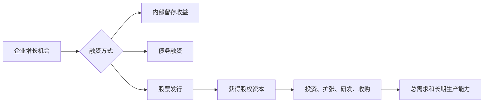
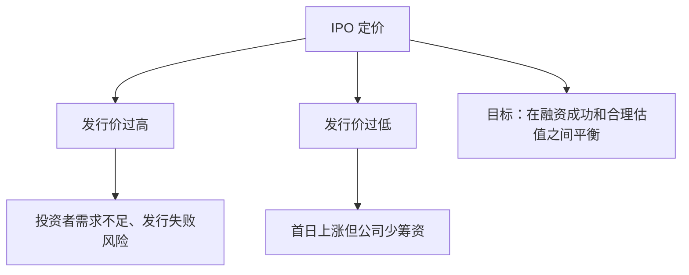
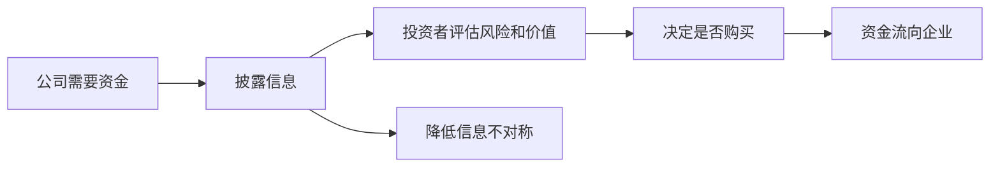

# 22.3 IPO、增发与股票发行

来源：

- 主线：Mishkin/Eakins Ch.13
- 补充：Mishkin《货币金融学》Ch.7
- 延伸：Bodie/Kane/Marcus《Investments》Ch.4, Ch.18

## 企业什么时候需要发行股票

企业需要资金时，可以使用内部留存收益、银行贷款、发行债券或发行股票。发行股票的特点是：企业获得长期资本，不承诺固定利息，也没有到期还本义务，但要让新股东分享公司所有权和未来收益。

股票发行通常出现在几类场景。快速成长企业需要资金扩大规模，却没有稳定现金流支撑大量债务；成熟企业希望为收购、研发或扩张筹集资金；负债较高的公司希望用股权资本降低杠杆；私人公司希望让早期投资者退出，并进入公开资本市场。

这些决策和宏观投资直接相连。企业发行股票获得资金后，可以增加资本支出、雇佣员工、研发产品或建设产能。若股票市场估值高、投资者风险偏好强，股权融资成本较低，企业更容易投资。若股市低迷、投资者要求高回报，股权融资变贵，企业可能推迟投资。

## 一级市场和股票发行

股票发行发生在一级市场。一级市场是公司出售新证券并获得资金的市场。投资者购买新发行股票，资金进入公司或出售股份的原股东手中。之后这些股票在二级市场交易，投资者之间互相买卖，公司通常不再从每次交易中获得新资金。

股票发行可以分为首次公开发行和后续发行。

首次公开发行，即 IPO，是公司第一次向公众出售股票。IPO 让私人公司变成公众公司，使股票可以在交易所或公开市场上买卖。

后续发行是已经上市的公司再次发行新股。公司可能在股价较高、投资项目较多或资本需求较强时增发股票。后续发行会增加流通股份，可能稀释原股东比例，因此市场会关注发行价格、资金用途和公司真实需求。

| 发行类型 | 含义 | 公司状态 |
| --- | --- | --- |
| IPO | 第一次向公众发行股票 | 私人公司转为公众公司 |
| 后续发行/增发 | 已上市公司再次发行新股 | 公众公司继续融资 |

IPO 和增发都属于一级市场行为，但对投资者的含义不同。IPO 面对的信息不确定性通常更高，因为公司公开历史较短、市场价格尚未形成；增发公司已有交易价格和公开披露记录，市场可以更容易评估发行是否合理。

## IPO 为什么重要

IPO 是企业生命周期中的重要转折。上市前，公司股权通常掌握在创始人、员工、风险投资基金、私募投资者或少数机构手中。上市后，公司股票可以被公众投资者持有，并在公开市场交易。

IPO 有几个功能。

第一，它为公司筹集资金。公司发行新股获得现金，用于扩张、研发、偿还债务或其他用途。

第二，它为早期投资者提供退出渠道。风险投资基金和早期股东在公司成长早期承担高风险，IPO 后可以逐步出售股份，实现投资回报。

第三，它提高公司知名度和信誉。上市公司需要持续披露信息，接受市场监督。公众公司身份可能帮助公司获得客户、供应商和融资机构信任。

第四，它形成市场价格。上市后，公司股权有公开交易价格，这有助于员工股权激励、并购交易和后续融资。

但 IPO 也有成本。公司要支付承销费、法律和审计费用，并承担持续披露、监管合规和市场压力。公众公司管理层要面对季度业绩、投资者关系、股价波动和潜在诉讼。

## 承销和发行定价

股票发行通常需要投资银行帮助。投资银行在发行中承担承销、定价、销售和信息协调职能。它们帮助公司准备发行文件，向潜在投资者介绍公司，评估市场需求，并确定发行价格。

发行定价很难。价格定得太高，投资者不愿购买，发行可能失败；价格定得太低，公司筹资不足，原股东把价值让给新投资者。IPO 定价尤其困难，因为公司此前没有公开交易价格，投资者必须根据财务数据、增长前景、行业对比和市场情绪判断价值。

很多 IPO 会出现发行首日价格上涨，即所谓低估发行或发行折价。表面看，首日上涨让新投资者获利，也显示市场欢迎；但对公司来说，发行价低于市场愿意支付的价格，意味着公司本可以筹集更多资金。低估发行可能来自信息不确定性、承销商希望保证发行成功、吸引投资者参与或补偿投资者承担新股风险。

发行定价体现了金融市场的信息问题。公司内部人更了解公司真实状况，外部投资者担心高估风险；投资银行用声誉、尽职调查和销售网络降低这种不确定性。

## 招股说明书和信息披露

公众投资者愿意购买股票，前提是能获得足够可信的信息。股票发行需要披露公司业务、财务报表、管理层、风险因素、资金用途、股权结构和重大合同等内容。招股说明书是投资者了解公司和发行条款的重要文件。

信息披露的作用不是保证公司一定成功，而是让投资者能够判断风险和价值。监管者通常不替投资者决定股票是否值得买，而是要求公司真实、完整、及时披露重要信息，并处罚虚假陈述和欺诈。

这与金融市场的基本功能一致：资金从储蓄者流向需要资金的企业，但储蓄者必须判断谁值得获得资金。没有可信披露，投资者会担心买到劣质公司股票，要求更高回报或退出市场。严重时，股权融资市场会萎缩。

## 增发和稀释

已经上市的公司可以进行后续股票发行。增发新股会增加公司股份总数。如果原股东不参与认购，他们持有的公司比例会下降，这就是稀释。

稀释本身不一定坏。关键在于公司用新资金创造的价值是否超过新增股份带来的摊薄。如果公司以合理价格发行股票，用资金投资高回报项目，原股东虽然持股比例下降，但公司总价值提高，单股价值可能仍然上升。相反，如果公司在股价低迷时被迫发行股票，只是为了弥补亏损或偿还压力债务，稀释可能损害原股东。

投资者看到增发，会问几个问题：公司为什么需要资金？发行价格相对市场价格如何？资金用途是否能创造回报？公司是否因为现金流恶化而被迫融资？管理层是否认为当前股价被高估，所以选择发行股票？

这里又出现信息不对称。公司选择发行股票，市场有时会解读为管理层认为股票价格较高。因为如果管理层认为公司被低估，发行股票会以低价出售所有权，损害原股东；如果管理层认为股票被高估，发行股票更有吸引力。这种信号效应可能使增发公告压低股价。

## 股票回购与发行的相反方向

理解股票发行，也可以顺带理解股票回购。发行股票是公司出售新股份获得资金；回购股票则是公司用现金从市场买回股份。发行会增加股份数，回购会减少股份数。

公司回购股票可能是因为现金充裕、投资机会有限，或者管理层认为股票被低估。回购减少流通股数，可能提高每股收益和股东持股比例。但如果公司用债务融资回购，杠杆上升，财务风险增加。

发行和回购都属于资本结构管理。公司在债务、普通股、优先股、留存收益之间选择资金来源和资金用途。这些选择影响公司风险、每股收益、控制权和融资成本。

| 行为 | 股份数量 | 公司现金 | 可能含义 |
| --- | --- | --- | --- |
| 发行股票 | 增加 | 增加 | 筹资、扩张、偿债、稀释 |
| 回购股票 | 减少 | 减少 | 返还现金、调整资本结构、可能认为低估 |

## 上市标准和市场准入

公司想让股票在主要交易所交易，需要满足上市标准。交易所通常要求公司达到一定市值、交易量、公众持股数量、财务标准和信息披露要求。这些标准不是为了保证股票一定上涨，而是为了维护市场质量。

大型交易所更偏好规模较大、交易活跃、信息披露较完善的公司。交易量高有助于流动性，流动性又吸引投资者。较高的上市标准也能增强市场声誉，使投资者相信上市公司至少满足一定基本要求。

不过，并不是所有重要公司都一定在传统交易所上市。随着电子市场发展，场外市场和 NASDAQ 等系统也能为大量公司提供交易平台。市场结构在变化，但核心目标不变：让股票能够以较低成本、较高透明度和较好流动性交易。

上市也意味着持续义务。公司上市后，要定期披露财务报告，披露重大事件，遵守治理和交易规则。公众市场给公司带来资金和流动性，也带来监管、审计、投资者监督和声誉约束。

## 发行市场和宏观周期

股票发行活动具有明显周期性。经济增长强、股价高、投资者风险偏好高时，IPO 和增发更活跃。企业愿意上市，投资者愿意承担风险，承销商也更容易销售新股。经济衰退、金融危机或股市大跌时，发行活动往往减少，因为估值低、不确定性高、投资者需求弱。

这和宏观经济形成反馈。繁荣时期，活跃股权融资支持企业扩张和创新，进一步推高投资和就业。衰退时期，股权融资萎缩，企业更难筹集风险资本，投资减少，经济恢复可能变慢。

但过度繁荣也有风险。股市估值过高时，一些质量较差的公司也可能趁市场热情上市，投资者可能低估风险。之后如果预期逆转，股票价格下跌，财富效应和融资条件都会恶化。科技股泡沫和其他股市周期都说明，股票发行市场既能配置资本，也可能在情绪高涨时配置失误。

从投资学角度看，股票发行同时反映融资需求和信号效应。企业在高估值时期发行股票，权益资本成本较低，但市场也可能解读为管理层认为股票不便宜；企业在低估值或危机中被迫增发，稀释成本更高，往往传递现金流压力。判断一次 IPO 或增发是否有利，不能只看募集金额，而要比较发行价格、资金投向、项目净现值、原股东稀释和公司资本结构变化。

## 小结

股票发行是企业获得股权资本的一级市场活动。IPO 是公司第一次向公众发行股票，使私人公司转为公众公司；增发是已上市公司继续发行新股筹资。股票发行支持企业投资和长期增长，但会稀释原股东权益，并受市场估值和投资者风险偏好影响。

发行过程依赖投资银行承销、定价和销售。IPO 定价尤其困难，因为公司缺乏公开交易历史，信息不对称更强。发行价过高可能失败，发行价过低会使公司少筹资。招股说明书和信息披露帮助投资者评估公司价值，降低逆向选择。

从宏观看，股票发行市场随经济周期和股市估值波动。繁荣时期发行活跃，支持投资扩张；衰退时期发行收缩，可能加剧融资困难。理解 IPO 和增发，有助于理解股权资本如何从储蓄者流向企业。

## 自测问题

- IPO 和后续增发有什么区别？
- 为什么 IPO 定价比已上市公司增发更困难？
- 发行价过低对新投资者和公司分别意味着什么？
- 信息披露在股票发行中解决什么问题？
- 增发为什么会稀释原股东？稀释一定坏吗？
- 股票发行活动为什么通常会随宏观周期波动？
- 为什么公司选择发行股票有时会被市场解读为估值或现金流信号？
