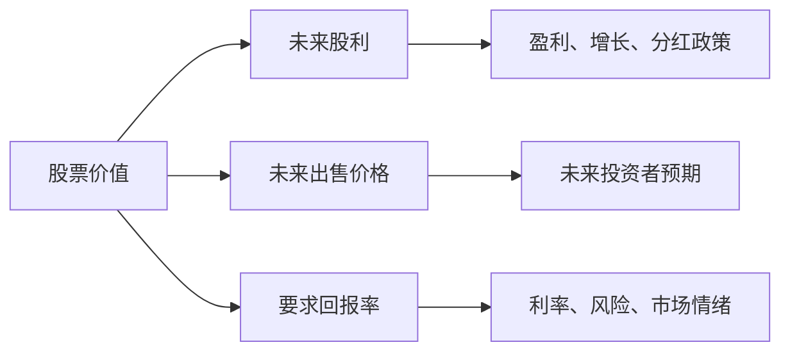
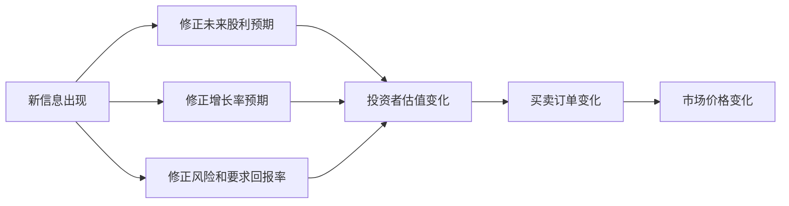

# 22.4 股票估值：股利贴现、市盈率与增长预期

来源：

- 主线：Mishkin/Eakins Ch.13
- 补充：Mishkin《货币金融学》Ch.7
- 延伸：Bodie/Kane/Marcus《Investments》Ch.7, Ch.18

## 股票估值为什么比债券更难

债券估值已经不容易，但至少现金流通常写在合同里：票息是多少，到期本金是多少，什么时候支付。股票估值更困难，因为股票没有固定到期日，股利不确定，未来售价也不确定。股票代表剩余索取权，剩余本身取决于企业未来利润、竞争、管理层决策、宏观经济和投资者风险偏好。

但股票估值的基本原则和债券一样：任何资产的价值，都等于未来现金流的现值。债券现金流是利息和本金；股票现金流是股利和未来出售股票得到的价格。区别在于，股票现金流更难预测。

因此，股票价格波动大，并不是因为股票市场完全没有逻辑，而是因为决定股票价值的变量本来就难以估计。未来增长率、未来股利、投资者要求回报率，只要稍微变化，就会显著改变股票现值。



估值模型不是为了给出绝对准确的价格，而是帮助理解股价由哪些因素决定，以及新闻为什么会引起股价变化。

## 一期估值模型

先看最简单情形：投资者买入一只股票，持有一年，期间收到一次股利，然后在一年后卖出。今天的股票价格应该等于一年后股利和一年后出售价格的现值。

公式可以写成：

```text
P0 = D1 / (1 + ke) + P1 / (1 + ke)
```

其中，P0 是今天的股票价格，D1 是一年后收到的股利，P1 是一年后的预期出售价格，ke 是投资者对股票投资要求的回报率。

假设某股票当前卖 50 美元，预计一年后支付 0.16 美元股利，一年后价格为 60 美元。投资者认为股票风险高于债券，要求 12% 回报。按一期模型计算：

```text
P0 = 0.16 / 1.12 + 60 / 1.12
P0 ≈ 0.14 + 53.57 = 53.71 美元
```

如果股票市场价格是 50 美元，而投资者估计的价值为 53.71 美元，他会认为股票值得购买。为什么市场价格可能低于他的估值？因为其他投资者可能对未来价格、股利或风险有不同判断。股票市场价格正是在这些不同判断的竞争中形成的。

这个简单模型揭示了股票估值的三个核心变量：未来现金流、未来价格和要求回报。

## 从一期模型到一般股利估值模型

一期模型里，一年后的出售价格 P1 本身也是未来投资者对更远期现金流的估值。如果把逻辑继续展开，P1 取决于第二年的股利和第二年后的出售价格；第二年后的出售价格又取决于更远未来。不断向后推，股票今天的价值最终可以理解为未来所有股利的现值。

一般股利估值模型可以写成：

```text
P0 = D1/(1+ke) + D2/(1+ke)^2 + D3/(1+ke)^3 + ...
```

这看起来有些奇怪：很多股票现在不支付股利，为什么还有价值？答案是，投资者预期它们未来某一天会支付股利，或者未来出售给其他投资者时，其他投资者也会根据未来股利来估值。只要公司最终能把利润以某种方式分配给股东，股票就有价值。

快速成长公司通常不急于分红，因为它们有高回报投资机会。把利润留在公司内部，用于研发、扩张和市场份额增长，可能比现在分红更有价值。投资者购买这类股票，不是因为眼前股利高，而是因为预期未来利润和股利会更高。

这也说明，股票估值的核心不是“有没有当前股利”，而是“未来能否产生可分配现金流”。

## 戈登增长模型

一般股利模型要求估计无限期股利，实际很难操作。戈登增长模型做了一个简化假设：股利将以一个固定增长率长期增长。

如果下一期股利为 D1，股利增长率为 g，投资者要求回报率为 ke，并且 g 小于 ke，那么股票价格为：

```text
P0 = D1 / (ke - g)
```

如果用最近一期股利 D0 表示，则：

```text
D1 = D0 × (1 + g)
P0 = D0 × (1 + g) / (ke - g)
```

假设某公司最近股利为 1 美元，预期股利每年增长 10.95%，投资者要求回报率为 13%。下一期股利为 1.1095 美元，股票价值为：

```text
P0 = 1.1095 / (0.13 - 0.1095)
P0 = 1.1095 / 0.0205 ≈ 54.12 美元
```

这个模型很简洁，也很敏感。分母是 ke - g。只要要求回报率或增长率稍有变化，分母就会明显变化，价格也会大幅变化。

增长率还可以从留存收益和净资产收益率理解。若公司把利润的一部分留在企业内部继续投资，留存率为 `b`，净资产收益率为 `ROE`，可持续增长率近似为：

```text
g = b × ROE
```

这说明增长不是免费变量。少分红会提高留存率，但只有当留存资金能赚到足够高的 ROE 时，增长才真正提高股票价值。若企业把资金投向低于资本成本的项目，收入和资产规模可能增长，股东价值却会下降。

## 为什么增长率必须低于要求回报率

戈登增长模型要求 g 小于 ke。这个限制不是数学细节，而是经济常识。如果一家公司股利永久增长率高于投资者要求回报率，模型会给出不合理结果。长期看，没有公司能永远以超过经济整体可持续水平的速度增长。否则它最终会变得比整个经济还大。

增长率可以在一段时间内很高。新兴行业、快速扩张公司、技术变革都可能带来多年高速增长。但长期估值必须考虑竞争、市场容量、利润率回归和宏观增长约束。高增长会吸引竞争者，竞争又会压低利润率和增长速度。

因此，估值时最困难的不是把公式写出来，而是判断增长能持续多久、最终会降到什么水平。许多股票泡沫都来自投资者把短期高增长当成长期永久增长。

## 增长率的小变化为什么会让价格大变

假设一只股票最近股利为 2 美元，投资者要求回报率为 15%。如果预期股利增长率为 5%，价格为：

```text
P0 = 2 × 1.05 / (0.15 - 0.05) = 21 美元
```

如果增长率上升到 10%，价格变为：

```text
P0 = 2 × 1.10 / (0.15 - 0.10) = 44 美元
```

如果增长率上升到 14%，价格会进一步大幅上升：

```text
P0 = 2 × 1.14 / (0.15 - 0.14) = 228 美元
```

同样一家公司，同样 2 美元股利，只是长期增长率假设不同，估值可能差出数倍。这说明股票市场为什么会对增长预期如此敏感。市场不是只看今天利润，而是在给未来多年甚至更远的现金流定价。

这也解释了宏观数据为什么会影响股价。经济增长预期上调，企业销售和利润增长可能改善，g 上升；经济放缓、需求下降或行业竞争加剧，g 下降，股票估值可能大幅下调。

## 要求回报率的小变化也会让价格大变

要求回报率 ke 反映投资者持有股票所要求的补偿。它受无风险利率、股票风险、经济不确定性和投资者风险偏好影响。股票比债券风险更高，所以投资者通常要求更高回报。

仍假设最近股利为 2 美元、增长率为 5%。如果要求回报率为 10%，价格为：

```text
P0 = 2 × 1.05 / (0.10 - 0.05) = 42 美元
```

如果要求回报率上升到 15%，价格变为：

```text
P0 = 2 × 1.05 / (0.15 - 0.05) = 21 美元
```

要求回报率上升，分母变大，股票价格下降。央行加息、长期国债收益率上升、信用风险扩大、经济不确定性增加，都可能提高投资者要求回报率，从而压低股票价格。

这就是股票估值和宏观金融的连接。股票价格不仅受企业利润影响，也受利率和风险补偿影响。即使公司盈利预期没有变化，只要折现率上升，股票价值也会下降。

## 市盈率方法

股利贴现模型理论上最直接，但实际使用时经常遇到困难：公司不支付股利，股利增长不稳定，或者未来分红政策难以预测。另一种常用方法是市盈率方法。

市盈率，即 PE ratio，是股票价格除以每股收益。它表示市场愿意为公司每 1 美元收益支付多少价格。

```text
市盈率 = 股票价格 / 每股收益
股票价格 = 市盈率 × 每股收益
```

如果某餐厅行业平均市盈率为 23，某公司预计每股收益为 1.13 美元，那么按行业市盈率估值：

```text
股票价格 = 23 × 1.13 = 26 美元
```

市盈率方法直观，适合快速比较同行业公司，也常用于不支付股利或股利不稳定的公司。但它有明显弱点。行业平均市盈率不能自动适用于每家公司。某家公司增长更快、风险更低、品牌更强，市盈率可能高于行业平均；另一家公司负债更高、利润不稳定，市盈率应低于行业平均。

高市盈率有两种常见解释。第一，市场预期未来收益会增长，当前收益只是暂时较低，因此愿意支付较高价格。第二，市场认为公司收益风险低、质量高，愿意为稳定收益支付溢价。相反，高市盈率也可能反映过度乐观，低市盈率也不一定便宜，可能因为市场预期未来收益会下降。

市盈率也可以从增长模型推出来。若股利等于每股收益乘以股利支付率，则：

```text
P/E = 股利支付率 / (ke - g)
```

所以 P/E 高低不只取决于“市场情绪”，还取决于支付率、资本成本和长期增长率。比较两家公司 P/E 时，必须同时比较增长、风险、盈利质量和会计口径。一个低 P/E 周期股可能只是处在利润高点，未来盈利回落后并不便宜；一个高 P/E 优质公司如果能长期维持高 ROE、高 ROIC 和高增长，也未必被高估。

## 自由现金流估值

股利贴现模型关注实际支付给股东的股利，但公司股利政策可能与真实可分配能力不一致。自由现金流估值直接看企业经营扣除必要再投资后还能产生多少现金。

公司自由现金流（FCFF）大致为：

```text
FCFF = EBIT × (1 - 税率) + 折旧摊销 - 资本开支 - 营运资本增加
```

FCFF 属于债权人和股东共同的现金流，应使用加权平均资本成本 WACC 折现，得到企业价值；再减去净债务，得到股权价值。股权自由现金流（FCFE）则是偿还债务后属于普通股股东的现金流，应使用股权资本成本折现。

自由现金流模型特别强调增长的代价。高速增长通常需要资本开支、营运资本和研发投入；如果新增投资回报率低于资本成本，增长会消耗而不是创造价值。

## 市场价格如何形成

估值模型给出的是某个投资者根据自己预期计算出的价值。市场价格则由投资者之间的竞争决定。

可以用拍卖汽车的例子理解。两个人都看中一辆车。一个人听到车有异响，担心维修费用，最多愿意出 5000 美元。另一个人知道异响只是刹车片磨损，维修成本很低，因此愿意出 7000 美元。竞价中，第二个人只要出到 5100 美元就可以买下，因为已经超过第一个人的最高出价。

这个例子说明三点。第一，市场价格由愿意支付最高价格的买方推动。第二，能更好使用资产或更了解资产的人，愿意支付更高价格。第三，信息会改变估值。知道更多信息的人认为风险更低，或者预期现金流更高，因此出价更高。

股票市场也是如此。不同投资者对未来股利、增长率和风险有不同判断。信息更多、信心更强或要求回报更低的投资者，会给出更高估值。当新信息出现，投资者重新估计现金流和风险，股票价格就会变化。



## 为什么股票市场波动大

股票市场波动大，根源在于估值变量高度不确定。增长率、要求回报率和未来股利难以准确预测，而且小变化会带来大估值变化。

2020 年疫情初期提供了典型例子。疫情消息最初出现时，许多人以为冲击短暂；随后封锁、停工、失业和需求下降使投资者重新评估企业未来销售、成本和利润。增长预期下降，意味着戈登增长模型中的 g 下降；不确定性上升、信用利差扩大，意味着要求回报率 ke 上升。g 下降和 ke 上升同时作用，都会压低股票价格。

当企业后来适应远程工作、外卖自取、线上服务等新环境，投资者又重新评估未来现金流和风险，股市逐步恢复。这个过程说明，股票价格不是机械反映当前收入，而是在不完整信息下不断修正未来预期。

宏观冲击也是这样传导到股市的。通胀上升会提高利率和折现率；经济衰退会降低利润增长；金融危机会提高风险补偿；技术进步会提高部分公司的长期增长预期。每一种宏观变化都可能通过 g、ke 或股利预期进入股票估值。

## 模型的价值和局限

股票估值模型的价值在于提供清晰逻辑：价格由未来现金流和折现率决定。它帮助读者理解为什么同一公司在不同预期下会有不同价格，为什么利率上升可能压低股票估值，为什么增长股对增长预期和折现率特别敏感。

但模型不是自动答案。估计未来增长率很难，尤其是高增长能持续多久。估计要求回报率也很难，因为风险偏好会变化，宏观环境会变化。预测股利更难，因为公司分红政策取决于投资机会、现金流、管理层偏好和融资环境。

因此，投资者使用模型时要避免虚假的精确。用 10.95% 增长率和 13% 要求回报率算出 54.12 美元，不代表股票真实价值精确到小数点后两位。真正重要的是理解：如果增长率略低或要求回报略高，估值会发生什么。

权益资本成本可以进一步和资产定价连接起来。若使用 CAPM，`ke` 可以理解为无风险利率加上股票贝塔乘以市场风险溢价；高贝塔公司对经济和市场波动更敏感，要求回报率更高。成长股的大部分价值来自较远未来现金流，因此也有类似“长久期资产”的特征：当无风险利率或风险溢价上升时，远期现金流折现值下降更明显。估值模型把宏观利率、风险溢价和公司基本面放在同一个框架里。

## 小结

股票估值的基本原则和债券相同：资产价值等于未来现金流的现值。股票现金流包括股利和未来出售价格；不断向后展开后，股票价值可以理解为未来股利流的现值。

一期估值模型说明，股票价格取决于下一期股利、下一期出售价格和要求回报率。一般股利模型把股票价值扩展为未来所有股利的现值。戈登增长模型假设股利按固定增长率增长，得到 `P0 = D1 / (ke - g)`。这个模型简单但敏感，增长率和要求回报率的小变化会导致股票价格大幅变化。

市盈率方法用行业或可比公司市盈率乘以每股收益来估值，直观但粗糙。高市盈率可能反映高增长预期或低风险，也可能反映过度乐观。自由现金流估值则把经营现金流、资本开支、营运资本和资本成本放在一起，检验增长是否真正创造价值。股票市场价格最终由投资者对现金流和风险的不同判断在交易中形成。

## 自测问题

- 为什么股票估值比债券估值更困难？
- 一期估值模型中的三个核心变量是什么？
- 为什么不支付当前股利的股票仍然可能有价值？
- 戈登增长模型为什么要求增长率低于要求回报率？
- 增长率和要求回报率的小变化为什么会导致股价大幅变化？
- 市盈率方法的优点和局限分别是什么？
- 宏观经济冲击如何通过增长预期和折现率影响股票价格？
- 为什么高增长股票通常对利率和风险溢价上升更敏感？
