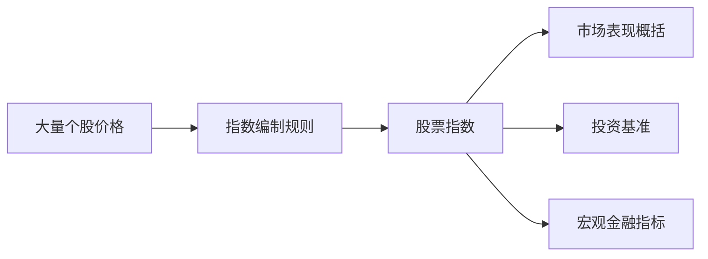
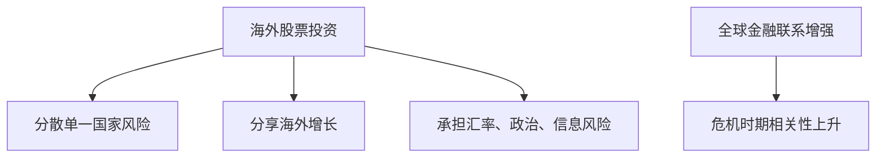
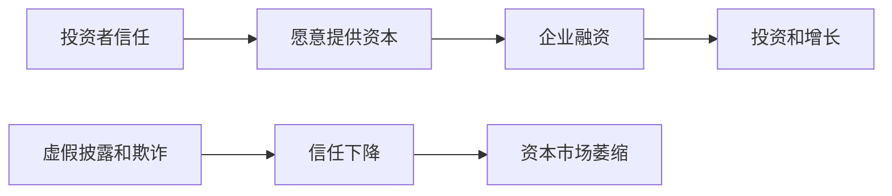

# 22.5 股票指数、海外股票与证券监管

来源：

- 主线：Mishkin/Eakins Ch.13
- 补充：Mishkin《货币金融学》Ch.7
- 延伸：Bodie/Kane/Marcus《Investments》Ch.4, Ch.23

## 为什么需要股票指数

股票市场每天有成千上万只股票交易。单只股票价格只能说明一家公司的市场表现，不能直接告诉我们整个市场、某个行业或某类股票的走势。股票指数的作用，就是用一组股票的平均表现来概括市场变化。

股票指数不是一个真实公司，而是一种统计工具。它选取一篮子股票，并按照一定方法计算指数水平。投资者观察指数，可以快速了解市场大致涨跌；基金经理可以用指数作为业绩比较基准；宏观分析者可以用指数观察金融市场对经济前景、利率和风险的反应。

例如，市场常说“股市上涨”，通常不是指每只股票都上涨，而是指某个广泛指数上涨。指数把大量个股信息压缩成一个数字，使市场表现更容易被观察和讨论。

指数的价值在于概括，但也正因为是概括，它不能替代对具体公司和行业的分析。

## 道琼斯工业平均指数

最著名的股票指数之一是道琼斯工业平均指数，即 DJIA。它由 30 家大型公司股票组成，历史悠久，因此受到媒体和投资者广泛关注。虽然名字里有“工业”，但现代 DJIA 中的公司并不限于传统工业企业，而是包括许多代表美国大型企业部门的公司。

DJIA 的优势是历史长、知名度高、容易传播。投资者可以用它大致观察大型蓝筹股表现。它也常被用作金融新闻中的市场温度计。

但 DJIA 并不是最全面的市场指标。它只包含 30 家公司，样本较小；短期表现可能与更广泛指数不同。许多市场观察者认为，更广泛的指数，例如 S&P 500、NASDAQ 综合指数和 NYSE 综合指数，更适合观察不同股票群体或整体市场表现。

这提醒我们，使用指数时要先问：这个指数代表什么？它包含多少公司？偏向哪些行业？采用什么加权方法？如果一个指数主要包含大型科技公司，它的走势就不能简单代表全部企业部门。

## 指数、宏观经济和市场预期

股票指数常被当作宏观金融指标，是因为它们反映投资者对未来利润和折现率的综合判断。经济增长预期改善，企业利润可能提高，指数上涨；通胀或利率上升，折现率提高，指数可能下跌；金融不确定性上升，风险补偿扩大，指数也可能下跌。

不过，指数不是 GDP。股市可以在经济尚未恢复时上涨，因为投资者预期未来会恢复；也可以在当前经济数据良好时下跌，因为市场担心未来利率更高或利润放缓。指数反映的是预期和估值，不是当前产出的机械记录。

指数还会通过财富效应和融资条件影响宏观经济。家庭持有股票基金和退休账户时，指数上涨会提高财富和信心；指数下跌会压低财富，影响消费。企业股票价格上涨时，发行股票融资更容易；指数大幅下跌时，股权融资环境恶化，投资可能下降。

因此，股票指数既是宏观预期的结果，也是宏观传导的渠道。

## 指数基金和 ETF

指数不仅用于观察市场，也用于投资。指数基金和 ETF 按照某个指数持有一篮子股票，让投资者低成本获得市场组合。投资者不必选择单个公司，就可以通过购买跟踪 S&P 500 或其他指数的基金，获得较广泛的股票暴露。

ETF 在交易方式上像股票，可以在交易日内买卖。它的净值来自底层股票组合，套利机制通常使 ETF 市场价格接近底层资产价值。ETF 的普及降低了分散化成本，也使普通投资者更容易进行全球、行业和风格配置。

但指数投资并不等于没有风险。如果整个市场下跌，指数基金也会下跌。指数基金降低的是单个公司风险，而不是系统性市场风险。它把投资者暴露在整个市场的增长、利率、通胀和风险偏好变化中。

| 投资方式 | 分散化 | 主要风险 |
| --- | --- | --- |
| 单只股票 | 低 | 公司特定风险和市场风险 |
| 行业 ETF | 中等 | 行业风险和市场风险 |
| 宽基指数 ETF | 高 | 系统性市场风险 |

这和投资组合理论一致：分散化可以降低个别公司风险，但不能消除整个经济和市场共同面对的风险。

## 为什么买海外股票

投资者购买海外股票，主要是为了分散风险和分享其他经济体增长。不同国家的经济周期、产业结构、通胀环境和政策条件不完全相同。当一个国家陷入衰退时，另一个国家可能仍在增长；当美国股票受通胀担忧压制时，其他国家股票可能因不同政策和增长环境表现较好。

国际分散化的逻辑和国内分散化相同：不要把所有投资集中在同一类风险上。持有不同行业、不同国家和不同货币环境中的资产，可以降低单一经济体冲击对投资组合的影响。

不过，全球化也意味着各国市场并非完全独立。2008 年全球金融危机说明，金融机构、贸易、资本流动和信心会把冲击从一个国家传导到另一个国家。国际分散化可以降低某些国家特定风险，但不能消除全球共同风险。

因此，海外股票不是“更安全”的替代品，而是投资组合分散化的一部分。

## ADR：让海外股票在本地交易

直接购买海外公司股票可能不方便。外国公司可能没有在美国交易所上市，投资者要面对不同交易系统、货币兑换、托管、结算和信息披露规则。美国存托凭证，即 ADR，就是为解决这个问题而出现的工具。

ADR 的基本结构是：美国银行购买外国公司的股票并托管，然后以这些股票为基础发行可在美国市场交易的凭证。投资者买卖 ADR，就像买卖美国市场上的证券。交易用美元进行，股利也由银行转换为美元支付。

ADR 降低了购买外国股票的操作难度，使美国投资者更容易获得海外公司暴露，也让外国公司更容易接触美国资本市场。

但 ADR 并不消除海外投资风险。投资者仍然承担外国公司经营风险、所在国经济风险、政治和监管风险，以及汇率变化带来的影响。ADR 只是改变交易和持有形式，不改变底层资产本质。

## 海外股票和汇率风险

海外股票投资还涉及汇率。假设美国投资者购买一家日本公司股票。即使这家公司日元股价上涨，如果日元相对美元贬值，投资者换回美元后的收益可能被抵消。反过来，如果股票本币价格不变，但本币升值，美元投资者也可能获得汇率收益。

这把股票市场和开放经济宏观联系起来。汇率受利率差异、通胀预期、贸易状况、资本流动和政策变化影响。海外股票收益不仅取决于企业利润，还取决于货币价值变化。

因此，国际股票投资比国内股票多一层风险：本币资产价格风险之外，还有汇率风险。机构投资者有时会使用外汇衍生品对冲汇率风险，但对普通投资者来说，理解这层风险本身就很重要。

## 为什么证券市场需要监管

资本市场正常运转的前提是信任。投资者愿意把储蓄交给企业，是因为相信公司披露的信息大体可靠，相信交易市场相对公平，相信欺诈会受到惩罚。如果这种信任消失，投资者会撤出市场，企业融资渠道会萎缩。

美国证券监管的现代框架与大萧条有密切关系。20 世纪 20 年代，大量新证券发行，之后许多变得毫无价值，公众对资本市场信心崩溃。为了恢复信任，国会通过 1933 年《证券法》和 1934 年《证券交易法》。这些法律的核心目标包括：要求公司向公众真实披露业务信息；要求经纪商、交易商和交易所以公平方式对待投资者。

证券监管的重点不是让投资者不亏钱，也不是由政府判断每只股票是否值得买。监管的核心是信息披露和市场公平。只要公司真实披露，投资者可以自行判断是否承担风险；如果公司欺诈、隐瞒或操纵市场，监管机构就要介入。

## SEC 的基本职能

美国证券交易委员会，即 SEC，是负责执行证券法律的重要机构。它的使命可以概括为保护投资者、维护公平有序市场，并促进资本形成。

SEC 的工作重点是保证投资者获得持续、及时、准确的信息。公开公司需要提交年度报告、季度报告、注册文件和重大事项披露。监管机构审查这些文件是否符合披露要求，但不保证每一项商业判断都正确，也不保证公司一定成功。

SEC 还监管市场参与者，包括证券交易所、经纪商、交易商和投资管理行业。市场要有效运转，不仅公司信息要可靠，交易过程也要公平。内幕交易、市场操纵、虚假陈述、不当销售和欺诈行为都会破坏市场信任。

可以把 SEC 的职能分成几类：

| 职能 | 目的 |
| --- | --- |
| 公司披露监管 | 降低投资者和公司之间的信息不对称 |
| 交易和市场监管 | 维护有序、公平、高效交易 |
| 投资管理监管 | 监督基金和投资顾问行业 |
| 执法 | 调查欺诈、操纵和违法披露 |
| 经济分析 | 评估规则和市场风险 |

这些职能共同服务于一个目标：让资本市场能够把资金配置到有价值的企业，同时让投资者理解自己承担的风险。

## 监管、信息不对称与资本形成

证券监管和前面学过的信息不对称直接相关。股票投资者面对公司内部人，天然处于信息劣势。如果公司可以随意夸大利润、隐瞒债务、操纵交易或选择性披露，外部投资者就会提高要求回报，甚至退出市场。优质公司也会被劣质公司拖累，因为投资者难以区分好坏。

强制披露、审计、反欺诈规则和执法，可以降低这种逆向选择。投资者更愿意购买股票，企业更容易发行证券，资本形成更顺畅。

不过，监管也有成本。披露、审计和合规费用对小公司尤其明显。过高成本可能使一些公司推迟上市或选择私人融资。因此，监管需要在投资者保护和融资效率之间平衡。信息越可靠，资本成本越低；但规则越复杂，合规成本越高。

这也是为什么股票市场制度会影响一国金融发展。拥有可信披露制度、有效法律执行和公平交易规则的市场，更容易吸引长期资本。

## 股票市场监管和宏观稳定

股票市场崩盘本身不一定导致金融危机，但如果股价下跌伴随融资冻结、财富缩水、金融机构损失和信心崩溃，就会影响宏观经济。监管不能消除股价波动，但可以减少欺诈、操纵和信息失真造成的非理性恐慌。

监管良好的市场更容易让价格反映真实信息。价格可以下跌，但下跌如果基于真实盈利和风险变化，市场仍然能发挥配置功能；如果价格建立在虚假披露和操纵上，一旦真相暴露，信任会遭到更大破坏。

从宏观角度看，证券监管支持的是资本形成机制。企业需要长期股权资本，家庭需要可靠投资渠道，金融体系需要可信价格信号。股票市场越透明，储蓄越容易转化为生产性投资；股票市场越不可信，储蓄越可能流向低效率或短期安全资产。

指数和海外股票还提醒投资者，分散化必须看权重和相关性。价格加权指数会让高价格股票影响更大，市值加权指数会让大公司影响更大，等权指数则更偏向中小公司；不同编制方法代表不同风险暴露。海外股票能降低本国单一风险，但危机时期全球股票相关性往往上升，汇率也可能放大本币回报波动。监管可信度、会计质量、资本管制和投资者保护制度，会影响海外股票是否真正能提供可持续的分散化收益。

## 小结

股票指数用一组股票概括市场表现，是观察市场、设定投资基准和分析宏观金融条件的重要工具。DJIA 历史悠久、影响广泛，但样本较小；S&P 500、NASDAQ 综合指数和其他指数能反映不同市场范围。指数基金和 ETF 让投资者低成本获得分散化股票暴露，但不能消除系统性风险。

海外股票投资可以分散单一国家风险，并分享其他经济体增长。ADR 让投资者更方便地在本地市场买卖外国公司股票，但不消除底层公司风险、国家风险和汇率风险。全球市场联系增强意味着国际分散化有效但有限。

证券监管的核心是保护投资者、维护公平市场和促进资本形成。SEC 通过披露监管、市场监管、投资管理监管和执法降低信息不对称。可信的监管制度不能保证投资者获利，却能提高市场信任，使股票市场更好地服务企业融资和宏观经济增长。

## 自测问题

- 股票指数为什么不能简单等同于整个经济？
- DJIA 的优点和局限分别是什么？
- 指数基金和 ETF 降低了哪类风险？不能消除哪类风险？
- 投资海外股票为什么可以分散风险？为什么仍然有全球共同风险？
- ADR 解决了海外股票投资中的什么问题？没有解决什么问题？
- 证券监管为什么重点放在信息披露而不是保证投资收益？
- SEC 的监管如何帮助资本形成？
- 为什么市值加权指数、价格加权指数和等权指数会带来不同的风险暴露？
